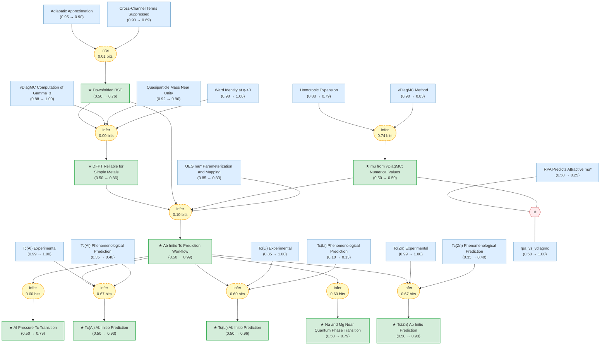

# superconductivity-electron-liquids-gaia

Gaia knowledge package: Superconductivity in Electron Liquids (arXiv:2512.19382)

<!-- badges:start -->
<!-- badges:end -->

## Overview

> **Reasoning graph information gain: `4.0 bits`**
>
> Total mutual information between leaf premises and exported conclusions — measures how much the reasoning structure reduces uncertainty about the results.

## Conclusions

| Label | Content | Prior | Belief |
|-------|---------|-------|--------|
| ab_initio_workflow | The complete ab initio workflow for predicting $T_c$ of simple metals: (1) co... | 0.50 | 0.99 |
| al_pressure_transition | Under hydrostatic pressure, the ab initio framework predicts that aluminum's ... | 0.50 | 0.79 |
| dfpt_reliable_for_simple_metals | For simple metals, the DFPT calculation of the electron-phonon coupling const... | 0.50 | 0.86 |
| downfolded_bse | The frequency-only downfolded Bethe-Salpeter equation: the full momentum-freq... | 0.50 | 0.76 |
| mu_vdiagmc_values | vDiagMC calculations of the UEG four-point vertex yield the Coulomb pseudopot... | 0.50 | 0.50 |
| tc_al_predicted | The ab initio predicted superconducting transition temperature of aluminum is... | 0.50 | 0.93 |
| tc_li_predicted | The ab initio predicted superconducting transition temperature of lithium (9R... | 0.50 | 0.96 |
| tc_mg_na_near_qpt | The ab initio framework predicts that sodium and magnesium have extremely low... | 0.50 | 0.79 |
| tc_zn_predicted | The ab initio predicted superconducting transition temperature of zinc is $T_... | 0.50 | 0.93 |

<!-- content:start -->
<!-- content:end -->
