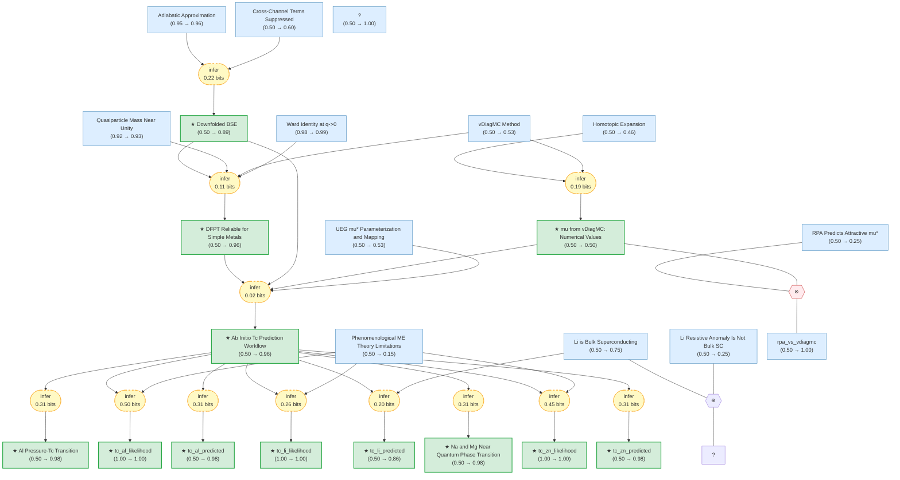

# superconductivity-electron-liquids-gaia

Gaia knowledge package: Superconductivity in Electron Liquids (arXiv:2512.19382)

<!-- badges:start -->
<!-- badges:end -->

## Overview

> [!TIP]
> **Reasoning graph information gain: `3.2 bits`**
>
> Total mutual information between leaf premises and exported conclusions — measures how much the reasoning structure reduces uncertainty about the results.

```mermaid
---
config:
  flowchart:
    rankSpacing: 80
    nodeSpacing: 30
---
graph TB
    adiabatic_approx["Adiabatic Approximation\n(0.95 → 0.96)"]:::premise
    phenomenological_me_theory["Phenomenological ME Theory Limitations\n(0.50 → 0.15)"]:::premise
    li_is_superconducting["Li is Bulk Superconducting\n(0.50 → 0.75)"]:::premise
    cross_term_suppressed["Cross-Channel Terms Suppressed\n(0.50 → 0.60)"]:::premise
    downfolded_bse["★ Downfolded BSE\n(0.50 → 0.89)"]:::exported
    vdiagmc_method["vDiagMC Method\n(0.50 → 0.53)"]:::premise
    homotopic_expansion["Homotopic Expansion\n(0.50 → 0.46)"]:::premise
    mu_vdiagmc_values["★ mu from vDiagMC: Numerical Values\n(0.50 → 0.50)"]:::exported
    ward_identity["Ward Identity at q->0\n(0.98 → 0.99)"]:::premise
    quasiparticle_mass_near_unity["Quasiparticle Mass Near Unity\n(0.92 → 0.93)"]:::premise
    dfpt_reliable_for_simple_metals["★ DFPT Reliable for Simple Metals\n(0.50 → 0.96)"]:::exported
    ueg_pseudopotential_parameterization["UEG mu#ast; Parameterization and Mapping\n(0.50 → 0.53)"]:::premise
    ab_initio_workflow["★ Ab Initio Tc Prediction Workflow\n(0.50 → 0.96)"]:::exported
    al_pressure_transition["★ Al Pressure-Tc Transition\n(0.50 → 0.98)"]:::exported
    tc_mg_na_near_qpt["★ Na and Mg Near Quantum Phase Transition\n(0.50 → 0.98)"]:::exported
    tc_al_predicted["★ tc_al_predicted\n(0.50 → 0.98)"]:::exported
    tc_al_likelihood["★ tc_al_likelihood\n(1.00 → 1.00)"]:::exported
    tc_zn_predicted["★ tc_zn_predicted\n(0.50 → 0.98)"]:::exported
    tc_zn_likelihood["★ tc_zn_likelihood\n(1.00 → 1.00)"]:::exported
    tc_li_predicted["★ tc_li_predicted\n(0.50 → 0.86)"]:::exported
    tc_li_likelihood["★ tc_li_likelihood\n(1.00 → 1.00)"]:::exported
    li_anomaly_not_sc["Li Resistive Anomaly Is Not Bulk SC\n(0.50 → 0.25)"]:::premise
    x["?\n(0.50 → 1.00)"]:::premise
    rpa_vs_vdiagmc["rpa_vs_vdiagmc\n(0.50 → 1.00)"]:::premise
    rpa_predicts_attractive_mu["RPA Predicts Attractive mu#ast;\n(0.50 → 0.25)"]:::premise
    strat_0(["infer\n0.31 bits"]):::weak
    ab_initio_workflow --> strat_0
    strat_0 --> al_pressure_transition
    strat_1(["infer\n0.50 bits"]):::weak
    ab_initio_workflow --> strat_1
    phenomenological_me_theory --> strat_1
    strat_1 --> tc_al_likelihood
    strat_2(["infer\n0.31 bits"]):::weak
    ab_initio_workflow --> strat_2
    strat_2 --> tc_al_predicted
    strat_3(["infer\n0.26 bits"]):::weak
    ab_initio_workflow --> strat_3
    phenomenological_me_theory --> strat_3
    strat_3 --> tc_li_likelihood
    strat_4(["infer\n0.20 bits"]):::weak
    ab_initio_workflow --> strat_4
    li_is_superconducting --> strat_4
    strat_4 --> tc_li_predicted
    strat_5(["infer\n0.31 bits"]):::weak
    ab_initio_workflow --> strat_5
    strat_5 --> tc_mg_na_near_qpt
    strat_6(["infer\n0.45 bits"]):::weak
    ab_initio_workflow --> strat_6
    phenomenological_me_theory --> strat_6
    strat_6 --> tc_zn_likelihood
    strat_7(["infer\n0.31 bits"]):::weak
    ab_initio_workflow --> strat_7
    strat_7 --> tc_zn_predicted
    strat_8(["infer\n0.22 bits"]):::weak
    adiabatic_approx --> strat_8
    cross_term_suppressed --> strat_8
    strat_8 --> downfolded_bse
    strat_9(["infer\n0.02 bits"]):::weak
    dfpt_reliable_for_simple_metals --> strat_9
    downfolded_bse --> strat_9
    mu_vdiagmc_values --> strat_9
    ueg_pseudopotential_parameterization --> strat_9
    strat_9 --> ab_initio_workflow
    strat_10(["infer\n0.11 bits"]):::weak
    downfolded_bse --> strat_10
    quasiparticle_mass_near_unity --> strat_10
    vdiagmc_method --> strat_10
    ward_identity --> strat_10
    strat_10 --> dfpt_reliable_for_simple_metals
    strat_11(["infer\n0.19 bits"]):::weak
    homotopic_expansion --> strat_11
    vdiagmc_method --> strat_11
    strat_11 --> mu_vdiagmc_values
    oper_0{{"⊕"}}
    li_is_superconducting --- oper_0
    li_anomaly_not_sc --- oper_0
    oper_0 --- ?
    oper_1{{"⊗"}}:::contra
    rpa_predicts_attractive_mu --- oper_1
    mu_vdiagmc_values --- oper_1
    oper_1 --- rpa_vs_vdiagmc

    classDef premise fill:#ddeeff,stroke:#4488bb,color:#333
    classDef exported fill:#d4edda,stroke:#28a745,stroke-width:2px,color:#333
    classDef weak fill:#fff9c4,stroke:#f9a825,stroke-dasharray: 5 5,color:#333
    classDef contra fill:#ffebee,stroke:#c62828,color:#333
```

## Conclusions

| Label | Content | Prior | Belief |
|-------|---------|-------|--------|
| ab_initio_workflow | The complete ab initio workflow for predicting $T_c$ of simple metals: (1) co... | 0.50 | 0.96 |
| al_pressure_transition | Under hydrostatic pressure, the ab initio framework predicts that aluminum's ... | 0.50 | 0.98 |
| dfpt_reliable_for_simple_metals | For simple metals, the DFPT calculation of the electron-phonon coupling const... | 0.50 | 0.96 |
| downfolded_bse | The frequency-only downfolded Bethe-Salpeter equation: the full momentum-freq... | 0.50 | 0.89 |
| mu_vdiagmc_values | vDiagMC calculations of the UEG four-point vertex yield the Coulomb pseudopot... | 0.50 | 0.50 |
| tc_al_likelihood | Bayes likelihood comparison. | 1.00 | 1.00 |
| tc_al_predicted | The ab initio EFT framework predicts $T_c^{\mathrm{EFT}} = 1.14$ K for alumin... | 0.50 | 0.98 |
| tc_li_likelihood | Bayes likelihood comparison. | 1.00 | 1.00 |
| tc_li_predicted | The ab initio EFT framework predicts $T_c^{\mathrm{EFT}} \approx 2.2e-03$ K f... | 0.50 | 0.86 |
| tc_mg_na_near_qpt | The ab initio framework predicts that sodium and magnesium have extremely low... | 0.50 | 0.98 |
| tc_zn_likelihood | Bayes likelihood comparison. | 1.00 | 1.00 |
| tc_zn_predicted | The ab initio EFT framework predicts $T_c^{\mathrm{EFT}} = 0.995$ K for zinc ... | 0.50 | 0.98 |

<!-- content:start -->
<!-- content:end -->
