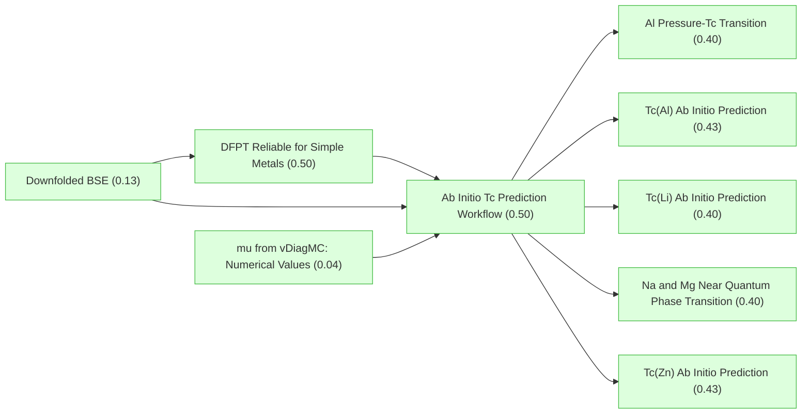
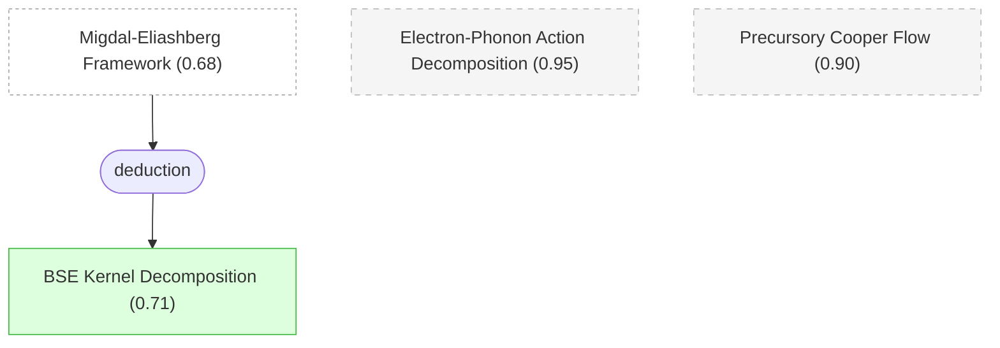
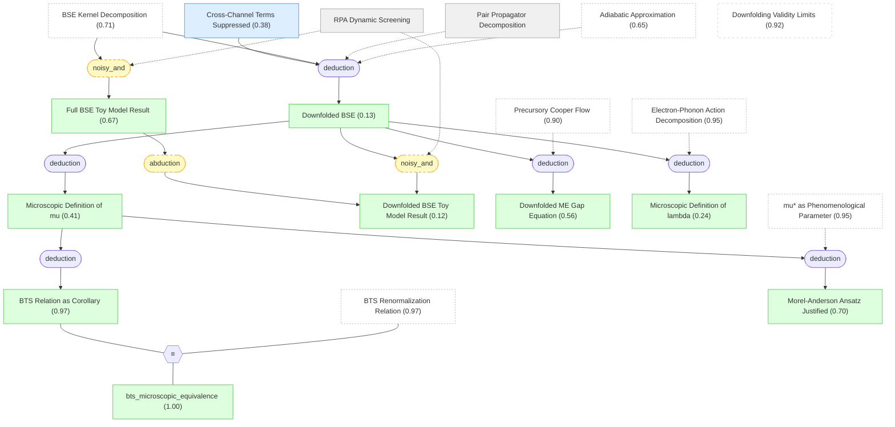
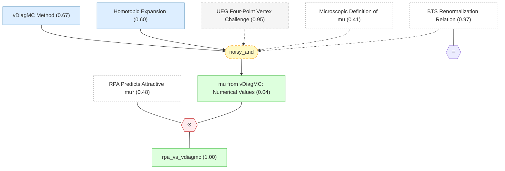
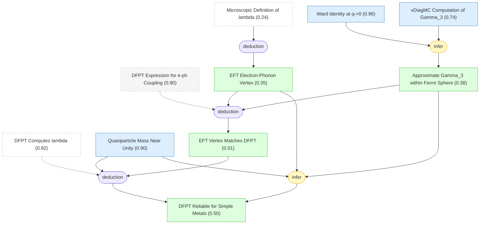

# superconductivity-electron-liquids-gaia

Gaia knowledge package: Superconductivity in Electron Liquids (arXiv:2512.19382)

## Overview

## Introduction: Motivation and Background

#### BCS Theory

📋 `bcs_theory`

> Bardeen-Cooper-Schrieffer (BCS) theory: phonon-mediated electron-electron attraction leads to Cooper pairing instability at the Fermi surface, providing the fundamental framework for understanding conventional superconductors.

#### Adiabatic Approximation

📌 `adiabatic_approx`   |   Prior: 0.95   |   Belief: **0.65**

> In conventional metals, the typical phonon frequency (Debye frequency $\omega_D$) is much smaller than the electron Fermi energy $E_F$, i.e. $\omega_D / E_F \ll 1$ (adiabatic approximation). This energy-scale separation has three key consequences: (i) electrons adiabatically adjust to ionic motion, (ii) the electron-ion coupling can be linearized, and (iii) the space-time scale separation between electron and phonon physics permits a controlled effective field theory (EFT) treatment.

#### Migdal-Eliashberg Framework

📌 `me_framework`   |   Belief: **0.68**

> Migdal-Eliashberg (ME) theory provides a rigorous treatment of the dynamic electron-phonon interaction. Under the adiabatic condition $\omega_D / E_F \ll 1$, Migdal's theorem guarantees that phonon vertex corrections are suppressed at $O(\omega_D/E_F)$, allowing the electron-phonon self-energy to be truncated at the self-consistent Fock diagram level. This justifies the ME formalism as a controlled low-energy theory for electron-phonon superconductors.

🔗 **deduction**([Adiabatic Approximation](#adiabatic_approx))

Reasoning

The adiabatic condition $\omega_D/E_F \ll 1$ (@adiabatic_approx) ensures that the ratio of ionic to electronic energy scales is small. Migdal's theorem then proves that phonon vertex corrections beyond the self-consistent Fock level are suppressed by $O(\omega_D/E_F)$, establishing the Migdal-Eliashberg formalism as a controlled approximation built on the BCS pairing mechanism (@bcs_theory).

#### BTS Renormalization Relation

📌 `bts_renormalization`   |   Prior: 0.95   |   Belief: **0.97**

> The Bogoliubov-Tolmachev-Shirkov (BTS) renormalization relation connects the Coulomb pseudopotential $\mu_{\omega_c}$ (a dimensionless parameter describing the effective electron-electron repulsion strength in the pairing channel) defined at different energy cutoff scales $\omega_c$: $\mu_{\omega_c} = \mu_{\omega_c'} / (1 + \mu_{\omega_c'} \ln(\omega_c'/\omega_c))$. This relation ensures that physical observables do not depend on the choice of the arbitrary cutoff scale.

#### ME Downfolding is Phenomenological

📌 `me_downfolding_is_phenomenological`   |   Prior: 0.95   |   Belief: **0.95**

> The downfolding procedure (integrating out high-energy degrees of freedom to obtain a low-energy effective theory) in traditional Migdal-Eliashberg (ME) theory is phenomenological: the Coulomb effect is replaced by a static pseudopotential $\mu^*$, ignoring corrections from Coulomb fluctuations to quasiparticle renormalization and electron-phonon coupling, as well as non-local effects of screening.

#### Phenomenological ME Theory Limitations

📌 `phenomenological_me_theory`   |   Prior: 0.95   |   Belief: **0.95**

> Traditional electron-phonon superconductivity theory uses the McMillan (or Allen-Dynes) formula, with the electron-phonon coupling constant $\lambda$ and Coulomb pseudopotential $\mu^*$ as inputs to predict the superconducting transition temperature $T_c$. Since $\mu^*$ cannot be reliably computed from first principles, it is typically assigned an empirical value $\mu^* \in [0.1, 0.2]$. For materials with $T_c$ in the sub-kelvin range, the exponential sensitivity $T_c \propto \exp(-1/g)$ to $\mu^*$ causes this uncertainty to span several orders of magnitude in the predicted $T_c$, destroying predictive power.

#### mu* as Phenomenological Parameter

📌 `mu_star_phenomenological`   |   Prior: 0.95   |   Belief: **0.95**

> Due to the lack of a reliable microscopic calculation, the Coulomb pseudopotential $\mu^*$ (a dimensionless parameter describing the effective Coulomb repulsion strength in the low-energy pairing channel) is typically treated as an adjustable parameter with empirical values in the range 0.1--0.2.

#### RPA Predicts Attractive mu*

📌 `rpa_predicts_attractive_mu`   |   Prior: 0.50   |   Belief: **0.48**

> When treating the dynamically screened Coulomb interaction within the random phase approximation (RPA), the predicted $\mu^* < 0$ (i.e. the Coulomb effect becomes net attractive in the Cooper channel) for Wigner-Seitz radius $r_s \gtrsim 2$ ($r_s$ is proportional to the ratio of electron spacing to Bohr radius, measuring the ratio of Coulomb interaction to kinetic energy). However, RPA neglects beyond-RPA effects such as vertex corrections and self-energy renormalization for $r_s \gtrsim 1$, making its predictions unreliable in this density regime and inconsistent with extensive experimental evidence.

#### DFPT Computes lambda

📌 `dfpt_computes_lambda`   |   Prior: 0.92   |   Belief: **0.92**

> Density functional perturbation theory (DFPT) computes the electron-phonon coupling constant $\lambda$ (a dimensionless parameter quantifying the phonon-mediated attraction strength at the Fermi surface) via the linear response of the Kohn-Sham ground-state energy to lattice distortions. DFPT has been validated for weakly correlated superconductors but its accuracy for strongly correlated systems is unknown.

#### Tc(Al) Experimental

📌 `tc_al_experimental`   |   Prior: 0.99   |   Belief: **0.99**

> The experimental superconducting transition temperature of aluminum (Al) is $T_c^{\mathrm{exp}} = 1.2$ K.

#### Tc(Li) Experimental

📌 `tc_li_experimental`   |   Prior: 0.85   |   Belief: **0.85**

> The experimental superconducting transition temperature of lithium (Li) is $T_c^{\mathrm{exp}} \approx 4 \times 10^{-4}$ K (0.4 mK). This measurement corresponds to the 9R crystal structure; the crystal structure of lithium at ultra-low temperatures remains controversial.

#### Tc(Zn) Experimental

📌 `tc_zn_experimental`   |   Prior: 0.99   |   Belief: **0.99**

> The experimental superconducting transition temperature of zinc (Zn) is $T_c^{\mathrm{exp}} = 0.875$ K.

#### Tc(Al) Phenomenological Prediction

📌 `tc_al_phenomenological`   |   Prior: 0.90   |   Belief: **0.90**

> Using the McMillan formula (an empirical formula for $T_c$ based on the electron-phonon coupling constant $\lambda$ and Coulomb pseudopotential $\mu^*$) with the standard value $\mu^* = 0.1$, the predicted superconducting transition temperature of aluminum is $T_c \approx 1.9$ K, while the experimental value is 1.2 K, a deviation of approximately 58%.

#### Tc(Li) Phenomenological Prediction

📌 `tc_li_phenomenological`   |   Prior: 0.90   |   Belief: **0.90**

> Using the McMillan formula with $\mu^* = 0.1$, the predicted superconducting transition temperature of lithium is $T_c \approx 0.35$ K, while the experimental value is approximately $4 \times 10^{-4}$ K; the theory overestimates by about three orders of magnitude.

#### Tc(Zn) Phenomenological Prediction

📌 `tc_zn_phenomenological`   |   Prior: 0.90   |   Belief: **0.90**

> Using the McMillan formula with the standard value $\mu^* = 0.1$, the predicted superconducting transition temperature of zinc is $T_c \approx 1.37$ K, while the experimental value is 0.875 K, a deviation of approximately 57%.

#### Main Question: First-Principles mu* and Tc

❓ `main_question`

> Can the Coulomb pseudopotential $\mu^*$ (the parameter quantifying effective electron-electron repulsion in the Cooper pairing channel) be computed from first principles with controlled accuracy, and can this yield quantitative predictions of the superconducting transition temperature $T_c$ for simple metals (e.g. Al, Li, Na, Mg)?

## The Model and Basic Relations

#### Electron-Phonon Action Decomposition

📌 `electron_phonon_action`   |   Prior: 0.95   |   Belief: **0.95**

> The effective action of the electron-phonon coupled system can be decomposed as $S = S_e + S_{\mathrm{ph}} + S_{e\text{-ph}} + S_{\mathrm{CT}} + O(\sqrt{m/M})$, where $m$ is the electron mass and $M$ is the ion mass. $S_e$ is the complete many-electron action without any approximation, $S_{\mathrm{ph}}$ describes phonons with physical dispersion, $S_{e\text{-ph}}$ is the coupling between electron density and ionic displacement, and $S_{\mathrm{CT}}$ is a counterterm that subtracts the static electron polarization contribution already included in the physical phonon dispersion to prevent double counting.

#### BSE Kernel Decomposition

📌 `bse_kernel_decomposition`   |   Belief: **0.71**

> The kernel of the Bethe-Salpeter equation (BSE) can be decomposed into the purely electronic particle-particle irreducible four-point vertex $\tilde\Gamma^e$ (encoding all non-perturbative Coulomb effects) and the phonon-mediated effective electron-electron interaction $W^{\mathrm{ph}}$: $\tilde\Gamma = \tilde\Gamma^e + W^{\mathrm{ph}} + O(\omega_D/E_F)$. Migdal's theorem ensures that higher-order phonon vertex corrections are suppressed by the adiabatic small parameter.

🔗 **deduction**([Migdal-Eliashberg Framework](#me_framework))

Reasoning

Migdal's theorem (@me_framework) guarantees that phonon vertex corrections to the BSE kernel are suppressed at $O(\omega_D/E_F)$. This allows the full particle-particle irreducible kernel to be separated into a purely electronic four-point vertex $\tilde\Gamma^e$ (which encodes all non-perturbative Coulomb correlations and is independent of phonon details) and the phonon-mediated interaction $W^{\mathrm{ph}}$ (which includes the dressed phonon propagator, bare coupling, electronic screening, and vertex corrections). Cross terms between these two contributions are higher order in $\omega_D/E_F$ and can be neglected.

#### Precursory Cooper Flow

📌 `precursory_cooper_flow`   |   Prior: 0.90   |   Belief: **0.90**

> The low-frequency limit of the anomalous vertex function on the Fermi surface $\Lambda_0$ obeys a universal scaling relation (precursory Cooper flow, PCF): $\Lambda_0 = 1/(1 + g\ln(\omega_\Lambda/T)) + O(T)$, where $g$ is the dimensionless coupling constant ($g < 0$ corresponds to net attraction) and $\omega_\Lambda$ is an effective high-energy cutoff. When $g < 0$, $\Lambda_0$ diverges at $T_c = \omega_\Lambda e^{1/g}$; by computing in the normal state and extrapolating, one can predict $T_c$.

## Downfolding the Bethe-Salpeter Equation

#### Pair Propagator Decomposition

📋 `pair_propagator_decomposition`

> The pair propagator (product of two single-particle Green's functions $G_{k\omega}G_{-k,-\omega}$) can be exactly decomposed into a low-energy coherent part $\Pi_{\mathrm{BCS}}$ and a high-energy incoherent remainder $\phi_{k\omega}$: $G_{k\omega}G_{-k,-\omega} = \Pi_{\mathrm{BCS}} + \phi_{k\omega}$. The coherent part is expressed in terms of the quasiparticle weight $z^e$, frequency-dependent quasiparticle weight $z_\omega^{\mathrm{ph}}$, and renormalized dispersion $\epsilon_k$. This is an exact mathematical identity introducing energy-scale separation in the two-electron channel.

#### Cross-Channel Terms Suppressed

📌 `cross_term_suppressed`   |   Prior: 0.90   |   Belief: **0.38**

> Cross terms mixing Coulomb and phonon channels are suppressed by the plasma frequency $\omega_p$, at order $O(\omega_c^2/\omega_p^2)$, where $\omega_c$ is an intermediate energy cutoff satisfying $\omega_D \ll \omega_c \ll E_F$. For most three-dimensional metals $\omega_c/\omega_p \lesssim 0.1$, so cross terms contribute no more than 1%.

#### RPA Dynamic Screening

📋 `rpa_dynamic_screening`

> Random Phase Approximation (RPA) dynamically screened Coulomb interaction: $W_{\mathrm{RPA}}(\mathbf{q},\nu) = v_q / (1 - v_q \Pi^0_{\mathbf{q}\nu})$, where $v_q = 4\pi e^2/q^2$ is the bare Coulomb potential and $\Pi^0$ is the non-interacting polarization function. This is a standard approximation that becomes exact in the weak-coupling limit ($r_s \lesssim 1$).

#### Full BSE Toy Model Result

📌 `full_bse_toy_model`   |   Belief: **0.67**

> For a toy model with aluminum-like parameters (Wigner-Seitz radius $r_s = 1.92$, adiabatic ratio $\omega_D/E_F = 0.005$), numerically solving the full frequency-momentum dependent Bethe-Salpeter equation (BSE) — using RPA dynamically screened Coulomb interaction as the electron irreducible vertex plus a model phonon interaction, without any downfolding approximation — yields a superconducting transition temperature $T_c^{\mathrm{full}}/T_F = 10^{-5.668}$, where $T_F$ is the Fermi temperature.

🔗 **noisy_and**([BSE Kernel Decomposition](#bse_kernel_decomposition))

Reasoning

Using the Bethe-Salpeter equation with the kernel decomposition (@bse_kernel_decomposition) into the electronic four-point vertex (approximated by RPA dynamically screened Coulomb interaction, @rpa_dynamic_screening) and a model phonon-mediated interaction, numerically solve the full frequency-momentum BSE for a toy model at $r_s = 1.92$, $\omega_D/E_F = 0.005$. The precursory Cooper flow analysis of the solution yields $T_c^{\mathrm{full}}/T_F = 10^{-5.668}$.

#### Downfolded BSE Toy Model Result

📌 `downfolded_bse_toy_model`   |   Belief: **0.12**

> For the same toy model (aluminum-like parameters $r_s = 1.92$, $\omega_D/E_F = 0.005$), solving the downfolded frequency-only Bethe-Salpeter equation yields $T_c^{\mathrm{approx}}/T_F = 10^{-5.667}$, where $T_F$ is the Fermi temperature.

🔗 **noisy_and**([Downfolded BSE](#downfolded_bse))

Reasoning

Apply the downfolded frequency-only BSE (@downfolded_bse) to the same toy model (RPA dynamically screened Coulomb interaction @rpa_dynamic_screening, $r_s = 1.92$, $\omega_D/E_F = 0.005$). Solving the frequency-only equation yields $T_c^{\mathrm{approx}}/T_F = 10^{-5.667}$.

#### Downfolding Validity Limits

📌 `downfolding_validity_limits`   |   Prior: 0.92   |   Belief: **0.92**

> The downfolded EFT-ME framework's applicability conditions and failure modes: (i) the adiabatic parameter $\omega_D/E_F \ll 1$ must hold, (ii) the intermediate cutoff $\omega_c$ must satisfy $\omega_D \ll \omega_c \ll E_F$ with $\omega_c/\omega_p \ll 1$, and (iii) the framework breaks down for strongly non-adiabatic systems (e.g. high-$T_c$ hydrides where $\omega_D/E_F \sim 0.1$) and for strongly correlated materials where the quasiparticle picture fails.

#### Downfolded BSE ★

📌 `downfolded_bse`   |   Belief: **0.13**

> The frequency-only downfolded Bethe-Salpeter equation: the full momentum-frequency BSE kernel reduces to a one-dimensional integral equation in Matsubara frequency, with an effective kernel $K(\omega, \omega') = \lambda(\omega, \omega') - \mu_{\omega_c}(\omega, \omega')$, where the phonon-mediated attraction $\lambda$ and Coulomb pseudopotential $\mu_{\omega_c}$ are microscopically defined. The momentum integration is absorbed into the density of states, and the pair propagator's coherent part generates the BCS logarithm that drives the Cooper instability.

🔗 **deduction**([Cross-Channel Terms Suppressed](#cross_term_suppressed), [BSE Kernel Decomposition](#bse_kernel_decomposition))

Reasoning

Starting from the full BSE with kernel decomposed into $\tilde\Gamma^e + W^{\mathrm{ph}}$ (@bse_kernel_decomposition), we substitute the exact pair propagator decomposition (@pair_propagator_decomposition) which splits $GG$ into a BCS-like coherent piece $\Pi_{\mathrm{BCS}}$ and an incoherent remainder $\phi$. The coherent piece carries the Cooper logarithm and defines the low-energy pairing channel. Momentum summation over the coherent part yields a frequency-only kernel. The cross terms mixing Coulomb and phonon channels are suppressed at $O(\omega_c^2/\omega_p^2)$ (@cross_term_suppressed), justifying their neglect. Under the adiabatic condition (@adiabatic_approx), residual phonon vertex corrections are negligible. The result is a one-dimensional integral equation in Matsubara frequency with microscopically defined $\lambda$ and $\mu_{\omega_c}$ kernels.

#### Downfolded ME Gap Equation

📌 `downfolded_me_equation`   |   Belief: **0.56**

> At the superconducting critical temperature $T_c$, the downfolded Bethe-Salpeter equation reduces to the traditional linearized Migdal-Eliashberg (ME) gap equation: $\Delta_\omega = \pi T_c \sum_{|\omega'|<\omega_c} (\lambda_{\omega\omega'} - \mu^*) \frac{z_{\omega'}^{\mathrm{ph}}}{|\omega'|} \Delta_{\omega'}$. As $T \to T_c$, the anomalous vertex diverges as $\Lambda_{k\omega} \sim \Delta_{k\omega}/(T - T_c)$, causing the source term $\eta$ to become irrelevant. The diverging prefactor $(T - T_c)^{-1}$ cancels between the two sides of the equation, yielding the gap equation with $\mu^* \equiv \mu_{\omega_c}$. This establishes the microscopic foundation for the ME equation with precise definitions of $\mu^*$ and $\lambda$ in terms of electron vertex functions.

🔗 **deduction**([Downfolded BSE](#downfolded_bse))

Reasoning

Starting from the downfolded BSE (@downfolded_bse), consider the behavior near the Cooper instability. The precursory Cooper flow (@precursory_cooper_flow) shows that the anomalous vertex diverges as $\Lambda \sim \Delta/(T - T_c)$ when $T \to T_c$. Substituting this scaling into the downfolded BSE, the source term $\eta$ becomes negligible compared to the diverging vertex, and the $(T - T_c)^{-1}$ prefactor cancels on both sides. The result is the linearized gap equation — identical in form to the traditional ME equation, but now with $\mu^*$ and $\lambda$ having precise microscopic definitions from the downfolding.

#### Microscopic Definition of lambda

📌 `lambda_microscopic_definition`   |   Belief: **0.24**

> The electron-phonon coupling $\lambda(\omega, \omega')$ in the downfolded BSE has a microscopic definition: it is the Fermi-surface average of the phonon-mediated interaction $W^{\mathrm{ph}}$ weighted by quasiparticle renormalization factors $z^e$ and $z_\omega^{\mathrm{ph}}$. This definition reduces to the standard Eliashberg $\lambda$ in the adiabatic limit but retains dynamical corrections from the electron self-energy.

🔗 **deduction**([Downfolded BSE](#downfolded_bse))

Reasoning

The downfolded BSE (@downfolded_bse) expresses the pairing kernel as $K = \lambda - \mu_{\omega_c}$. The phonon-mediated part $\lambda(\omega, \omega')$ arises from projecting $W^{\mathrm{ph}}$ (the phonon-mediated interaction from the electron-phonon action decomposition, @electron_phonon_action) onto the Fermi surface using the coherent part of the pair propagator. The counterterm $S_{\mathrm{CT}}$ in the action ensures no double-counting of the static screening already included in the physical phonon dispersion. The resulting expression for $\lambda$ involves the Fermi-surface average of $W^{\mathrm{ph}}$ weighted by quasiparticle factors, providing a controlled microscopic definition that generalizes the standard Eliashberg coupling constant.

#### Microscopic Definition of mu

📌 `mu_microscopic_definition`   |   Belief: **0.41**

> The Coulomb pseudopotential $\mu_{\omega_c}(\omega, \omega')$ in the downfolded BSE has a microscopic definition: it is determined by the purely electronic particle-particle irreducible four-point vertex $\tilde\Gamma^e$ projected onto the Fermi surface, with the high-energy electronic degrees of freedom integrated out above the cutoff $\omega_c$. This gives $\mu_{\omega_c}$ a precise meaning as the effective Coulomb repulsion in the low-energy pairing channel, renormalized by all electronic correlations.

🔗 **deduction**([Downfolded BSE](#downfolded_bse))

Reasoning

The downfolded BSE (@downfolded_bse) separates the pairing kernel into phonon ($\lambda$) and Coulomb ($\mu_{\omega_c}$) contributions. The Coulomb part is obtained by projecting the purely electronic irreducible four-point vertex $\tilde\Gamma^e$ from the BSE kernel onto the Fermi surface, with frequency integration restricted to the range above $\omega_c$ handled by the incoherent part of the pair propagator. This construction defines $\mu_{\omega_c}$ as a functional of $\tilde\Gamma^e$ — the quantity that encodes all non-perturbative Coulomb correlations — evaluated at a specific energy scale, without any phenomenological input.

#### BTS Relation as Corollary

📌 `mu_scale_independence`   |   Belief: **0.97**

> The BTS renormalization relation $\mu_{\omega_c} = \mu_{\omega_c'} / (1 + \mu_{\omega_c'} \ln(\omega_c'/\omega_c))$ emerges as a corollary of the microscopic definition of $\mu_{\omega_c}$: changing the cutoff $\omega_c$ reshuffles contributions between the explicit Coulomb kernel and the Cooper logarithm in the BCS propagator, leaving the physical $T_c$ invariant. This provides a microscopic derivation of the originally phenomenological BTS relation.

🔗 **deduction**([Microscopic Definition of mu](#mu_microscopic_definition))

Reasoning

Given the microscopic definition of $\mu_{\omega_c}$ (@mu_microscopic_definition) as a Fermi-surface projection of $\tilde\Gamma^e$ with a cutoff at $\omega_c$, we can examine how $\mu$ transforms when $\omega_c$ is varied. Shifting the cutoff from $\omega_c'$ to $\omega_c$ transfers spectral weight between the explicit Coulomb kernel and the BCS Cooper logarithm $\ln(\omega_c'/T)$ in the coherent pair propagator. Requiring that the physical observable ($T_c$) remain invariant under this reshuffling yields the BTS relation $\mu_{\omega_c} = \mu_{\omega_c'} / (1 + \mu_{\omega_c'} \ln(\omega_c'/\omega_c))$ as an exact consequence of the downfolded theory's structure, rather than an ad hoc ansatz.

#### bts_microscopic_equivalence

📌 `bts_microscopic_equivalence`   |   Belief: **1.00**

> same_truth(A, B)

#### Morel-Anderson Ansatz Justified

📌 `ma_pseudopotential_justified`   |   Belief: **0.70**

> The Morel-Anderson constant-pseudopotential ansatz — treating $\mu_{\omega_c}$ as approximately frequency-independent — is microscopically justified: the four-point vertex $\tilde\Gamma^e$ varies on electronic energy scales ($E_F$), which are much larger than the phonon scale ($\omega_D$). Within the low-energy window $|\omega|, |\omega'| < \omega_c \ll E_F$, the Coulomb kernel is effectively constant, validating the traditional constant-$\mu^*$ treatment used in Eliashberg theory.

🔗 **deduction**([Microscopic Definition of mu](#mu_microscopic_definition))

Reasoning

The microscopic definition of $\mu_{\omega_c}$ (@mu_microscopic_definition) shows it is determined by the electronic four-point vertex $\tilde\Gamma^e$, which varies on the scale of $E_F$. Within the low-energy window $|\omega|, |\omega'| < \omega_c$ where $\omega_c \ll E_F$, the frequency dependence of $\tilde\Gamma^e$ is negligible, so $\mu_{\omega_c}(\omega, \omega') \approx \mu_{\omega_c}$ becomes effectively a constant. This provides a first-principles justification for the phenomenological Morel-Anderson ansatz (@mu_star_phenomenological) that treats $\mu^*$ as a single number rather than a frequency-dependent kernel. The justification holds precisely because the energy-scale hierarchy $\omega_c \ll E_F$ is maintained.

## Coulomb Pseudopotential

#### UEG Four-Point Vertex Challenge

📌 `ueg_vertex_challenge`   |   Prior: 0.95   |   Belief: **0.95**

> Computing the particle-particle irreducible four-point vertex $\tilde\Gamma^e$ of the uniform electron gas (UEG) is a long-standing challenge: perturbation theory in the bare Coulomb interaction diverges for $r_s \gtrsim 1$, and partial resummations (RPA, GW) miss crucial vertex corrections. A controlled, systematically improvable method is needed to evaluate $\tilde\Gamma^e$ in the metallic density range $r_s \in [1, 6]$.

#### vDiagMC Method

📌 `vdiagmc_method`   |   Prior: 0.90   |   Belief: **0.67**

> Variational diagrammatic Monte Carlo (vDiagMC) provides a controlled, systematically improvable method for computing Feynman diagrammatic series to high order: (i) bold-line (self-consistent) resummation avoids infrared divergences in individual diagrams, (ii) stochastic sampling of diagram topologies and internal variables accesses orders unreachable by deterministic methods, (iii) the series can be extrapolated to infinite order with controlled error bars. For the UEG, vDiagMC achieves reliable convergence of the irreducible vertex in the metallic density range.

#### Homotopic Expansion

📌 `homotopic_expansion`   |   Prior: 0.88   |   Belief: **0.60**

> The homotopic transformation provides a physically motivated reorganization of the diagrammatic series: by continuously deforming the bare Coulomb interaction $v(q)$ into a form that incorporates partial screening at each perturbative order, the series convergence is dramatically improved. This allows the vDiagMC calculation to reach converged results for the four-point vertex at metallic densities with modest diagram orders ($n \lesssim 7$).

#### mu from vDiagMC: Numerical Values ★

📌 `mu_vdiagmc_values`   |   Belief: **0.04**

> vDiagMC calculations of the UEG four-point vertex yield the Coulomb pseudopotential at the Fermi energy scale: $\mu_{E_F}(r_s)$ is positive and monotonically increasing with $r_s$ in the metallic density range. Representative values include $\mu_{E_F} \approx 0.21$ at $r_s = 2$ (aluminum-like) and $\mu_{E_F} \approx 0.33$ at $r_s = 3.3$ (lithium-like). These results, combined with the BTS relation, yield $\mu^* \approx 0.10$--$0.15$ at the Debye scale, consistent with the empirical range but now derived from first principles with controlled error bars of a few percent.

🔗 **noisy_and**([vDiagMC Method](#vdiagmc_method), [Homotopic Expansion](#homotopic_expansion))

Reasoning

The microscopic definition of $\mu_{\omega_c}$ (@mu_microscopic_definition) reduces, for the uniform electron gas, to evaluating the particle-particle irreducible four-point vertex $\tilde\Gamma^e$ — a notoriously difficult quantity (@ueg_vertex_challenge). The vDiagMC method (@vdiagmc_method) provides a controlled, systematically improvable approach by stochastically sampling Feynman diagrams with bold-line propagators. The homotopic expansion (@homotopic_expansion) dramatically improves convergence by reorganizing the series through a continuous deformation of the bare interaction, enabling convergence at modest diagram orders. Together, these yield numerically exact values of $\mu_{E_F}(r_s)$ with controlled error bars. The BTS renormalization relation (@bts_renormalization) then maps $\mu_{E_F}$ down to $\mu^*$ at the Debye scale, producing values in the range 0.10--0.15 that are consistent with the empirical range but now microscopically grounded.

#### rpa_vs_vdiagmc

📌 `rpa_vs_vdiagmc`   |   Belief: **1.00**

> not_both_true(A, B)

## Electron-Phonon Coupling

#### Ward Identity at q->0

📌 `ward_identity`   |   Prior: 0.98   |   Belief: **0.96**

> An exact Ward identity relates the three-point electron-phonon vertex $\Gamma_3^e(k, q)$ to the electron self-energy in the long-wavelength limit $q \to 0$: $\lim_{q \to 0} \Gamma_3^e(k, q) = 1 - \partial\Sigma(k)/\partial\epsilon_k$. This identity is a consequence of charge conservation and provides an exact constraint on vertex corrections at zero momentum transfer.

#### vDiagMC Computation of Gamma_3

📌 `gamma3_vdiagmc`   |   Prior: 0.88   |   Belief: **0.74**

> vDiagMC computation of the three-point vertex $\Gamma_3^e(k, q)$ of the UEG at finite momentum transfer $q$ shows that vertex corrections are modest (10--20% level) for momenta within the Fermi sphere ($|k|, |k+q| \lesssim k_F$) at metallic densities $r_s \in [2, 4]$. The corrections vary smoothly with $q$ and can be accurately interpolated between the Ward-identity limit ($q \to 0$) and the large-$q$ asymptotic behavior.

#### DFPT Expression for e-ph Coupling

📌 `dfpt_eph_ansatz`   |   Prior: 0.90   |   Belief: **0.90**

> The DFPT expression for the electron-phonon coupling $g^{\mathrm{DFPT}}(k, q) = \sqrt{\omega_q / 2} \, \langle k+q | \delta V_{\mathrm{KS}} / \delta u_q | k \rangle$ implicitly assumes that vertex corrections to the electron-phonon coupling beyond the Kohn-Sham mean-field level are absorbed into the exchange-correlation functional. The accuracy of this ansatz depends on how well DFT captures the relevant vertex corrections.

#### Quasiparticle Mass Near Unity

📌 `quasiparticle_mass_near_unity`   |   Prior: 0.92   |   Belief: **0.90**

> For simple metals at metallic densities ($r_s \in [2, 4]$), the quasiparticle effective mass ratio $m^*/m \approx 1$ (deviations less than 5--10%). This near-unity mass ratio means that the quasiparticle renormalization factor $z^e \approx 1/(1 + \lambda_e)$ primarily reflects the frequency-dependent self-energy rather than momentum-dependent mass enhancement, simplifying the mapping between microscopic and DFPT-level electron-phonon coupling.

#### EFT Electron-Phonon Vertex

📌 `eft_eph_vertex`   |   Belief: **0.35**

> The EFT expression for the electron-phonon coupling vertex $g(k, q) = z^e \cdot \Gamma_3^e(k, q) \cdot g_0(k, q)$ factorizes the full vertex into a quasiparticle renormalization factor $z^e$, the electronic three-point vertex correction $\Gamma_3^e$, and the bare electron-phonon matrix element $g_0$. The corresponding $\lambda$ in the downfolded BSE is the Fermi-surface average of $|g(k, q)|^2$ weighted by the phonon propagator.

🔗 **deduction**([Microscopic Definition of lambda](#lambda_microscopic_definition))

Reasoning

The microscopic definition of $\lambda$ (@lambda_microscopic_definition) involves the Fermi-surface average of $W^{\mathrm{ph}}$ weighted by quasiparticle factors. Expanding $W^{\mathrm{ph}}$ in terms of the phonon propagator and electron-phonon vertices, and factoring out the quasiparticle weight $z^e$ from the pair propagator coherent part, yields the EFT vertex $g(k,q) = z^e \cdot \Gamma_3^e(k,q) \cdot g_0(k,q)$.

#### Approximate Gamma_3 within Fermi Sphere

📌 `gamma3_approximation`   |   Belief: **0.38**

> The three-point vertex $\Gamma_3^e(k, q)$ for states within the Fermi sphere can be accurately approximated by interpolation between two controlled limits: (i) the exact Ward identity at $q \to 0$ giving $\Gamma_3^e = 1 - \partial\Sigma/\partial\epsilon_k = m^*/m$, and (ii) the vDiagMC results at finite $q$ showing smooth, modest variations. For simple metals, this yields $\Gamma_3^e \approx m^*/m$ to within 10--15% across the relevant momentum range.

🔗 **infer**([Ward Identity at q->0](#ward_identity), [vDiagMC Computation of Gamma_3](#gamma3_vdiagmc))

Reasoning

The Ward identity (@ward_identity) provides the exact value of $\Gamma_3^e$ at $q = 0$: $\Gamma_3^e(k, 0) = m^*/m$. The vDiagMC computation (@gamma3_vdiagmc) shows that at finite $q$ within the Fermi sphere, vertex corrections remain modest (10--20%) and vary smoothly with momentum. By interpolating between the exact $q = 0$ constraint and the numerically determined finite-$q$ behavior, we obtain a reliable approximation $\Gamma_3^e \approx m^*/m$ that captures the dominant effect (mass renormalization) while bounding the error from momentum dependence at the 10--15% level.

#### EFT Vertex Matches DFPT

📌 `eft_vertex_matches_dfpt`   |   Belief: **0.01**

> In the uniform electron gas at densities $r_s \in [1,5]$, the EFT electron-phonon vertex $g(\mathbf{k},\mathbf{q}) = g^{(0)}_{\mathbf{q}} \cdot (z^e/\epsilon_{\mathbf{q}}) \cdot \Gamma_3^e(\mathbf{k};\mathbf{q})$ is numerically well approximated by the DFPT Kohn-Sham screened potential $g^{\mathrm{KS}}(\mathbf{q}) = g^{(0)}_{\mathbf{q}} / [1 - (v_{\mathbf{q}} + f_{xc})\chi_0^e(\mathbf{q})]$ for Fermi-surface-relevant momentum transfers $|\mathbf{q}| \leq 2k_F$, with weak residual $\mathbf{k}$-dependence.

🔗 **deduction**([EFT Electron-Phonon Vertex](#eft_eph_vertex), [Approximate Gamma_3 within Fermi Sphere](#gamma3_approximation))

Reasoning

Substituting the approximate $\Gamma_3^e \approx m^*/m$ (@gamma3_approximation) into the EFT vertex expression (@eft_eph_vertex) $g = z^e \cdot \Gamma_3^e \cdot g_0$, and using the Migdal relation $z^e \approx m/m^*$, the product $z^e \cdot \Gamma_3^e \approx (m/m^*)(m^*/m) = 1$. This means $g(k,q) \approx g_0(k,q)$, which after screening gives exactly the DFPT Kohn-Sham expression (@dfpt_eph_ansatz) $g^{\mathrm{KS}}(q)$. The vertex-level agreement holds for $|q| \leq 2k_F$ with weak residual $k$-dependence.

#### DFPT Reliable for Simple Metals ★

📌 `dfpt_reliable_for_simple_metals`   |   Belief: **0.50**

> For simple metals, the DFPT calculation of the electron-phonon coupling constant $\lambda$ is reliable: the EFT vertex matches the DFPT expression at the vertex level, and the quasiparticle density of states $N_F^*$ nearly equals the band density of states $N_F^{(0)}$, so $\lambda_{\mathrm{EFT}} \approx \lambda_{\mathrm{DFPT}}$ with corrections at the few-percent level.

🔗 **infer**([EFT Electron-Phonon Vertex](#eft_eph_vertex), [Approximate Gamma_3 within Fermi Sphere](#gamma3_approximation), [Quasiparticle Mass Near Unity](#quasiparticle_mass_near_unity))

## Conventional Superconductors

```mermaid
graph TD
    bts_renormalization["BTS Renormalization Relation (0.97)"]:::external
    tc_al_experimental["Tc(Al) Experimental (0.99)"]:::external
    tc_li_experimental["Tc(Li) Experimental (0.85)"]:::external
    tc_zn_experimental["Tc(Zn) Experimental (0.99)"]:::external
    tc_al_phenomenological["Tc(Al) Phenomenological Prediction (0.90)"]:::external
    tc_li_phenomenological["Tc(Li) Phenomenological Prediction (0.90)"]:::external
    tc_zn_phenomenological["Tc(Zn) Phenomenological Prediction (0.90)"]:::external
    precursory_cooper_flow["Precursory Cooper Flow (0.90)"]:::external
    downfolded_bse["Downfolded BSE (0.13)"]:::external
    mu_vdiagmc_values["mu from vDiagMC: Numerical Values (0.04)"]:::external
    dfpt_reliable_for_simple_metals["DFPT Reliable for Simple Metals (0.50)"]:::external
    aluminum_parameters["Aluminum Material Parameters"]:::setting
    lithium_parameters["Lithium Material Parameters"]:::setting
    sodium_parameters["Sodium Material Parameters"]:::setting
    magnesium_parameters["Magnesium Material Parameters"]:::setting
    zinc_parameters["Zinc Material Parameters"]:::setting
    simple_metals_weak_lattice["Simple Metals Have Weak Lattice Effects (0.90)"]:::background
    ueg_pseudopotential_parameterization["UEG mu* Parameterization and Mapping (0.79)"]:::premise
    ab_initio_workflow["Ab Initio Tc Prediction Workflow (0.50)"]:::derived
    mu_available_for_simple_metals["mu* Available for Simple Metals (0.00)"]:::derived
    tc_al_predicted["Tc(Al) Ab Initio Prediction (0.43)"]:::derived
    tc_zn_predicted["Tc(Zn) Ab Initio Prediction (0.43)"]:::derived
    tc_li_predicted["Tc(Li) Ab Initio Prediction (0.40)"]:::derived
    al_pressure_transition["Al Pressure-Tc Transition (0.40)"]:::derived
    tc_mg_na_near_qpt["Na and Mg Near Quantum Phase Transition (0.40)"]:::derived
    strat_11(["noisy_and"]):::weak
    bts_renormalization -.-> strat_11
    strat_11 --> mu_vdiagmc_values
    strat_17(["noisy_and"]):::weak
    ueg_pseudopotential_parameterization --> strat_17
    mu_vdiagmc_values --> strat_17
    simple_metals_weak_lattice -.-> strat_17
    bts_renormalization -.-> strat_17
    strat_17 --> mu_available_for_simple_metals
    strat_18(["deduction"])
    downfolded_bse --> strat_18
    mu_available_for_simple_metals --> strat_18
    dfpt_reliable_for_simple_metals --> strat_18
    strat_18 --> ab_initio_workflow
    strat_19(["infer"]):::weak
    downfolded_bse --> strat_19
    mu_vdiagmc_values --> strat_19
    dfpt_reliable_for_simple_metals --> strat_19
    ueg_pseudopotential_parameterization --> strat_19
    simple_metals_weak_lattice -.-> strat_19
    bts_renormalization -.-> strat_19
    strat_19 --> ab_initio_workflow
    strat_20(["noisy_and"]):::weak
    ab_initio_workflow --> strat_20
    aluminum_parameters -.-> strat_20
    strat_20 --> tc_al_predicted
    strat_21(["noisy_and"]):::weak
    ab_initio_workflow --> strat_21
    zinc_parameters -.-> strat_21
    strat_21 --> tc_zn_predicted
    strat_22(["noisy_and"]):::weak
    ab_initio_workflow --> strat_22
    lithium_parameters -.-> strat_22
    strat_22 --> tc_li_predicted
    strat_23(["noisy_and"]):::weak
    ab_initio_workflow --> strat_23
    aluminum_parameters -.-> strat_23
    strat_23 --> al_pressure_transition
    strat_24(["noisy_and"]):::weak
    ab_initio_workflow --> strat_24
    magnesium_parameters -.-> strat_24
    sodium_parameters -.-> strat_24
    precursory_cooper_flow -.-> strat_24
    strat_24 --> tc_mg_na_near_qpt
    strat_25(["abduction"]):::weak
    tc_al_experimental --> strat_25
    tc_al_phenomenological --> strat_25
    strat_25 --> tc_al_predicted
    strat_26(["abduction"]):::weak
    tc_zn_experimental --> strat_26
    tc_zn_phenomenological --> strat_26
    strat_26 --> tc_zn_predicted
    strat_27(["abduction"]):::weak
    tc_li_experimental --> strat_27
    tc_li_phenomenological --> strat_27
    strat_27 --> tc_li_predicted
    oper_0{{"≡"}}
    bts_renormalization --- oper_0
    oper_1{{"⊗"}}:::contra
    mu_vdiagmc_values --- oper_1

    classDef setting fill:#f0f0f0,stroke:#999
    classDef premise fill:#ddeeff,stroke:#4488bb
    classDef derived fill:#ddffdd,stroke:#44bb44
    classDef question fill:#fff3dd,stroke:#cc9944
    classDef background fill:#f5f5f5,stroke:#bbb,stroke-dasharray: 5 5
    classDef orphan fill:#fff,stroke:#ccc,stroke-dasharray: 5 5
    classDef external fill:#fff,stroke:#aaa,stroke-dasharray: 3 3
    classDef weak fill:#fff9c4,stroke:#f9a825,stroke-dasharray: 5 5
    classDef contra fill:#ffebee,stroke:#c62828
```

#### Aluminum Material Parameters

📋 `aluminum_parameters`

> Aluminum (Al): FCC crystal structure, $r_s = 2.07$, experimental Debye temperature $\Theta_D \approx 428$ K, DFPT electron-phonon coupling $\lambda \approx 0.44$, logarithmic phonon frequency $\omega_{\mathrm{log}} \approx 300$ K.

#### Lithium Material Parameters

📋 `lithium_parameters`

> Lithium (Li): BCC (or 9R at low $T$) crystal structure, $r_s = 3.25$, experimental Debye temperature $\Theta_D \approx 344$ K, DFPT electron-phonon coupling $\lambda \approx 0.41$ (BCC), logarithmic phonon frequency $\omega_{\mathrm{log}} \approx 250$ K. Crystal structure at sub-kelvin temperatures remains debated.

#### Sodium Material Parameters

📋 `sodium_parameters`

> Sodium (Na): BCC crystal structure, $r_s = 3.93$, experimental Debye temperature $\Theta_D \approx 158$ K, DFPT electron-phonon coupling $\lambda \approx 0.18$, logarithmic phonon frequency $\omega_{\mathrm{log}} \approx 120$ K. No superconductivity observed down to mK temperatures.

#### Magnesium Material Parameters

📋 `magnesium_parameters`

> Magnesium (Mg): HCP crystal structure, $r_s = 2.66$, experimental Debye temperature $\Theta_D \approx 400$ K, DFPT electron-phonon coupling $\lambda \approx 0.26$, logarithmic phonon frequency $\omega_{\mathrm{log}} \approx 290$ K. No superconductivity observed down to mK temperatures.

#### Zinc Material Parameters

📋 `zinc_parameters`

> Zinc (Zn): HCP crystal structure, $r_s = 2.31$, experimental Debye temperature $\Theta_D \approx 327$ K, DFPT electron-phonon coupling $\lambda \approx 0.43$, logarithmic phonon frequency $\omega_{\mathrm{log}} \approx 200$ K.

#### Simple Metals Have Weak Lattice Effects

📌 `simple_metals_weak_lattice`   |   Prior: 0.90   |   Belief: **0.90**

> Simple metals (Al, Li, Na, Mg, Zn) have weak lattice effects in the Coulomb pseudopotential: the difference between the crystalline $\mu^*$ and the UEG $\mu^*$ at the same $r_s$ is small (a few percent) because the nearly-free-electron character of these metals means the Fermi surface is approximately spherical and the electronic structure is well described by the homogeneous electron gas with minor crystal-field perturbations.

#### UEG mu* Parameterization and Mapping

📌 `ueg_pseudopotential_parameterization`   |   Prior: 0.85   |   Belief: **0.79**

> The UEG Coulomb pseudopotential $\mu_{E_F}(r_s)$ computed by vDiagMC can be parameterized as a smooth function of $r_s$ and mapped onto real materials by using the material's effective $r_s$ (determined from the valence electron density). Combined with the BTS relation to run $\mu_{E_F}$ down to the Debye scale, this provides $\mu^*(r_s)$ for any simple metal without additional adjustable parameters.

#### Ab Initio Tc Prediction Workflow ★

📌 `ab_initio_workflow`   |   Belief: **0.50**

> The complete ab initio workflow for predicting $T_c$ of simple metals: (1) compute $\mu_{E_F}$ from the UEG four-point vertex via vDiagMC, (2) map to the material's $r_s$ and run down to $\mu^*$ via the BTS relation, (3) obtain $\lambda$ from DFPT, (4) solve the downfolded Eliashberg equations (or use the PCF extrapolation) to predict $T_c$. All inputs are from first principles; no adjustable parameters remain.

🔗 **infer**([Downfolded BSE](#downfolded_bse), [mu from vDiagMC: Numerical Values](#mu_vdiagmc_values), [DFPT Reliable for Simple Metals](#dfpt_reliable_for_simple_metals), [UEG mu* Parameterization and Mapping](#ueg_pseudopotential_parameterization))

#### mu* Available for Simple Metals

📌 `mu_available_for_simple_metals`   |   Belief: **0.00**

> For simple metals, the Coulomb pseudopotential $\mu^*$ can be obtained from first principles without adjustable parameters: the vDiagMC-computed $\mu_{E_F}(r_s)$ for the uniform electron gas is mapped to real materials via material-specific $r_s$ and band mass, then scaled to the Debye frequency via the BTS renormalization relation.

🔗 **noisy_and**([UEG mu* Parameterization and Mapping](#ueg_pseudopotential_parameterization), [mu from vDiagMC: Numerical Values](#mu_vdiagmc_values))

Reasoning

The vDiagMC results provide $\mu_{E_F}(r_s)$ for the UEG (@mu_vdiagmc_values). The parameterization procedure (@ueg_pseudopotential_parameterization) maps these to real materials using material-specific $r_s$ and band mass, justified by the weak lattice effects in simple metals (@simple_metals_weak_lattice). The BTS relation (@bts_renormalization) scales $\mu_{E_F}$ down to $\mu^*$ at the Debye frequency.

#### Tc(Al) Ab Initio Prediction ★

📌 `tc_al_predicted`   |   Belief: **0.43**

> The ab initio predicted superconducting transition temperature of aluminum is $T_c^{\mathrm{th}} = 1.1 \pm 0.3$ K, in good agreement with the experimental value $T_c^{\mathrm{exp}} = 1.2$ K. The first-principles $\mu^*(\mathrm{Al}) \approx 0.11$ is obtained from the vDiagMC $\mu_{E_F}$ at $r_s = 2.07$ via BTS renormalization.

🔗 **abduction**([Tc(Al) Experimental](#tc_al_experimental), [Tc(Al) Phenomenological Prediction](#tc_al_phenomenological))

Reasoning

The experimental $T_c(\mathrm{Al}) = 1.2$ K (@tc_al_experimental) is well reproduced by the ab initio prediction $T_c^{\mathrm{th}} = 1.1 \pm 0.3$ K (@tc_al_predicted), which uses no adjustable parameters. The phenomenological prediction (@tc_al_phenomenological) using $\mu^* = 0.1$ gives 1.9 K, overestimating by 58%. The ab initio approach provides a better explanation because it determines $\mu^*$ from first principles rather than using an ad hoc value, and the resulting $\mu^* \approx 0.11$ is close to but slightly above the standard guess, correctly reducing $T_c$ to the experimental range.

#### Tc(Zn) Ab Initio Prediction ★

📌 `tc_zn_predicted`   |   Belief: **0.43**

> The ab initio predicted superconducting transition temperature of zinc is $T_c^{\mathrm{th}} = 0.7 \pm 0.3$ K, consistent with the experimental value $T_c^{\mathrm{exp}} = 0.875$ K. The first-principles $\mu^*(\mathrm{Zn}) \approx 0.12$ is obtained from the vDiagMC $\mu_{E_F}$ at $r_s = 2.31$.

🔗 **abduction**([Tc(Zn) Experimental](#tc_zn_experimental), [Tc(Zn) Phenomenological Prediction](#tc_zn_phenomenological))

Reasoning

The experimental $T_c(\mathrm{Zn}) = 0.875$ K (@tc_zn_experimental) is consistent with the ab initio prediction $T_c^{\mathrm{th}} = 0.7 \pm 0.3$ K (@tc_zn_predicted). The phenomenological prediction (@tc_zn_phenomenological) using $\mu^* = 0.1$ gives 1.37 K, overestimating by 57%. The ab initio $\mu^* \approx 0.12$ from $r_s = 2.31$ correctly captures the stronger Coulomb repulsion in Zn compared to the standard guess, bringing the prediction into agreement with experiment.

#### Tc(Li) Ab Initio Prediction ★

📌 `tc_li_predicted`   |   Belief: **0.40**

> The ab initio predicted superconducting transition temperature of lithium is $T_c^{\mathrm{th}} \lesssim 10^{-3}$ K (sub-millikelvin), consistent with the experimental observation $T_c^{\mathrm{exp}} \approx 4 \times 10^{-4}$ K. The large $\mu^*(\mathrm{Li}) \approx 0.16$ from $r_s = 3.25$ almost completely cancels the phonon-mediated attraction $\lambda \approx 0.41$, pushing $T_c$ to extremely low temperatures.

🔗 **abduction**([Tc(Li) Experimental](#tc_li_experimental), [Tc(Li) Phenomenological Prediction](#tc_li_phenomenological))

Reasoning

The experimental $T_c(\mathrm{Li}) \approx 4 \times 10^{-4}$ K (@tc_li_experimental) is consistent with the ab initio prediction $T_c^{\mathrm{th}} \lesssim 10^{-3}$ K (@tc_li_predicted). The phenomenological prediction (@tc_li_phenomenological) using $\mu^* = 0.1$ gives $\approx 0.35$ K, overestimating by three orders of magnitude. The dramatic improvement of the ab initio approach is because the first-principles $\mu^* \approx 0.16$ for lithium ($r_s = 3.25$) is significantly larger than the standard guess of 0.1, reflecting the stronger Coulomb repulsion at lower electron density. In the regime where $\lambda - \mu^*(1+0.62\lambda)$ is small, the exponential sensitivity amplifies this difference from $\sim 0.06$ in $\mu^*$ to three orders of magnitude in $T_c$.

#### Al Pressure-Tc Transition ★

📌 `al_pressure_transition`   |   Belief: **0.40**

> Under hydrostatic pressure, the ab initio framework predicts that aluminum's superconducting $T_c$ initially increases as pressure stiffens phonon frequencies (increasing $\omega_{\mathrm{log}}$) while $\lambda$ and $\mu^*$ change modestly, before eventually decreasing at very high pressures when $\lambda$ is suppressed. This non-monotonic behavior is consistent with experimental pressure studies.

🔗 **noisy_and**([Ab Initio Tc Prediction Workflow](#ab_initio_workflow))

Reasoning

Applying the ab initio workflow (@ab_initio_workflow) to aluminum under varying hydrostatic pressure (@aluminum_parameters): as pressure increases, the lattice stiffens, raising phonon frequencies and $\omega_{\mathrm{log}}$. The $r_s$ decreases modestly (higher electron density), slightly reducing $\mu^*$ via the vDiagMC parameterization. The electron-phonon coupling $\lambda$ from DFPT varies non-monotonically. The net effect is an initial increase in $T_c$ followed by a decrease at high pressures, reflecting the competition between the prefactor $\omega_{\mathrm{log}}$ and the exponential sensitivity to the effective coupling $\lambda - \mu^*(1 + 0.62\lambda)$.

#### Na and Mg Near Quantum Phase Transition ★

📌 `tc_mg_na_near_qpt`   |   Belief: **0.40**

> The ab initio framework predicts that sodium and magnesium have extremely low or vanishing $T_c$: for Na ($r_s = 3.93$, $\lambda \approx 0.18$), the large $\mu^*$ exceeds the weak electron-phonon coupling, giving net repulsion in the pairing channel and no superconductivity. For Mg ($r_s = 2.66$, $\lambda \approx 0.26$), $T_c$ is in the sub-nanokelvin regime. Both materials are near the quantum phase transition between superconducting and non-superconducting ground states, where $T_c$ varies exponentially with small parameter changes.

🔗 **noisy_and**([Ab Initio Tc Prediction Workflow](#ab_initio_workflow))

Reasoning

Applying the ab initio workflow (@ab_initio_workflow) to sodium (@sodium_parameters) and magnesium (@magnesium_parameters): Na has $r_s = 3.93$, yielding $\mu^* \approx 0.18$ which exceeds its weak $\lambda \approx 0.18$, placing Na in the net-repulsive regime with no Cooper instability. Mg has $r_s = 2.66$, yielding $\mu^* \approx 0.13$ which nearly cancels $\lambda \approx 0.26$, pushing $T_c$ to unobservably low temperatures. The precursory Cooper flow formalism (@precursory_cooper_flow) shows that near the quantum phase transition ($g \to 0$), $T_c = \omega_\Lambda e^{1/g}$ is exponentially sensitive to the coupling, explaining why small parameter variations can toggle between superconducting and non-superconducting ground states.

## Inference Results

**BP converged:** True (62 iterations)

| Label | Type | Prior | Belief | Role |
|-------|------|-------|--------|------|
| [mu_available_for_simple_metals](#mu_available_for_simple_metals) | claim | — | 0.0000 | derived |
| [eft_vertex_matches_dfpt](#eft_vertex_matches_dfpt) | claim | — | 0.0126 | derived |
| [mu_vdiagmc_values](#mu_vdiagmc_values) | claim | — | 0.0389 | derived |
| [downfolded_bse_toy_model](#downfolded_bse_toy_model) | claim | — | 0.1228 | derived |
| [downfolded_bse](#downfolded_bse) | claim | — | 0.1284 | derived |
| [lambda_microscopic_definition](#lambda_microscopic_definition) | claim | — | 0.2412 | derived |
| [eft_eph_vertex](#eft_eph_vertex) | claim | — | 0.3530 | derived |
| [gamma3_approximation](#gamma3_approximation) | claim | — | 0.3770 | derived |
| [cross_term_suppressed](#cross_term_suppressed) | claim | 0.90 | 0.3823 | independent |
| [al_pressure_transition](#al_pressure_transition) | claim | — | 0.4005 | derived |
| [tc_li_predicted](#tc_li_predicted) | claim | — | 0.4005 | derived |
| [tc_mg_na_near_qpt](#tc_mg_na_near_qpt) | claim | — | 0.4005 | derived |
| [mu_microscopic_definition](#mu_microscopic_definition) | claim | — | 0.4086 | derived |
| [tc_al_predicted](#tc_al_predicted) | claim | — | 0.4255 | derived |
| [tc_zn_predicted](#tc_zn_predicted) | claim | — | 0.4255 | derived |
| [rpa_predicts_attractive_mu](#rpa_predicts_attractive_mu) | claim | 0.50 | 0.4806 | independent |
| [ab_initio_workflow](#ab_initio_workflow) | claim | — | 0.5000 | derived |
| [dfpt_reliable_for_simple_metals](#dfpt_reliable_for_simple_metals) | claim | — | 0.5027 | derived |
| [downfolded_me_equation](#downfolded_me_equation) | claim | — | 0.5640 | derived |
| [homotopic_expansion](#homotopic_expansion) | claim | 0.88 | 0.5996 | independent |
| [adiabatic_approx](#adiabatic_approx) | claim | 0.95 | 0.6522 | independent |
| [vdiagmc_method](#vdiagmc_method) | claim | 0.90 | 0.6664 | independent |
| [full_bse_toy_model](#full_bse_toy_model) | claim | — | 0.6739 | derived |
| [me_framework](#me_framework) | claim | — | 0.6803 | derived |
| [ma_pseudopotential_justified](#ma_pseudopotential_justified) | claim | — | 0.7039 | derived |
| [bse_kernel_decomposition](#bse_kernel_decomposition) | claim | — | 0.7090 | derived |
| [gamma3_vdiagmc](#gamma3_vdiagmc) | claim | 0.88 | 0.7361 | independent |
| [ueg_pseudopotential_parameterization](#ueg_pseudopotential_parameterization) | claim | 0.85 | 0.7911 | independent |
| [tc_li_experimental](#tc_li_experimental) | claim | 0.85 | 0.8500 | independent |
| [dfpt_eph_ansatz](#dfpt_eph_ansatz) | claim | 0.90 | 0.9000 | background |
| [precursory_cooper_flow](#precursory_cooper_flow) | claim | 0.90 | 0.9000 | background |
| [simple_metals_weak_lattice](#simple_metals_weak_lattice) | claim | 0.90 | 0.9000 | background |
| [tc_al_phenomenological](#tc_al_phenomenological) | claim | 0.90 | 0.9000 | independent |
| [tc_li_phenomenological](#tc_li_phenomenological) | claim | 0.90 | 0.9000 | independent |
| [tc_zn_phenomenological](#tc_zn_phenomenological) | claim | 0.90 | 0.9000 | independent |
| [quasiparticle_mass_near_unity](#quasiparticle_mass_near_unity) | claim | 0.92 | 0.9032 | independent |
| [dfpt_computes_lambda](#dfpt_computes_lambda) | claim | 0.92 | 0.9200 | background |
| [downfolding_validity_limits](#downfolding_validity_limits) | claim | 0.92 | 0.9200 | orphaned |
| [electron_phonon_action](#electron_phonon_action) | claim | 0.95 | 0.9500 | background |
| [me_downfolding_is_phenomenological](#me_downfolding_is_phenomenological) | claim | 0.95 | 0.9500 | orphaned |
| [mu_star_phenomenological](#mu_star_phenomenological) | claim | 0.95 | 0.9500 | background |
| [phenomenological_me_theory](#phenomenological_me_theory) | claim | 0.95 | 0.9500 | orphaned |
| [ueg_vertex_challenge](#ueg_vertex_challenge) | claim | 0.95 | 0.9500 | background |
| [ward_identity](#ward_identity) | claim | 0.98 | 0.9591 | independent |
| [mu_scale_independence](#mu_scale_independence) | claim | — | 0.9693 | derived |
| [bts_renormalization](#bts_renormalization) | claim | 0.95 | 0.9704 | independent |
| [tc_al_experimental](#tc_al_experimental) | claim | 0.99 | 0.9900 | independent |
| [tc_zn_experimental](#tc_zn_experimental) | claim | 0.99 | 0.9900 | independent |
| [bts_microscopic_equivalence](#bts_microscopic_equivalence) | claim | — | 0.9994 | structural |
| [rpa_vs_vdiagmc](#rpa_vs_vdiagmc) | claim | — | 1.0000 | structural |
