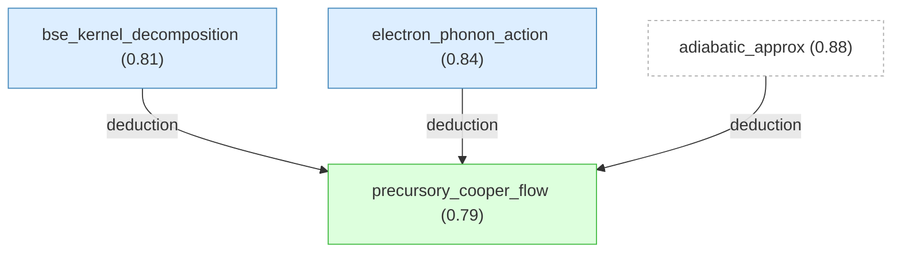
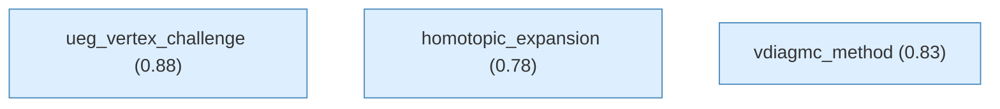
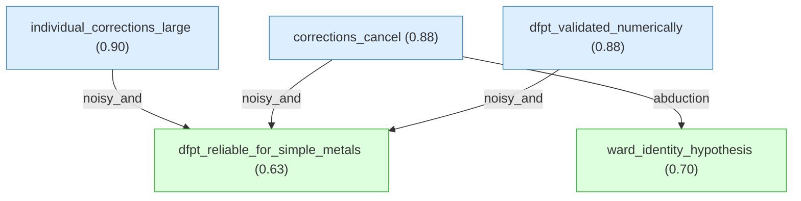
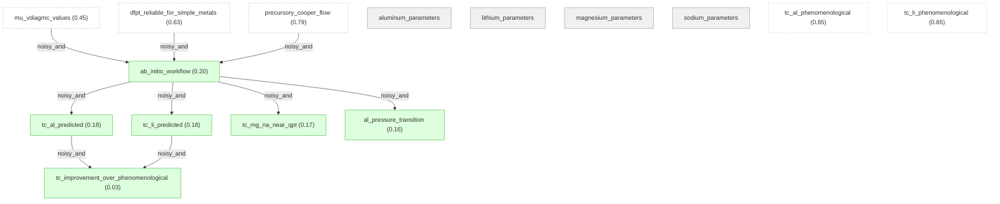

# superconductivity-electron-liquids-gaia

Gaia knowledge package: Superconductivity in Electron Liquids (arXiv:2512.19382)

## Introduction

#### bcs_framework

Bardeen-Cooper-Schrieffer (BCS) 理论将传统超导解释为声子交换介导的电子 Cooper 配对所产生的宏观量子态。该理论需要输入净有效电子-电子相互作用强度，即声子介导的吸引耦合与屏蔽 Coulomb 排斥之间的平衡。

#### migdal_eliashberg

Migdal-Eliashberg (ME) 框架通过在实频率轴上求解电子自能的自洽方程，将 BCS 理论推广到强耦合区间。然而，该框架将 Coulomb 赝势 $\mu^*$ 作为唯象参数处理，通常通过拟合实验测量的超导转变温度 $T_c$ 来确定。对拟合参数的依赖限制了框架的预测能力，尤其是对于亚开尔文超导体，$\mu^*$ 的微小变化会导致 $T_c$ 发生数量级变化。

#### adiabatic_approx

在传统金属中，Debye 频率 $\omega_D$ 远小于 Fermi 能量 $E_F$（$\omega_D / E_F \ll 1$），建立了电子和声子能量尺度的分离。这一绝热条件由 Migdal（1958）首先利用，证明了电子-声子顶点修正是小量，从而允许向低能有效理论投影。

**Prior:** 0.95 · **Belief:** 0.88

#### electron_gas_model

均匀电子气（jellium 模型）在金属密度区间（Wigner-Seitz 半径 $r_s = 2$ 至 $6$）是简单金属理论的标准参考系统。其性质通过局域密度近似支撑了密度泛函理论，使其成为第一性原理多体方法的天然检验平台。

**Prior:** 0.90 · **Belief:** 0.90

#### main_question

Coulomb 赝势 $\mu^*$——Migdal-Eliashberg 超导理论中的关键唯象参数——能否从第一性原理以可控精度计算？将第一性原理 $\mu^*$ 值代入 Eliashberg 框架后，能否对简单金属的超导转变温度 $T_c$ 给出定量可靠的预测？

## motivation

```mermaid
graph TD
    bcs_framework["bcs_framework"]:::setting
    migdal_eliashberg["migdal_eliashberg"]:::setting
    adiabatic_approx["adiabatic_approx (0.88)"]:::premise
    electron_gas_model["electron_gas_model (0.90)"]:::orphan
    main_question["main_question"]:::question

    classDef setting fill:#f0f0f0,stroke:#999
    classDef premise fill:#ddeeff,stroke:#4488bb
    classDef derived fill:#ddffdd,stroke:#44bb44
    classDef question fill:#fff3dd,stroke:#cc9944
    classDef orphan fill:#fff,stroke:#ccc,stroke-dasharray: 5 5
    classDef external fill:#fff,stroke:#aaa,stroke-dasharray: 3 3
```

#### bcs_framework

Bardeen-Cooper-Schrieffer (BCS) 理论将传统超导解释为声子交换介导的电子 Cooper 配对所产生的宏观量子态。该理论需要输入净有效电子-电子相互作用强度，即声子介导的吸引耦合与屏蔽 Coulomb 排斥之间的平衡。

#### migdal_eliashberg

Migdal-Eliashberg (ME) 框架通过在实频率轴上求解电子自能的自洽方程，将 BCS 理论推广到强耦合区间。然而，该框架将 Coulomb 赝势 $\mu^*$ 作为唯象参数处理，通常通过拟合实验测量的超导转变温度 $T_c$ 来确定。对拟合参数的依赖限制了框架的预测能力，尤其是对于亚开尔文超导体，$\mu^*$ 的微小变化会导致 $T_c$ 发生数量级变化。

#### adiabatic_approx

在传统金属中，Debye 频率 $\omega_D$ 远小于 Fermi 能量 $E_F$（$\omega_D / E_F \ll 1$），建立了电子和声子能量尺度的分离。这一绝热条件由 Migdal（1958）首先利用，证明了电子-声子顶点修正是小量，从而允许向低能有效理论投影。

**Prior:** 0.95 · **Belief:** 0.88

#### electron_gas_model

均匀电子气（jellium 模型）在金属密度区间（Wigner-Seitz 半径 $r_s = 2$ 至 $6$）是简单金属理论的标准参考系统。其性质通过局域密度近似支撑了密度泛函理论，使其成为第一性原理多体方法的天然检验平台。

**Prior:** 0.90 · **Belief:** 0.90

#### main_question

Coulomb 赝势 $\mu^*$——Migdal-Eliashberg 超导理论中的关键唯象参数——能否从第一性原理以可控精度计算？将第一性原理 $\mu^*$ 值代入 Eliashberg 框架后，能否对简单金属的超导转变温度 $T_c$ 给出定量可靠的预测？

## s2_model

#### electron_phonon_action

电子-声子系统的总作用量可严格分解为 $S = S_e[\bar{\psi}, \psi] + S_{ph}[u] + S_{e\text{-}ph}[\bar{\psi}, \psi, u] + S_{CT}[u]$，其中 $S_e$ 描述无近似的多电子相互作用，$S_{ph}$ 描述具有物理色散 $\omega_{\kappa q}$ 的声子，$S_{e\text{-}ph}$ 通过密度-位移形式捕获电子-声子耦合，$S_{CT}$ 是反项，减去已包含在物理声子谱中的静态屏蔽。引入反项 $S_{CT}$ 确保微扰展开中声子传播子保持物理性质且不发生重复计数。

**Prior:** 0.90 · **Belief:** 0.84

#### bse_kernel_decomposition

超导不稳定性通过反常顶点函数 $\Lambda_{k\omega}$ 满足的 Bethe-Salpeter 方程检测。BSE 积分核可严格分解为纯电子粒子-粒子相互作用 $\tilde{\Gamma}^e$ 与声子介导的吸引 $W^{ph}$ 两部分：$\tilde{\Gamma} = \tilde{\Gamma}^e + W^{ph} + O(\omega_D / E_F)$，其中误差项由 Migdal 定理控制，在绝热极限下可忽略。此分解是后续将 Coulomb 和声子通道独立处理的理论基础。

**Prior:** 0.88 · **Belief:** 0.81

#### precursory_cooper_flow

反常顶点函数在低频极限下遵循普适标度关系 $\Lambda_0 = 1 / (1 + g \ln(\omega_\Lambda / T)) + O(T)$，其中 $g$ 和 $\omega_\Lambda$ 是系统相关参数。对于 $g < 0$（净吸引），顶点在 $T_c = \omega_\Lambda \exp(1/g)$ 处发散，标志 Cooper 不稳定性。通过在 $T_c$ 以上多个温度计算 $\Lambda_0$ 并利用此对数标度律外推，可以避免在 $T_c$ 处进行计算困难的自洽求解而精确确定超导转变温度。该方法优于传统特征值追踪方法，因为后者在强排斥相互作用体系中缺乏可靠的外推方案。

**Derived via:** deduction([bse_kernel_decomposition](#bse_kernel_decomposition), [electron_phonon_action](#electron_phonon_action), [adiabatic_approx](#adiabatic_approx))
**Belief:** 0.79
**Reason:** 作用量的严格分解保证了电子-声子耦合的正确处理，BSE 积分核的 Coulomb/声子分离在绝热近似下成立，由此严格推导出反常顶点函数的普适对数标度律。

## s3_downfolding

```mermaid
graph TD
    adiabatic_approx["adiabatic_approx (0.88)"]:::external
    pair_propagator_decomposition["pair_propagator_decomposition (0.82)"]:::premise
    cross_term_suppressed["cross_term_suppressed (0.73)"]:::premise
    downfolded_bse["downfolded_bse (0.75)"]:::derived
    pseudopotential_scale_relation["pseudopotential_scale_relation (0.92)"]:::orphan
    mu_vdiagmc_values["mu_vdiagmc_values (0.45)"]:::derived
    rpa_predicts_negative_mu["rpa_predicts_negative_mu (0.28)"]:::orphan
    downfolding_validated["downfolding_validated (0.88)"]:::orphan
    downfolding_limitations["downfolding_limitations (0.90)"]:::orphan
    mu_rpa_vdiagmc_contradiction["mu_rpa_vdiagmc_contradiction (1.00)"]:::orphan
    ueg_vertex_challenge["ueg_vertex_challenge (0.88)"]:::external
    homotopic_expansion["homotopic_expansion (0.78)"]:::external
    vdiagmc_method["vdiagmc_method (0.83)"]:::external
    pair_propagator_decomposition -->|deduction| downfolded_bse
    cross_term_suppressed -->|deduction| downfolded_bse
    adiabatic_approx -->|deduction| downfolded_bse
    vdiagmc_method -->|noisy_and| mu_vdiagmc_values
    homotopic_expansion -->|noisy_and| mu_vdiagmc_values
    ueg_vertex_challenge -->|noisy_and| mu_vdiagmc_values
    mu_vdiagmc_values -.-|contradiction| mu_rpa_vdiagmc_contradiction
    rpa_predicts_negative_mu -.-|contradiction| mu_rpa_vdiagmc_contradiction

    classDef setting fill:#f0f0f0,stroke:#999
    classDef premise fill:#ddeeff,stroke:#4488bb
    classDef derived fill:#ddffdd,stroke:#44bb44
    classDef question fill:#fff3dd,stroke:#cc9944
    classDef orphan fill:#fff,stroke:#ccc,stroke-dasharray: 5 5
    classDef external fill:#fff,stroke:#aaa,stroke-dasharray: 3 3
```

#### pair_propagator_decomposition

配对传播子可严格分解为相干（低能/IR）与非相干（高能/UV）分量：$G_{k,\omega} G_{-k,-\omega} = \Pi_{BCS} + \varphi_{k\omega}$，其中相干部分 $\Pi_{BCS} = (z^e)^2 / [(\omega/z_\omega^{ph})^2 + \varepsilon_k^2] \cdot \Theta(\omega_c - |\varepsilon_k|)$，$z^e$ 为电子-电子相互作用的准粒子权重，$z_\omega^{ph}$ 捕获电子-声子耦合的频率依赖重整化。此分解是将全 BSE 降到低能有效理论的数学基础。

**Prior:** 0.88 · **Belief:** 0.82

#### cross_term_suppressed

在 downfolding 过程中，Coulomb 通道和声子通道之间的交叉耦合项（$\tilde{\Gamma}^e \cdot \varphi \cdot W^{ph}$）被等离激元频率压制，量级为 $\omega_c^2 / \omega_p^2$。对于金属密度 $r_s \geq 1$，$\omega_c / \omega_p \lesssim 0.1$，故 $\omega_c^2 / \omega_p^2 \lesssim 0.01$，保证了两个通道可独立处理。此压制依赖于动态屏蔽 Coulomb 相互作用在高频的渐近行为 $W^s \propto (\omega - \omega')^2 / [(\omega - \omega')^2 + \omega_p^2]$。

**Prior:** 0.82 · **Belief:** 0.73

#### downfolded_bse

消去高能模式后，完整的 BSE 可严格降标为仅依赖频率的 Fermi 面方程：$\Lambda_\omega = \eta_\omega + \pi T \sum_{|\omega'| < \omega_c} (\lambda_{\omega\omega'} - \mu_{\omega_c}) \, z^{ph}_{\omega'} / |\omega'| \, \Lambda_{\omega'}$，其中有效顶点可分离为 $\tilde{\Gamma}^{\omega_c} = U^e + W^{ph} + O(\omega_D/E_F, \, \omega_c^2/\omega_p^2)$，$U^e$ 为纯电子贡献且不依赖声子细节。此结果的关键意义是：尽管微观 Coulomb 相互作用具有奇异的动量依赖性和复杂的动态屏蔽，投影后的有效电子-电子相互作用退化为频率无关的赝势 $\mu_{\omega_c}$。

**Derived via:** deduction([pair_propagator_decomposition](#pair_propagator_decomposition), [cross_term_suppressed](#cross_term_suppressed), [adiabatic_approx](#adiabatic_approx))
**Belief:** 0.75
**Reason:** 配对传播子的相干/非相干分解提供了降标的数学基础，交叉项被 $\omega_c^2/\omega_p^2$ 压制保证了 Coulomb 和声子通道可独立处理，两者结合在绝热近似下严格推导出仅依赖频率的 Fermi 面 BSE。

#### pseudopotential_scale_relation

Coulomb 赝势 $\mu_{\omega_c}$ 在能量尺度变换下满足 Bogoliubov-Tolmachev-Shirkov 关系：$\mu_{\omega_c} = \mu_{\omega_c'} / (1 + \mu_{\omega_c'} \ln(\omega_c'/\omega_c))$。该关系确保物理可观测量不依赖于截断尺度的选择。在 Fermi 能量处定义的'裸'赝势 $\mu_{E_F}$ 是物理上有意义且无重整化伪影的量。

**Prior:** 0.92 · **Belief:** 0.92

#### mu_vdiagmc_values

利用变分图形蒙特卡洛方法计算均匀电子气在 $r_s \in [1,6]$ 区间的 $\mu_{E_F}$，结果为：$r_s=1$ 时 $\mu_{E_F} = 0.28(1)$，$r_s=2$ 时 $0.53(2)$，$r_s=3$ 时 $0.77(5)$，$r_s=4$ 时 $1.0(2)$，$r_s=5$ 时 $1.3(2)$，$r_s=6$ 时 $1.8(8)$。这些值显著超出 Morel-Anderson 静态 RPA 估计值（在 $r_s=5$ 处约为三倍），差异来源于顶点修正和超越 RPA 的效应。

**Derived via:** noisy_and([vdiagmc_method](#vdiagmc_method), [homotopic_expansion](#homotopic_expansion), [ueg_vertex_challenge](#ueg_vertex_challenge))
**Belief:** 0.45
**Reason:** 在均匀电子气上用 VDiagMC 计算四点顶点函数，同伦展开解决低温收敛问题，BTS 标度关系保证尺度一致性，共同得到 $\mu_{E_F}$ 的精确值。

#### rpa_predicts_negative_mu

动态 RPA 对 $r_s > 2$ 预测 $\mu^*$ 为负值，意味着 Coulomb 相互作用在 Cooper 通道中变为净吸引。这一结果在物理上不合理，因为没有电子-声子耦合的纯电子系统不应出现传统超导。这表明 RPA 在这些密度下对赝势的计算已经失效。

**Prior:** 0.50 · **Belief:** 0.28

#### downfolding_validated

通过类铝参数（$r_s = 1.92$，$\omega_D/E_F = 0.005$）的基准测试，比较完整频率-动量依赖的 BSE 解与简化的仅频率 downfolded BSE 解，两种方法得到的 $T_c$ 仅差 0.2%（$T_c^{full}/T_F = 10^{-5.668}$ vs $T_c^{approx}/T_F = 10^{-5.667}$），在 Debye 频率以下两者展现相同的普适对数标度行为。该基准验证了 downfolding 过程的定量精度。

**Prior:** 0.88 · **Belief:** 0.88

#### downfolding_limitations

Downfolding 框架在三类体系中不可靠：（1）超致密体系（$r_s \lesssim 0.01$，如白矮星内部），等离激元变软；（2）二维体系，无能隙等离激元模式使尺度分离条件在任何密度下都不成立；（3）强关联材料，强关联产生的软集体激发破坏了能量尺度层级。

**Prior:** 0.90 · **Belief:** 0.90

#### mu_rpa_vdiagmc_contradiction

not_both_true(A, B)

**Belief:** 1.00

## s4_pseudopotential

#### ueg_vertex_challenge

尽管均匀电子气相对于真实材料更简单，但在 $r_s > 1$ 的密度下精确计算其 Cooper 通道的 Coulomb 赝势仍是重大挑战。传统的基态方法（变分蒙特卡洛和扩散蒙特卡洛）无法获取 $r_s > 1$ 时所需的四点顶点函数，而变分图形蒙特卡洛方法可以在弱耦合以外的区间直接计算所需的顶点函数。

**Prior:** 0.92 · **Belief:** 0.88

#### homotopic_expansion

在低温下，标准微扰展开的第 $n$ 阶项按 $(\ln T)^n$ 标度，导致 $T \to 0$ 时对数发散。为解决此收敛问题，引入同伦变换将温度依赖的散射振幅 $\gamma_T(\xi)$ 转化为温度无关的赝势：$\mu_{\omega_c}(\xi) = \gamma_T(\xi) / [1 - \gamma_T(\xi) \, \xi \ln(\omega_c / T)]$，展开为 $\mu_{\omega_c}(\xi) = \mu_{\omega_c}^{(0)} + \mu_{\omega_c}^{(1)}\xi + \mu_{\omega_c}^{(2)}\xi^2 + \cdots$，其系数不依赖温度。该变换利用 Cooper 对数的标度性质，产生恰好抵消发散 $\ln(\omega_c/T)$ 行为的反项，使级数在所有温度下快速收敛，从而可靠提取 $\mu_{E_F}$ 的值。

**Prior:** 0.85 · **Belief:** 0.78

#### vdiagmc_method

变分图形蒙特卡洛方法采用重整化策略，将均匀电子气视为带反项的重整化 Yukawa Fermi 气体，将裸参数展开为幂级数 $\mu = \mu_R + \delta\mu_1 \xi + \delta\mu_2 \xi^2 + \cdots$，物理结果对应 $\xi = 1$。Feynman 图表示为利用 Dyson-Schwinger 和 Parquet 方程的计算图，实现了场论重整化方案的高效实现。屏蔽参数 $\lambda_R$ 经过优化以改善收敛性。

**Prior:** 0.88 · **Belief:** 0.83

## s5_eph_coupling

#### individual_corrections_large

在有效场论（EFT）框架中，电子-电子相互作用对准粒子权重 $z^e$ 的修正、对屏蔽 Coulomb 相互作用 $v_q/\varepsilon_q$ 的修正、以及对电子-声子顶点 $\Gamma_3^e$ 的修正各自都很大，单独考虑时会显著偏离自由电子结果。

**Prior:** 0.90 · **Belief:** 0.90

#### corrections_cancel

尽管各项修正单独很大，它们在有效电子-声子耦合中几乎精确抵消：$z^e \cdot v_q/\varepsilon_q \cdot \Gamma_3^e(k; q) \approx v_q / [1 - (v_q + f_{xc}) \cdot \chi_0^e(q)]$，其中左侧是包含所有多体修正的 EFT 结果，右侧是基于线性响应理论的密度泛函微扰理论（DFPT）结果。图形化地说，电子-电子相互作用对准粒子权重 $z^e$ 的贡献被电子-声子顶点重整化 $\Gamma_3^e$ 有效抵消。

**Prior:** 0.88 · **Belief:** 0.88

#### dfpt_validated_numerically

通过变分图形蒙特卡洛方法在 $r_s \in [1, 5]$ 区间的数值验证，EFT 与 DFPT 在 Fermi 面上所有相关动量传递（$|q| \leq 2k_F$）范围内给出近乎完全一致的有效电子-声子耦合 $\lambda$ 值。

**Prior:** 0.88 · **Belief:** 0.88

#### dfpt_reliable_for_simple_metals

密度泛函微扰理论（DFPT）对简单金属的电子-声子耦合常数 $\lambda$ 给出定量可靠的结果。这一结论由变分图形蒙特卡洛方法在 $r_s \in [1,5]$ 区间的逐点基准测试确立：尽管准粒子权重 $z^e$、屏蔽和顶点修正各自偏离自由电子值很大，它们在有效耦合中几乎精确抵消，使得 DFPT 的线性响应结果与包含所有多体效应的有效场论结果一致。这意味着计算真实材料的 $T_c$ 时可直接使用现有的 DFPT 代码获取电子-声子耦合，而无需完整的多体计算。

**Derived via:** noisy_and([individual_corrections_large](#individual_corrections_large), [corrections_cancel](#corrections_cancel), [dfpt_validated_numerically](#dfpt_validated_numerically))
**Belief:** 0.63
**Reason:** 各项多体修正单独很大，但在有效耦合中几乎精确抵消，并通过 VDiagMC 的逐点数值验证确认 → DFPT 对简单金属可靠。

#### ward_identity_hypothesis

Ward 恒等式和电子-声子顶点的规范不变性强制要求自能、屏蔽和顶点修正在长波极限下系统性地互相抵消。DFPT 中各项大修正的近精确抵消不是数值巧合，而是守恒律约束多体修正在物理可观测量中组合方式的必然结果。

**Derived via:** abduction([corrections_cancel](#corrections_cancel))
**Prior:** 0.70 · **Belief:** 0.70
**Reason:** 各项修正的近精确抵消不是数值巧合，而是 Ward 恒等式约束多体修正在物理可观测量中组合方式的必然结果。

## s6_superconductors

#### aluminum_parameters

铝（Al）的材料参数（Table II）：Wigner-Seitz 半径 $r_s = 2.07$，对数平均声子频率 $\omega_{\mathrm{log}} = 320$ K，电子-声子耦合 $\lambda = 0.44$，实验超导转变温度 $T_c^{\mathrm{exp}} = 1.2$ K。

#### lithium_parameters

锂（Li, 9R 结构）的材料参数（Table II）：Wigner-Seitz 半径 $r_s = 3.25$，对数平均声子频率 $\omega_{\mathrm{log}} = 242$ K，电子-声子耦合 $\lambda = 0.34$，实验超导转变温度 $T_c^{\mathrm{exp}} = 4 \times 10^{-4}$ K（0.4 mK）。

#### magnesium_parameters

镁（Mg）的材料参数（Table II）：Wigner-Seitz 半径 $r_s = 2.66$，对数平均声子频率 $\omega_{\mathrm{log}} = 269$ K，电子-声子耦合 $\lambda = 0.24$，实验上未观测到超导转变。

#### sodium_parameters

钠（Na）的材料参数（Table II）：Wigner-Seitz 半径 $r_s = 3.96$，对数平均声子频率 $\omega_{\mathrm{log}} = 127$ K，电子-声子耦合 $\lambda = 0.2$，实验上未观测到超导转变。

#### ab_initio_workflow ★

一套完整的第一性原理超导 $T_c$ 预测工作流由三个组件集成构成：（1）由变分图形蒙特卡洛方法计算的均匀电子气 Coulomb 赝势 $\mu^*$，通过 Bogoliubov-Tolmachev-Shirkov 关系标度到适当的能量截断；（2）由密度泛函微扰理论（DFPT）计算的电子-声子耦合常数 $\lambda$，其可靠性已通过多体基准测试验证；（3）前驱 Cooper 流方法，通过在 $T_c$ 以上多个温度求解 downfolded BSE 并利用普适标度律外推确定 $T_c$。该工作流不含任何可调参数。

**Derived via:** noisy_and([mu_vdiagmc_values](#mu_vdiagmc_values), [dfpt_reliable_for_simple_metals](#dfpt_reliable_for_simple_metals), [precursory_cooper_flow](#precursory_cooper_flow))
**Belief:** 0.20
**Reason:** 精确 $\mu^*$ + 可靠 $\lambda$ + PCF 方法 → 无可调参数的第一性原理工作流。

#### tc_al_predicted ★

第一性原理工作流预测铝的超导转变温度为 $T_c^{\mathrm{EFT}} = 0.96$ K（Table II），与实验值 $T_c^{\mathrm{exp}} = 1.2$ K 偏差约 20%。

**Derived via:** noisy_and([ab_initio_workflow](#ab_initio_workflow))
**Belief:** 0.18

#### tc_al_phenomenological

使用传统 McMillan 公式和标准 $\mu^* = 0.1$ 预测铝的超导转变温度为 $T_c^{\mu\mathrm{MA}} = 1.9$ K（Table II），相对实验值 1.2 K 偏高约 58%。与第一性原理预测的 0.96 K（偏差 20%）相比，传统方法对铝的预测精度较低。

**Prior:** 0.85 · **Belief:** 0.85

#### tc_li_predicted ★

第一性原理工作流预测锂（9R 结构）的超导转变温度为 $T_c^{\mathrm{EFT}} = 5 \times 10^{-3}$ K（Table II），比实验值 $T_c^{\mathrm{exp}} = 4 \times 10^{-4}$ K 高约一个数量级，部分原因在于极低温下锂晶体结构的争议。

**Derived via:** noisy_and([ab_initio_workflow](#ab_initio_workflow))
**Belief:** 0.18

#### tc_li_phenomenological

使用传统 McMillan 公式和标准 $\mu^* = 0.1$ 预测锂（9R 结构）的超导转变温度为 $T_c^{\mu\mathrm{MA}} = 0.35$ K（Table II），相对实验值 $4 \times 10^{-4}$ K 偏高约三个数量级。第一性原理预测的 $5 \times 10^{-3}$ K 虽仍偏高一个数量级，但较传统方法改善了两个数量级。

**Prior:** 0.85 · **Belief:** 0.85

#### tc_mg_na_near_qpt ★

第一性原理计算预测镁的 $T_c^{\mathrm{EFT}} = 5 \times 10^{-5}$ K、钠的 $T_c^{\mathrm{EFT}} = 2 \times 10^{-13}$ K（Table II），远低于当前实验探测能力。两者均处于正常态-超导态量子相变的临界点附近，配对场磁化率在 10 K 以下展现量子临界标度 $\chi \sim \ln(T)$，无需精细调控参数。

**Derived via:** noisy_and([ab_initio_workflow](#ab_initio_workflow))
**Belief:** 0.17

#### al_pressure_transition ★

理论预测铝在压力增加到约 60 GPa 以上时会经历从超导态到正常态的压力诱导量子相变。这是一个可实验验证的预测。

**Derived via:** noisy_and([ab_initio_workflow](#ab_initio_workflow))
**Belief:** 0.16

#### tc_improvement_over_phenomenological ★

与基于唯象 $\mu^* = 0.1$ 的 McMillan 公式相比，第一性原理框架对亚开尔文超导体的 $T_c$ 预测实现了数量级的改进：铝从偏差 58% 缩小到 20%，锂从偏差三个数量级缩小到一个数量级。改进的根本原因是用变分图形蒙特卡洛方法精确计算的 $\mu_{E_F}$ 替代了拟合参数。对于 $\mu^*$ 微小变化导致 $T_c$ 数量级变化的低温超导体，精确的 $\mu^*$ 值尤为关键。

**Derived via:** noisy_and([tc_al_predicted](#tc_al_predicted), [tc_li_predicted](#tc_li_predicted))
**Belief:** 0.03
**Reason:** 铝（偏差 58%→20%）和锂（偏差 3 个数量级→1 个数量级）两个案例共同支撑总结论。

## Inference Results

**BP converged:** True (35 iterations)

| Label | Type | Prior | Belief | Role |
|-------|------|-------|--------|------|
| [tc_improvement_over_phenomenological](#tc_improvement_over_phenomenological) | claim | — | 0.0309 | derived |
| [al_pressure_transition](#al_pressure_transition) | claim | — | 0.1580 | derived |
| [tc_mg_na_near_qpt](#tc_mg_na_near_qpt) | claim | — | 0.1678 | derived |
| [tc_al_predicted](#tc_al_predicted) | claim | — | 0.1777 | derived |
| [tc_li_predicted](#tc_li_predicted) | claim | — | 0.1777 | derived |
| [ab_initio_workflow](#ab_initio_workflow) | claim | — | 0.1965 | derived |
| [rpa_predicts_negative_mu](#rpa_predicts_negative_mu) | claim | 0.50 | 0.2764 | orphaned |
| [mu_vdiagmc_values](#mu_vdiagmc_values) | claim | — | 0.4491 | derived |
| [dfpt_reliable_for_simple_metals](#dfpt_reliable_for_simple_metals) | claim | — | 0.6272 | derived |
| [ward_identity_hypothesis](#ward_identity_hypothesis) | claim | 0.70 | 0.7000 | derived |
| [cross_term_suppressed](#cross_term_suppressed) | claim | 0.82 | 0.7309 | independent |
| [downfolded_bse](#downfolded_bse) | claim | — | 0.7479 | derived |
| [homotopic_expansion](#homotopic_expansion) | claim | 0.85 | 0.7831 | independent |
| [precursory_cooper_flow](#precursory_cooper_flow) | claim | — | 0.7878 | derived |
| [bse_kernel_decomposition](#bse_kernel_decomposition) | claim | 0.88 | 0.8110 | independent |
| [pair_propagator_decomposition](#pair_propagator_decomposition) | claim | 0.88 | 0.8206 | independent |
| [vdiagmc_method](#vdiagmc_method) | claim | 0.88 | 0.8265 | independent |
| [electron_phonon_action](#electron_phonon_action) | claim | 0.90 | 0.8425 | independent |
| [tc_al_phenomenological](#tc_al_phenomenological) | claim | 0.85 | 0.8500 | orphaned |
| [tc_li_phenomenological](#tc_li_phenomenological) | claim | 0.85 | 0.8500 | orphaned |
| [corrections_cancel](#corrections_cancel) | claim | 0.88 | 0.8800 | independent |
| [dfpt_validated_numerically](#dfpt_validated_numerically) | claim | 0.88 | 0.8800 | independent |
| [downfolding_validated](#downfolding_validated) | claim | 0.88 | 0.8800 | orphaned |
| [adiabatic_approx](#adiabatic_approx) | claim | 0.95 | 0.8804 | independent |
| [ueg_vertex_challenge](#ueg_vertex_challenge) | claim | 0.92 | 0.8843 | independent |
| [downfolding_limitations](#downfolding_limitations) | claim | 0.90 | 0.9000 | orphaned |
| [electron_gas_model](#electron_gas_model) | claim | 0.90 | 0.9000 | orphaned |
| [individual_corrections_large](#individual_corrections_large) | claim | 0.90 | 0.9000 | independent |
| [pseudopotential_scale_relation](#pseudopotential_scale_relation) | claim | 0.92 | 0.9200 | orphaned |
| [mu_rpa_vdiagmc_contradiction](#mu_rpa_vdiagmc_contradiction) | claim | — | 0.9996 | orphaned |
