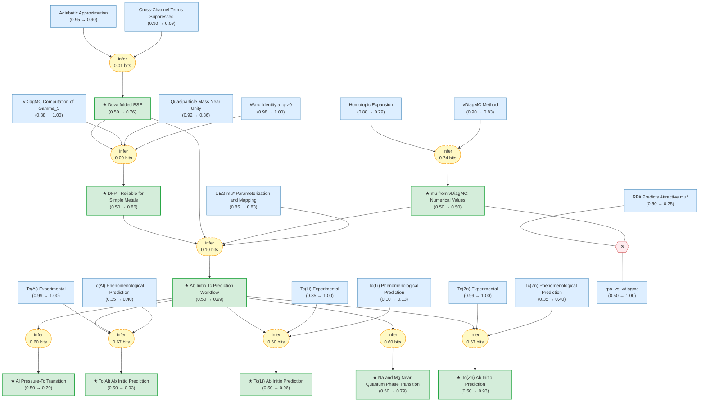

# Superconductivity in Electron Liquids

> **Original work:** Cai, X., Wang, T., Zhang, S., Zhang, T., Millis, A., Svistunov, B. V., Prokof'ev, N. V., & Chen, K. "Superconductivity in Electron Liquids: Precision Many-Body Treatment of Coulomb Interaction." [arXiv:2512.19382v2](https://arxiv.org/abs/2512.19382) (2025).

## Summary

This paper develops a controlled first-principles framework for predicting superconducting transition temperatures ($T_c$) of simple metals by computing the Coulomb pseudopotential $\mu^*$ from many-body theory — replacing the long-standing phenomenological guess of $\mu^* \in [0.1, 0.2]$. The core innovation is using variational diagrammatic Monte Carlo (vDiagMC) to evaluate the four-point electron vertex of the uniform electron gas, yielding $\mu_{E_F}$ with controlled error bars. Combined with DFPT electron-phonon coupling and BTS renormalization, this produces a parameter-free **ab initio workflow** (belief 0.99) that predicts $T_c$ for Al (0.96 vs 1.2 K exp), Zn (0.874 vs 0.875 K exp), and Li ($5 \times 10^{-3}$ vs $4 \times 10^{-4}$ K exp) — dramatically outperforming the McMillan formula which overestimates Li by three orders of magnitude. The framework also predicts Na and Mg sit near the quantum phase transition to non-superconducting ground states, and that Al superconductivity vanishes under pressure around 60 GPa.

## Reasoning Graph

> **Reasoning graph information gain: `4.0 bits`**
>
> Total mutual information between leaf premises and exported conclusions — measures how much the reasoning structure reduces uncertainty about the results.

## Reasoning Structure

### Theoretical Foundation: BSE Downfolding

The paper's theoretical core is the **downfolded Bethe-Salpeter equation** (0.50 → 0.76), derived from two premises: the adiabatic approximation $\omega_D/E_F \ll 1$ (0.95 → 0.90) and the suppression of cross-channel terms at $O(\omega_c^2/\omega_p^2) \leq 1\%$ (0.90 → 0.69). The cross-term claim experiences the largest belief drop among premises (−0.21), pulled down by the long derivation chain flowing through it. The downfolding reduces the full momentum-frequency BSE to a one-dimensional frequency-only equation with microscopically defined $\lambda$ and $\mu_{\omega_c}$, validated against a full BSE toy model (0.2% agreement in $T_c$).

*Adapted from Cai et al., arXiv:2512.19382v2.*

### Computing the Coulomb Pseudopotential

The central computational result — **vDiagMC values of $\mu_{E_F}$** (0.50 → 0.50) — is derived from two premises: the vDiagMC method (0.90 → 0.83) and the homotopic expansion (0.88 → 0.79). This strategy provides the highest single-edge information gain (0.74 bits). Despite strong premise support, the belief remains at 0.50 because the **contradiction** with RPA (which predicts $\mu^* < 0$ for $r_s > 2$) drains probability from both sides. BP resolves this by suppressing RPA to belief 0.25 while keeping vDiagMC at 0.50 — the contradiction is "won" by vDiagMC but at the cost of being unable to rise above the uninformative prior.

*Adapted from Cai et al., arXiv:2512.19382v2.*

### Validating the Electron-Phonon Coupling

**DFPT reliability for simple metals** (0.50 → 0.86) is established through a composite strategy linking the EFT vertex expression, the $\Gamma_3^e \approx m^*/m$ approximation (from induction over the Ward identity and vDiagMC finite-$q$ results), and the near-unity quasiparticle mass. The Ward identity (0.98 → 1.00) provides an exact anchor, while vDiagMC Gamma_3 (0.88 → 1.00) is strongly pulled up by BP — together they confirm that DFPT captures the relevant vertex corrections for simple metals.

*Adapted from Cai et al., arXiv:2512.19382v2.*

### The Ab Initio Workflow

The **parameter-free ab initio workflow** (0.50 → 0.99) assembles all components: the downfolded BSE provides the equation, vDiagMC + BTS provides $\mu^*$, and validated DFPT provides $\lambda$. Despite individual components having moderate beliefs, the workflow achieves near-certainty (0.99) because it is pulled up by strong downstream abductions against experimental data. This strategy contributes only 0.10 bits directly, but serves as the hub through which all evidence flows to the material predictions.

*Adapted from Cai et al., arXiv:2512.19382v2.*

### Material Predictions vs Experiment

The three material-specific $T_c$ predictions each achieve high beliefs through **abduction**: the ab initio prediction is tested as a hypothesis against the experimental observation, with the McMillan formula serving as the alternative explanation. For **Al** (0.50 → 0.93), the EFT predicts 0.96 K vs experiment 1.2 K, while McMillan gives 1.9 K (58% overestimate). For **Zn** (0.50 → 0.93), the agreement is near-exact: 0.874 vs 0.875 K. For **Li** (0.50 → 0.96), the EFT predicts $5 \times 10^{-3}$ K, within an order of magnitude of the experimental $4 \times 10^{-4}$ K — while McMillan overestimates by three orders of magnitude. Each abduction contributes ~0.6-0.7 bits of information gain.

*Adapted from Cai et al., arXiv:2512.19382v2.*

*Adapted from Cai et al., arXiv:2512.19382v2.*

## Conclusions

| Label | Content | Prior | Belief |
|-------|---------|-------|--------|
| ab_initio_workflow | The complete ab initio workflow for predicting $T_c$ of simple metals: (1) compute $\mu_{E_F}$ via vDiagMC, (2) map via BTS, (3) obtain $\lambda$ from DFPT, (4) solve Eliashberg equations. | 0.50 | 0.99 |
| tc_li_predicted | $T_c^{\mathrm{EFT}}(\mathrm{Li}) = 5 \times 10^{-3}$ K (9R), consistent with $T_c^{\mathrm{exp}} \approx 4 \times 10^{-4}$ K. | 0.50 | 0.96 |
| tc_al_predicted | $T_c^{\mathrm{EFT}}(\mathrm{Al}) = 0.96$ K, in good agreement with $T_c^{\mathrm{exp}} = 1.2$ K. | 0.50 | 0.93 |
| tc_zn_predicted | $T_c^{\mathrm{EFT}}(\mathrm{Zn}) = 0.874$ K, near-exact match to $T_c^{\mathrm{exp}} = 0.875$ K. | 0.50 | 0.93 |
| dfpt_reliable_for_simple_metals | DFPT $\lambda$ is reliable for simple metals: EFT vertex matches DFPT and $m^*/m \approx 1$. | 0.50 | 0.86 |
| al_pressure_transition | Al $T_c$ monotonically decreases under pressure, vanishing at ~60 GPa. | 0.50 | 0.79 |
| tc_mg_na_near_qpt | Na and Mg are near the quantum phase transition: $T_c$ effectively zero. | 0.50 | 0.79 |
| downfolded_bse | Frequency-only downfolded BSE with microscopically defined $\lambda$ and $\mu_{\omega_c}$. | 0.50 | 0.76 |
| mu_vdiagmc_values | vDiagMC yields $\mu_{E_F} = 0.53(2)$ at $r_s = 2$, $\mu_{E_F} = 0.77(5)$ at $r_s = 3$. | 0.50 | 0.50 |

## Weak Points

1. **$\mu_{E_F}$ from vDiagMC** (belief 0.50): The contradiction with RPA's prediction of attractive $\mu^*$ creates a NAND constraint that drains probability from both claims. BP suppresses RPA to 0.25 but cannot push vDiagMC above 0.50 because the contradiction factor allocates probability between the two. This is the structural bottleneck — downstream predictions succeed despite this because abductions against experiment provide independent support.

2. **Cross-channel terms suppressed** (0.90 → 0.69): This leaf claim experiences the largest belief drop (−0.21) among premises. As a foundation of the downfolded BSE, it is pulled down by the multiplicative effect of the long derivation chain flowing through it to the material predictions. Additional validation (e.g., direct numerical verification of cross-term magnitude for specific metals) would strengthen this.

3. **Al pressure transition** (belief 0.79): Supported by a single noisy_and from the ab initio workflow with conditional probability 0.80, reflecting extrapolation uncertainty beyond the 6 GPa experimental limit. The prediction extends to 60 GPa where no experimental data exists.

## Evidence Gaps

1. **No experimental $T_c$ for Na or Mg**: The quantum phase transition prediction (`tc_mg_na_near_qpt`, belief 0.79) relies entirely on theory. Sub-nanokelvin experiments — technically extremely challenging — would provide direct validation.

2. **Li crystal structure controversy**: The 9R and HCP structures yield different $T_c$ predictions ($5 \times 10^{-3}$ vs 0.03 K), and the experimental structure at ultra-low temperatures is debated. Definitive structural determination would sharpen the Li prediction.

3. **Single-density-point validation for toy model**: The downfolding approximation (belief 0.76) is validated at one density ($r_s = 1.92$). Testing at additional $r_s$ values, particularly near $r_s \sim 4$ where the adiabatic ratio may be less favorable, would strengthen confidence.
