# superconductivity-electron-liquids-gaia

Gaia knowledge package: Superconductivity in Electron Liquids (arXiv:2512.19382)

 

## Overview

```mermaid
graph TD
    adiabatic_approx["Adiabatic Approximation (0.95 → 0.90)"]:::premise
    cross_term_suppressed["Cross-Channel Terms Suppressed (0.90 → 0.69)"]:::premise
    downfolded_bse["Downfolded BSE ★ (→ 0.76)"]:::exported
    vdiagmc_method["vDiagMC Method (0.90 → 0.83)"]:::premise
    homotopic_expansion["Homotopic Expansion (0.88 → 0.79)"]:::premise
    mu_vdiagmc_values["μ* from vDiagMC ★ (→ 0.50)"]:::exported
    ward_identity["Ward Identity (0.98 → 1.00)"]:::premise
    gamma3_vdiagmc["vDiagMC Γ₃ (0.88 → 1.00)"]:::premise
    quasiparticle_mass_near_unity["m*/m ≈ 1 (0.92 → 0.86)"]:::premise
    dfpt_reliable_for_simple_metals["DFPT Reliable ★ (→ 0.86)"]:::exported
    ueg_pseudopotential_parameterization["UEG μ* Mapping (0.85 → 0.83)"]:::premise
    ab_initio_workflow["Ab Initio Workflow ★ (→ 0.99)"]:::exported
    tc_al_experimental["Tc(Al) Expt (0.99 → 1.00)"]:::premise
    tc_al_phenomenological["Tc(Al) Phenom (0.35 → 0.40)"]:::premise
    tc_al_predicted["Tc(Al) Predicted ★ (→ 0.93)"]:::exported
    tc_zn_experimental["Tc(Zn) Expt (0.99 → 1.00)"]:::premise
    tc_zn_phenomenological["Tc(Zn) Phenom (0.35 → 0.40)"]:::premise
    tc_zn_predicted["Tc(Zn) Predicted ★ (→ 0.93)"]:::exported
    tc_li_experimental["Tc(Li) Expt (0.85 → 1.00)"]:::premise
    tc_li_phenomenological["Tc(Li) Phenom (0.10 → 0.13)"]:::premise
    tc_li_predicted["Tc(Li) Predicted ★ (→ 0.96)"]:::exported
    al_pressure_transition["Al Pressure-Tc ★ (→ 0.79)"]:::exported
    tc_mg_na_near_qpt["Na/Mg Near QPT ★ (→ 0.79)"]:::exported

    adiabatic_approx --> downfolded_bse
    cross_term_suppressed --> downfolded_bse
    vdiagmc_method --> mu_vdiagmc_values
    homotopic_expansion --> mu_vdiagmc_values
    ward_identity --> dfpt_reliable_for_simple_metals
    gamma3_vdiagmc --> dfpt_reliable_for_simple_metals
    quasiparticle_mass_near_unity --> dfpt_reliable_for_simple_metals
    downfolded_bse --> dfpt_reliable_for_simple_metals
    downfolded_bse --> ab_initio_workflow
    mu_vdiagmc_values --> ab_initio_workflow
    dfpt_reliable_for_simple_metals --> ab_initio_workflow
    ueg_pseudopotential_parameterization --> ab_initio_workflow
    ab_initio_workflow --> tc_al_predicted
    tc_al_experimental --> tc_al_predicted
    tc_al_phenomenological --> tc_al_predicted
    ab_initio_workflow --> tc_zn_predicted
    tc_zn_experimental --> tc_zn_predicted
    tc_zn_phenomenological --> tc_zn_predicted
    ab_initio_workflow --> tc_li_predicted
    tc_li_experimental --> tc_li_predicted
    tc_li_phenomenological --> tc_li_predicted
    ab_initio_workflow --> al_pressure_transition
    ab_initio_workflow --> tc_mg_na_near_qpt

    classDef premise fill:#ddeeff,stroke:#4488bb,color:#333
    classDef exported fill:#d4edda,stroke:#28a745,stroke-width:2px,color:#333
```

## Conclusions

| Label | Content | Belief |
|-------|---------|--------|
| ab_initio_workflow | The complete ab initio workflow for predicting $T_c$ of simple metals: (1) co... | 0.99 |
| al_pressure_transition | Under hydrostatic pressure, the ab initio framework predicts that aluminum's ... | 0.79 |
| dfpt_reliable_for_simple_metals | For simple metals, the DFPT calculation of the electron-phonon coupling const... | 0.86 |
| downfolded_bse | The frequency-only downfolded Bethe-Salpeter equation: the full momentum-freq... | 0.76 |
| mu_vdiagmc_values | vDiagMC calculations of the UEG four-point vertex yield the Coulomb pseudopot... | 0.50 |
| tc_al_predicted | The ab initio predicted superconducting transition temperature of aluminum is... | 0.93 |
| tc_li_predicted | The ab initio predicted superconducting transition temperature of lithium is ... | 0.96 |
| tc_mg_na_near_qpt | The ab initio framework predicts that sodium and magnesium have extremely low... | 0.79 |
| tc_zn_predicted | The ab initio predicted superconducting transition temperature of zinc is $T_... | 0.93 |

<!-- content:start -->

This paper develops a complete first-principles framework for predicting the superconducting transition temperature $T_c$ of simple metals, resolving a decades-old problem in condensed matter physics. The key innovation is computing the Coulomb pseudopotential $\mu^*$ --- the effective electron-electron repulsion in the Cooper pairing channel --- from first principles using variational diagrammatic Monte Carlo (vDiagMC) applied to the uniform electron gas, eliminating the last phenomenological parameter from the Migdal-Eliashberg theory of superconductivity. The approach derives a microscopically grounded downfolded Bethe-Salpeter equation, validates DFPT for the electron-phonon coupling in simple metals via an effective field theory analysis, and combines both inputs into a parameter-free workflow that reproduces experimental $T_c$ values for aluminum, zinc, and lithium with dramatically improved accuracy over the traditional McMillan formula.

### Main Conclusions

#### Ab Initio $T_c$ Prediction Workflow (belief: 0.99)

The complete parameter-free workflow for predicting $T_c$ brings together three independently validated components: (1) the vDiagMC-computed Coulomb pseudopotential $\mu^*$ mapped from the uniform electron gas to real materials via the BTS renormalization relation, (2) the DFPT-computed electron-phonon coupling constant $\lambda$, and (3) the downfolded Eliashberg equations derived from a controlled BSE downfolding. This workflow is assembled via a composite deduction from `downfolded_bse`, `mu_available_for_simple_metals`, and `dfpt_reliable_for_simple_metals`, and its very high belief (0.99) reflects the strong convergence of all three independent lines of reasoning, despite individual components having moderate beliefs.

#### $T_c$(Al) Ab Initio Prediction (belief: 0.93)

The predicted $T_c^{\mathrm{th}} = 1.1 \pm 0.3$ K for aluminum agrees well with the experimental $T_c^{\mathrm{exp}} = 1.2$ K. This prediction flows from `ab_initio_workflow` applied with aluminum material parameters ($r_s = 2.07$, $\lambda \approx 0.44$). The abduction against the experimental value (`tc_al_experimental`, belief 1.00) strongly favors this prediction over the phenomenological alternative (`tc_al_phenomenological`, belief 0.40), which overestimates by 58% using the ad hoc $\mu^* = 0.1$.

#### $T_c$(Zn) Ab Initio Prediction (belief: 0.93)

The predicted $T_c^{\mathrm{th}} = 0.7 \pm 0.3$ K for zinc is consistent with the experimental $T_c^{\mathrm{exp}} = 0.875$ K. Derived via the same `ab_initio_workflow` with zinc parameters ($r_s = 2.31$, $\lambda \approx 0.43$), the first-principles $\mu^* \approx 0.12$ correctly captures the stronger Coulomb repulsion at higher $r_s$. The phenomenological prediction (`tc_zn_phenomenological`, belief 0.40) again overestimates by 57%.

#### $T_c$(Li) Ab Initio Prediction (belief: 0.96)

The predicted $T_c^{\mathrm{th}} \lesssim 10^{-3}$ K for lithium matches the experimental $T_c^{\mathrm{exp}} \approx 4 \times 10^{-4}$ K, a dramatic improvement over the phenomenological prediction that overestimates by three orders of magnitude. This is the most striking success of the framework: the large first-principles $\mu^* \approx 0.16$ (from $r_s = 3.25$) nearly cancels $\lambda \approx 0.41$, and the exponential sensitivity $T_c \propto \exp(-1/g)$ amplifies this correction from 0.06 in $\mu^*$ to a thousand-fold reduction in $T_c$. The phenomenological alternative (`tc_li_phenomenological`) drops to belief 0.13.

#### DFPT Reliable for Simple Metals (belief: 0.86)

The DFPT calculation of $\lambda$ is validated for simple metals through a two-step composite reasoning: (1) the EFT electron-phonon vertex expression, combined with the approximation $\Gamma_3^e \approx m^*/m$ from vDiagMC, shows that $z^e \cdot \Gamma_3^e \approx 1$ so the EFT vertex matches DFPT; (2) the near-unity quasiparticle mass ($m^*/m \approx 1$) ensures the density of states agrees as well. This conclusion depends on the induction-derived `gamma3_approximation` (belief 0.91) and `quasiparticle_mass_near_unity` (belief 0.86).

#### Downfolded Bethe-Salpeter Equation (belief: 0.76)

The full momentum-frequency BSE kernel is rigorously reduced to a one-dimensional frequency-only integral equation with microscopically defined $\lambda$ and $\mu_{\omega_c}$ kernels. This is the theoretical backbone of the paper, derived by deduction from `bse_kernel_decomposition` (belief 0.998) and `cross_term_suppressed` (belief 0.69). The moderate belief (0.76) is primarily limited by the cross-channel suppression estimate, which has a relatively conservative prior of 0.90 and experiences further reduction through the reasoning network.

#### $\mu^*$ from vDiagMC (belief: 0.50)

The vDiagMC calculations yield $\mu_{E_F} \approx 0.21$ at $r_s = 2$ (aluminum-like) and $\mu_{E_F} \approx 0.33$ at $r_s = 3.3$ (lithium-like), giving $\mu^* \approx 0.10$--$0.15$ at the Debye scale after BTS renormalization. This claim has the lowest belief among the exported conclusions because it depends on two computational ingredients --- the vDiagMC method itself (belief 0.83) and the homotopic expansion convergence technique (belief 0.79) --- connected through a noisy-AND strategy with conditional probability 0.90. The claim also participates in a contradiction with the RPA prediction of attractive $\mu^*$, which suppresses both claims.

#### Al Pressure-$T_c$ Transition and Na/Mg Near Quantum Phase Transition (belief: 0.79 each)

The framework predicts non-monotonic pressure dependence of $T_c$ for aluminum and identifies sodium and magnesium as lying near the quantum phase transition between superconducting and non-superconducting ground states. Both derive from `ab_initio_workflow` via noisy-AND strategies with conditional probabilities of 0.80, reflecting the additional uncertainties of extrapolation (pressure for Al, near-critical behavior for Na/Mg).

### Weak Points

#### Cross-Channel Term Suppression (`cross_term_suppressed`, belief: 0.69)

This claim --- that Coulomb-phonon cross terms are suppressed at $O(\omega_c^2/\omega_p^2)$ --- is the weakest link in the downfolding derivation chain. It is a leaf claim with prior 0.90 that drops to 0.69 after belief propagation, because it directly feeds into `downfolded_bse` (belief 0.76) which in turn supports every downstream prediction. The suppression estimate relies on a plasmon-pole argument that, while physically reasonable, lacks the rigorous backing of a convergent diagrammatic calculation. Any revision of this estimate would propagate through the entire prediction chain.

#### $\mu^*$ from vDiagMC (`mu_vdiagmc_values`, belief: 0.50)

Despite being the central computational result, this claim carries the lowest belief of any exported conclusion. It depends on two premises connected by a noisy-AND: `vdiagmc_method` (belief 0.83) and `homotopic_expansion` (belief 0.79). Both require the diagrammatic series to converge reliably --- a condition that is systematically validated but not mathematically proven. Furthermore, this claim enters a contradiction with `rpa_predicts_attractive_mu`, which, although suppressed to belief 0.25, still drains probability from the vDiagMC result through the contradiction factor.

#### $\mu^*$ Available for Simple Metals (`mu_available_for_simple_metals`, belief: 0.40)

This intermediate claim --- that the UEG $\mu_{E_F}(r_s)$ can be reliably mapped to real materials --- has the lowest belief of any non-leaf claim in the network. It depends on both `mu_vdiagmc_values` (belief 0.50) and `ueg_pseudopotential_parameterization` (belief 0.83) through a noisy-AND with conditional probability 0.88. The low belief of its vDiagMC input propagates directly, and the additional uncertainty from the UEG-to-material mapping (band-mass corrections, lattice effects) compounds the issue. This claim is the bottleneck between the computational core and the material-specific predictions.

#### Homotopic Expansion (`homotopic_expansion`, belief: 0.79)

The convergence improvement technique underpinning the vDiagMC calculations has a prior of 0.88, reflecting that while the log-divergence cure is rigorous, the conformal-map trick relies on analyticity assumptions about the diagrammatic series. Since both the $\mu^*$ values and (indirectly) the $\Gamma_3$ vertex corrections depend on vDiagMC convergence, any failure in the homotopic expansion would undermine multiple branches of the reasoning graph simultaneously.
<!-- content:end -->
