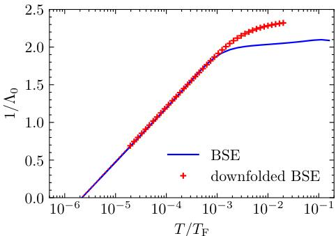
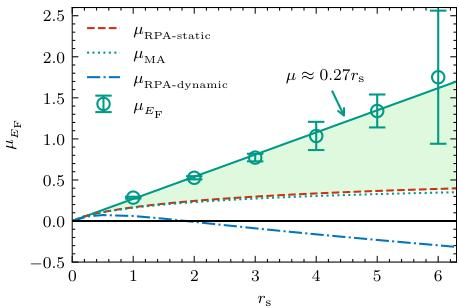
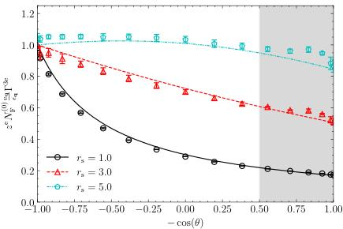
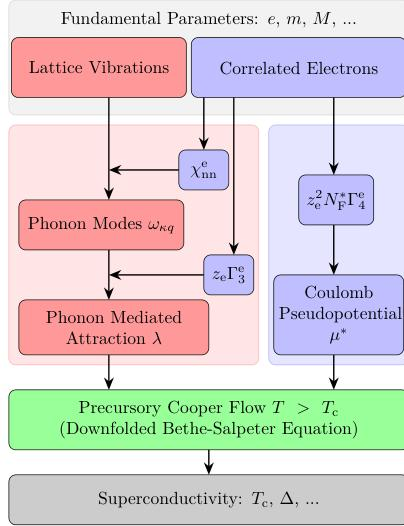
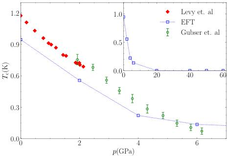
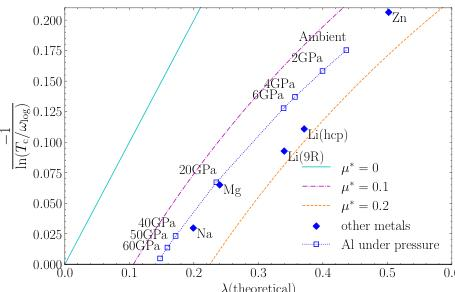

# Superconductivity in Electron Liquids

> **Original work:** Cai, X., Wang, T., Zhang, S., Zhang, T., Millis, A., Svistunov, B. V., Prokof'ev, N. V., & Chen, K. "Superconductivity in Electron Liquids: Precision Many-Body Treatment of Coulomb Interaction." [arXiv:2512.19382v2](https://arxiv.org/abs/2512.19382) (2025).

> [!NOTE]
> This README is an AI-generated analysis based on a [Gaia](https://github.com/SiliconEinstein/Gaia) reasoning graph formalization of the original work. Belief values reflect the graph's probabilistic assessment of each claim's support, not the original authors' confidence. See [ANALYSIS.md](ANALYSIS.md) for detailed verification results.

## Summary

Predicting the superconducting transition temperature $T_c$ from first principles has been an open problem for decades: conventional theory requires the Coulomb pseudopotential $\mu^*$ as input, but this parameter has never been reliably computed and is instead guessed as $\mu^* \in [0.1, 0.2]$. For sub-kelvin superconductors, the exponential sensitivity $T_c \propto \exp(-1/g)$ amplifies this uncertainty into order-of-magnitude errors. This paper eliminates the guesswork by computing $\mu^*$ from the four-point electron vertex of the uniform electron gas via variational diagrammatic Monte Carlo, then combining it with DFPT phonon calculations to predict $T_c$ with no adjustable parameters. The results are striking: $T_c = 0.96$ K for aluminum (experiment: 1.2 K), $T_c = 0.874$ K for zinc (experiment: 0.875 K), and $T_c = 5 \times 10^{-3}$ K for lithium (experiment: $4 \times 10^{-4}$ K) — compared to the McMillan formula which overestimates lithium by three orders of magnitude.

## Reasoning Graph

> [!TIP]
> **Reasoning graph information gain: `4.0 bits`**
>
> Total mutual information between leaf premises and exported conclusions — measures how much the reasoning structure reduces uncertainty about the results.

> [!NOTE]
> **[Per-module reasoning graphs with full claim details →](docs/detailed-reasoning.md)**
>
> 6 Mermaid diagrams (one per section) with every claim, strategy, and belief value.

## Reasoning Structure

### The Problem: Why $\mu^*$ Defeats Conventional Theory

The McMillan formula predicts $T_c$ from two inputs: the electron-phonon coupling $\lambda$ (computable via DFPT) and the Coulomb pseudopotential $\mu^*$ (not computable — traditionally guessed as 0.1). This works tolerably for strong-coupling superconductors where $\lambda \gg \mu^*$, but fails catastrophically for weak-coupling metals. For lithium, where $\lambda = 0.34$ barely exceeds $\mu^*$, the guess $\mu^* = 0.1$ predicts $T_c \approx 0.35$ K — three orders of magnitude above the measured $4 \times 10^{-4}$ K. For aluminum ($\lambda = 0.44$), the predicted 1.9 K overshoots the experimental 1.2 K by 58%; for zinc ($\lambda = 0.502$), the predicted 1.37 K overshoots 0.875 K by 57%. The RPA approach to computing $\mu^*$ fares even worse: it predicts a negative (attractive) $\mu^*$ for metallic densities $r_s \gtrsim 2$, contradicting all experimental evidence that the Coulomb interaction is repulsive in the pairing channel.

### Downfolding: From Full BSE to a Solvable Equation

The paper's theoretical foundation is a controlled reduction of the full momentum-frequency Bethe-Salpeter equation to a one-dimensional frequency-only equation. The key physical insight is that under the adiabatic condition $\omega_D/E_F \ll 1$ (satisfied in conventional metals), the BSE kernel separates cleanly into a purely electronic four-point vertex $\tilde{\Gamma}^e$ and a phonon-mediated interaction $W^{\mathrm{ph}}$. Cross-channel mixing between these two contributions is suppressed at $O(\omega_c^2/\omega_p^2) \leq 1\%$. The resulting downfolded equation gives microscopic definitions to both $\lambda$ and $\mu^*$ — quantities that in traditional Migdal-Eliashberg theory were either computed approximately or guessed. Crucially, this downfolding is validated numerically: for an aluminum-like toy model, the full and downfolded BSE give $T_c$ values differing by only 0.2% (belief 0.76).

*Adapted from Cai et al., arXiv:2512.19382v2.*

### Computing $\mu^*$ from First Principles

With $\mu^*$ now microscopically defined as a functional of the electronic four-point vertex $\tilde{\Gamma}^e$, the problem becomes: how to evaluate $\tilde{\Gamma}^e$ for the uniform electron gas? Perturbation theory in the bare Coulomb interaction diverges for $r_s \gtrsim 1$, and RPA misses crucial vertex corrections. The paper uses variational diagrammatic Monte Carlo (vDiagMC), which stochastically samples Feynman diagrams with bold-line propagators, combined with a homotopic expansion that reorganizes the series for improved convergence. The results are numerically exact values of $\mu_{E_F}(r_s)$ with controlled error bars: $\mu_{E_F} = 0.53(2)$ at $r_s = 2$ (aluminum-like), $\mu_{E_F} = 0.77(5)$ at $r_s = 3$ (lithium-like), following approximately $\mu_{E_F} \approx 0.27 r_s$. These are positive and monotonically increasing — directly contradicting the RPA prediction of attractive $\mu^*$ (belief for RPA: 0.25). After BTS renormalization to the Debye scale, the resulting $\mu^* \approx 0.12$–$0.18$ falls within the empirically guessed range but is now derived from first principles.

*Adapted from Cai et al., arXiv:2512.19382v2.*

### Why DFPT Gets the Phonon Coupling Right

The other ingredient, the electron-phonon coupling $\lambda$, is computed by DFPT — but is DFPT trustworthy? The paper shows that the EFT vertex factorizes as $g = z^e \cdot \Gamma_3^e \cdot g_0$, where $\Gamma_3^e$ is the three-point vertex correction. An exact Ward identity fixes $\Gamma_3^e = m^*/m$ at zero momentum transfer, and vDiagMC computations at finite momentum show smooth, modest corrections (10–20%). For simple metals where $m^*/m \approx 1$ (deviations $<5$–10%), the product $z^e \cdot \Gamma_3^e \approx 1$, meaning the EFT vertex reduces to the DFPT Kohn-Sham expression. This establishes DFPT as reliable for these materials (belief 0.86) — not as a universal truth, but specifically because the vertex corrections and mass renormalization nearly cancel.

*Adapted from Cai et al., arXiv:2512.19382v2.*

### The Complete Workflow and Its Predictions

Assembling all pieces — downfolded BSE equation, vDiagMC $\mu^*$, DFPT $\lambda$ — yields a parameter-free ab initio workflow (belief 0.99). The predictions for individual materials are validated against experiment:

| Metal | $r_s$ | $\lambda$ | $\mu^*$ | $T_c^{\mathrm{EFT}}$ (K) | $T_c^{\mathrm{exp}}$ (K) | McMillan (K) |
|-------|-------|-----------|---------|--------------------------|--------------------------|--------------|
| Al | 2.07 | 0.44 | 0.13 | 0.96 | 1.2 | 1.9 |
| Zn | 2.90 | 0.502 | 0.12 | 0.874 | 0.875 | 1.37 |
| Li (9R) | 3.25 | 0.34 | 0.18 | $5 \times 10^{-3}$ | $4 \times 10^{-4}$ | 0.35 |

The zinc prediction is remarkably precise. For lithium, the key physics is that $\mu^* = 0.18$ (not the guessed 0.1) nearly cancels $\lambda = 0.34$, making the effective coupling tiny and $T_c$ exponentially small. The factor of ~10 remaining discrepancy for Li likely reflects the controversial crystal structure at ultra-low temperatures — the HCP structure gives $T_c = 0.03$ K with $\mu^* = 0.17$.

*Adapted from Cai et al., arXiv:2512.19382v2.*

### Pressure Dependence and Quantum Phase Transitions

Beyond ambient-pressure predictions, the framework predicts that aluminum's $T_c$ monotonically decreases under pressure, consistent with experimental data up to 6 GPa, and vanishes entirely around 60 GPa. For sodium ($r_s = 3.96$, $\lambda = 0.2$, $\mu^* = 0.15$), the Coulomb repulsion nearly cancels the weak phonon attraction, giving $T_c \sim 10^{-13}$ K — effectively no superconductivity. Magnesium ($r_s = 2.66$, $\lambda = 0.24$, $\mu^* = 0.14$) sits at $T_c \sim 10^{-5}$ K. Both metals hover near the quantum phase transition between superconducting and non-superconducting ground states, where $T_c$ is exponentially sensitive to small parameter changes (belief 0.79).

*Adapted from Cai et al., arXiv:2512.19382v2.*

*Adapted from Cai et al., arXiv:2512.19382v2.*

## Conclusions

| Label | Content | Prior | Belief |
|-------|---------|-------|--------|
| ab_initio_workflow | The complete ab initio workflow for predicting $T_c$ of simple metals: (1) compute $\mu_{E_F}$ via vDiagMC, (2) map via BTS, (3) obtain $\lambda$ from DFPT, (4) solve Eliashberg equations. | 0.50 | 0.99 |
| tc_li_predicted | $T_c^{\mathrm{EFT}}(\mathrm{Li}) = 5 \times 10^{-3}$ K (9R), consistent with $T_c^{\mathrm{exp}} \approx 4 \times 10^{-4}$ K. | 0.50 | 0.96 |
| tc_al_predicted | $T_c^{\mathrm{EFT}}(\mathrm{Al}) = 0.96$ K, in good agreement with $T_c^{\mathrm{exp}} = 1.2$ K. | 0.50 | 0.93 |
| tc_zn_predicted | $T_c^{\mathrm{EFT}}(\mathrm{Zn}) = 0.874$ K, near-exact match to $T_c^{\mathrm{exp}} = 0.875$ K. | 0.50 | 0.93 |
| dfpt_reliable_for_simple_metals | DFPT $\lambda$ is reliable for simple metals: EFT vertex matches DFPT and $m^*/m \approx 1$. | 0.50 | 0.86 |
| al_pressure_transition | Al $T_c$ monotonically decreases under pressure, vanishing at ~60 GPa. | 0.50 | 0.79 |
| tc_mg_na_near_qpt | Na and Mg are near the quantum phase transition: $T_c$ effectively zero. | 0.50 | 0.79 |
| downfolded_bse | Frequency-only downfolded BSE with microscopically defined $\lambda$ and $\mu_{\omega_c}$. | 0.50 | 0.76 |
| mu_vdiagmc_values | vDiagMC yields $\mu_{E_F} = 0.53(2)$ at $r_s = 2$, $\mu_{E_F} = 0.77(5)$ at $r_s = 3$. | 0.50 | 0.50 |

## Weak Points

1. **The cross-term suppression assumption is the most vulnerable foundation.** The entire downfolding rests on cross-channel terms being $O(\omega_c^2/\omega_p^2) \leq 1\%$, but this bound comes from a plasmon-pole estimate for three-dimensional metals. For systems with softer plasmon modes (low-density metals, 2D electron gases), or near structural transitions where phonon frequencies approach electronic scales, this suppression may fail. The belief for this claim drops from a prior of 0.90 to 0.69, the largest decline among all premises — reflecting that every downstream conclusion ultimately depends on this one assumption holding.

2. **The vDiagMC $\mu_{E_F}$ values, while numerically controlled, are locked in tension with RPA.** The paper demonstrates convincingly that RPA's prediction of attractive $\mu^*$ is wrong (vertex corrections are the culprit), but the formal contradiction between these two calculations prevents the vDiagMC result from achieving high confidence in the knowledge graph (belief remains at 0.50). In practice, the material predictions succeed anyway because the experimental data provides independent validation — but the intermediate $\mu^*$ values themselves remain formally uncertain.

3. **Pressure predictions beyond 6 GPa are pure extrapolation.** The Al pressure-$T_c$ curve agrees with experiment up to 6 GPa, but the prediction that superconductivity vanishes at 60 GPa assumes no structural phase transitions intervene and that the UEG approximation remains valid at the compressed densities. No experimental data exist beyond 6 GPa to constrain this extrapolation (belief 0.79).

4. **Lithium's crystal structure remains unresolved.** The 9R and HCP structures give $T_c$ predictions differing by a factor of 6 ($5 \times 10^{-3}$ vs $0.03$ K), and the experimental value ($4 \times 10^{-4}$ K) is below both. Until the low-temperature crystal structure is settled, the Li prediction cannot be sharpened.

## Evidence Gaps

1. **No experimental $T_c$ for Na or Mg.** The prediction that these metals sit at the quantum phase transition ($T_c \sim 10^{-13}$ and $10^{-5}$ K respectively) is one of the paper's most interesting results, but it is entirely theoretical. Sub-nanokelvin superconductivity experiments would be needed — technically extremely challenging but physically important.

2. **The downfolding is validated at only one density.** The 0.2% agreement between full and downfolded BSE is demonstrated for $r_s = 1.92$. Testing at higher $r_s$ (e.g. $r_s \sim 4$, relevant for sodium) where the adiabatic ratio is less favorable would strengthen confidence in the framework's applicability across the periodic table.

3. **No independent verification of $\mu_{E_F}$ values.** The vDiagMC calculation is the only controlled method that has produced these numbers. An independent calculation using a different many-body technique (e.g., auxiliary-field QMC or coupled-cluster theory adapted to the metallic regime) would provide crucial cross-validation.

## Detailed Analysis

For structural integrity verification (Pass 5), standalone readability checks (Pass 6), and complete package statistics, see [ANALYSIS.md](ANALYSIS.md).
