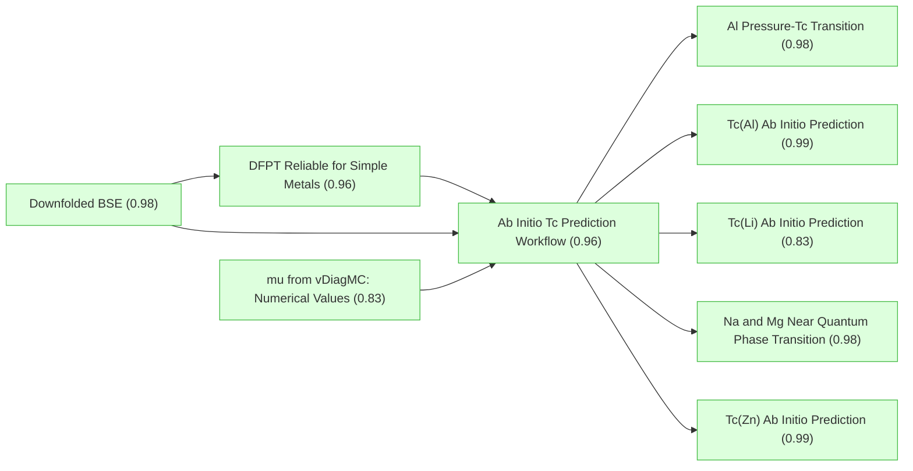
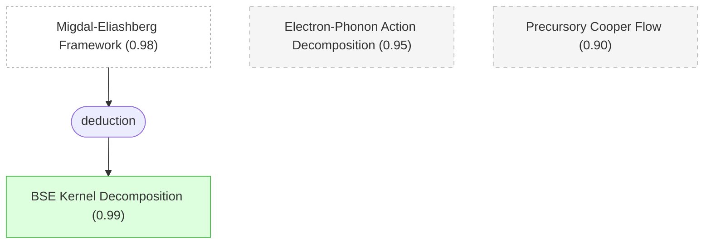
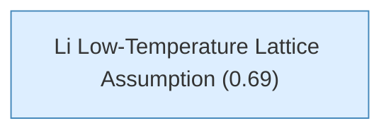
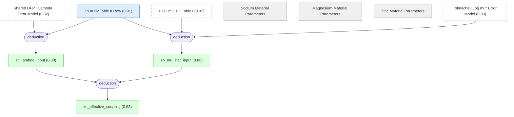

# superconductivity-electron-liquids-gaia

Gaia knowledge package: Superconductivity in Electron Liquids (arXiv:2512.19382)

## Overview

## Introduction: Motivation and Background

#### BCS Theory

📋 `bcs_theory`

> Bardeen-Cooper-Schrieffer (BCS) theory: phonon-mediated electron-electron attraction leads to Cooper pairing instability at the Fermi surface, providing the fundamental framework for understanding conventional superconductors.

## Small v6 migration helpers for the electron-liquids sandbox package.

```mermaid
graph TD
    bcs_theory["BCS Theory"]:::external
    adiabatic_approx["Adiabatic Approximation (0.96)"]:::premise
    me_framework["Migdal-Eliashberg Framework (0.98)"]:::derived
    bts_renormalization["BTS Renormalization Relation (1.00)"]:::premise
    me_downfolding_is_phenomenological["ME Downfolding is Phenomenological (0.95)"]:::orphan
    phenomenological_me_theory["Phenomenological ME Theory Limitations (0.95)"]:::orphan
    mu_star_phenomenological["mu#ast; as Phenomenological Parameter (0.95)"]:::background
    rpa_predicts_attractive_mu["RPA Predicts Attractive mu#ast; (0.09)"]:::premise
    dfpt_computes_lambda["DFPT Computes lambda (0.92)"]:::background
    tc_al_experimental["Tc(Al) Experimental (1.00)"]:::derived
    tc_li_experimental["Tc(Li) Experimental (0.78)"]:::derived
    tc_zn_experimental["Tc(Zn) Experimental (1.00)"]:::derived
    tc_al_phenomenological["Tc(Al) Phenomenological Prediction (0.78)"]:::premise
    tc_li_phenomenological["Tc(Li) Phenomenological Prediction (0.70)"]:::premise
    tc_zn_phenomenological["Tc(Zn) Phenomenological Prediction (0.83)"]:::premise
    mu_scale_independence["BTS Relation as Corollary (1.00)"]:::external
    bts_microscopic_equivalence["bts_microscopic_equivalence (1.00)"]:::external
    mu_vdiagmc_values["mu from vDiagMC: Numerical Values (0.83)"]:::external
    rpa_vs_vdiagmc["rpa_vs_vdiagmc (1.00)"]:::external
    tc_al_predicted["Tc(Al) Ab Initio Prediction (0.99)"]:::external
    tc_zn_predicted["Tc(Zn) Ab Initio Prediction (0.99)"]:::external
    tc_li_predicted["Tc(Li) Ab Initio Prediction (0.83)"]:::external
    strat_0(["deduction"])
    adiabatic_approx --> strat_0
    bcs_theory -.-> strat_0
    strat_0 --> me_framework
    strat_10(["deduction"])
    bts_renormalization -.-> strat_10
    strat_10 --> mu_vdiagmc_values
    strat_32(["infer"]):::weak
    tc_al_predicted --> strat_32
    strat_32 --> tc_al_experimental
    strat_33(["infer"]):::weak
    tc_al_phenomenological --> strat_33
    strat_33 --> tc_al_experimental
    strat_34(["infer"]):::weak
    tc_zn_predicted --> strat_34
    strat_34 --> tc_zn_experimental
    strat_35(["infer"]):::weak
    tc_zn_phenomenological --> strat_35
    strat_35 --> tc_zn_experimental
    strat_36(["infer"]):::weak
    tc_li_predicted --> strat_36
    strat_36 --> tc_li_experimental
    strat_37(["infer"]):::weak
    tc_li_phenomenological --> strat_37
    strat_37 --> tc_li_experimental
    oper_1{{"≡"}}
    mu_scale_independence --- oper_1
    bts_renormalization --- oper_1
    oper_1 --- bts_microscopic_equivalence
    oper_2{{"⊗"}}:::contra
    rpa_predicts_attractive_mu --- oper_2
    mu_vdiagmc_values --- oper_2
    oper_2 --- rpa_vs_vdiagmc

    classDef setting fill:#f0f0f0,stroke:#999,color:#333
    classDef premise fill:#ddeeff,stroke:#4488bb,color:#333
    classDef derived fill:#ddffdd,stroke:#44bb44,color:#333
    classDef question fill:#fff3dd,stroke:#cc9944,color:#333
    classDef background fill:#f5f5f5,stroke:#bbb,stroke-dasharray: 5 5,color:#333
    classDef orphan fill:#fff,stroke:#ccc,stroke-dasharray: 5 5,color:#333
    classDef external fill:#fff,stroke:#aaa,stroke-dasharray: 3 3,color:#333
    classDef weak fill:#fff9c4,stroke:#f9a825,stroke-dasharray: 5 5,color:#333
    classDef contra fill:#ffebee,stroke:#c62828,color:#333
```

#### Adiabatic Approximation

📌 `adiabatic_approx`   |   Prior: 0.95   |   Belief: **0.96**

> In conventional metals, the typical phonon frequency (Debye frequency $\omega_D$) is much smaller than the electron Fermi energy $E_F$, i.e. $\omega_D / E_F \ll 1$ (adiabatic approximation). This energy-scale separation has three key consequences: (i) electrons adiabatically adjust to ionic motion, (ii) the electron-ion coupling can be linearized, and (iii) the space-time scale separation between electron and phonon physics permits a controlled effective field theory (EFT) treatment.

#### Migdal-Eliashberg Framework

📌 `me_framework`   |   Belief: **0.98**

> Migdal-Eliashberg (ME) theory provides a rigorous treatment of the dynamic electron-phonon interaction. Under the adiabatic condition $\omega_D / E_F \ll 1$, Migdal's theorem guarantees that phonon vertex corrections are suppressed at $O(\omega_D/E_F)$, allowing the electron-phonon self-energy to be truncated at the self-consistent Fock diagram level. This justifies the ME formalism as a controlled low-energy theory for electron-phonon superconductors.

🔗 **deduction**([Adiabatic Approximation](#adiabatic_approx))

#### BTS Renormalization Relation

📌 `bts_renormalization`   |   Prior: 0.95   |   Belief: **1.00**

> The Bogoliubov-Tolmachev-Shirkov (BTS) renormalization relation connects the Coulomb pseudopotential $\mu_{\omega_c}$ (a dimensionless parameter describing the effective electron-electron repulsion strength in the pairing channel) defined at different energy cutoff scales $\omega_c$: $\mu_{\omega_c} = \mu_{\omega_c'} / (1 + \mu_{\omega_c'} \ln(\omega_c'/\omega_c))$. This relation ensures that physical observables do not depend on the choice of the arbitrary cutoff scale.

#### ME Downfolding is Phenomenological

📌 `me_downfolding_is_phenomenological`   |   Prior: 0.95   |   Belief: **0.95**

> The downfolding procedure (integrating out high-energy degrees of freedom to obtain a low-energy effective theory) in traditional Migdal-Eliashberg (ME) theory is phenomenological: the Coulomb effect is replaced by a static pseudopotential $\mu^*$, ignoring corrections from Coulomb fluctuations to quasiparticle renormalization and electron-phonon coupling, as well as non-local effects of screening.

#### Phenomenological ME Theory Limitations

📌 `phenomenological_me_theory`   |   Prior: 0.95   |   Belief: **0.95**

> Traditional electron-phonon superconductivity theory uses the McMillan (or Allen-Dynes) formula, with the electron-phonon coupling constant $\lambda$ and Coulomb pseudopotential $\mu^*$ as inputs to predict the superconducting transition temperature $T_c$. Since $\mu^*$ cannot be reliably computed from first principles, it is typically assigned an empirical value $\mu^* \in [0.1, 0.2]$. For materials with $T_c$ in the sub-kelvin range, the exponential sensitivity $T_c \propto \exp(-1/g)$ to $\mu^*$ causes this uncertainty to span several orders of magnitude in the predicted $T_c$, destroying predictive power.

#### mu* as Phenomenological Parameter

📌 `mu_star_phenomenological`   |   Prior: 0.95   |   Belief: **0.95**

> Due to the lack of a reliable microscopic calculation, the Coulomb pseudopotential $\mu^*$ (a dimensionless parameter describing the effective Coulomb repulsion strength in the low-energy pairing channel) is typically treated as an adjustable parameter with empirical values in the range 0.1--0.2.

#### RPA Predicts Attractive mu*

📌 `rpa_predicts_attractive_mu`   |   Prior: 0.50   |   Belief: **0.09**

> When treating the dynamically screened Coulomb interaction within the random phase approximation (RPA), the predicted $\mu^* < 0$ (i.e. the Coulomb effect becomes net attractive in the Cooper channel) for Wigner-Seitz radius $r_s \gtrsim 2$ ($r_s$ is proportional to the ratio of electron spacing to Bohr radius, measuring the ratio of Coulomb interaction to kinetic energy). However, RPA neglects beyond-RPA effects such as vertex corrections and self-energy renormalization for $r_s \gtrsim 1$, making its predictions unreliable in this density regime and inconsistent with extensive experimental evidence.

#### DFPT Computes lambda

📌 `dfpt_computes_lambda`   |   Prior: 0.92   |   Belief: **0.92**

> Density functional perturbation theory (DFPT) computes the electron-phonon coupling constant $\lambda$ (a dimensionless parameter quantifying the phonon-mediated attraction strength at the Fermi surface) via the linear response of the Kohn-Sham ground-state energy to lattice distortions. DFPT has been validated for weakly correlated superconductors but its accuracy for strongly correlated systems is unknown.

#### Tc(Al) Experimental

📌 `tc_al_experimental`   |   Prior: 0.99   |   Belief: **1.00**

> The experimental superconducting transition temperature of aluminum (Al) is $T_c^{\mathrm{exp}} = 1.2$ K.

🔗 **infer**([Tc(Al) Phenomenological Prediction](#tc_al_phenomenological))

#### Tc(Li) Experimental

📌 `tc_li_experimental`   |   Prior: 0.85   |   Belief: **0.78**

> The experimental superconducting transition temperature of lithium (Li) is $T_c^{\mathrm{exp}} \approx 4 \times 10^{-4}$ K (0.4 mK). This measurement corresponds to the 9R crystal structure; the crystal structure of lithium at ultra-low temperatures remains controversial.

🔗 **infer**([Tc(Li) Phenomenological Prediction](#tc_li_phenomenological))

#### Tc(Zn) Experimental

📌 `tc_zn_experimental`   |   Prior: 0.99   |   Belief: **1.00**

> The experimental superconducting transition temperature of zinc (Zn) is $T_c^{\mathrm{exp}} = 0.875$ K.

🔗 **infer**([Tc(Zn) Phenomenological Prediction](#tc_zn_phenomenological))

#### Tc(Al) Phenomenological Prediction

📌 `tc_al_phenomenological`   |   Prior: 0.90   |   Belief: **0.78**

> Using the McMillan formula (an empirical formula for $T_c$ based on the electron-phonon coupling constant $\lambda$ and Coulomb pseudopotential $\mu^*$), and treating the traditional empirical $\mu^*$ choice as uniformly distributed over 0.1--0.2, the predicted superconducting transition temperature of aluminum spans roughly $0.071$--$1.9$ K. The experimental value 1.2 K lies inside this broad interval, illustrating that the conventional prediction has adjustable rather than first-principles $\mu^*$ content.

#### Tc(Li) Phenomenological Prediction

📌 `tc_li_phenomenological`   |   Prior: 0.90   |   Belief: **0.70**

> Using the McMillan formula and treating the traditional empirical $\mu^*$ choice as uniformly distributed over 0.1--0.2, the predicted superconducting transition temperature of lithium spans roughly $1.3 \times 10^{-4}$--$0.35$ K. The experimental value is approximately $4 \times 10^{-4}$ K, so the range can cover the measurement only near its high-$\mu^*$ tail; the broad interval shows that the conventional prediction is dominated by the adjustable $\mu^*$ choice.

#### Tc(Zn) Phenomenological Prediction

📌 `tc_zn_phenomenological`   |   Prior: 0.90   |   Belief: **0.83**

> Using the McMillan formula and treating the traditional empirical $\mu^*$ choice as uniformly distributed over 0.1--0.2, the predicted superconducting transition temperature of zinc spans roughly $0.137$--$1.37$ K. The experimental value 0.875 K lies inside this broad interval, again indicating that the conventional prediction depends strongly on the empirical $\mu^*$ selection.

## Introduction: Motivation and Background (continued)

#### Main Question: First-Principles mu* and Tc

❓ `main_question`

> Can the Coulomb pseudopotential $\mu^*$ (the parameter quantifying effective electron-electron repulsion in the Cooper pairing channel) be computed from first principles with controlled accuracy, and can this yield quantitative predictions of the superconducting transition temperature $T_c$ for simple metals (e.g. Al, Li, Na, Mg)?

## Small v6 migration helpers for the electron-liquids sandbox package. (continued)

#### Electron-Phonon Action Decomposition

📌 `electron_phonon_action`   |   Prior: 0.95   |   Belief: **0.95**

> The effective action of the electron-phonon coupled system can be decomposed as $S = S_e + S_{\mathrm{ph}} + S_{e\text{-ph}} + S_{\mathrm{CT}} + O(\sqrt{m/M})$, where $m$ is the electron mass and $M$ is the ion mass. $S_e$ is the complete many-electron action without any approximation, $S_{\mathrm{ph}}$ describes phonons with physical dispersion, $S_{e\text{-ph}}$ is the coupling between electron density and ionic displacement, and $S_{\mathrm{CT}}$ is a counterterm that subtracts the static electron polarization contribution already included in the physical phonon dispersion to prevent double counting.

#### BSE Kernel Decomposition

📌 `bse_kernel_decomposition`   |   Belief: **0.99**

> The kernel of the Bethe-Salpeter equation (BSE) can be decomposed into the purely electronic particle-particle irreducible four-point vertex $\tilde\Gamma^e$ (encoding all non-perturbative Coulomb effects) and the phonon-mediated effective electron-electron interaction $W^{\mathrm{ph}}$: $\tilde\Gamma = \tilde\Gamma^e + W^{\mathrm{ph}} + O(\omega_D/E_F)$. Migdal's theorem ensures that higher-order phonon vertex corrections are suppressed by the adiabatic small parameter.

🔗 **deduction**([Migdal-Eliashberg Framework](#me_framework))

#### Precursory Cooper Flow

📌 `precursory_cooper_flow`   |   Prior: 0.90   |   Belief: **0.90**

> The low-frequency limit of the anomalous vertex function on the Fermi surface $\Lambda_0$ obeys a universal scaling relation (precursory Cooper flow, PCF): $\Lambda_0 = 1/(1 + g\ln(\omega_\Lambda/T)) + O(T)$, where $g$ is the dimensionless coupling constant ($g < 0$ corresponds to net attraction) and $\omega_\Lambda$ is an effective high-energy cutoff. When $g < 0$, $\Lambda_0$ diverges at $T_c = \omega_\Lambda e^{1/g}$; by computing in the normal state and extrapolating, one can predict $T_c$.

## Downfolding the Bethe-Salpeter Equation

#### Pair Propagator Decomposition

📋 `pair_propagator_decomposition`

> The pair propagator (product of two single-particle Green's functions $G_{k\omega}G_{-k,-\omega}$) can be exactly decomposed into a low-energy coherent part $\Pi_{\mathrm{BCS}}$ and a high-energy incoherent remainder $\phi_{k\omega}$: $G_{k\omega}G_{-k,-\omega} = \Pi_{\mathrm{BCS}} + \phi_{k\omega}$. The coherent part is expressed in terms of the quasiparticle weight $z^e$, frequency-dependent quasiparticle weight $z_\omega^{\mathrm{ph}}$, and renormalized dispersion $\epsilon_k$. This is an exact mathematical identity introducing energy-scale separation in the two-electron channel.

## Small v6 migration helpers for the electron-liquids sandbox package. (continued)

#### Cross-Channel Terms Suppressed

📌 `cross_term_suppressed`   |   Prior: 0.90   |   Belief: **0.93**

> Cross terms mixing Coulomb and phonon channels are suppressed by the plasma frequency $\omega_p$, at order $O(\omega_c^2/\omega_p^2)$, where $\omega_c$ is an intermediate energy cutoff satisfying $\omega_D \ll \omega_c \ll E_F$. For most three-dimensional metals $\omega_c/\omega_p \lesssim 0.1$, so cross terms contribute no more than 1%.

## Downfolding the Bethe-Salpeter Equation (continued)

#### RPA Dynamic Screening

📋 `rpa_dynamic_screening`

> Random Phase Approximation (RPA) dynamically screened Coulomb interaction: $W_{\mathrm{RPA}}(\mathbf{q},\nu) = v_q / (1 - v_q \Pi^0_{\mathbf{q}\nu})$, where $v_q = 4\pi e^2/q^2$ is the bare Coulomb potential and $\Pi^0$ is the non-interacting polarization function. This is a standard approximation that becomes exact in the weak-coupling limit ($r_s \lesssim 1$).

## Small v6 migration helpers for the electron-liquids sandbox package. (continued)

```mermaid
graph TD
    adiabatic_approx["Adiabatic Approximation (0.96)"]:::external
    bts_renormalization["BTS Renormalization Relation (1.00)"]:::external
    mu_star_phenomenological["mu#ast; as Phenomenological Parameter (0.95)"]:::external
    rpa_predicts_attractive_mu["RPA Predicts Attractive mu#ast; (0.09)"]:::external
    dfpt_computes_lambda["DFPT Computes lambda (0.92)"]:::external
    electron_phonon_action["Electron-Phonon Action Decomposition (0.95)"]:::external
    bse_kernel_decomposition["BSE Kernel Decomposition (0.99)"]:::external
    precursory_cooper_flow["Precursory Cooper Flow (0.90)"]:::external
    pair_propagator_decomposition["Pair Propagator Decomposition"]:::external
    cross_term_suppressed["Cross-Channel Terms Suppressed (0.93)"]:::external
    rpa_dynamic_screening["RPA Dynamic Screening"]:::external
    full_bse_toy_model["Full BSE Toy Model Result (1.00)"]:::derived
    downfolded_bse_toy_model["Downfolded BSE Toy Model Result (1.00)"]:::derived
    downfolding_validity_limits["Downfolding Validity Limits (0.92)"]:::orphan
    downfolded_bse["Downfolded BSE (0.98)"]:::derived
    downfolded_me_equation["Downfolded ME Gap Equation (0.99)"]:::derived
    lambda_microscopic_definition["Microscopic Definition of lambda (0.99)"]:::derived
    mu_microscopic_definition["Microscopic Definition of mu (0.99)"]:::derived
    mu_scale_independence["BTS Relation as Corollary (1.00)"]:::derived
    bts_microscopic_equivalence["bts_microscopic_equivalence (1.00)"]:::derived
    ma_pseudopotential_justified["Morel-Anderson Ansatz Justified (1.00)"]:::derived
    ueg_vertex_challenge["UEG Four-Point Vertex Challenge (0.95)"]:::background
    vdiagmc_method["vDiagMC Method (0.87)"]:::premise
    homotopic_expansion["Homotopic Expansion (0.85)"]:::premise
    mu_vdiagmc_values["mu from vDiagMC: Numerical Values (0.83)"]:::derived
    rpa_vs_vdiagmc["rpa_vs_vdiagmc (1.00)"]:::derived
    ward_identity["Ward Identity at q->0 (0.98)"]:::premise
    gamma3_vdiagmc["vDiagMC Computation of Gamma_3 (0.88)"]:::premise
    dfpt_eph_ansatz["DFPT Expression for e-ph Coupling (0.90)"]:::background
    quasiparticle_mass_near_unity["Quasiparticle Mass Near Unity (0.93)"]:::premise
    eft_eph_vertex["EFT Electron-Phonon Vertex (0.99)"]:::derived
    gamma3_approximation["Approximate Gamma_3 within Fermi Sphere (0.93)"]:::derived
    eft_vertex_matches_dfpt["EFT Vertex Matches DFPT (0.97)"]:::derived
    dfpt_reliable_for_simple_metals["DFPT Reliable for Simple Metals (0.96)"]:::derived
    strat_2(["deduction"])
    bse_kernel_decomposition --> strat_2
    rpa_dynamic_screening -.-> strat_2
    strat_2 --> full_bse_toy_model
    strat_3(["deduction"])
    cross_term_suppressed --> strat_3
    bse_kernel_decomposition --> strat_3
    pair_propagator_decomposition -.-> strat_3
    adiabatic_approx -.-> strat_3
    strat_3 --> downfolded_bse
    strat_4(["deduction"])
    downfolded_bse --> strat_4
    rpa_dynamic_screening -.-> strat_4
    strat_4 --> downfolded_bse_toy_model
    strat_5(["deduction"])
    downfolded_bse --> strat_5
    precursory_cooper_flow -.-> strat_5
    strat_5 --> downfolded_me_equation
    strat_6(["deduction"])
    downfolded_bse --> strat_6
    electron_phonon_action -.-> strat_6
    strat_6 --> lambda_microscopic_definition
    strat_7(["deduction"])
    downfolded_bse --> strat_7
    strat_7 --> mu_microscopic_definition
    strat_8(["deduction"])
    mu_microscopic_definition --> strat_8
    strat_8 --> mu_scale_independence
    strat_9(["deduction"])
    mu_microscopic_definition --> strat_9
    mu_star_phenomenological -.-> strat_9
    strat_9 --> ma_pseudopotential_justified
    strat_10(["deduction"])
    vdiagmc_method --> strat_10
    homotopic_expansion --> strat_10
    ueg_vertex_challenge -.-> strat_10
    mu_microscopic_definition -.-> strat_10
    bts_renormalization -.-> strat_10
    strat_10 --> mu_vdiagmc_values
    strat_11(["deduction"])
    lambda_microscopic_definition --> strat_11
    strat_11 --> eft_eph_vertex
    strat_12(["deduction"])
    ward_identity --> strat_12
    gamma3_vdiagmc --> strat_12
    strat_12 --> gamma3_approximation
    strat_13(["deduction"])
    eft_eph_vertex --> strat_13
    gamma3_approximation --> strat_13
    dfpt_eph_ansatz -.-> strat_13
    strat_13 --> eft_vertex_matches_dfpt
    strat_14(["deduction"])
    eft_vertex_matches_dfpt --> strat_14
    quasiparticle_mass_near_unity --> strat_14
    dfpt_computes_lambda -.-> strat_14
    strat_14 --> dfpt_reliable_for_simple_metals
    oper_0{{"≡"}}
    full_bse_toy_model --- oper_0
    downfolded_bse_toy_model --- oper_0
    oper_1{{"≡"}}
    mu_scale_independence --- oper_1
    bts_renormalization --- oper_1
    oper_1 --- bts_microscopic_equivalence
    oper_2{{"⊗"}}:::contra
    rpa_predicts_attractive_mu --- oper_2
    mu_vdiagmc_values --- oper_2
    oper_2 --- rpa_vs_vdiagmc

    classDef setting fill:#f0f0f0,stroke:#999,color:#333
    classDef premise fill:#ddeeff,stroke:#4488bb,color:#333
    classDef derived fill:#ddffdd,stroke:#44bb44,color:#333
    classDef question fill:#fff3dd,stroke:#cc9944,color:#333
    classDef background fill:#f5f5f5,stroke:#bbb,stroke-dasharray: 5 5,color:#333
    classDef orphan fill:#fff,stroke:#ccc,stroke-dasharray: 5 5,color:#333
    classDef external fill:#fff,stroke:#aaa,stroke-dasharray: 3 3,color:#333
    classDef weak fill:#fff9c4,stroke:#f9a825,stroke-dasharray: 5 5,color:#333
    classDef contra fill:#ffebee,stroke:#c62828,color:#333
```

#### Full BSE Toy Model Result

📌 `full_bse_toy_model`   |   Belief: **1.00**

> For a toy model with aluminum-like parameters (Wigner-Seitz radius $r_s = 1.92$, adiabatic ratio $\omega_D/E_F = 0.005$), numerically solving the full frequency-momentum dependent Bethe-Salpeter equation (BSE) — using RPA dynamically screened Coulomb interaction as the electron irreducible vertex plus a model phonon interaction, without any downfolding approximation — yields a superconducting transition temperature $T_c^{\mathrm{full}}/T_F = 10^{-5.668}$, where $T_F$ is the Fermi temperature.

🔗 **deduction**([BSE Kernel Decomposition](#bse_kernel_decomposition))

#### Downfolded BSE Toy Model Result

📌 `downfolded_bse_toy_model`   |   Belief: **1.00**

> For the same toy model (aluminum-like parameters $r_s = 1.92$, $\omega_D/E_F = 0.005$), solving the downfolded frequency-only Bethe-Salpeter equation yields $T_c^{\mathrm{approx}}/T_F = 10^{-5.667}$, where $T_F$ is the Fermi temperature.

🔗 **deduction**([Downfolded BSE](#downfolded_bse))

#### Downfolding Validity Limits

📌 `downfolding_validity_limits`   |   Prior: 0.92   |   Belief: **0.92**

> The downfolded EFT-ME framework's applicability conditions and failure modes: (i) the adiabatic parameter $\omega_D/E_F \ll 1$ must hold, (ii) the intermediate cutoff $\omega_c$ must satisfy $\omega_D \ll \omega_c \ll E_F$ with $\omega_c/\omega_p \ll 1$, and (iii) the framework breaks down for strongly non-adiabatic systems (e.g. high-$T_c$ hydrides where $\omega_D/E_F \sim 0.1$) and for strongly correlated materials where the quasiparticle picture fails.

#### Downfolded BSE ★

📌 `downfolded_bse`   |   Belief: **0.98**

> The frequency-only downfolded Bethe-Salpeter equation: the full momentum-frequency BSE kernel reduces to a one-dimensional integral equation in Matsubara frequency, with an effective kernel $K(\omega, \omega') = \lambda(\omega, \omega') - \mu_{\omega_c}(\omega, \omega')$, where the phonon-mediated attraction $\lambda$ and Coulomb pseudopotential $\mu_{\omega_c}$ are microscopically defined. The momentum integration is absorbed into the density of states, and the pair propagator's coherent part generates the BCS logarithm that drives the Cooper instability.

🔗 **deduction**([Cross-Channel Terms Suppressed](#cross_term_suppressed), [BSE Kernel Decomposition](#bse_kernel_decomposition))

#### Downfolded ME Gap Equation

📌 `downfolded_me_equation`   |   Belief: **0.99**

> At the superconducting critical temperature $T_c$, the downfolded Bethe-Salpeter equation reduces to the traditional linearized Migdal-Eliashberg (ME) gap equation: $\Delta_\omega = \pi T_c \sum_{|\omega'|<\omega_c} (\lambda_{\omega\omega'} - \mu^*) \frac{z_{\omega'}^{\mathrm{ph}}}{|\omega'|} \Delta_{\omega'}$. As $T \to T_c$, the anomalous vertex diverges as $\Lambda_{k\omega} \sim \Delta_{k\omega}/(T - T_c)$, causing the source term $\eta$ to become irrelevant. The diverging prefactor $(T - T_c)^{-1}$ cancels between the two sides of the equation, yielding the gap equation with $\mu^* \equiv \mu_{\omega_c}$. This establishes the microscopic foundation for the ME equation with precise definitions of $\mu^*$ and $\lambda$ in terms of electron vertex functions.

🔗 **deduction**([Downfolded BSE](#downfolded_bse))

#### Microscopic Definition of lambda

📌 `lambda_microscopic_definition`   |   Belief: **0.99**

> The electron-phonon coupling $\lambda(\omega, \omega')$ in the downfolded BSE has a microscopic definition: it is the Fermi-surface average of the phonon-mediated interaction $W^{\mathrm{ph}}$ weighted by quasiparticle renormalization factors $z^e$ and $z_\omega^{\mathrm{ph}}$. This definition reduces to the standard Eliashberg $\lambda$ in the adiabatic limit but retains dynamical corrections from the electron self-energy.

🔗 **deduction**([Downfolded BSE](#downfolded_bse))

#### Microscopic Definition of mu

📌 `mu_microscopic_definition`   |   Belief: **0.99**

> The Coulomb pseudopotential $\mu_{\omega_c}(\omega, \omega')$ in the downfolded BSE has a microscopic definition: it is determined by the purely electronic particle-particle irreducible four-point vertex $\tilde\Gamma^e$ projected onto the Fermi surface, with the high-energy electronic degrees of freedom integrated out above the cutoff $\omega_c$. This gives $\mu_{\omega_c}$ a precise meaning as the effective Coulomb repulsion in the low-energy pairing channel, renormalized by all electronic correlations.

🔗 **deduction**([Downfolded BSE](#downfolded_bse))

#### BTS Relation as Corollary

📌 `mu_scale_independence`   |   Belief: **1.00**

> The BTS renormalization relation $\mu_{\omega_c} = \mu_{\omega_c'} / (1 + \mu_{\omega_c'} \ln(\omega_c'/\omega_c))$ emerges as a corollary of the microscopic definition of $\mu_{\omega_c}$: changing the cutoff $\omega_c$ reshuffles contributions between the explicit Coulomb kernel and the Cooper logarithm in the BCS propagator, leaving the physical $T_c$ invariant. This provides a microscopic derivation of the originally phenomenological BTS relation.

🔗 **deduction**([Microscopic Definition of mu](#mu_microscopic_definition))

#### bts_microscopic_equivalence

📌 `bts_microscopic_equivalence`   |   Belief: **1.00**

> The BTS renormalization relation $\mu_{\omega_c} = \mu_{\omega_c'} / (1 + \mu_{\omega_c'} \ln(\omega_c'/\omega_c))$ emerges as a corollary of the microscopic definition of $\mu_{\omega_c}$: changing the cutoff $\omega_c$ reshuffles contributions between the explicit Coulomb kernel and the Cooper logarithm in the BCS propagator, leaving the physical $T_c$ invariant. This provides a microscopic derivation of the originally phenomenological BTS relation. and The Bogoliubov-Tolmachev-Shirkov (BTS) renormalization relation connects the Coulomb pseudopotential $\mu_{\omega_c}$ (a dimensionless parameter describing the effective electron-electron repulsion strength in the pairing channel) defined at different energy cutoff scales $\omega_c$: $\mu_{\omega_c} = \mu_{\omega_c'} / (1 + \mu_{\omega_c'} \ln(\omega_c'/\omega_c))$. This relation ensures that physical observables do not depend on the choice of the arbitrary cutoff scale. are equivalent.

#### Morel-Anderson Ansatz Justified

📌 `ma_pseudopotential_justified`   |   Belief: **1.00**

> The Morel-Anderson constant-pseudopotential ansatz — treating $\mu_{\omega_c}$ as approximately frequency-independent — is microscopically justified: the four-point vertex $\tilde\Gamma^e$ varies on electronic energy scales ($E_F$), which are much larger than the phonon scale ($\omega_D$). Within the low-energy window $|\omega|, |\omega'| < \omega_c \ll E_F$, the Coulomb kernel is effectively constant, validating the traditional constant-$\mu^*$ treatment used in Eliashberg theory.

🔗 **deduction**([Microscopic Definition of mu](#mu_microscopic_definition))

#### UEG Four-Point Vertex Challenge

📌 `ueg_vertex_challenge`   |   Prior: 0.95   |   Belief: **0.95**

> Computing the particle-particle irreducible four-point vertex $\tilde\Gamma^e$ of the uniform electron gas (UEG) is a long-standing challenge: perturbation theory in the bare Coulomb interaction diverges for $r_s \gtrsim 1$, and partial resummations (RPA, GW) miss crucial vertex corrections. A controlled, systematically improvable method is needed to evaluate $\tilde\Gamma^e$ in the metallic density range $r_s \in [1, 6]$.

#### vDiagMC Method

📌 `vdiagmc_method`   |   Prior: 0.90   |   Belief: **0.87**

> Variational diagrammatic Monte Carlo (vDiagMC) provides a controlled, systematically improvable method for computing Feynman diagrammatic series to high order: (i) bold-line (self-consistent) resummation avoids infrared divergences in individual diagrams, (ii) stochastic sampling of diagram topologies and internal variables accesses orders unreachable by deterministic methods, (iii) the series can be extrapolated to infinite order with controlled error bars. For the UEG, vDiagMC achieves reliable convergence of the irreducible vertex in the metallic density range.

#### Homotopic Expansion

📌 `homotopic_expansion`   |   Prior: 0.88   |   Belief: **0.85**

> The homotopic transformation provides a physically motivated reorganization of the diagrammatic series: by continuously deforming the bare Coulomb interaction $v(q)$ into a form that incorporates partial screening at each perturbative order, the series convergence is dramatically improved. This allows the vDiagMC calculation to reach converged results for the four-point vertex at metallic densities with modest diagram orders ($n \lesssim 7$).

#### mu from vDiagMC: Numerical Values ★

📌 `mu_vdiagmc_values`   |   Belief: **0.83**

> vDiagMC calculations of the UEG four-point vertex yield the Coulomb pseudopotential at the Fermi energy scale: $\mu_{E_F}(r_s)$ is positive and monotonically increasing with $r_s$ in the metallic density range. Representative values include $\mu_{E_F} \approx 0.21$ at $r_s = 2$ (aluminum-like) and $\mu_{E_F} \approx 0.33$ at $r_s = 3.3$ (lithium-like). These results, combined with the BTS relation, yield $\mu^* \approx 0.10$--$0.15$ at the Debye scale, consistent with the empirical range but now derived from first principles with controlled error bars of a few percent.

🔗 **deduction**([vDiagMC Method](#vdiagmc_method), [Homotopic Expansion](#homotopic_expansion))

#### rpa_vs_vdiagmc

📌 `rpa_vs_vdiagmc`   |   Belief: **1.00**

> When treating the dynamically screened Coulomb interaction within the random phase approximation (RPA), the predicted $\mu^* < 0$ (i.e. the Coulomb effect becomes net attractive in the Cooper channel) for Wigner-Seitz radius $r_s \gtrsim 2$ ($r_s$ is proportional to the ratio of electron spacing to Bohr radius, measuring the ratio of Coulomb interaction to kinetic energy). However, RPA neglects beyond-RPA effects such as vertex corrections and self-energy renormalization for $r_s \gtrsim 1$, making its predictions unreliable in this density regime and inconsistent with extensive experimental evidence. and vDiagMC calculations of the UEG four-point vertex yield the Coulomb pseudopotential at the Fermi energy scale: $\mu_{E_F}(r_s)$ is positive and monotonically increasing with $r_s$ in the metallic density range. Representative values include $\mu_{E_F} \approx 0.21$ at $r_s = 2$ (aluminum-like) and $\mu_{E_F} \approx 0.33$ at $r_s = 3.3$ (lithium-like). These results, combined with the BTS relation, yield $\mu^* \approx 0.10$--$0.15$ at the Debye scale, consistent with the empirical range but now derived from first principles with controlled error bars of a few percent. contradict.

#### Ward Identity at q->0

📌 `ward_identity`   |   Prior: 0.98   |   Belief: **0.98**

> An exact Ward identity relates the three-point electron-phonon vertex $\Gamma_3^e(k, q)$ to the electron self-energy in the long-wavelength limit $q \to 0$: $\lim_{q \to 0} \Gamma_3^e(k, q) = 1 - \partial\Sigma(k)/\partial\epsilon_k$. This identity is a consequence of charge conservation and provides an exact constraint on vertex corrections at zero momentum transfer.

#### vDiagMC Computation of Gamma_3

📌 `gamma3_vdiagmc`   |   Prior: 0.88   |   Belief: **0.88**

> vDiagMC computation of the three-point vertex $\Gamma_3^e(k, q)$ of the UEG at finite momentum transfer $q$ shows that vertex corrections are modest (10--20% level) for momenta within the Fermi sphere ($|k|, |k+q| \lesssim k_F$) at metallic densities $r_s \in [2, 4]$. The corrections vary smoothly with $q$ and can be accurately interpolated between the Ward-identity limit ($q \to 0$) and the large-$q$ asymptotic behavior.

#### DFPT Expression for e-ph Coupling

📌 `dfpt_eph_ansatz`   |   Prior: 0.90   |   Belief: **0.90**

> The DFPT expression for the electron-phonon coupling $g^{\mathrm{DFPT}}(k, q) = \sqrt{\omega_q / 2} \, \langle k+q | \delta V_{\mathrm{KS}} / \delta u_q | k \rangle$ implicitly assumes that vertex corrections to the electron-phonon coupling beyond the Kohn-Sham mean-field level are absorbed into the exchange-correlation functional. The accuracy of this ansatz depends on how well DFT captures the relevant vertex corrections.

#### Quasiparticle Mass Near Unity

📌 `quasiparticle_mass_near_unity`   |   Prior: 0.92   |   Belief: **0.93**

> For simple metals at metallic densities ($r_s \in [2, 4]$), the quasiparticle effective mass ratio $m^*/m \approx 1$ (deviations less than 5--10%). This near-unity mass ratio means that the quasiparticle renormalization factor $z^e \approx 1/(1 + \lambda_e)$ primarily reflects the frequency-dependent self-energy rather than momentum-dependent mass enhancement, simplifying the mapping between microscopic and DFPT-level electron-phonon coupling.

#### EFT Electron-Phonon Vertex

📌 `eft_eph_vertex`   |   Belief: **0.99**

> The EFT expression for the electron-phonon coupling vertex $g(k, q) = z^e \cdot \Gamma_3^e(k, q) \cdot g_0(k, q)$ factorizes the full vertex into a quasiparticle renormalization factor $z^e$, the electronic three-point vertex correction $\Gamma_3^e$, and the bare electron-phonon matrix element $g_0$. The corresponding $\lambda$ in the downfolded BSE is the Fermi-surface average of $|g(k, q)|^2$ weighted by the phonon propagator.

🔗 **deduction**([Microscopic Definition of lambda](#lambda_microscopic_definition))

#### Approximate Gamma_3 within Fermi Sphere

📌 `gamma3_approximation`   |   Belief: **0.93**

> The three-point vertex $\Gamma_3^e(k, q)$ for states within the Fermi sphere can be accurately approximated by interpolation between two controlled limits: (i) the exact Ward identity at $q \to 0$ giving $\Gamma_3^e = 1 - \partial\Sigma/\partial\epsilon_k = m^*/m$, and (ii) the vDiagMC results at finite $q$ showing smooth, modest variations. For simple metals, this yields $\Gamma_3^e \approx m^*/m$ to within 10--15% across the relevant momentum range.

🔗 **deduction**([Ward Identity at q->0](#ward_identity), [vDiagMC Computation of Gamma_3](#gamma3_vdiagmc))

#### EFT Vertex Matches DFPT

📌 `eft_vertex_matches_dfpt`   |   Belief: **0.97**

> In the uniform electron gas at densities $r_s \in [1,5]$, the EFT electron-phonon vertex $g(\mathbf{k},\mathbf{q}) = g^{(0)}_{\mathbf{q}} \cdot (z^e/\epsilon_{\mathbf{q}}) \cdot \Gamma_3^e(\mathbf{k};\mathbf{q})$ is numerically well approximated by the DFPT Kohn-Sham screened potential $g^{\mathrm{KS}}(\mathbf{q}) = g^{(0)}_{\mathbf{q}} / [1 - (v_{\mathbf{q}} + f_{xc})\chi_0^e(\mathbf{q})]$ for Fermi-surface-relevant momentum transfers $|\mathbf{q}| \leq 2k_F$, with weak residual $\mathbf{k}$-dependence.

🔗 **deduction**([EFT Electron-Phonon Vertex](#eft_eph_vertex), [Approximate Gamma_3 within Fermi Sphere](#gamma3_approximation))

#### DFPT Reliable for Simple Metals ★

📌 `dfpt_reliable_for_simple_metals`   |   Belief: **0.96**

> For simple metals, the DFPT calculation of the electron-phonon coupling constant $\lambda$ is reliable: the EFT vertex matches the DFPT expression at the vertex level, and the quasiparticle density of states $N_F^*$ nearly equals the band density of states $N_F^{(0)}$, so $\lambda_{\mathrm{EFT}} \approx \lambda_{\mathrm{DFPT}}$ with corrections at the few-percent level.

🔗 **deduction**([EFT Vertex Matches DFPT](#eft_vertex_matches_dfpt), [Quasiparticle Mass Near Unity](#quasiparticle_mass_near_unity))

## Conventional Superconductors

```mermaid
graph TD
    ueg_mu_ef_table_i["UEG mu_EF Table I (0.92)"]:::premise
    shared_dfpt_lambda_error_model["Shared DFPT Lambda Error Model (0.82)"]:::premise
    tolmachev_log_mu_star_error_model["Tolmachev Log mu#ast; Error Model (0.83)"]:::premise
    al_arxiv_table_row["Al arXiv Table II Row (0.91)"]:::premise
    aluminum_parameters["Aluminum Material Parameters"]:::setting
    al_lambda_input["al_lambda_input (0.88)"]:::derived
    al_mu_star_input["al_mu_star_input (0.86)"]:::derived
    al_effective_coupling["al_effective_coupling (0.92)"]:::derived
    li_arxiv_table_row["Li 9R arXiv Table II Row (0.83)"]:::premise
    lithium_parameters["Lithium Material Parameters"]:::setting
    li_lambda_input["li_lambda_input (0.85)"]:::derived
    li_mu_star_input["li_mu_star_input (0.83)"]:::derived
    li_effective_coupling["li_effective_coupling (0.88)"]:::derived
    strat_15(["deduction"])
    al_arxiv_table_row --> strat_15
    shared_dfpt_lambda_error_model --> strat_15
    strat_15 --> al_lambda_input
    strat_16(["deduction"])
    al_arxiv_table_row --> strat_16
    ueg_mu_ef_table_i --> strat_16
    tolmachev_log_mu_star_error_model --> strat_16
    strat_16 --> al_mu_star_input
    strat_17(["deduction"])
    al_lambda_input --> strat_17
    al_mu_star_input --> strat_17
    strat_17 --> al_effective_coupling
    strat_18(["deduction"])
    li_arxiv_table_row --> strat_18
    shared_dfpt_lambda_error_model --> strat_18
    strat_18 --> li_lambda_input
    strat_19(["deduction"])
    li_arxiv_table_row --> strat_19
    ueg_mu_ef_table_i --> strat_19
    tolmachev_log_mu_star_error_model --> strat_19
    strat_19 --> li_mu_star_input
    strat_20(["deduction"])
    li_lambda_input --> strat_20
    li_mu_star_input --> strat_20
    strat_20 --> li_effective_coupling

    classDef setting fill:#f0f0f0,stroke:#999,color:#333
    classDef premise fill:#ddeeff,stroke:#4488bb,color:#333
    classDef derived fill:#ddffdd,stroke:#44bb44,color:#333
    classDef question fill:#fff3dd,stroke:#cc9944,color:#333
    classDef background fill:#f5f5f5,stroke:#bbb,stroke-dasharray: 5 5,color:#333
    classDef orphan fill:#fff,stroke:#ccc,stroke-dasharray: 5 5,color:#333
    classDef external fill:#fff,stroke:#aaa,stroke-dasharray: 3 3,color:#333
    classDef weak fill:#fff9c4,stroke:#f9a825,stroke-dasharray: 5 5,color:#333
    classDef contra fill:#ffebee,stroke:#c62828,color:#333
```

#### UEG mu_EF Table I

📌 `ueg_mu_ef_table_i`   |   Prior: 0.90   |   Belief: **0.92**

#### Shared DFPT Lambda Error Model

📌 `shared_dfpt_lambda_error_model`   |   Prior: 0.78   |   Belief: **0.82**

> The shared DFPT lambda error model uses a 0.1 fractional systematic uncertainty for simple metals.

#### Tolmachev Log mu* Error Model

📌 `tolmachev_log_mu_star_error_model`   |   Prior: 0.80   |   Belief: **0.83**

> The mu* error model treats the Tolmachev logarithm as uncertain by 1.0 logarithmic unit.

#### Al arXiv Table II Row

📌 `al_arxiv_table_row`   |   Prior: 0.90   |   Belief: **0.91**

> The arXiv TeX Table II row for Al (fcc) gives lambda = 0.44, rs = 2.07, mb = 1.05, TF = 130000.0 K, and omega_log = 320.0 K.

#### Aluminum Material Parameters

📋 `aluminum_parameters`

> Aluminum (Al): FCC crystal structure, $r_s = 2.07$, experimental Debye temperature $\Theta_D \approx 428$ K, DFPT electron-phonon coupling $\lambda \approx 0.44$, logarithmic phonon frequency $\omega_{\mathrm{log}} = 320$ K.

#### al_lambda_input

📌 `al_lambda_input`   |   Belief: **0.88**

> The DFPT electron-phonon coupling input for Al (fcc) is lambda = 0.44 ± 0.044.

🔗 **deduction**([Al arXiv Table II Row](#al_arxiv_table_row), [Shared DFPT Lambda Error Model](#shared_dfpt_lambda_error_model))

#### al_mu_star_input

📌 `al_mu_star_input`   |   Belief: **0.86**

> The Coulomb pseudopotential input for Al (fcc) is mu* = 0.1289 ± 0.0179.

🔗 **deduction**([Al arXiv Table II Row](#al_arxiv_table_row), [UEG mu_EF Table I](#ueg_mu_ef_table_i), [Tolmachev Log mu* Error Model](#tolmachev_log_mu_star_error_model))

#### al_effective_coupling

📌 `al_effective_coupling`   |   Belief: **0.92**

> The effective pairing strength for Al is g = 0.2759 ± 0.0633.

🔗 **deduction**([al_lambda_input](#al_lambda_input), [al_mu_star_input](#al_mu_star_input))

#### Li 9R arXiv Table II Row

📌 `li_arxiv_table_row`   |   Prior: 0.82   |   Belief: **0.83**

> The arXiv TeX Table II row for Li (9R) gives lambda = 0.34, rs = 3.25, mb = 1.75, TF = 40000.0 K, and omega_log = 242.0 K.

#### Lithium Material Parameters

📋 `lithium_parameters`

> Lithium (Li): the Table II low-temperature 9R row uses $r_s = 3.25$, band mass $m_b = 1.75$, DFPT/literature electron-phonon coupling $\lambda = 0.34$, and $\omega_{\mathrm{log}} = 242$ K. The alternate hcp row gives $\lambda = 0.37$ and $T_c = 0.03$ K. Crystal structure at ultra-low temperatures remains debated.

#### li_lambda_input

📌 `li_lambda_input`   |   Belief: **0.85**

> The DFPT electron-phonon coupling input for Li (9R) is lambda = 0.34 ± 0.034.

🔗 **deduction**([Li 9R arXiv Table II Row](#li_arxiv_table_row), [Shared DFPT Lambda Error Model](#shared_dfpt_lambda_error_model))

#### li_mu_star_input

📌 `li_mu_star_input`   |   Belief: **0.83**

> The Coulomb pseudopotential input for Li (9R) is mu* = 0.1749 ± 0.0375.

🔗 **deduction**([Li 9R arXiv Table II Row](#li_arxiv_table_row), [UEG mu_EF Table I](#ueg_mu_ef_table_i), [Tolmachev Log mu* Error Model](#tolmachev_log_mu_star_error_model))

#### li_effective_coupling

📌 `li_effective_coupling`   |   Belief: **0.88**

> The effective pairing strength for Li is g = 0.1282 ± 0.0757.

🔗 **deduction**([li_lambda_input](#li_lambda_input), [li_mu_star_input](#li_mu_star_input))

## Small v6 migration helpers for the electron-liquids sandbox package. (continued)

#### Li Low-Temperature Lattice Assumption

📌 `li_low_temperature_lattice_assumption`   |   Prior: 0.60   |   Belief: **0.69**

> The low-temperature lithium $T_c$ calculation assumes that the BCC/9R structural description and associated phonon spectrum used for the DFPT input remain adequate in the sub-kelvin regime. This assumption is uncertain because lithium's crystal structure at ultra-low temperature is experimentally debated.

## Conventional Superconductors (continued)

#### Sodium Material Parameters

📋 `sodium_parameters`

> Sodium (Na): BCC crystal structure, $r_s = 3.93$, experimental Debye temperature $\Theta_D \approx 158$ K, DFPT electron-phonon coupling $\lambda \approx 0.18$, logarithmic phonon frequency $\omega_{\mathrm{log}} \approx 120$ K. No superconductivity observed down to mK temperatures.

#### Magnesium Material Parameters

📋 `magnesium_parameters`

> Magnesium (Mg): HCP crystal structure, $r_s = 2.66$, experimental Debye temperature $\Theta_D \approx 400$ K, DFPT electron-phonon coupling $\lambda \approx 0.26$, logarithmic phonon frequency $\omega_{\mathrm{log}} \approx 290$ K. No superconductivity observed down to mK temperatures.

#### Zinc Material Parameters

📋 `zinc_parameters`

> Zinc (Zn): HCP crystal structure, $r_s = 2.90$, experimental Debye temperature $\Theta_D \approx 327$ K, DFPT electron-phonon coupling $\lambda = 0.502$, logarithmic phonon frequency $\omega_{\mathrm{log}} = 111$ K.

#### Zn arXiv Table II Row

📌 `zn_arxiv_table_row`   |   Prior: 0.90   |   Belief: **0.91**

> The arXiv TeX Table II row for Zn (hcp) gives lambda = 0.502, rs = 2.9, mb = 1.0, TF = 121000.0 K, and omega_log = 111.0 K.

#### zn_lambda_input

📌 `zn_lambda_input`   |   Belief: **0.88**

> The DFPT electron-phonon coupling input for Zn (hcp) is lambda = 0.502 ± 0.0502.

🔗 **deduction**([Zn arXiv Table II Row](#zn_arxiv_table_row), [Shared DFPT Lambda Error Model](#shared_dfpt_lambda_error_model))

#### zn_mu_star_input

📌 `zn_mu_star_input`   |   Belief: **0.86**

> The Coulomb pseudopotential input for Zn (hcp) is mu* = 0.12 ± 0.0156.

🔗 **deduction**([Zn arXiv Table II Row](#zn_arxiv_table_row), [UEG mu_EF Table I](#ueg_mu_ef_table_i), [Tolmachev Log mu* Error Model](#tolmachev_log_mu_star_error_model))

#### zn_effective_coupling

📌 `zn_effective_coupling`   |   Belief: **0.92**

> The effective pairing strength for Zn is g = 0.3447 ± 0.0669.

🔗 **deduction**([zn_lambda_input](#zn_lambda_input), [zn_mu_star_input](#zn_mu_star_input))

## Small v6 migration helpers for the electron-liquids sandbox package. (continued)

```mermaid
graph TD
    bts_renormalization["BTS Renormalization Relation (1.00)"]:::external
    precursory_cooper_flow["Precursory Cooper Flow (0.90)"]:::external
    downfolded_bse["Downfolded BSE (0.98)"]:::external
    mu_vdiagmc_values["mu from vDiagMC: Numerical Values (0.83)"]:::external
    dfpt_reliable_for_simple_metals["DFPT Reliable for Simple Metals (0.96)"]:::external
    aluminum_parameters["Aluminum Material Parameters"]:::external
    al_effective_coupling["al_effective_coupling (0.92)"]:::external
    lithium_parameters["Lithium Material Parameters"]:::external
    li_effective_coupling["li_effective_coupling (0.88)"]:::external
    li_low_temperature_lattice_assumption["Li Low-Temperature Lattice Assumption (0.69)"]:::external
    sodium_parameters["Sodium Material Parameters"]:::external
    magnesium_parameters["Magnesium Material Parameters"]:::external
    zinc_parameters["Zinc Material Parameters"]:::external
    zn_effective_coupling["zn_effective_coupling (0.92)"]:::external
    simple_metals_weak_lattice["Simple Metals Have Weak Lattice Effects (0.90)"]:::background
    ueg_pseudopotential_parameterization["UEG mu#ast; Parameterization and Mapping (0.87)"]:::premise
    li_effective_coupling_error_bounded["Li Effective Coupling Error Bound (0.88)"]:::derived
    ab_initio_workflow["Ab Initio Tc Prediction Workflow (0.96)"]:::derived
    mu_available_for_simple_metals["mu#ast; Available for Simple Metals (0.89)"]:::derived
    tc_al_predicted["Tc(Al) Ab Initio Prediction (0.99)"]:::derived
    tc_zn_predicted["Tc(Zn) Ab Initio Prediction (0.99)"]:::derived
    tc_li_predicted["Tc(Li) Ab Initio Prediction (0.83)"]:::derived
    al_pressure_transition["Al Pressure-Tc Transition (0.98)"]:::derived
    tc_mg_na_near_qpt["Na and Mg Near Quantum Phase Transition (0.98)"]:::derived
    strat_10(["deduction"])
    bts_renormalization -.-> strat_10
    strat_10 --> mu_vdiagmc_values
    strat_24(["deduction"])
    li_effective_coupling --> strat_24
    li_low_temperature_lattice_assumption --> strat_24
    strat_24 --> li_effective_coupling_error_bounded
    strat_25(["deduction"])
    ueg_pseudopotential_parameterization --> strat_25
    mu_vdiagmc_values --> strat_25
    simple_metals_weak_lattice -.-> strat_25
    bts_renormalization -.-> strat_25
    strat_25 --> mu_available_for_simple_metals
    strat_26(["deduction"])
    downfolded_bse --> strat_26
    mu_available_for_simple_metals --> strat_26
    dfpt_reliable_for_simple_metals --> strat_26
    strat_26 --> ab_initio_workflow
    strat_27(["deduction"])
    ab_initio_workflow --> strat_27
    al_effective_coupling --> strat_27
    aluminum_parameters -.-> strat_27
    strat_27 --> tc_al_predicted
    strat_28(["deduction"])
    ab_initio_workflow --> strat_28
    zn_effective_coupling --> strat_28
    zinc_parameters -.-> strat_28
    strat_28 --> tc_zn_predicted
    strat_29(["deduction"])
    ab_initio_workflow --> strat_29
    li_low_temperature_lattice_assumption --> strat_29
    li_effective_coupling --> strat_29
    li_effective_coupling_error_bounded --> strat_29
    lithium_parameters -.-> strat_29
    strat_29 --> tc_li_predicted
    strat_30(["deduction"])
    ab_initio_workflow --> strat_30
    aluminum_parameters -.-> strat_30
    strat_30 --> al_pressure_transition
    strat_31(["deduction"])
    ab_initio_workflow --> strat_31
    magnesium_parameters -.-> strat_31
    sodium_parameters -.-> strat_31
    precursory_cooper_flow -.-> strat_31
    strat_31 --> tc_mg_na_near_qpt
    oper_1{{"≡"}}
    bts_renormalization --- oper_1
    oper_2{{"⊗"}}:::contra
    mu_vdiagmc_values --- oper_2

    classDef setting fill:#f0f0f0,stroke:#999,color:#333
    classDef premise fill:#ddeeff,stroke:#4488bb,color:#333
    classDef derived fill:#ddffdd,stroke:#44bb44,color:#333
    classDef question fill:#fff3dd,stroke:#cc9944,color:#333
    classDef background fill:#f5f5f5,stroke:#bbb,stroke-dasharray: 5 5,color:#333
    classDef orphan fill:#fff,stroke:#ccc,stroke-dasharray: 5 5,color:#333
    classDef external fill:#fff,stroke:#aaa,stroke-dasharray: 3 3,color:#333
    classDef weak fill:#fff9c4,stroke:#f9a825,stroke-dasharray: 5 5,color:#333
    classDef contra fill:#ffebee,stroke:#c62828,color:#333
```

#### Simple Metals Have Weak Lattice Effects

📌 `simple_metals_weak_lattice`   |   Prior: 0.90   |   Belief: **0.90**

> Simple metals (Al, Li, Na, Mg, Zn) have weak lattice effects in the Coulomb pseudopotential: the difference between the crystalline $\mu^*$ and the UEG $\mu^*$ at the same $r_s$ is small (a few percent) because the nearly-free-electron character of these metals means the Fermi surface is approximately spherical and the electronic structure is well described by the homogeneous electron gas with minor crystal-field perturbations.

#### UEG mu* Parameterization and Mapping

📌 `ueg_pseudopotential_parameterization`   |   Prior: 0.85   |   Belief: **0.87**

> The UEG Coulomb pseudopotential $\mu_{E_F}(r_s)$ computed by vDiagMC can be parameterized as a smooth function of $r_s$ and mapped onto real materials by using the material's effective $r_s$ (determined from the valence electron density). Combined with the BTS relation to run $\mu_{E_F}$ down to the Debye scale, this provides $\mu^*(r_s)$ for any simple metal without additional adjustable parameters.

#### Li Effective Coupling Error Bound

📌 `li_effective_coupling_error_bounded`   |   Prior: 0.68   |   Belief: **0.88**

> For lithium, the effective pairing strength computed from $\lambda = 0.34 \pm 0.034$ and $\mu^* = 0.1749 \pm 0.0375$ is small ($g = 0.1282 \pm 0.0757$), so the transition temperature is sensitive to input errors. The propagated error remains bounded enough that the sign and smallness of $g$ remain qualitatively stable.

🔗 **deduction**([li_effective_coupling](#li_effective_coupling), [Li Low-Temperature Lattice Assumption](#li_low_temperature_lattice_assumption))

#### Ab Initio Tc Prediction Workflow ★

📌 `ab_initio_workflow`   |   Belief: **0.96**

> The complete ab initio workflow for predicting $T_c$ of simple metals: (1) compute $\mu_{E_F}$ from the UEG four-point vertex via vDiagMC, (2) map to the material's $r_s$ and run down to $\mu^*$ via the BTS relation, (3) obtain $\lambda$ from DFPT, (4) solve the downfolded Eliashberg equations (or use the PCF extrapolation) to predict $T_c$. All inputs are from first principles; no adjustable parameters remain.

🔗 **deduction**([Downfolded BSE](#downfolded_bse), [mu* Available for Simple Metals](#mu_available_for_simple_metals), [DFPT Reliable for Simple Metals](#dfpt_reliable_for_simple_metals))

#### mu* Available for Simple Metals

📌 `mu_available_for_simple_metals`   |   Belief: **0.89**

> For simple metals, the Coulomb pseudopotential $\mu^*$ can be obtained from first principles without adjustable parameters: the vDiagMC-computed $\mu_{E_F}(r_s)$ for the uniform electron gas is mapped to real materials via material-specific $r_s$ and band mass, then scaled to the Debye frequency via the BTS renormalization relation.

🔗 **deduction**([UEG mu* Parameterization and Mapping](#ueg_pseudopotential_parameterization), [mu from vDiagMC: Numerical Values](#mu_vdiagmc_values))

#### Tc(Al) Ab Initio Prediction ★

📌 `tc_al_predicted`   |   Belief: **0.99**

> The ab initio predicted superconducting transition temperature of aluminum is $T_c^{\mathrm{th}} = 0.96$ K, in good agreement with the experimental value $T_c^{\mathrm{exp}} = 1.2$ K. The first-principles $\mu^*(\mathrm{Al}) \approx 0.13$ is obtained from the vDiagMC $\mu_{E_F}$ at $r_s = 2.07$ via BTS renormalization.

🔗 **deduction**([Ab Initio Tc Prediction Workflow](#ab_initio_workflow), [al_effective_coupling](#al_effective_coupling))

#### Tc(Zn) Ab Initio Prediction ★

📌 `tc_zn_predicted`   |   Belief: **0.99**

> The ab initio predicted superconducting transition temperature of zinc is $T_c^{\mathrm{th}} = 0.874$ K, consistent with the experimental value $T_c^{\mathrm{exp}} = 0.875$ K. The first-principles $\mu^*(\mathrm{Zn}) \approx 0.12$ is obtained from the vDiagMC $\mu_{E_F}$ at $r_s = 2.90$.

🔗 **deduction**([Ab Initio Tc Prediction Workflow](#ab_initio_workflow), [zn_effective_coupling](#zn_effective_coupling))

#### Tc(Li) Ab Initio Prediction ★

📌 `tc_li_predicted`   |   Belief: **0.83**

> The ab initio predicted superconducting transition temperature of lithium in the 9R row is $T_c^{\mathrm{th}} = 5 \times 10^{-3}$ K, while the hcp row gives $T_c^{\mathrm{th}} = 0.03$ K and the reported experimental value is $T_c^{\mathrm{exp}} \approx 4 \times 10^{-4}$ K. The large $\mu^*(\mathrm{Li}) \approx 0.18$ from the rescaled $r_s = 5.6875$ nearly cancels the phonon-mediated attraction $\lambda = 0.34$, pushing $T_c$ to very low temperatures but leaving a residual discrepancy tied to the debated low-temperature lattice structure.

🔗 **deduction**([Ab Initio Tc Prediction Workflow](#ab_initio_workflow), [Li Low-Temperature Lattice Assumption](#li_low_temperature_lattice_assumption), [li_effective_coupling](#li_effective_coupling), [Li Effective Coupling Error Bound](#li_effective_coupling_error_bounded))

#### Al Pressure-Tc Transition ★

📌 `al_pressure_transition`   |   Belief: **0.98**

> Under hydrostatic pressure, the ab initio framework predicts that aluminum's superconducting $T_c$ initially increases as pressure stiffens phonon frequencies (increasing $\omega_{\mathrm{log}}$) while $\lambda$ and $\mu^*$ change modestly, before eventually decreasing at very high pressures when $\lambda$ is suppressed. This non-monotonic behavior is consistent with experimental pressure studies.

🔗 **deduction**([Ab Initio Tc Prediction Workflow](#ab_initio_workflow))

#### Na and Mg Near Quantum Phase Transition ★

📌 `tc_mg_na_near_qpt`   |   Belief: **0.98**

> The ab initio framework predicts that sodium and magnesium have extremely low or vanishing $T_c$: for Na ($r_s = 3.93$, $\lambda \approx 0.18$), the large $\mu^*$ exceeds the weak electron-phonon coupling, giving net repulsion in the pairing channel and no superconductivity. For Mg ($r_s = 2.66$, $\lambda \approx 0.26$), $T_c$ is in the sub-nanokelvin regime. Both materials are near the quantum phase transition between superconducting and non-superconducting ground states, where $T_c$ varies exponentially with small parameter changes.

🔗 **deduction**([Ab Initio Tc Prediction Workflow](#ab_initio_workflow))

## Inference Results

**BP converged:** True (2 iterations)

| Label | Type | Prior | Belief | Role |
|-------|------|-------|--------|------|
| [rpa_predicts_attractive_mu](#rpa_predicts_attractive_mu) | claim | 0.50 | 0.0858 | independent |
| [li_low_temperature_lattice_assumption](#li_low_temperature_lattice_assumption) | claim | 0.60 | 0.6892 | independent |
| [tc_li_phenomenological](#tc_li_phenomenological) | claim | 0.90 | 0.7037 | independent |
| [tc_li_experimental](#tc_li_experimental) | claim | 0.85 | 0.7796 | derived |
| [tc_al_phenomenological](#tc_al_phenomenological) | claim | 0.90 | 0.7839 | independent |
| [shared_dfpt_lambda_error_model](#shared_dfpt_lambda_error_model) | claim | 0.78 | 0.8174 | independent |
| [li_mu_star_input](#li_mu_star_input) | claim | — | 0.8266 | derived |
| [tc_li_predicted](#tc_li_predicted) | claim | — | 0.8292 | derived |
| [li_arxiv_table_row](#li_arxiv_table_row) | claim | 0.82 | 0.8305 | independent |
| [tc_zn_phenomenological](#tc_zn_phenomenological) | claim | 0.90 | 0.8307 | independent |
| [mu_vdiagmc_values](#mu_vdiagmc_values) | claim | — | 0.8318 | derived |
| [tolmachev_log_mu_star_error_model](#tolmachev_log_mu_star_error_model) | claim | 0.80 | 0.8326 | independent |
| [li_lambda_input](#li_lambda_input) | claim | — | 0.8464 | derived |
| [homotopic_expansion](#homotopic_expansion) | claim | 0.88 | 0.8486 | independent |
| [al_mu_star_input](#al_mu_star_input) | claim | — | 0.8628 | derived |
| [zn_mu_star_input](#zn_mu_star_input) | claim | — | 0.8637 | derived |
| [ueg_pseudopotential_parameterization](#ueg_pseudopotential_parameterization) | claim | 0.85 | 0.8676 | independent |
| [vdiagmc_method](#vdiagmc_method) | claim | 0.90 | 0.8738 | independent |
| [li_effective_coupling_error_bounded](#li_effective_coupling_error_bounded) | claim | 0.68 | 0.8773 | derived |
| [li_effective_coupling](#li_effective_coupling) | claim | — | 0.8806 | derived |
| [al_lambda_input](#al_lambda_input) | claim | — | 0.8833 | derived |
| [gamma3_vdiagmc](#gamma3_vdiagmc) | claim | 0.88 | 0.8836 | independent |
| [zn_lambda_input](#zn_lambda_input) | claim | — | 0.8841 | derived |
| [mu_available_for_simple_metals](#mu_available_for_simple_metals) | claim | — | 0.8881 | derived |
| [dfpt_eph_ansatz](#dfpt_eph_ansatz) | claim | 0.90 | 0.9000 | background |
| [precursory_cooper_flow](#precursory_cooper_flow) | claim | 0.90 | 0.9000 | background |
| [simple_metals_weak_lattice](#simple_metals_weak_lattice) | claim | 0.90 | 0.9000 | background |
| [al_arxiv_table_row](#al_arxiv_table_row) | claim | 0.90 | 0.9109 | independent |
| [zn_arxiv_table_row](#zn_arxiv_table_row) | claim | 0.90 | 0.9114 | independent |
| [ueg_mu_ef_table_i](#ueg_mu_ef_table_i) | claim | 0.90 | 0.9163 | independent |
| [al_effective_coupling](#al_effective_coupling) | claim | — | 0.9179 | derived |
| [dfpt_computes_lambda](#dfpt_computes_lambda) | claim | 0.92 | 0.9200 | background |
| [downfolding_validity_limits](#downfolding_validity_limits) | claim | 0.92 | 0.9200 | orphaned |
| [zn_effective_coupling](#zn_effective_coupling) | claim | — | 0.9203 | derived |
| [quasiparticle_mass_near_unity](#quasiparticle_mass_near_unity) | claim | 0.92 | 0.9308 | independent |
| [cross_term_suppressed](#cross_term_suppressed) | claim | 0.90 | 0.9337 | independent |
| [gamma3_approximation](#gamma3_approximation) | claim | — | 0.9341 | derived |
| [electron_phonon_action](#electron_phonon_action) | claim | 0.95 | 0.9500 | background |
| [me_downfolding_is_phenomenological](#me_downfolding_is_phenomenological) | claim | 0.95 | 0.9500 | orphaned |
| [mu_star_phenomenological](#mu_star_phenomenological) | claim | 0.95 | 0.9500 | background |
| [phenomenological_me_theory](#phenomenological_me_theory) | claim | 0.95 | 0.9500 | orphaned |
| [ueg_vertex_challenge](#ueg_vertex_challenge) | claim | 0.95 | 0.9500 | background |
| [dfpt_reliable_for_simple_metals](#dfpt_reliable_for_simple_metals) | claim | — | 0.9570 | derived |
| [adiabatic_approx](#adiabatic_approx) | claim | 0.95 | 0.9571 | independent |
| [ab_initio_workflow](#ab_initio_workflow) | claim | — | 0.9615 | derived |
| [eft_vertex_matches_dfpt](#eft_vertex_matches_dfpt) | claim | — | 0.9651 | derived |
| [al_pressure_transition](#al_pressure_transition) | claim | — | 0.9793 | derived |
| [tc_mg_na_near_qpt](#tc_mg_na_near_qpt) | claim | — | 0.9793 | derived |
| [ward_identity](#ward_identity) | claim | 0.98 | 0.9806 | independent |
| [me_framework](#me_framework) | claim | — | 0.9813 | derived |
| [downfolded_bse](#downfolded_bse) | claim | — | 0.9834 | derived |
| [tc_al_predicted](#tc_al_predicted) | claim | — | 0.9885 | derived |
| [downfolded_me_equation](#downfolded_me_equation) | claim | — | 0.9902 | derived |
| [lambda_microscopic_definition](#lambda_microscopic_definition) | claim | — | 0.9903 | derived |
| [tc_zn_predicted](#tc_zn_predicted) | claim | — | 0.9926 | derived |
| [mu_microscopic_definition](#mu_microscopic_definition) | claim | — | 0.9935 | derived |
| [eft_eph_vertex](#eft_eph_vertex) | claim | — | 0.9938 | derived |
| [bse_kernel_decomposition](#bse_kernel_decomposition) | claim | — | 0.9940 | derived |
| [ma_pseudopotential_justified](#ma_pseudopotential_justified) | claim | — | 0.9953 | derived |
| [tc_al_experimental](#tc_al_experimental) | claim | 0.99 | 0.9960 | derived |
| [tc_zn_experimental](#tc_zn_experimental) | claim | 0.99 | 0.9974 | derived |
| [downfolded_bse_toy_model](#downfolded_bse_toy_model) | claim | — | 0.9989 | derived |
| [full_bse_toy_model](#full_bse_toy_model) | claim | — | 0.9989 | derived |
| [rpa_vs_vdiagmc](#rpa_vs_vdiagmc) | claim | — | 0.9992 | structural |
| [bts_renormalization](#bts_renormalization) | claim | 0.95 | 0.9995 | independent |
| [mu_scale_independence](#mu_scale_independence) | claim | — | 0.9996 | derived |
| [bts_microscopic_equivalence](#bts_microscopic_equivalence) | claim | — | 0.9999 | structural |
