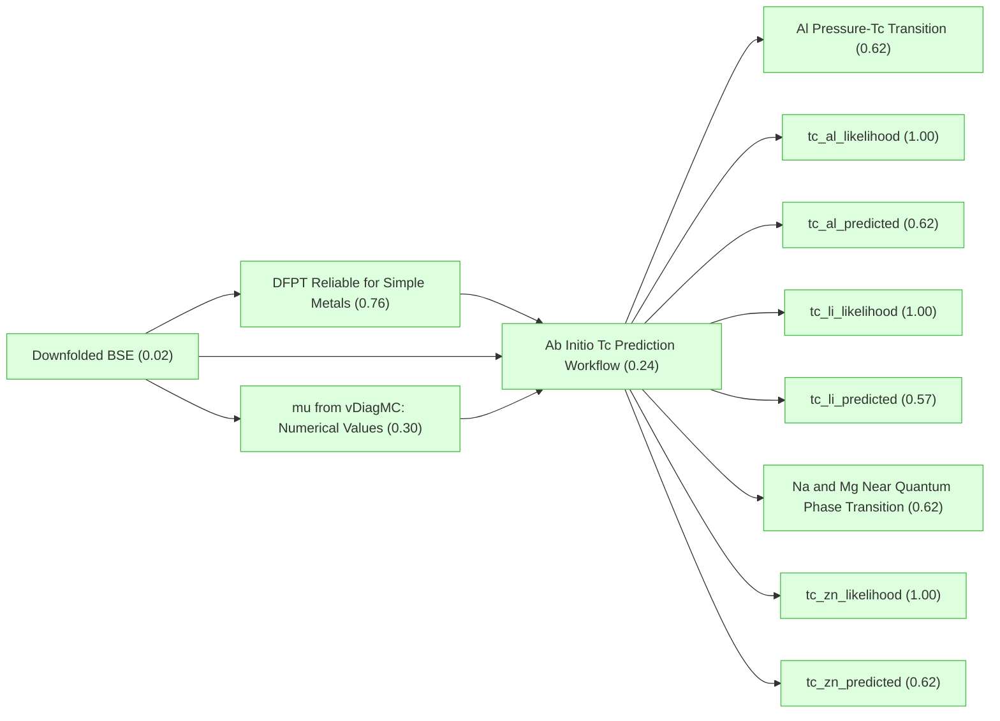
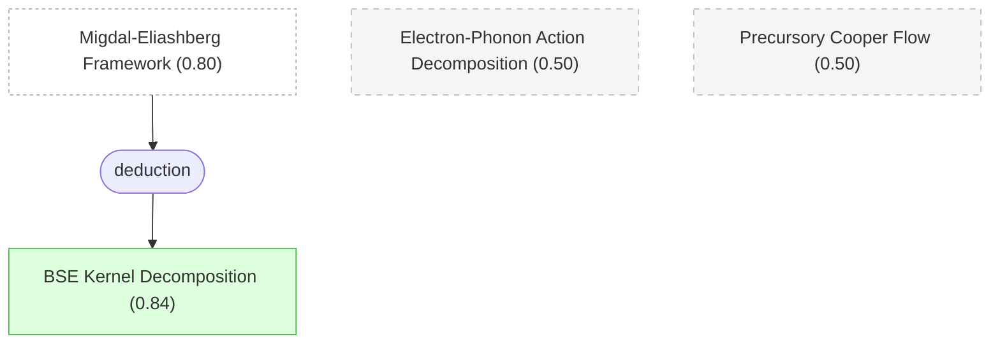
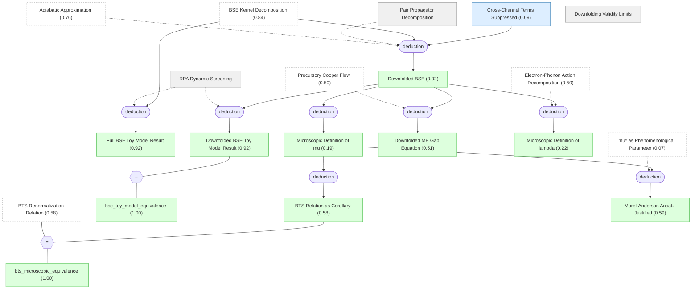
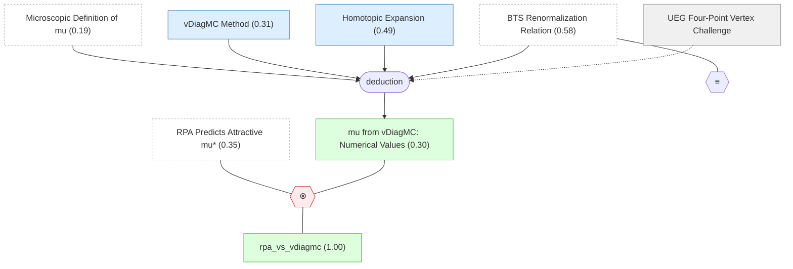
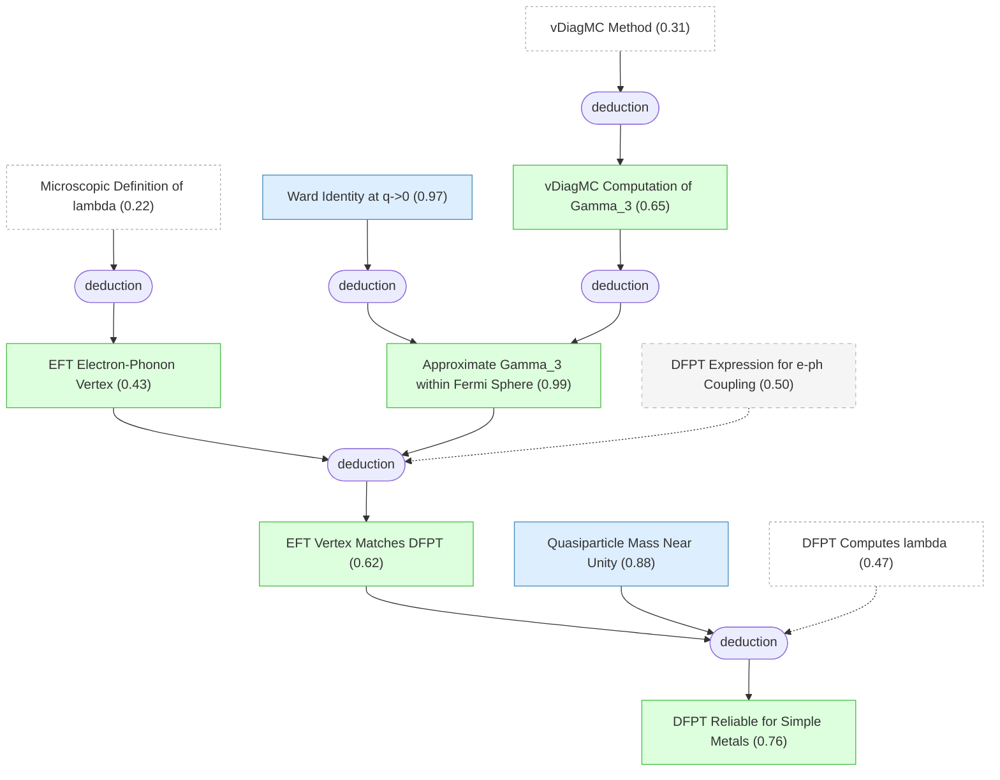

# superconductivity-electron-liquids-gaia

Gaia knowledge package: Superconductivity in Electron Liquids (arXiv:2512.19382)

## Overview

```mermaid
graph LR
    downfolded_bse["Downfolded BSE (0.02)"]:::derived
    mu_vdiagmc_values["mu from vDiagMC: Numerical Values (0.30)"]:::derived
    dfpt_reliable_for_simple_metals["DFPT Reliable for Simple Metals (0.76)"]:::derived
    ab_initio_workflow["Ab Initio Tc Prediction Workflow (0.24)"]:::derived
    al_pressure_transition["Al Pressure-Tc Transition (0.62)"]:::derived
    tc_mg_na_near_qpt["Na and Mg Near Quantum Phase Transition (0.62)"]:::derived
    tc_al_predicted["tc_al_predicted (0.62)"]:::derived
    tc_al_likelihood["tc_al_likelihood (1.00)"]:::derived
    tc_zn_predicted["tc_zn_predicted (0.62)"]:::derived
    tc_zn_likelihood["tc_zn_likelihood (1.00)"]:::derived
    tc_li_predicted["tc_li_predicted (0.57)"]:::derived
    tc_li_likelihood["tc_li_likelihood (1.00)"]:::derived
    ab_initio_workflow --> al_pressure_transition
    ab_initio_workflow --> tc_al_likelihood
    ab_initio_workflow --> tc_al_predicted
    ab_initio_workflow --> tc_li_likelihood
    ab_initio_workflow --> tc_li_predicted
    ab_initio_workflow --> tc_mg_na_near_qpt
    ab_initio_workflow --> tc_zn_likelihood
    ab_initio_workflow --> tc_zn_predicted
    dfpt_reliable_for_simple_metals --> ab_initio_workflow
    downfolded_bse --> ab_initio_workflow
    downfolded_bse --> dfpt_reliable_for_simple_metals
    downfolded_bse --> mu_vdiagmc_values
    mu_vdiagmc_values --> ab_initio_workflow

    classDef note fill:#f0f0f0,stroke:#999,color:#333
    classDef premise fill:#ddeeff,stroke:#4488bb,color:#333
    classDef derived fill:#ddffdd,stroke:#44bb44,color:#333
    classDef question fill:#fff3dd,stroke:#cc9944,color:#333
    classDef background fill:#f5f5f5,stroke:#bbb,stroke-dasharray: 5 5,color:#333
    classDef orphan fill:#fff,stroke:#ccc,stroke-dasharray: 5 5,color:#333
    classDef external fill:#fff,stroke:#aaa,stroke-dasharray: 3 3,color:#333
    classDef weak fill:#fff9c4,stroke:#f9a825,stroke-dasharray: 5 5,color:#333
    classDef contra fill:#ffebee,stroke:#c62828,color:#333
```

## Introduction: Motivation and Background.

#### BCS Theory

📌 `bcs_theory`   |   Prior: 0.98   |   Belief: **0.98**

> Bardeen-Cooper-Schrieffer (BCS) theory: phonon-mediated electron-electron attraction leads to Cooper pairing instability at the Fermi surface, providing the fundamental framework for understanding conventional superconductors.

#### Adiabatic Approximation

📌 `adiabatic_approx`   |   Prior: 0.95   |   Belief: **0.76**

> In conventional metals, the typical phonon frequency (Debye frequency $\omega_D$) is much smaller than the electron Fermi energy $E_F$, i.e. $\omega_D / E_F \ll 1$ (adiabatic approximation). This energy-scale separation has three key consequences: (i) electrons adiabatically adjust to ionic motion, (ii) the electron-ion coupling can be linearized, and (iii) the space-time scale separation between electron and phonon physics permits a controlled effective field theory (EFT) treatment.

#### Migdal-Eliashberg Framework

📌 `me_framework`   |   Belief: **0.80**

> Migdal-Eliashberg (ME) theory provides a rigorous treatment of the dynamic electron-phonon interaction. Under the adiabatic condition $\omega_D / E_F \ll 1$, Migdal's theorem guarantees that phonon vertex corrections are suppressed at $O(\omega_D/E_F)$, allowing the electron-phonon self-energy to be truncated at the self-consistent Fock diagram level. This justifies the ME formalism as a controlled low-energy theory for electron-phonon superconductors.

🔗 **deduction**([Adiabatic Approximation](#adiabatic_approx))

#### BTS Renormalization Relation

📌 `bts_renormalization`   |   Belief: **0.58**

> The Bogoliubov-Tolmachev-Shirkov (BTS) renormalization relation connects the Coulomb pseudopotential $\mu_{\omega_c}$ (a dimensionless parameter describing the effective electron-electron repulsion strength in the pairing channel) defined at different energy cutoff scales $\omega_c$: $\mu_{\omega_c} = \mu_{\omega_c'} / (1 + \mu_{\omega_c'} \ln(\omega_c'/\omega_c))$. This relation ensures that physical observables do not depend on the choice of the arbitrary cutoff scale.

#### ME Downfolding is Phenomenological

📌 `me_downfolding_is_phenomenological`   |   Belief: **0.19**

> The downfolding procedure (integrating out high-energy degrees of freedom to obtain a low-energy effective theory) in traditional Migdal-Eliashberg (ME) theory is phenomenological: the Coulomb effect is replaced by a static pseudopotential $\mu^*$, ignoring corrections from Coulomb fluctuations to quasiparticle renormalization and electron-phonon coupling, as well as non-local effects of screening.

🔗 **deduction**([mu* as Phenomenological Parameter](#mu_star_phenomenological))

#### Phenomenological ME Theory Limitations

📌 `phenomenological_me_theory`   |   Belief: **0.31**

> Traditional electron-phonon superconductivity theory uses the McMillan (or Allen-Dynes) formula, with the electron-phonon coupling constant $\lambda$ and Coulomb pseudopotential $\mu^*$ as inputs to predict the superconducting transition temperature $T_c$. Since $\mu^*$ cannot be reliably computed from first principles, it is typically assigned an empirical value $\mu^* \in [0.1, 0.2]$. For materials with $T_c$ in the sub-kelvin range, the exponential sensitivity $T_c \propto \exp(-1/g)$ to $\mu^*$ causes this uncertainty to span several orders of magnitude in the predicted $T_c$, destroying predictive power.

🔗 **deduction**([ME Downfolding is Phenomenological](#me_downfolding_is_phenomenological))

#### mu* as Phenomenological Parameter

📌 `mu_star_phenomenological`   |   Belief: **0.07**

> Due to the lack of a reliable microscopic calculation, the Coulomb pseudopotential $\mu^*$ (a dimensionless parameter describing the effective Coulomb repulsion strength in the low-energy pairing channel) is typically treated as an adjustable parameter with empirical values in the range 0.1--0.2.

#### RPA Predicts Attractive mu*

📌 `rpa_predicts_attractive_mu`   |   Belief: **0.35**

> When treating the dynamically screened Coulomb interaction within the random phase approximation (RPA), the predicted $\mu^* < 0$ (i.e. the Coulomb effect becomes net attractive in the Cooper channel) for Wigner-Seitz radius $r_s \gtrsim 2$ ($r_s$ is proportional to the ratio of electron spacing to Bohr radius, measuring the ratio of Coulomb interaction to kinetic energy). However, RPA neglects beyond-RPA effects such as vertex corrections and self-energy renormalization for $r_s \gtrsim 1$, making its predictions unreliable in this density regime and inconsistent with extensive experimental evidence.

#### DFPT Computes lambda

📌 `dfpt_computes_lambda`   |   Belief: **0.47**

> Density functional perturbation theory (DFPT) computes the electron-phonon coupling constant $\lambda$ (a dimensionless parameter quantifying the phonon-mediated attraction strength at the Fermi surface) via the linear response of the Kohn-Sham ground-state energy to lattice distortions. DFPT has been validated for weakly correlated superconductors but its accuracy for strongly correlated systems is unknown.

#### Tc(Al) Experimental

📌 `tc_al_experimental`   |   Prior: 0.99   |   Belief: **0.99**

> The experimental superconducting transition temperature of aluminum (Al) is $T_c^{\mathrm{exp}} = 1.2$ K.

#### Tc(Li) Experimental

📌 `tc_li_experimental`   |   Belief: **0.50**

> The experimental superconducting transition temperature of lithium (Li) is $T_c^{\mathrm{exp}} \approx 4 \times 10^{-4}$ K (0.4 mK). This measurement corresponds to the 9R crystal structure.

#### Tc(Zn) Experimental

📌 `tc_zn_experimental`   |   Prior: 0.99   |   Belief: **0.99**

> The experimental superconducting transition temperature of zinc (Zn) is $T_c^{\mathrm{exp}} = 0.875$ K.

#### Li 9R Structural Assumption at Sub-Kelvin T

📌 `li_crystal_structure_at_low_t`   |   Belief: **0.33**

> Lithium's crystal structure at sub-kelvin temperatures is debated. Measurements consistent with the 9R polytype are typically cited, but the structural identification at the sample where $T_c \approx 4 \times 10^{-4}$ K was inferred is not independently established. The Tc(Li) experimental input therefore assumes 9R is the relevant phase.

#### Li is Bulk Superconducting

📌 `li_is_superconducting`   |   Belief: **0.71**

> Li in the 9R structure undergoes a genuine bulk superconducting transition at $T_c \approx 4 \times 10^{-4}$ K. The Cooper pair condensate is bulk (not filamentary or surface), and the observed resistive anomaly reflects this true SC state.

#### Li Resistive Anomaly Is Not Bulk SC

📌 `li_anomaly_not_sc`   |   Belief: **0.29**

> The resistive anomaly observed in Li 9R at $\sim 0.4$ mK is *not* a bulk superconducting transition: it could be filamentary SC on grain boundaries / impurity phases, surface superconductivity, measurement / contact artifacts amplified at sub-mK temperatures, a structural transition that mimics a SC signature, or another phenomenon of the extreme sub-mK regime.

#### Li Resistance Drop at ~0.4 mK

📌 `li_zero_resistance_observed`   |   Prior: 1.00   |   Belief: **1.00**

> Resistivity of the Li 9R sample drops sharply to below the measurement noise floor at $T \approx 0.4$ mK (Schwarz et al. and follow-ups).

🔗 **infer**([Li is Bulk Superconducting](#li_is_superconducting))

#### Li Meissner Observation (hypothetical)

📌 `li_meissner_observed`   |   Belief: **0.71**

> Meissner-Ochsenfeld expulsion of magnetic flux is observed for the Li 9R sample at sub-K temperatures, confirming bulk SC.

🔗 **infer**([Li is Bulk Superconducting](#li_is_superconducting))

#### Missing Meissner Experiment for Li 9R

❓ `li_meissner_inquiry`

> Has the Meissner-Ochsenfeld experiment been performed on the Li 9R sample at sub-K temperatures? This is the gold-standard discriminator between genuine bulk SC and the various non-SC explanations (BF ~200x if positive; near-decisive ruling-out if null). The package currently records no public data on this measurement.

#### Main Question: First-Principles mu* and Tc

❓ `main_question`

> Can the Coulomb pseudopotential $\mu^*$ (the parameter quantifying effective electron-electron repulsion in the Cooper pairing channel) be computed from first principles with controlled accuracy, and can this yield quantitative predictions of the superconducting transition temperature $T_c$ for simple metals (e.g. Al, Li, Na, Mg)?

## Section II — The Model and Basic Relations.

```mermaid
graph TD
    me_framework["Migdal-Eliashberg Framework (0.80)"]:::external
    electron_phonon_action["Electron-Phonon Action Decomposition (0.50)"]:::background
    bse_kernel_decomposition["BSE Kernel Decomposition (0.84)"]:::derived
    precursory_cooper_flow["Precursory Cooper Flow (0.50)"]:::background
    strat_5(["deduction"])
    me_framework --> strat_5
    strat_5 --> bse_kernel_decomposition

    classDef note fill:#f0f0f0,stroke:#999,color:#333
    classDef premise fill:#ddeeff,stroke:#4488bb,color:#333
    classDef derived fill:#ddffdd,stroke:#44bb44,color:#333
    classDef question fill:#fff3dd,stroke:#cc9944,color:#333
    classDef background fill:#f5f5f5,stroke:#bbb,stroke-dasharray: 5 5,color:#333
    classDef orphan fill:#fff,stroke:#ccc,stroke-dasharray: 5 5,color:#333
    classDef external fill:#fff,stroke:#aaa,stroke-dasharray: 3 3,color:#333
    classDef weak fill:#fff9c4,stroke:#f9a825,stroke-dasharray: 5 5,color:#333
    classDef contra fill:#ffebee,stroke:#c62828,color:#333
```

#### Electron-Phonon Action Decomposition

📌 `electron_phonon_action`   |   Belief: **0.50**

> The effective action of the electron-phonon coupled system can be decomposed as $S = S_e + S_{\mathrm{ph}} + S_{e\text{-ph}} + S_{\mathrm{CT}} + O(\sqrt{m/M})$, where $m$ is the electron mass and $M$ is the ion mass. $S_e$ is the complete many-electron action without any approximation, $S_{\mathrm{ph}}$ describes phonons with physical dispersion, $S_{e\text{-ph}}$ is the coupling between electron density and ionic displacement, and $S_{\mathrm{CT}}$ is a counterterm that subtracts the static electron polarization contribution already included in the physical phonon dispersion to prevent double counting.

#### BSE Kernel Decomposition

📌 `bse_kernel_decomposition`   |   Belief: **0.84**

> The kernel of the Bethe-Salpeter equation (BSE) can be decomposed into the purely electronic particle-particle irreducible four-point vertex $\tilde\Gamma^e$ (encoding all non-perturbative Coulomb effects) and the phonon-mediated effective electron-electron interaction $W^{\mathrm{ph}}$: $\tilde\Gamma = \tilde\Gamma^e + W^{\mathrm{ph}} + O(\omega_D/E_F)$. Migdal's theorem ensures that higher-order phonon vertex corrections are suppressed by the adiabatic small parameter.

🔗 **deduction**([Migdal-Eliashberg Framework](#me_framework))

#### Precursory Cooper Flow

📌 `precursory_cooper_flow`   |   Belief: **0.50**

> The low-frequency limit of the anomalous vertex function on the Fermi surface $\Lambda_0$ obeys a universal scaling relation (precursory Cooper flow, PCF): $\Lambda_0 = 1/(1 + g\ln(\omega_\Lambda/T)) + O(T)$, where $g$ is the dimensionless coupling constant ($g < 0$ corresponds to net attraction) and $\omega_\Lambda$ is an effective high-energy cutoff. When $g < 0$, $\Lambda_0$ diverges at $T_c = \omega_\Lambda e^{1/g}$; by computing in the normal state and extrapolating, one can predict $T_c$.

## Section III — Downfolding the Bethe-Salpeter Equation.

```mermaid
graph TD
    adiabatic_approx["Adiabatic Approximation (0.76)"]:::external
    bts_renormalization["BTS Renormalization Relation (0.58)"]:::external
    mu_star_phenomenological["mu#ast; as Phenomenological Parameter (0.07)"]:::external
    electron_phonon_action["Electron-Phonon Action Decomposition (0.50)"]:::external
    bse_kernel_decomposition["BSE Kernel Decomposition (0.84)"]:::external
    precursory_cooper_flow["Precursory Cooper Flow (0.50)"]:::external
    pair_propagator_decomposition["Pair Propagator Decomposition"]:::note
    rpa_dynamic_screening["RPA Dynamic Screening"]:::note
    cross_term_suppressed["Cross-Channel Terms Suppressed (0.09)"]:::premise
    downfolding_validity_limits["Downfolding Validity Limits"]:::note
    downfolded_bse["Downfolded BSE (0.02)"]:::derived
    full_bse_toy_model["Full BSE Toy Model Result (0.92)"]:::derived
    downfolded_bse_toy_model["Downfolded BSE Toy Model Result (0.92)"]:::derived
    bse_toy_model_equivalence["bse_toy_model_equivalence (1.00)"]:::derived
    downfolded_me_equation["Downfolded ME Gap Equation (0.51)"]:::derived
    lambda_microscopic_definition["Microscopic Definition of lambda (0.22)"]:::derived
    mu_microscopic_definition["Microscopic Definition of mu (0.19)"]:::derived
    mu_scale_independence["BTS Relation as Corollary (0.58)"]:::derived
    bts_microscopic_equivalence["bts_microscopic_equivalence (1.00)"]:::derived
    ma_pseudopotential_justified["Morel-Anderson Ansatz Justified (0.59)"]:::derived
    strat_6(["deduction"])
    cross_term_suppressed --> strat_6
    bse_kernel_decomposition --> strat_6
    pair_propagator_decomposition -.-> strat_6
    adiabatic_approx -.-> strat_6
    strat_6 --> downfolded_bse
    strat_7(["deduction"])
    bse_kernel_decomposition --> strat_7
    rpa_dynamic_screening -.-> strat_7
    strat_7 --> full_bse_toy_model
    strat_8(["deduction"])
    downfolded_bse --> strat_8
    rpa_dynamic_screening -.-> strat_8
    strat_8 --> downfolded_bse_toy_model
    strat_9(["deduction"])
    downfolded_bse --> strat_9
    precursory_cooper_flow -.-> strat_9
    strat_9 --> downfolded_me_equation
    strat_10(["deduction"])
    downfolded_bse --> strat_10
    electron_phonon_action -.-> strat_10
    strat_10 --> lambda_microscopic_definition
    strat_11(["deduction"])
    downfolded_bse --> strat_11
    strat_11 --> mu_microscopic_definition
    strat_12(["deduction"])
    mu_microscopic_definition --> strat_12
    strat_12 --> mu_scale_independence
    strat_13(["deduction"])
    mu_microscopic_definition --> strat_13
    mu_star_phenomenological -.-> strat_13
    strat_13 --> ma_pseudopotential_justified
    oper_1{{"≡"}}
    downfolded_bse_toy_model --- oper_1
    full_bse_toy_model --- oper_1
    oper_1 --- bse_toy_model_equivalence
    oper_2{{"≡"}}
    mu_scale_independence --- oper_2
    bts_renormalization --- oper_2
    oper_2 --- bts_microscopic_equivalence

    classDef note fill:#f0f0f0,stroke:#999,color:#333
    classDef premise fill:#ddeeff,stroke:#4488bb,color:#333
    classDef derived fill:#ddffdd,stroke:#44bb44,color:#333
    classDef question fill:#fff3dd,stroke:#cc9944,color:#333
    classDef background fill:#f5f5f5,stroke:#bbb,stroke-dasharray: 5 5,color:#333
    classDef orphan fill:#fff,stroke:#ccc,stroke-dasharray: 5 5,color:#333
    classDef external fill:#fff,stroke:#aaa,stroke-dasharray: 3 3,color:#333
    classDef weak fill:#fff9c4,stroke:#f9a825,stroke-dasharray: 5 5,color:#333
    classDef contra fill:#ffebee,stroke:#c62828,color:#333
```

#### Pair Propagator Decomposition

📋 `pair_propagator_decomposition`

> The pair propagator (product of two single-particle Green's functions $G_{k\omega}G_{-k,-\omega}$) can be exactly decomposed into a low-energy coherent part $\Pi_{\mathrm{BCS}}$ and a high-energy incoherent remainder $\phi_{k\omega}$: $G_{k\omega}G_{-k,-\omega} = \Pi_{\mathrm{BCS}} + \phi_{k\omega}$. The coherent part is expressed in terms of the quasiparticle weight $z^e$, frequency-dependent quasiparticle weight $z_\omega^{\mathrm{ph}}$, and renormalized dispersion $\epsilon_k$. This is an exact mathematical identity introducing energy-scale separation in the two-electron channel.

#### RPA Dynamic Screening

📋 `rpa_dynamic_screening`

> Random Phase Approximation (RPA) dynamically screened Coulomb interaction: $W_{\mathrm{RPA}}(\mathbf{q},\nu) = v_q / (1 - v_q \Pi^0_{\mathbf{q}\nu})$, where $v_q = 4\pi e^2/q^2$ is the bare Coulomb potential and $\Pi^0$ is the non-interacting polarization function. This is a standard approximation that becomes exact in the weak-coupling limit ($r_s \lesssim 1$).

#### Cross-Channel Terms Suppressed

📌 `cross_term_suppressed`   |   Belief: **0.09**

> Cross terms mixing Coulomb and phonon channels are suppressed by the plasma frequency $\omega_p$, at order $O(\omega_c^2/\omega_p^2)$, where $\omega_c$ is an intermediate energy cutoff satisfying $\omega_D \ll \omega_c \ll E_F$. For most three-dimensional metals $\omega_c/\omega_p \lesssim 0.1$, so cross terms contribute no more than 1%.

#### Downfolding Validity Limits

📋 `downfolding_validity_limits`

> The downfolded EFT-ME framework's applicability conditions and failure modes: (i) the adiabatic parameter $\omega_D/E_F \ll 1$ must hold, (ii) the intermediate cutoff $\omega_c$ must satisfy $\omega_D \ll \omega_c \ll E_F$ with $\omega_c/\omega_p \ll 1$, and (iii) the framework breaks down for strongly non-adiabatic systems (e.g. high-$T_c$ hydrides where $\omega_D/E_F \sim 0.1$) and for strongly correlated materials where the quasiparticle picture fails.

#### Downfolded BSE ★

📌 `downfolded_bse`   |   Belief: **0.02**

> The frequency-only downfolded Bethe-Salpeter equation: the full momentum-frequency BSE kernel reduces to a one-dimensional integral equation in Matsubara frequency for the Fermi-surface-averaged anomalous vertex $\Lambda_\omega$ (Cai et al., Eq. 20):
> 
> $$\Lambda_\omega = \eta_\omega + \pi T \sum_{|\omega'|<\omega_c} \bigl(\lambda_{\omega\omega'} - \mu_{\omega_c}\bigr) \frac{z_{\omega'}^{\mathrm{ph}}}{|\omega'|}\, \Lambda_{\omega'}.$$
> 
> Here $\eta_\omega$ is the symmetry-breaking pair source (set to unity for numerical convenience without affecting $T_c$), $z_\omega^{\mathrm{ph}}$ is the e-ph quasiparticle weight (Cai et al., Eq. 21), and the kernel decomposes into the phonon-mediated attraction $\lambda_{\omega\omega'}$ and the Coulomb pseudopotential $\mu_{\omega_c}$, both with microscopic definitions in terms of electron vertex functions. Corrections are bounded by three small parameters: $\omega_D/E_F$, $\omega_c^2/\omega_p^2$, and $T/\omega_c$. The momentum integration is absorbed into the density of states, and the pair propagator's coherent part generates the BCS logarithm that drives the Cooper instability.

🔗 **deduction**([Cross-Channel Terms Suppressed](#cross_term_suppressed), [BSE Kernel Decomposition](#bse_kernel_decomposition))

#### Full BSE Toy Model Result

📌 `full_bse_toy_model`   |   Belief: **0.92**

> For a toy model with aluminum-like parameters (Wigner-Seitz radius $r_s = 1.92$, adiabatic ratio $\omega_D/E_F = 0.005$), numerically solving the full frequency-momentum dependent Bethe-Salpeter equation (BSE) — using RPA dynamically screened Coulomb interaction as the electron irreducible vertex plus a model phonon interaction, without any downfolding approximation — yields a superconducting transition temperature $T_c^{\mathrm{full}}/T_F = 10^{-5.668}$, where $T_F$ is the Fermi temperature.

🔗 **deduction**([BSE Kernel Decomposition](#bse_kernel_decomposition))

#### Downfolded BSE Toy Model Result

📌 `downfolded_bse_toy_model`   |   Belief: **0.92**

> For the same toy model (aluminum-like parameters $r_s = 1.92$, $\omega_D/E_F = 0.005$), solving the downfolded frequency-only Bethe-Salpeter equation yields $T_c^{\mathrm{approx}}/T_F = 10^{-5.667}$, where $T_F$ is the Fermi temperature.

🔗 **deduction**([Downfolded BSE](#downfolded_bse))

#### bse_toy_model_equivalence

📌 `bse_toy_model_equivalence`   |   Belief: **1.00**

> For the same toy model (aluminum-like parameters $r_s = 1.92$, $\omega_D/E_F = 0.005$), solving the downfolded frequency-only Bethe-Salpeter equation yields $T_c^{\mathrm{approx}}/T_F = 10^{-5.667}$, where $T_F$ is the Fermi temperature. and For a toy model with aluminum-like parameters (Wigner-Seitz radius $r_s = 1.92$, adiabatic ratio $\omega_D/E_F = 0.005$), numerically solving the full frequency-momentum dependent Bethe-Salpeter equation (BSE) — using RPA dynamically screened Coulomb interaction as the electron irreducible vertex plus a model phonon interaction, without any downfolding approximation — yields a superconducting transition temperature $T_c^{\mathrm{full}}/T_F = 10^{-5.668}$, where $T_F$ is the Fermi temperature. are equivalent.

#### Downfolded ME Gap Equation

📌 `downfolded_me_equation`   |   Belief: **0.51**

> At the superconducting critical temperature $T_c$, the downfolded Bethe-Salpeter equation reduces to the traditional linearized Migdal-Eliashberg (ME) gap equation: $\Delta_\omega = \pi T_c \sum_{|\omega'|<\omega_c} (\lambda_{\omega\omega'} - \mu^*) \frac{z_{\omega'}^{\mathrm{ph}}}{|\omega'|} \Delta_{\omega'}$. As $T \to T_c$, the anomalous vertex diverges as $\Lambda_{k\omega} \sim \Delta_{k\omega}/(T - T_c)$, causing the source term $\eta$ to become irrelevant. The diverging prefactor $(T - T_c)^{-1}$ cancels between the two sides of the equation, yielding the gap equation with $\mu^* \equiv \mu_{\omega_c}$. This establishes the microscopic foundation for the ME equation with precise definitions of $\mu^*$ and $\lambda$ in terms of electron vertex functions.

🔗 **deduction**([Downfolded BSE](#downfolded_bse))

#### Microscopic Definition of lambda

📌 `lambda_microscopic_definition`   |   Belief: **0.22**

> The electron-phonon coupling $\lambda(\omega, \omega')$ in the downfolded BSE has a microscopic definition: it is the Fermi-surface average of the phonon-mediated interaction $W^{\mathrm{ph}}$ weighted by quasiparticle renormalization factors $z^e$ and $z_\omega^{\mathrm{ph}}$.
> 
> In the standard ME normalization, the static dimensionless coupling follows the Fermi-surface average of $g^2/\omega^2$ over phonon branches $\kappa$ (Cai et al., Eq. 31):
> 
> $$\lambda = N_F \sum_\kappa \left\langle \frac{g_\kappa^2(\mathbf{k}, \mathbf{q})}{\omega_{\kappa, \mathbf{q}}^2}\right\rangle_{\mathrm{FS}},$$
> 
> with $|\mathbf{k}| = |\mathbf{k} + \mathbf{q}| = k_F$, $N_F$ the density of states at the Fermi level, and $g_\kappa(\mathbf{k}, \mathbf{q})$ the physical screened-and-renormalized e-ph vertex (see @eft_eph_vertex). This definition reduces to the standard Eliashberg $\lambda$ in the adiabatic limit but retains dynamical corrections from the electron self-energy.

🔗 **deduction**([Downfolded BSE](#downfolded_bse))

#### Microscopic Definition of mu

📌 `mu_microscopic_definition`   |   Belief: **0.19**

> The Coulomb pseudopotential $\mu_{\omega_c}(\omega, \omega')$ in the downfolded BSE has a microscopic definition: it is determined by the purely electronic particle-particle irreducible four-point vertex $\tilde\Gamma^e$ projected onto the Fermi surface, with the high-energy electronic degrees of freedom integrated out above the cutoff $\omega_c$.
> 
> Operationally, in a purely electronic theory ($\lambda = 0$, $z^{\mathrm{ph}} = 1$), solving the downfolded equation gives the temperature-dependent effective Cooper-channel repulsion (Cai et al., Eq. 23):
> 
> $$\gamma_T = \frac{\mu_{\omega_c}}{1 + \mu_{\omega_c} \ln(\omega_c/T)} \quad (T \ll \omega_c),$$
> 
> where $\gamma_T$ is computed directly from the four-point vertex (Cai et al., Eq. 24):
> 
> $$\gamma_T \equiv z_e^2\, N_F^{\ast}\, \bigl\langle \Gamma_4^e(\mathbf{k}_F, \omega_0;\, \mathbf{k}_F', \omega_0)\bigr\rangle_{\mathbf{k}_F, \mathbf{k}_F'},\qquad \omega_0 = \pi T.$$
> 
> Here $z_e$ is the electronic quasiparticle weight, $N_F^\ast$ is the quasiparticle density of states, and $\Gamma_4^e$ is the full electronic four-point vertex on the Fermi surface evaluated at the lowest Matsubara frequency $\omega_0 = \pi T$. Inverting Eq. 23 yields $\mu_{\omega_c}$ from the measured $\gamma_T$, providing a precise meaning to the Coulomb pseudopotential as the effective repulsion in the low-energy pairing channel, renormalized by all electronic correlations.

🔗 **deduction**([Downfolded BSE](#downfolded_bse))

#### BTS Relation as Corollary

📌 `mu_scale_independence`   |   Belief: **0.58**

> The BTS renormalization relation $\mu_{\omega_c} = \mu_{\omega_c'} / (1 + \mu_{\omega_c'} \ln(\omega_c'/\omega_c))$ emerges as a corollary of the microscopic definition of $\mu_{\omega_c}$: changing the cutoff $\omega_c$ reshuffles contributions between the explicit Coulomb kernel and the Cooper logarithm in the BCS propagator, leaving the physical $T_c$ invariant. This provides a microscopic derivation of the originally phenomenological BTS relation.

🔗 **deduction**([Microscopic Definition of mu](#mu_microscopic_definition))

#### bts_microscopic_equivalence

📌 `bts_microscopic_equivalence`   |   Belief: **1.00**

> The BTS renormalization relation $\mu_{\omega_c} = \mu_{\omega_c'} / (1 + \mu_{\omega_c'} \ln(\omega_c'/\omega_c))$ emerges as a corollary of the microscopic definition of $\mu_{\omega_c}$: changing the cutoff $\omega_c$ reshuffles contributions between the explicit Coulomb kernel and the Cooper logarithm in the BCS propagator, leaving the physical $T_c$ invariant. This provides a microscopic derivation of the originally phenomenological BTS relation. and The Bogoliubov-Tolmachev-Shirkov (BTS) renormalization relation connects the Coulomb pseudopotential $\mu_{\omega_c}$ (a dimensionless parameter describing the effective electron-electron repulsion strength in the pairing channel) defined at different energy cutoff scales $\omega_c$: $\mu_{\omega_c} = \mu_{\omega_c'} / (1 + \mu_{\omega_c'} \ln(\omega_c'/\omega_c))$. This relation ensures that physical observables do not depend on the choice of the arbitrary cutoff scale. are equivalent.

#### Morel-Anderson Ansatz Justified

📌 `ma_pseudopotential_justified`   |   Belief: **0.59**

> The Morel-Anderson constant-pseudopotential ansatz — treating $\mu_{\omega_c}$ as approximately frequency-independent — is microscopically justified: the four-point vertex $\tilde\Gamma^e$ varies on electronic energy scales ($E_F$), which are much larger than the phonon scale ($\omega_D$). Within the low-energy window $|\omega|, |\omega'| < \omega_c \ll E_F$, the Coulomb kernel is effectively constant, validating the traditional constant-$\mu^*$ treatment used in Eliashberg theory.

🔗 **deduction**([Microscopic Definition of mu](#mu_microscopic_definition))

## Section IV — Coulomb Pseudopotential.

```mermaid
graph TD
    bts_renormalization["BTS Renormalization Relation (0.58)"]:::external
    rpa_predicts_attractive_mu["RPA Predicts Attractive mu#ast; (0.35)"]:::external
    mu_microscopic_definition["Microscopic Definition of mu (0.19)"]:::external
    ueg_vertex_challenge["UEG Four-Point Vertex Challenge"]:::note
    vdiagmc_method["vDiagMC Method (0.31)"]:::premise
    homotopic_expansion["Homotopic Expansion (0.49)"]:::premise
    mu_vdiagmc_values["mu from vDiagMC: Numerical Values (0.30)"]:::derived
    rpa_vs_vdiagmc["rpa_vs_vdiagmc (1.00)"]:::derived
    strat_14(["deduction"])
    mu_microscopic_definition --> strat_14
    vdiagmc_method --> strat_14
    homotopic_expansion --> strat_14
    bts_renormalization --> strat_14
    ueg_vertex_challenge -.-> strat_14
    strat_14 --> mu_vdiagmc_values
    oper_2{{"≡"}}
    bts_renormalization --- oper_2
    oper_3{{"⊗"}}:::contra
    rpa_predicts_attractive_mu --- oper_3
    mu_vdiagmc_values --- oper_3
    oper_3 --- rpa_vs_vdiagmc

    classDef note fill:#f0f0f0,stroke:#999,color:#333
    classDef premise fill:#ddeeff,stroke:#4488bb,color:#333
    classDef derived fill:#ddffdd,stroke:#44bb44,color:#333
    classDef question fill:#fff3dd,stroke:#cc9944,color:#333
    classDef background fill:#f5f5f5,stroke:#bbb,stroke-dasharray: 5 5,color:#333
    classDef orphan fill:#fff,stroke:#ccc,stroke-dasharray: 5 5,color:#333
    classDef external fill:#fff,stroke:#aaa,stroke-dasharray: 3 3,color:#333
    classDef weak fill:#fff9c4,stroke:#f9a825,stroke-dasharray: 5 5,color:#333
    classDef contra fill:#ffebee,stroke:#c62828,color:#333
```

#### UEG Four-Point Vertex Challenge

📋 `ueg_vertex_challenge`

> Computing the particle-particle irreducible four-point vertex $\tilde\Gamma^e$ of the uniform electron gas (UEG) is a long-standing challenge: perturbation theory in the bare Coulomb interaction diverges for $r_s \gtrsim 1$, and partial resummations (RPA, GW) miss crucial vertex corrections. A controlled, systematically improvable method is needed to evaluate $\tilde\Gamma^e$ in the metallic density range $r_s \in [1, 6]$.

#### vDiagMC Method

📌 `vdiagmc_method`   |   Belief: **0.31**

> Variational diagrammatic Monte Carlo (vDiagMC) provides a controlled, systematically improvable method for computing Feynman diagrammatic series to high order: (i) bold-line (self-consistent) resummation avoids infrared divergences in individual diagrams, (ii) stochastic sampling of diagram topologies and internal variables accesses orders unreachable by deterministic methods, (iii) the series can be extrapolated to infinite order with controlled error bars. For the UEG, vDiagMC achieves reliable convergence of the irreducible vertex in the metallic density range.

#### Homotopic Expansion

📌 `homotopic_expansion`   |   Belief: **0.49**

> The homotopic transformation provides a physically motivated reorganization of the diagrammatic series: by continuously deforming the bare Coulomb interaction $v(q)$ into a form that incorporates partial screening at each perturbative order, the series convergence is dramatically improved. This allows the vDiagMC calculation to reach converged results for the four-point vertex at metallic densities with modest diagram orders ($n \lesssim 7$).

#### mu from vDiagMC: Numerical Values ★

📌 `mu_vdiagmc_values`   |   Belief: **0.30**

> vDiagMC calculations of the UEG four-point vertex yield the Coulomb pseudopotential at the Fermi energy scale: $\mu_{E_F}(r_s)$ is positive and monotonically increasing with $r_s$ in the metallic density range, approximately following $\mu_{E_F} \approx 0.27\, r_s$. The complete set of values (Cai et al., TABLE I), computed at $\omega_c = 0.1\, E_F$ and rescaled to $E_F$ via the BTS relation:
> 
> | $r_s$              | 1       | 2       | 3       | 4        | 5        | 6      |
> |--------------------|---------|---------|---------|----------|----------|--------|
> | $\mu_{0.1\,E_F}$ | 0.172(4)| 0.238(4)| 0.278(6)| 0.306(15)| 0.328(12)| 0.35(3)|
> | $\mu_{E_F}$       | 0.28(1) | 0.53(2) | 0.77(5) | 1.0(2)   | 1.3(2)   | 1.8(8) |
> 
> Numbers in parentheses indicate the systematic uncertainty in the last digit. These results, combined with the BTS relation, yield $\mu^\ast \approx 0.12\text{--}0.18$ at the Debye scale, consistent with the empirical range but now derived from first principles with controlled error bars of a few percent. The values are dramatically larger than the static RPA, Morel-Anderson, and dynamic RPA predictions for $r_s > 0.5$ — by a factor of three at $r_s = 5$ — and resolve the long-standing contradiction between phenomenological and RPA-based treatments of the Coulomb pseudopotential.

🔗 **deduction**([Microscopic Definition of mu](#mu_microscopic_definition), [vDiagMC Method](#vdiagmc_method), [Homotopic Expansion](#homotopic_expansion), [BTS Renormalization Relation](#bts_renormalization))

#### rpa_vs_vdiagmc

📌 `rpa_vs_vdiagmc`   |   Belief: **1.00**

> When treating the dynamically screened Coulomb interaction within the random phase approximation (RPA), the predicted $\mu^* < 0$ (i.e. the Coulomb effect becomes net attractive in the Cooper channel) for Wigner-Seitz radius $r_s \gtrsim 2$ ($r_s$ is proportional to the ratio of electron spacing to Bohr radius, measuring the ratio of Coulomb interaction to kinetic energy). However, RPA neglects beyond-RPA effects such as vertex corrections and self-energy renormalization for $r_s \gtrsim 1$, making its predictions unreliable in this density regime and inconsistent with extensive experimental evidence. and vDiagMC calculations of the UEG four-point vertex yield the Coulomb pseudopotential at the Fermi energy scale: $\mu_{E_F}(r_s)$ is positive and monotonically increasing with $r_s$ in the metallic density range, approximately following $\mu_{E_F} \approx 0.27\, r_s$. The complete set of values (Cai et al., TABLE I), computed at $\omega_c = 0.1\, E_F$ and rescaled to $E_F$ via the BTS relation:
> 
> | $r_s$              | 1       | 2       | 3       | 4        | 5        | 6      |
> |--------------------|---------|---------|---------|----------|----------|--------|
> | $\mu_{0.1\,E_F}$ | 0.172(4)| 0.238(4)| 0.278(6)| 0.306(15)| 0.328(12)| 0.35(3)|
> | $\mu_{E_F}$       | 0.28(1) | 0.53(2) | 0.77(5) | 1.0(2)   | 1.3(2)   | 1.8(8) |
> 
> Numbers in parentheses indicate the systematic uncertainty in the last digit. These results, combined with the BTS relation, yield $\mu^\ast \approx 0.12\text{--}0.18$ at the Debye scale, consistent with the empirical range but now derived from first principles with controlled error bars of a few percent. The values are dramatically larger than the static RPA, Morel-Anderson, and dynamic RPA predictions for $r_s > 0.5$ — by a factor of three at $r_s = 5$ — and resolve the long-standing contradiction between phenomenological and RPA-based treatments of the Coulomb pseudopotential. contradict.

## Section V — Electron-Phonon Coupling.

```mermaid
graph TD
    dfpt_computes_lambda["DFPT Computes lambda (0.47)"]:::external
    lambda_microscopic_definition["Microscopic Definition of lambda (0.22)"]:::external
    vdiagmc_method["vDiagMC Method (0.31)"]:::external
    ward_identity["Ward Identity at q->0 (0.97)"]:::premise
    gamma3_vdiagmc["vDiagMC Computation of Gamma_3 (0.65)"]:::derived
    dfpt_eph_ansatz["DFPT Expression for e-ph Coupling (0.50)"]:::background
    quasiparticle_mass_near_unity["Quasiparticle Mass Near Unity (0.88)"]:::premise
    eft_eph_vertex["EFT Electron-Phonon Vertex (0.43)"]:::derived
    gamma3_approximation["Approximate Gamma_3 within Fermi Sphere (0.99)"]:::derived
    eft_vertex_matches_dfpt["EFT Vertex Matches DFPT (0.62)"]:::derived
    dfpt_reliable_for_simple_metals["DFPT Reliable for Simple Metals (0.76)"]:::derived
    strat_15(["deduction"])
    vdiagmc_method --> strat_15
    strat_15 --> gamma3_vdiagmc
    strat_16(["deduction"])
    lambda_microscopic_definition --> strat_16
    strat_16 --> eft_eph_vertex
    strat_17(["deduction"])
    ward_identity --> strat_17
    strat_17 --> gamma3_approximation
    strat_18(["deduction"])
    gamma3_vdiagmc --> strat_18
    strat_18 --> gamma3_approximation
    strat_19(["deduction"])
    eft_eph_vertex --> strat_19
    gamma3_approximation --> strat_19
    dfpt_eph_ansatz -.-> strat_19
    strat_19 --> eft_vertex_matches_dfpt
    strat_20(["deduction"])
    eft_vertex_matches_dfpt --> strat_20
    quasiparticle_mass_near_unity --> strat_20
    dfpt_computes_lambda -.-> strat_20
    strat_20 --> dfpt_reliable_for_simple_metals

    classDef note fill:#f0f0f0,stroke:#999,color:#333
    classDef premise fill:#ddeeff,stroke:#4488bb,color:#333
    classDef derived fill:#ddffdd,stroke:#44bb44,color:#333
    classDef question fill:#fff3dd,stroke:#cc9944,color:#333
    classDef background fill:#f5f5f5,stroke:#bbb,stroke-dasharray: 5 5,color:#333
    classDef orphan fill:#fff,stroke:#ccc,stroke-dasharray: 5 5,color:#333
    classDef external fill:#fff,stroke:#aaa,stroke-dasharray: 3 3,color:#333
    classDef weak fill:#fff9c4,stroke:#f9a825,stroke-dasharray: 5 5,color:#333
    classDef contra fill:#ffebee,stroke:#c62828,color:#333
```

#### Ward Identity at q->0

📌 `ward_identity`   |   Prior: 0.98   |   Belief: **0.97**

> An exact Ward identity relates the three-point electron-phonon vertex $\Gamma_3^e(k, q)$ to the electron self-energy in the long-wavelength limit $q \to 0$: $\lim_{q \to 0} \Gamma_3^e(k, q) = 1 - \partial\Sigma(k)/\partial\epsilon_k$. This identity is a consequence of charge conservation and provides an exact constraint on vertex corrections at zero momentum transfer.

#### vDiagMC Computation of Gamma_3

📌 `gamma3_vdiagmc`   |   Belief: **0.65**

> vDiagMC computation of the three-point vertex $\Gamma_3^e(k, q)$ of the UEG at finite momentum transfer $q$ shows that vertex corrections are modest (10--20% level) for momenta within the Fermi sphere ($|k|, |k+q| \lesssim k_F$) at metallic densities $r_s \in [2, 4]$. The corrections vary smoothly with $q$ and can be accurately interpolated between the Ward-identity limit ($q \to 0$) and the large-$q$ asymptotic behavior.

🔗 **deduction**([vDiagMC Method](#vdiagmc_method))

#### DFPT Expression for e-ph Coupling

📌 `dfpt_eph_ansatz`   |   Belief: **0.50**

> The DFPT expression for the electron-phonon coupling $g^{\mathrm{DFPT}}(k, q) = \sqrt{\omega_q / 2} \, \langle k+q | \delta V_{\mathrm{KS}} / \delta u_q | k \rangle$ implicitly assumes that vertex corrections to the electron-phonon coupling beyond the Kohn-Sham mean-field level are absorbed into the exchange-correlation functional. The accuracy of this ansatz depends on how well DFT captures the relevant vertex corrections.

#### Quasiparticle Mass Near Unity

📌 `quasiparticle_mass_near_unity`   |   Prior: 0.92   |   Belief: **0.88**

> For simple metals at metallic densities ($r_s \in [2, 4]$), the quasiparticle effective mass ratio $m^*/m \approx 1$ (deviations less than 5--10%). This near-unity mass ratio means that the quasiparticle renormalization factor $z^e \approx 1/(1 + \lambda_e)$ primarily reflects the frequency-dependent self-energy rather than momentum-dependent mass enhancement, simplifying the mapping between microscopic and DFPT-level electron-phonon coupling.

#### EFT Electron-Phonon Vertex

📌 `eft_eph_vertex`   |   Belief: **0.43**

> The EFT expression for the physical electron-phonon coupling vertex factorizes the bare coupling into a screening factor and vertex/quasiparticle renormalizations (Cai et al., Eq. 32):
> 
> $$g_\kappa(\mathbf{k}, \mathbf{q}) = g_{\kappa\mathbf{q}}^{(0)}\, \frac{z^e}{\epsilon_\mathbf{q}}\, \Gamma_3^e(\mathbf{k}, \mathbf{q}),$$
> 
> where $g_{\kappa\mathbf{q}}^{(0)}$ is the bare e-ph matrix element, $\epsilon_\mathbf{q}$ is the electronic dielectric function, $z^e$ is the electronic quasiparticle weight, and $\Gamma_3^e(\mathbf{k}, \mathbf{q})$ is the electronic three-point vertex correction. The combination $z^e \Gamma_3^e(\mathbf{k}, \mathbf{q})$ can be interpreted as the quasiparticle vertex correction to the screened interaction. The corresponding $\lambda$ in the downfolded BSE is the Fermi-surface average of $|g_\kappa(\mathbf{k}, \mathbf{q})|^2 / \omega_{\kappa,\mathbf{q}}^2$ over phonon branches (see @lambda_microscopic_definition).

🔗 **deduction**([Microscopic Definition of lambda](#lambda_microscopic_definition))

#### Approximate Gamma_3 within Fermi Sphere

📌 `gamma3_approximation`   |   Belief: **0.99**

> The three-point vertex $\Gamma_3^e(k, q)$ for states within the Fermi sphere can be accurately approximated by interpolation between two controlled limits: (i) the exact Ward identity at $q \to 0$ giving $\Gamma_3^e = 1 - \partial\Sigma/\partial\epsilon_k = m^*/m$, and (ii) the vDiagMC results at finite $q$ showing smooth, modest variations. For simple metals, this yields $\Gamma_3^e \approx m^*/m$ to within 10--15% across the relevant momentum range.

🔗 **deduction**([vDiagMC Computation of Gamma_3](#gamma3_vdiagmc))

#### EFT Vertex Matches DFPT

📌 `eft_vertex_matches_dfpt`   |   Belief: **0.62**

> In the uniform electron gas at densities $r_s \in [1,5]$, the EFT electron-phonon vertex $g(\mathbf{k},\mathbf{q}) = g^{(0)}_{\mathbf{q}} \cdot (z^e/\epsilon_{\mathbf{q}}) \cdot \Gamma_3^e(\mathbf{k};\mathbf{q})$ is numerically well approximated by the DFPT Kohn-Sham screened potential $g^{\mathrm{KS}}(\mathbf{q}) = g^{(0)}_{\mathbf{q}} / [1 - (v_{\mathbf{q}} + f_{xc})\chi_0^e(\mathbf{q})]$ for Fermi-surface-relevant momentum transfers $|\mathbf{q}| \leq 2k_F$, with weak residual $\mathbf{k}$-dependence.

🔗 **deduction**([EFT Electron-Phonon Vertex](#eft_eph_vertex), [Approximate Gamma_3 within Fermi Sphere](#gamma3_approximation))

#### DFPT Reliable for Simple Metals ★

📌 `dfpt_reliable_for_simple_metals`   |   Belief: **0.76**

> For simple metals, the DFPT calculation of the electron-phonon coupling constant $\lambda$ is reliable: the EFT vertex matches the DFPT expression at the vertex level, and the quasiparticle density of states $N_F^*$ nearly equals the band density of states $N_F^{(0)}$, so $\lambda_{\mathrm{EFT}} \approx \lambda_{\mathrm{DFPT}}$ with corrections at the few-percent level.

🔗 **deduction**([EFT Vertex Matches DFPT](#eft_vertex_matches_dfpt), [Quasiparticle Mass Near Unity](#quasiparticle_mass_near_unity))

## Section VI — Conventional Superconductors.

```mermaid
graph TD
    bts_renormalization["BTS Renormalization Relation (0.58)"]:::external
    phenomenological_me_theory["Phenomenological ME Theory Limitations (0.31)"]:::external
    mu_star_phenomenological["mu#ast; as Phenomenological Parameter (0.07)"]:::external
    dfpt_computes_lambda["DFPT Computes lambda (0.47)"]:::external
    tc_li_experimental["Tc(Li) Experimental (0.50)"]:::external
    li_crystal_structure_at_low_t["Li 9R Structural Assumption at Sub-Kelvin T (0.33)"]:::external
    li_is_superconducting["Li is Bulk Superconducting (0.71)"]:::external
    precursory_cooper_flow["Precursory Cooper Flow (0.50)"]:::external
    downfolded_bse["Downfolded BSE (0.02)"]:::external
    mu_vdiagmc_values["mu from vDiagMC: Numerical Values (0.30)"]:::external
    dfpt_reliable_for_simple_metals["DFPT Reliable for Simple Metals (0.76)"]:::external
    aluminum_parameters["Aluminum Material Parameters"]:::note
    lithium_parameters["Lithium Material Parameters"]:::note
    sodium_parameters["Sodium Material Parameters"]:::note
    magnesium_parameters["Magnesium Material Parameters"]:::note
    zinc_parameters["Zinc Material Parameters"]:::note
    simple_metals_weak_lattice["Simple Metals Have Weak Lattice Effects (0.90)"]:::background
    ueg_pseudopotential_parameterization["UEG mu#ast; Parameterization and Mapping (0.47)"]:::premise
    mu_available_for_simple_metals["mu#ast; Available for Simple Metals (0.52)"]:::derived
    ab_initio_workflow["Ab Initio Tc Prediction Workflow (0.24)"]:::derived
    al_pressure_transition["Al Pressure-Tc Transition (0.62)"]:::derived
    tc_mg_na_near_qpt["Na and Mg Near Quantum Phase Transition (0.62)"]:::derived
    tc_al_predicted["tc_al_predicted (0.62)"]:::derived
    tc_al_phenomenological["tc_al_phenomenological (0.50)"]:::derived
    tc_al_observation_binding["tc_al_observation_binding (1.00)"]:::orphan
    eft_al_model["eft_al_model (0.50)"]:::orphan
    mcmillan_al_model["mcmillan_al_model (0.50)"]:::orphan
    tc_al_likelihood["tc_al_likelihood (1.00)"]:::derived
    tc_zn_predicted["tc_zn_predicted (0.62)"]:::derived
    tc_zn_phenomenological["tc_zn_phenomenological (0.50)"]:::derived
    tc_zn_observation_binding["tc_zn_observation_binding (1.00)"]:::orphan
    eft_zn_model["eft_zn_model (0.50)"]:::orphan
    mcmillan_zn_model["mcmillan_zn_model (0.50)"]:::orphan
    tc_zn_likelihood["tc_zn_likelihood (1.00)"]:::derived
    tc_li_predicted["tc_li_predicted (0.57)"]:::derived
    tc_li_phenomenological["tc_li_phenomenological (0.50)"]:::derived
    tc_li_observation_binding["tc_li_observation_binding (0.67)"]:::derived
    eft_li_model["eft_li_model (0.50)"]:::orphan
    mcmillan_li_model["mcmillan_li_model (0.50)"]:::orphan
    tc_li_likelihood["tc_li_likelihood (1.00)"]:::derived
    strat_14(["deduction"])
    bts_renormalization --> strat_14
    strat_14 --> mu_vdiagmc_values
    strat_20(["deduction"])
    dfpt_computes_lambda -.-> strat_20
    strat_20 --> dfpt_reliable_for_simple_metals
    strat_21(["deduction"])
    ueg_pseudopotential_parameterization --> strat_21
    mu_vdiagmc_values --> strat_21
    bts_renormalization --> strat_21
    simple_metals_weak_lattice -.-> strat_21
    strat_21 --> mu_available_for_simple_metals
    strat_22(["deduction"])
    downfolded_bse --> strat_22
    mu_available_for_simple_metals --> strat_22
    dfpt_reliable_for_simple_metals --> strat_22
    strat_22 --> ab_initio_workflow
    strat_23(["deduction"])
    ab_initio_workflow --> strat_23
    aluminum_parameters -.-> strat_23
    strat_23 --> al_pressure_transition
    strat_24(["deduction"])
    ab_initio_workflow --> strat_24
    magnesium_parameters -.-> strat_24
    sodium_parameters -.-> strat_24
    precursory_cooper_flow -.-> strat_24
    strat_24 --> tc_mg_na_near_qpt
    strat_25(["deduction"])
    ab_initio_workflow --> strat_25
    aluminum_parameters -.-> strat_25
    strat_25 --> tc_al_predicted
    strat_26(["deduction"])
    phenomenological_me_theory --> strat_26
    mu_star_phenomenological --> strat_26
    dfpt_computes_lambda --> strat_26
    aluminum_parameters -.-> strat_26
    strat_26 --> tc_al_phenomenological
    strat_27(["deduction"])
    ab_initio_workflow --> strat_27
    zinc_parameters -.-> strat_27
    strat_27 --> tc_zn_predicted
    strat_28(["deduction"])
    phenomenological_me_theory --> strat_28
    mu_star_phenomenological --> strat_28
    dfpt_computes_lambda --> strat_28
    zinc_parameters -.-> strat_28
    strat_28 --> tc_zn_phenomenological
    strat_29(["deduction"])
    ab_initio_workflow --> strat_29
    li_is_superconducting --> strat_29
    lithium_parameters -.-> strat_29
    strat_29 --> tc_li_predicted
    strat_30(["deduction"])
    phenomenological_me_theory --> strat_30
    mu_star_phenomenological --> strat_30
    dfpt_computes_lambda --> strat_30
    li_is_superconducting --> strat_30
    lithium_parameters -.-> strat_30
    strat_30 --> tc_li_phenomenological
    strat_31(["deduction"])
    li_crystal_structure_at_low_t --> strat_31
    lithium_parameters -.-> strat_31
    tc_li_experimental -.-> strat_31
    strat_31 --> tc_li_observation_binding
    strat_32(["infer"]):::weak
    ab_initio_workflow --> strat_32
    strat_32 --> tc_al_likelihood
    strat_33(["infer"]):::weak
    phenomenological_me_theory --> strat_33
    strat_33 --> tc_al_likelihood
    strat_34(["infer"]):::weak
    ab_initio_workflow --> strat_34
    strat_34 --> tc_zn_likelihood
    strat_35(["infer"]):::weak
    phenomenological_me_theory --> strat_35
    strat_35 --> tc_zn_likelihood
    strat_36(["infer"]):::weak
    ab_initio_workflow --> strat_36
    strat_36 --> tc_li_likelihood
    strat_37(["infer"]):::weak
    phenomenological_me_theory --> strat_37
    strat_37 --> tc_li_likelihood
    oper_0{{"⊕"}}
    li_is_superconducting --- oper_0
    oper_2{{"≡"}}
    bts_renormalization --- oper_2
    oper_3{{"⊗"}}:::contra
    mu_vdiagmc_values --- oper_3

    classDef note fill:#f0f0f0,stroke:#999,color:#333
    classDef premise fill:#ddeeff,stroke:#4488bb,color:#333
    classDef derived fill:#ddffdd,stroke:#44bb44,color:#333
    classDef question fill:#fff3dd,stroke:#cc9944,color:#333
    classDef background fill:#f5f5f5,stroke:#bbb,stroke-dasharray: 5 5,color:#333
    classDef orphan fill:#fff,stroke:#ccc,stroke-dasharray: 5 5,color:#333
    classDef external fill:#fff,stroke:#aaa,stroke-dasharray: 3 3,color:#333
    classDef weak fill:#fff9c4,stroke:#f9a825,stroke-dasharray: 5 5,color:#333
    classDef contra fill:#ffebee,stroke:#c62828,color:#333
```

#### Aluminum Material Parameters

📋 `aluminum_parameters`

> Aluminum (Al): FCC crystal structure, $r_s = 2.07$, band mass $m_b = 1.05$, DFPT electron-phonon coupling $\lambda = 0.44$, logarithmic phonon frequency $\omega_{\mathrm{log}} = 320$ K, Fermi temperature $T_F = 1.3 \times 10^5$ K.

#### Lithium Material Parameters

📋 `lithium_parameters`

> Lithium (Li): 9R crystal structure at low $T$ (also studied in HCP). 9R parameters: $r_s = 3.25$, $m_b = 1.75$, $\lambda = 0.34$, $\omega_{\mathrm{log}} = 242$ K, $T_F = 4.0 \times 10^4$ K. HCP parameters: $r_s = 3.19$, $m_b = 1.4$, $\lambda = 0.37$, $\omega_{\mathrm{log}} = 243$ K, $T_F = 4.1 \times 10^4$ K. Crystal structure at sub-kelvin temperatures remains debated.

#### Sodium Material Parameters

📋 `sodium_parameters`

> Sodium (Na): BCC crystal structure, $r_s = 3.96$, band mass $m_b = 1.0$, DFPT electron-phonon coupling $\lambda = 0.2$, logarithmic phonon frequency $\omega_{\mathrm{log}} = 127$ K, Fermi temperature $T_F = 4.2 \times 10^4$ K. No superconductivity observed down to mK temperatures.

#### Magnesium Material Parameters

📋 `magnesium_parameters`

> Magnesium (Mg): HCP crystal structure, $r_s = 2.66$, band mass $m_b = 1.02$, DFPT electron-phonon coupling $\lambda = 0.24$, logarithmic phonon frequency $\omega_{\mathrm{log}} = 269$ K, Fermi temperature $T_F = 8.0 \times 10^4$ K. No superconductivity observed down to mK temperatures.

#### Zinc Material Parameters

📋 `zinc_parameters`

> Zinc (Zn): HCP crystal structure, $r_s = 2.90$, band mass $m_b = 1.0$, DFPT electron-phonon coupling $\lambda = 0.502$, logarithmic phonon frequency $\omega_{\mathrm{log}} = 111$ K, Fermi temperature $T_F = 1.21 \times 10^5$ K.

#### Simple Metals Have Weak Lattice Effects

📌 `simple_metals_weak_lattice`   |   Prior: 0.90   |   Belief: **0.90**

> Simple metals (Al, Li, Na, Mg, Zn) have weak lattice effects in the Coulomb pseudopotential: the difference between the crystalline $\mu^*$ and the UEG $\mu^*$ at the same $r_s$ is small (a few percent) because the nearly-free-electron character of these metals means the Fermi surface is approximately spherical and the electronic structure is well described by the homogeneous electron gas with minor crystal-field perturbations.

#### UEG mu* Parameterization and Mapping

📌 `ueg_pseudopotential_parameterization`   |   Belief: **0.47**

> The UEG Coulomb pseudopotential $\mu_{E_F}(r_s)$ computed by vDiagMC can be parameterized as a smooth function of $r_s$ and mapped onto real materials by using the material's effective $r_s$ (determined from the valence electron density). Combined with the BTS relation to run $\mu_{E_F}$ down to the Debye scale, this provides $\mu^*(r_s)$ for any simple metal without additional adjustable parameters.

#### mu* Available for Simple Metals

📌 `mu_available_for_simple_metals`   |   Belief: **0.52**

> For simple metals, the Coulomb pseudopotential $\mu^*$ can be obtained from first principles without adjustable parameters: the vDiagMC-computed $\mu_{E_F}(r_s)$ for the uniform electron gas is mapped to real materials via material-specific $r_s$ and band mass, then scaled to the Debye frequency via the BTS renormalization relation.

🔗 **deduction**([UEG mu* Parameterization and Mapping](#ueg_pseudopotential_parameterization), [mu from vDiagMC: Numerical Values](#mu_vdiagmc_values), [BTS Renormalization Relation](#bts_renormalization))

#### Ab Initio Tc Prediction Workflow ★

📌 `ab_initio_workflow`   |   Belief: **0.24**

> The complete ab initio workflow for predicting $T_c$ of simple metals: (1) compute $\mu_{E_F}$ from the UEG four-point vertex via vDiagMC, (2) map to the material's $r_s$ and run down to $\mu^*$ via the BTS relation, (3) obtain $\lambda$ from DFPT, (4) solve the downfolded Eliashberg equations (or use the PCF extrapolation) to predict $T_c$. All inputs are from first principles; no adjustable parameters remain.

🔗 **deduction**([Downfolded BSE](#downfolded_bse), [mu* Available for Simple Metals](#mu_available_for_simple_metals), [DFPT Reliable for Simple Metals](#dfpt_reliable_for_simple_metals))

#### Al Pressure-Tc Transition ★

📌 `al_pressure_transition`   |   Belief: **0.62**

> Under hydrostatic pressure, the ab initio framework predicts that aluminum's superconducting $T_c$ monotonically decreases, consistent with experimental data up to 6 GPa. The framework predicts that superconductivity in Al vanishes at approximately 60 GPa; at 20 GPa, $T_c$ is already suppressed below 1 mK.

🔗 **deduction**([Ab Initio Tc Prediction Workflow](#ab_initio_workflow))

#### Na and Mg Near Quantum Phase Transition ★

📌 `tc_mg_na_near_qpt`   |   Belief: **0.62**

> The ab initio framework predicts that sodium and magnesium have extremely low or vanishing $T_c$: for Na ($r_s = 3.96$, $\lambda = 0.2$, $\mu^* = 0.15$), the Coulomb repulsion nearly cancels the weak electron-phonon coupling, giving $T_c^{\mathrm{EFT}} = 2 \times 10^{-13}$ K (effectively no superconductivity). For Mg ($r_s = 2.66$, $\lambda = 0.24$, $\mu^* = 0.14$), $T_c^{\mathrm{EFT}} = 5 \times 10^{-5}$ K. Both materials are near the quantum phase transition between superconducting and non-superconducting ground states, where $T_c$ varies exponentially with small parameter changes.

🔗 **deduction**([Ab Initio Tc Prediction Workflow](#ab_initio_workflow))

#### tc_al_predicted ★

📌 `tc_al_predicted`   |   Belief: **0.62**

> The ab initio EFT framework predicts $T_c^{\mathrm{EFT}} = 1.14$ K for aluminum using $\lambda = 0.44$, $\mu^* = 0.13$ from vDiagMC + BTS, and $\omega_{\mathrm{log}} = 320$ K. The experimental value is $T_c^{\mathrm{exp}} = 1.2$ K.

🔗 **deduction**([Ab Initio Tc Prediction Workflow](#ab_initio_workflow))

#### tc_al_phenomenological

📌 `tc_al_phenomenological`   |   Belief: **0.50**

> The phenomenological McMillan formula with the standard guess $\mu^* = 0.1$ predicts $T_c \approx 2.22$ K for aluminum, overestimating the experimental 1.2 K by ~85%.

🔗 **deduction**([Phenomenological ME Theory Limitations](#phenomenological_me_theory), [mu* as Phenomenological Parameter](#mu_star_phenomenological), [DFPT Computes lambda](#dfpt_computes_lambda))

#### tc_al_observation_binding

📌 `tc_al_observation_binding`   |   Prior: 1.00   |   Belief: **1.00**

> Experimental log Tc(Al) = log(1.2) = 0.1823.

#### eft_al_model

📌 `eft_al_model`   |   Belief: **0.50**

> The complete ab initio workflow for predicting $T_c$ of simple metals: (1) compute $\mu_{E_F}$ from the UEG four-point vertex via vDiagMC, (2) map to the material's $r_s$ and run down to $\mu^*$ via the BTS relation, (3) obtain $\lambda$ from DFPT, (4) solve the downfolded Eliashberg equations (or use the PCF extrapolation) to predict $T_c$. All inputs are from first principles; no adjustable parameters remain. predicts log_tc_al under normal.

#### mcmillan_al_model

📌 `mcmillan_al_model`   |   Belief: **0.50**

> Traditional electron-phonon superconductivity theory uses the McMillan (or Allen-Dynes) formula, with the electron-phonon coupling constant $\lambda$ and Coulomb pseudopotential $\mu^*$ as inputs to predict the superconducting transition temperature $T_c$. Since $\mu^*$ cannot be reliably computed from first principles, it is typically assigned an empirical value $\mu^* \in [0.1, 0.2]$. For materials with $T_c$ in the sub-kelvin range, the exponential sensitivity $T_c \propto \exp(-1/g)$ to $\mu^*$ causes this uncertainty to span several orders of magnitude in the predicted $T_c$, destroying predictive power. predicts log_tc_al under normal.

#### tc_al_likelihood ★

📌 `tc_al_likelihood`   |   Prior: 1.00   |   Belief: **1.00**

> Bayes likelihood comparison.

🔗 **infer**([Phenomenological ME Theory Limitations](#phenomenological_me_theory))

#### tc_zn_predicted ★

📌 `tc_zn_predicted`   |   Belief: **0.62**

> The ab initio EFT framework predicts $T_c^{\mathrm{EFT}} = 0.995$ K for zinc using $\lambda = 0.502$, $\mu^* = 0.12$, and $\omega_{\mathrm{log}} = 111$ K. The experimental value is $T_c^{\mathrm{exp}} = 0.875$ K.

🔗 **deduction**([Ab Initio Tc Prediction Workflow](#ab_initio_workflow))

#### tc_zn_phenomenological

📌 `tc_zn_phenomenological`   |   Belief: **0.50**

> The phenomenological McMillan formula with the standard guess $\mu^* = 0.1$ predicts $T_c \approx 1.37$ K for zinc, overestimating the experimental 0.875 K by ~57%.

🔗 **deduction**([Phenomenological ME Theory Limitations](#phenomenological_me_theory), [mu* as Phenomenological Parameter](#mu_star_phenomenological), [DFPT Computes lambda](#dfpt_computes_lambda))

#### tc_zn_observation_binding

📌 `tc_zn_observation_binding`   |   Prior: 1.00   |   Belief: **1.00**

> Experimental log Tc(Zn) = log(0.875) = -0.1335.

#### eft_zn_model

📌 `eft_zn_model`   |   Belief: **0.50**

> The complete ab initio workflow for predicting $T_c$ of simple metals: (1) compute $\mu_{E_F}$ from the UEG four-point vertex via vDiagMC, (2) map to the material's $r_s$ and run down to $\mu^*$ via the BTS relation, (3) obtain $\lambda$ from DFPT, (4) solve the downfolded Eliashberg equations (or use the PCF extrapolation) to predict $T_c$. All inputs are from first principles; no adjustable parameters remain. predicts log_tc_zn under normal.

#### mcmillan_zn_model

📌 `mcmillan_zn_model`   |   Belief: **0.50**

> Traditional electron-phonon superconductivity theory uses the McMillan (or Allen-Dynes) formula, with the electron-phonon coupling constant $\lambda$ and Coulomb pseudopotential $\mu^*$ as inputs to predict the superconducting transition temperature $T_c$. Since $\mu^*$ cannot be reliably computed from first principles, it is typically assigned an empirical value $\mu^* \in [0.1, 0.2]$. For materials with $T_c$ in the sub-kelvin range, the exponential sensitivity $T_c \propto \exp(-1/g)$ to $\mu^*$ causes this uncertainty to span several orders of magnitude in the predicted $T_c$, destroying predictive power. predicts log_tc_zn under normal.

#### tc_zn_likelihood ★

📌 `tc_zn_likelihood`   |   Prior: 1.00   |   Belief: **1.00**

> Bayes likelihood comparison.

🔗 **infer**([Phenomenological ME Theory Limitations](#phenomenological_me_theory))

#### tc_li_predicted ★

📌 `tc_li_predicted`   |   Belief: **0.57**

> The ab initio EFT framework predicts $T_c^{\mathrm{EFT}} \approx 2.2e-03$ K for lithium (9R) using $\lambda = 0.34$, $\mu^* = 0.18$, and $\omega_{\mathrm{log}} = 242$ K. The large $\mu^*$ from $r_s = 3.25$ nearly cancels the moderate $\lambda$, pushing $T_c$ into the sub-mK regime. Experimental: $T_c \approx 4e-04$ K.

🔗 **deduction**([Ab Initio Tc Prediction Workflow](#ab_initio_workflow), [Li is Bulk Superconducting](#li_is_superconducting))

#### tc_li_phenomenological

📌 `tc_li_phenomenological`   |   Belief: **0.50**

> The phenomenological McMillan formula with $\mu^* = 0.1$ predicts $T_c \approx 0.35$ K for lithium, overestimating the experimental 4e-04 K by three orders of magnitude.

🔗 **deduction**([Phenomenological ME Theory Limitations](#phenomenological_me_theory), [mu* as Phenomenological Parameter](#mu_star_phenomenological), [DFPT Computes lambda](#dfpt_computes_lambda), [Li is Bulk Superconducting](#li_is_superconducting))

#### tc_li_observation_binding

📌 `tc_li_observation_binding`   |   Belief: **0.67**

> Experimental log Tc(Li) = log(4e-04) = -7.8240.

🔗 **deduction**([Li 9R Structural Assumption at Sub-Kelvin T](#li_crystal_structure_at_low_t))

#### eft_li_model

📌 `eft_li_model`   |   Belief: **0.50**

> The complete ab initio workflow for predicting $T_c$ of simple metals: (1) compute $\mu_{E_F}$ from the UEG four-point vertex via vDiagMC, (2) map to the material's $r_s$ and run down to $\mu^*$ via the BTS relation, (3) obtain $\lambda$ from DFPT, (4) solve the downfolded Eliashberg equations (or use the PCF extrapolation) to predict $T_c$. All inputs are from first principles; no adjustable parameters remain. predicts log_tc_li under normal.

#### mcmillan_li_model

📌 `mcmillan_li_model`   |   Belief: **0.50**

> Traditional electron-phonon superconductivity theory uses the McMillan (or Allen-Dynes) formula, with the electron-phonon coupling constant $\lambda$ and Coulomb pseudopotential $\mu^*$ as inputs to predict the superconducting transition temperature $T_c$. Since $\mu^*$ cannot be reliably computed from first principles, it is typically assigned an empirical value $\mu^* \in [0.1, 0.2]$. For materials with $T_c$ in the sub-kelvin range, the exponential sensitivity $T_c \propto \exp(-1/g)$ to $\mu^*$ causes this uncertainty to span several orders of magnitude in the predicted $T_c$, destroying predictive power. predicts log_tc_li under normal.

#### tc_li_likelihood ★

📌 `tc_li_likelihood`   |   Prior: 1.00   |   Belief: **1.00**

> Bayes likelihood comparison.

🔗 **infer**([Phenomenological ME Theory Limitations](#phenomenological_me_theory))

## Inference Results

**BP converged:** True (2 iterations)

| Label | Type | Prior | Belief | Role |
|-------|------|-------|--------|------|
| [downfolded_bse](#downfolded_bse) | claim | — | 0.0191 | derived |
| [mu_star_phenomenological](#mu_star_phenomenological) | claim | — | 0.0696 | independent |
| [cross_term_suppressed](#cross_term_suppressed) | claim | — | 0.0880 | independent |
| [me_downfolding_is_phenomenological](#me_downfolding_is_phenomenological) | claim | — | 0.1896 | derived |
| [mu_microscopic_definition](#mu_microscopic_definition) | claim | — | 0.1897 | derived |
| [lambda_microscopic_definition](#lambda_microscopic_definition) | claim | — | 0.2228 | derived |
| [ab_initio_workflow](#ab_initio_workflow) | claim | — | 0.2398 | derived |
| [li_anomaly_not_sc](#li_anomaly_not_sc) | claim | — | 0.2879 | independent |
| [mu_vdiagmc_values](#mu_vdiagmc_values) | claim | — | 0.3046 | derived |
| [phenomenological_me_theory](#phenomenological_me_theory) | claim | — | 0.3095 | derived |
| [vdiagmc_method](#vdiagmc_method) | claim | — | 0.3120 | independent |
| [li_crystal_structure_at_low_t](#li_crystal_structure_at_low_t) | claim | — | 0.3333 | independent |
| [rpa_predicts_attractive_mu](#rpa_predicts_attractive_mu) | claim | — | 0.3477 | independent |
| [eft_eph_vertex](#eft_eph_vertex) | claim | — | 0.4264 | derived |
| [ueg_pseudopotential_parameterization](#ueg_pseudopotential_parameterization) | claim | — | 0.4720 | independent |
| [dfpt_computes_lambda](#dfpt_computes_lambda) | claim | — | 0.4748 | independent |
| [homotopic_expansion](#homotopic_expansion) | claim | — | 0.4870 | independent |
| [dfpt_eph_ansatz](#dfpt_eph_ansatz) | claim | — | 0.5000 | background |
| [eft_al_model](#eft_al_model) | claim | — | 0.5000 | orphaned |
| [eft_li_model](#eft_li_model) | claim | — | 0.5000 | orphaned |
| [eft_zn_model](#eft_zn_model) | claim | — | 0.5000 | orphaned |
| [electron_phonon_action](#electron_phonon_action) | claim | — | 0.5000 | background |
| [mcmillan_al_model](#mcmillan_al_model) | claim | — | 0.5000 | orphaned |
| [mcmillan_li_model](#mcmillan_li_model) | claim | — | 0.5000 | orphaned |
| [mcmillan_zn_model](#mcmillan_zn_model) | claim | — | 0.5000 | orphaned |
| [precursory_cooper_flow](#precursory_cooper_flow) | claim | — | 0.5000 | background |
| [tc_li_experimental](#tc_li_experimental) | claim | — | 0.5000 | background |
| [tc_li_phenomenological](#tc_li_phenomenological) | claim | — | 0.5027 | derived |
| [tc_al_phenomenological](#tc_al_phenomenological) | claim | — | 0.5048 | derived |
| [tc_zn_phenomenological](#tc_zn_phenomenological) | claim | — | 0.5048 | derived |
| [downfolded_me_equation](#downfolded_me_equation) | claim | — | 0.5096 | derived |
| [mu_available_for_simple_metals](#mu_available_for_simple_metals) | claim | — | 0.5220 | derived |
| [tc_li_predicted](#tc_li_predicted) | claim | — | 0.5717 | derived |
| [bts_renormalization](#bts_renormalization) | claim | — | 0.5772 | independent |
| [mu_scale_independence](#mu_scale_independence) | claim | — | 0.5772 | derived |
| [ma_pseudopotential_justified](#ma_pseudopotential_justified) | claim | — | 0.5948 | derived |
| [al_pressure_transition](#al_pressure_transition) | claim | — | 0.6199 | derived |
| [tc_al_predicted](#tc_al_predicted) | claim | — | 0.6199 | derived |
| [tc_mg_na_near_qpt](#tc_mg_na_near_qpt) | claim | — | 0.6199 | derived |
| [tc_zn_predicted](#tc_zn_predicted) | claim | — | 0.6199 | derived |
| [eft_vertex_matches_dfpt](#eft_vertex_matches_dfpt) | claim | — | 0.6222 | derived |
| [gamma3_vdiagmc](#gamma3_vdiagmc) | claim | — | 0.6499 | derived |
| [tc_li_observation_binding](#tc_li_observation_binding) | claim | — | 0.6667 | derived |
| [li_meissner_observed](#li_meissner_observed) | claim | — | 0.7064 | derived |
| [li_is_superconducting](#li_is_superconducting) | claim | — | 0.7121 | independent |
| [adiabatic_approx](#adiabatic_approx) | claim | 0.95 | 0.7620 | independent |
| [dfpt_reliable_for_simple_metals](#dfpt_reliable_for_simple_metals) | claim | — | 0.7641 | derived |
| [me_framework](#me_framework) | claim | — | 0.8021 | derived |
| [bse_kernel_decomposition](#bse_kernel_decomposition) | claim | — | 0.8422 | derived |
| [quasiparticle_mass_near_unity](#quasiparticle_mass_near_unity) | claim | 0.92 | 0.8768 | independent |
| [simple_metals_weak_lattice](#simple_metals_weak_lattice) | claim | 0.90 | 0.9000 | background |
| [downfolded_bse_toy_model](#downfolded_bse_toy_model) | claim | — | 0.9215 | derived |
| [full_bse_toy_model](#full_bse_toy_model) | claim | — | 0.9215 | derived |
| [ward_identity](#ward_identity) | claim | 0.98 | 0.9681 | independent |
| [bcs_theory](#bcs_theory) | claim | 0.98 | 0.9800 | background |
| [gamma3_approximation](#gamma3_approximation) | claim | — | 0.9879 | derived |
| [tc_al_experimental](#tc_al_experimental) | claim | 0.99 | 0.9900 | orphaned |
| [tc_zn_experimental](#tc_zn_experimental) | claim | 0.99 | 0.9900 | orphaned |
| [tc_al_likelihood](#tc_al_likelihood) | claim | 1.00 | 0.9982 | derived |
| [tc_zn_likelihood](#tc_zn_likelihood) | claim | 1.00 | 0.9987 | derived |
| [tc_al_observation_binding](#tc_al_observation_binding) | claim | 1.00 | 0.9990 | orphaned |
| [tc_zn_observation_binding](#tc_zn_observation_binding) | claim | 1.00 | 0.9990 | orphaned |
| [li_zero_resistance_observed](#li_zero_resistance_observed) | claim | 1.00 | 0.9992 | derived |
| [tc_li_likelihood](#tc_li_likelihood) | claim | 1.00 | 0.9993 | derived |
| [bse_toy_model_equivalence](#bse_toy_model_equivalence) | claim | — | 1.0000 | structural |
| [bts_microscopic_equivalence](#bts_microscopic_equivalence) | claim | — | 1.0000 | structural |
| [rpa_vs_vdiagmc](#rpa_vs_vdiagmc) | claim | — | 1.0000 | structural |
