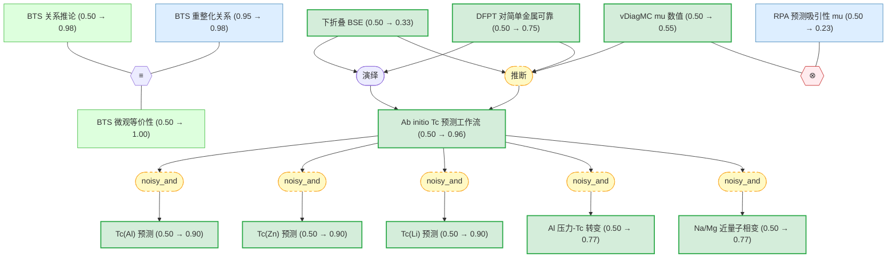

# 电子液体中的超导性 — 推理图总览

**论文**：*Superconductivity in Electron Liquids: Precision Many-Body Treatment of Coulomb Interaction*
Xiansheng Cai, Tao Wang, Shuai Zhang, Tiantian Zhang, Andrew Millis, Boris V. Svistunov, Nikolay V. Prokof'ev, and Kun Chen (2026)

## 摘要

超导发现一个多世纪以来，常规金属中超导的理论仍不完整。虽然电子-声子耦合的关键作用已被理解，但 Coulomb 相互作用的理论可控第一性原理处理尚未建立。现有 ab initio 计算中广泛使用的下折叠近似基于将 Coulomb 相互作用唯象地替换为排斥赝势 $\mu^*$，而动态 Coulomb 相互作用对电子-声子耦合影响的模糊性也长期未解。

本文通过基于变分图解蒙特卡罗（vDiagMC）积掉高能电子自由度的有效场论方法解决了这些局限。将该理论应用于均匀电子气（UEG），建立了实施下折叠近似、定义赝势、并通过电子顶角函数表达动态 Coulomb 相互作用对电子-声子耦合影响的定量微观程序。

关键发现包括：(i) 裸赝势 $\mu_{E_F}$ 显著大于传统唯象估计（在 $r_s = 5$ 时大 3 倍）；(ii) DFPT 计算的 $\lambda$ 对简单金属高度可靠；(iii) 对 Al、Zn 的 $T_c$ 预测与实验精确吻合，锂的预测改善了数个数量级；(iv) 预测 Al 在 ~60 GPa 压力下发生超导-正常态转变，Na 和 Mg 接近类似量子临界点。

