# 01 - 为什么需要从第一性原理计算库仑赝势

## 概述

超导理论自 BCS 提出以来已有七十年历史，其核心图像——声子介导的电子配对——已被广泛验证。然而，一个根本性的量化问题至今悬而未决：库仑排斥在配对通道中的有效强度到底有多大？传统 Migdal-Eliashberg (ME) 理论通过"下折叠"(downfolding) 程序将高能自由度积分掉，得到一个低能有效理论，但其中的库仑赝势 $\mu^*$ 一直是一个唯象可调参数，取值范围在 0.1--0.2 之间。对于 $T_c$ 在亚开尔文量级的超导体，由于 $T_c \propto \exp(-1/g)$ 对 $\mu^*$ 的指数敏感性，这种不确定性会导致预测值跨越数个数量级，使理论完全丧失预测能力。

本章梳理了超导 $T_c$ 预测面临的关键困难，建立了论文的出发点。一方面，唯象 ME 理论对铝、锌的 $T_c$ 预测偏差约 60%，对锂更是高估了三个数量级；另一方面，随机相位近似 (RPA) 在金属密度下预测出负的 $\mu^*$（即净吸引），与大量实验证据矛盾。这些失败共同指向一个结论：必须发展一种受控的第一性原理方法来计算 $\mu^*$ 和电子-声子耦合常数 $\lambda$，而不是继续依赖唯象参数。

下一章将建立解决这一问题的形式框架——电子-声子耦合系统的有效场论和 Bethe-Salpeter 方程。

```mermaid
graph TD
    bcs_theory["BCS Theory"]:::setting
    adiabatic_approx["Adiabatic Approximation (0.71)"]:::premise
    me_framework["Migdal-Eliashberg Framework (0.75)"]:::derived
    bts_renormalization["BTS Renormalization Relation (0.98)"]:::premise
    me_downfolding_is_phenomenological["ME Downfolding is Phenomenological (0.95)"]:::orphan
    phenomenological_me_theory["Phenomenological ME Theory Limitations (0.95)"]:::orphan
    mu_star_phenomenological["mu#ast; as Phenomenological Parameter (0.95)"]:::background
    rpa_predicts_attractive_mu["RPA Predicts Attractive mu#ast; (0.23)"]:::premise
    dfpt_computes_lambda["DFPT Computes lambda (0.92)"]:::background
    tc_al_experimental["Tc(Al) Experimental (1.00)"]:::premise
    tc_li_experimental["Tc(Li) Experimental (0.94)"]:::premise
    tc_zn_experimental["Tc(Zn) Experimental (1.00)"]:::premise
    tc_al_phenomenological["Tc(Al) Phenomenological Prediction (0.41)"]:::premise
    tc_li_phenomenological["Tc(Li) Phenomenological Prediction (0.13)"]:::premise
    tc_zn_phenomenological["Tc(Zn) Phenomenological Prediction (0.41)"]:::premise
    main_question["Main Question: First-Principles mu#ast; and Tc"]:::question
    mu_scale_independence["BTS Relation as Corollary (0.98)"]:::external
    bts_microscopic_equivalence["bts_microscopic_equivalence (1.00)"]:::external
    mu_vdiagmc_values["mu from vDiagMC: Numerical Values (0.55)"]:::external
    rpa_vs_vdiagmc["rpa_vs_vdiagmc (1.00)"]:::external
    strat_0(["deduction"])
    adiabatic_approx --> strat_0
    bcs_theory -.-> strat_0
    strat_0 --> me_framework
    strat_11(["noisy_and"]):::weak
    bts_renormalization -.-> strat_11
    strat_11 --> mu_vdiagmc_values
    oper_0{{"≡"}}
    mu_scale_independence --- oper_0
    bts_renormalization --- oper_0
    oper_0 --- bts_microscopic_equivalence
    oper_1{{"⊗"}}:::contra
    rpa_predicts_attractive_mu --- oper_1
    mu_vdiagmc_values --- oper_1
    oper_1 --- rpa_vs_vdiagmc

    classDef setting fill:#f0f0f0,stroke:#999,color:#333
    classDef premise fill:#ddeeff,stroke:#4488bb,color:#333
    classDef derived fill:#ddffdd,stroke:#44bb44,color:#333
    classDef question fill:#fff3dd,stroke:#cc9944,color:#333
    classDef background fill:#f5f5f5,stroke:#bbb,stroke-dasharray: 5 5,color:#333
    classDef orphan fill:#fff,stroke:#ccc,stroke-dasharray: 5 5,color:#333
    classDef external fill:#fff,stroke:#aaa,stroke-dasharray: 3 3,color:#333
    classDef weak fill:#fff9c4,stroke:#f9a825,stroke-dasharray: 5 5,color:#333
    classDef contra fill:#ffebee,stroke:#c62828,color:#333
```

## 推理链

### [[bcs_theory|#01 BCS 理论]]

超导理论的基石是 Bardeen-Cooper-Schrieffer (BCS) 理论：声子介导的电子-电子吸引导致费米面上的 Cooper 配对不稳定性。BCS 理论最深刻的洞见在于，超导是电子气的低能不稳定性——即使配对相互作用非常微弱，在能量标度降低的过程中其重要性也会增长。这意味着超导的竞争发生在声子频率尺度上的有效声子吸引与有效电子排斥之间。

正是这一洞见催生了将高能库仑相互作用"下折叠"到低能配对通道的思路。BCS 原始论文采取了完全忽略库仑效应的激进做法，但它引入了关键概念：如果在某个能量标度上存在弱配对相互作用，随着标度降低，这种相互作用的重要性会增长。这一 RG 流的物理图像奠定了后续所有下折叠理论的基础。作为基础理论框架，BCS 理论本身没有先验概率或 belief 赋值——它是知识包的起点设定。

由此自然引出一个问题：如果超导的竞争发生在低能有效相互作用之间，那么准确量化低能有效库仑排斥就成为理论预测 $T_c$ 的核心挑战。

### [[adiabatic_approx|#02 绝热近似]]

在常规金属中，典型声子频率（德拜频率 $\omega_D$）远小于电子费米能 $E_F$，即 $\omega_D / E_F \ll 1$。对于简单金属，这个比值约为 0.005。这种能量尺度分离带来三个关键后果：(i) 电子绝热地跟随离子运动——电子质量 $m$ 远小于离子质量 $M$，导致 $\omega_D \propto (m/M)^{1/2} E_F$；(ii) 电子-离子耦合可以线性化——电子在碰撞中传递给离子的动量很小；(iii) 电子和声子物理的时空尺度分离允许建立受控的有效场论——一旦纯库仑系统在 $\omega_D$ 以上的能量标度上的性质被确定，电子-声子顶点的进一步修正就被 $(m/M)^{1/2}$ 压低。

绝热近似是整篇论文所有下折叠程序的基础前提。它的 belief 从先验的 0.95 下降到 0.71，反映了推理图中的一个重要结构性信号。虽然绝热近似在简单金属中广泛被接受（Migdal 定理已被验证），但作为多个下游推理链的根前提，任何对它的怀疑都会显著影响全部后续结论。belief 的下降来自于它作为推理链起点所承受的结构性"压力"——整个下折叠理论的有效性都依赖于它，下游链条中积累的不确定性通过信念传播"回流"到这一节点。

这一前提为下面的 Migdal-Eliashberg 框架奠定了基础：正是因为 $\omega_D/E_F \ll 1$，Migdal 定理才能保证声子顶点修正被压低，使得自洽 Fock 图级别的截断成为合法的近似。

### [[bts_renormalization|#03 BTS 重正化关系]]

Bogoliubov-Tolmachev-Shirkov (BTS) 重正化关系将定义在不同能量截断尺度 $\omega_c$ 上的库仑赝势联系起来：

$$\mu_{\omega_c} = \frac{\mu_{\omega_c'}}{1 + \mu_{\omega_c'} \ln(\omega_c'/\omega_c)}$$

这是超导理论中最重要的标度关系之一——它保证物理可观测量（如 $T_c$）不依赖于截断尺度的选取。BTS 关系的物理根源是 Cooper 通道中的对数发散：嵌套的粒子-粒子泡图在低温下产生 $\ln(\omega_c/T)$ 项，这些对数项将高能标度上的强库仑排斥"重正化"到低能标度上的较弱有效排斥。Morel 和 Anderson 后来利用这一关系提出了著名的"赝势"概念——即使裸库仑排斥很大，在声子频率标度上的有效排斥 $\mu^*$ 也会被 Cooper 对数压到可管理的范围。

BTS 关系的 belief 从先验 0.95 上升到 0.98，表明推理图中的其他证据进一步增强了对它的信心。特别是，第三章的微观推导独立地导出了同一关系作为下折叠有效场论的精确推论，等价关系算子 $\equiv$ 将两者关联，形成了强有力的交叉验证。

这一关系在实际计算中扮演着核心角色：第四章通过 vDiagMC 在费米能标度 $E_F$ 上计算 $\mu_{E_F}$，然后利用 BTS 关系将其降到德拜频率标度，得到可直接输入 ME 方程的 $\mu^*$。

### [[me_downfolding_is_phenomenological|#04 ME 下折叠的唯象性]]

传统 ME 理论的下折叠程序本质上是唯象的：库仑效应被替换为一个静态赝势 $\mu^*$，忽略了库仑涨落对准粒子重正化和电子-声子耦合的修正，也忽略了屏蔽的非局域效应。具体而言，传统方法存在三个关键的未受控近似：(i) $\mu^*$ 被当作经验参数而非从微观理论导出，(ii) 动态库仑相互作用对电子-声子顶点的重正化被忽略，(iii) 准粒子权重 $z^e$ 在配对方程中的放置位置是不一致的。

这一论断的 belief 保持在 0.95 不变，因为它是一个广泛认可的事实。论文的Rainer (1986) 和 Shankar (1994) 等经典综述都讨论了传统下折叠的局限性，但直到本论文之前，没有人给出一个系统性的替代方案。作为知识包中的"孤立" claim（不参与任何推理链），它纯粹起到提供背景语境的作用——它是论文要解决的核心问题的诊断。

理解了这一唯象性的根源，就能理解为什么本论文选择在双电子通道（而非粒子-空穴通道）进行能量尺度分离——这一选择直接回应了传统 Wilsonian 方案中库仑相互作用在低能区失去屏蔽的问题。

### [[phenomenological_me_theory|#05 唯象 ME 理论的局限性]]

传统电子-声子超导理论使用 McMillan（或 Allen-Dynes）公式预测 $T_c$，输入参数为电子-声子耦合常数 $\lambda$ 和库仑赝势 $\mu^*$。由于 $\mu^*$ 无法从第一性原理可靠计算，通常取经验值 $\mu^* \in [0.1, 0.2]$。问题的核心在于 $T_c / \omega_{\mathrm{log}} \propto \exp(-1/g)$ 的指数敏感性：有效耦合常数 $g = \lambda - \mu^*$ 在分母位置，当 $\lambda$ 和 $\mu^*$ 接近抵消时，$g$ 的微小变化会通过指数放大，导致预测的 $T_c$ 跨越数个数量级。

论文中 Fig. 11 的三条 McMillan 曲线（$\mu^* = 0$、$0.1$、$0.2$）清楚地展示了这一灾难性的参数敏感性：对于 $\lambda \approx 0.2$--$0.4$ 的弱耦合金属，三条曲线之间的 $T_c$ 差异可达十个以上数量级。对于铝（$\lambda = 0.44$），$\mu^* = 0.1$ 给出 1.9 K 而 $\mu^* = 0.2$ 给出几乎为零的 $T_c$——唯象理论在这一参数区间内完全没有预测能力。

这一 claim 的 belief 稳定在 0.95——它是一个被广泛接受的已知局限。它为下文三种金属的唯象预测失败提供了解释框架，也为论文的核心贡献（消除 $\mu^*$ 的唯象不确定性）提供了直接的动机。

### [[mu_star_phenomenological|#06 作为唯象参数的 $\mu^*$]]

由于缺乏可靠的微观计算，库仑赝势 $\mu^*$——描述低能配对通道中有效库仑排斥强度的无量纲参数——通常被当作可调参数，经验取值范围为 0.1--0.2。更严重的是，有些体系（如 V、Nb$_3$Sn、碱金属掺杂 picene、高压氢化物）需要 $\mu^* = 0.2$--$0.5$ 才能拟合实验，远超静态 RPA 或 Morel-Anderson 估计的范围。

这个"知识空洞"是论文的核心动机：如果 $\mu^*$ 可以从第一性原理精确确定，整个 $T_c$ 预测问题就迎刃而解——$\lambda$ 已经可以从 DFPT 可靠计算，唯一的"黑箱"就是 $\mu^*$。论文正是通过建立 $\mu^*$ 的微观定义（第三章）并用 vDiagMC 实际计算它（第四章），填补了这一知识空洞。belief 保持在 0.95，反映了这一现状描述的准确性。

### [[rpa_predicts_attractive_mu|#07 RPA 预测吸引的 $\mu^*$]]

在随机相位近似 (RPA) 下处理动态屏蔽库仑相互作用时，当 Wigner-Seitz 半径 $r_s \gtrsim 2$（即金属密度区间）时，预测出 $\mu^* < 0$——库仑效应在 Cooper 通道中变为净吸引。Takada (1978, 1993) 和 Rietschel-Sham (1983) 的开创性工作发现，动态 RPA 中电子的电荷涨落在特定频率窗口内产生有效吸引，其强度在中等密度下足以克服静态排斥。近期的研究将这一分析扩展到所有配对通道，确认了纯电子 s 波超导的理论可能性。

然而，这一预测存在深刻的内在矛盾。RPA 在 $r_s \gtrsim 1$ 时忽略了两类关键修正：(i) 顶点修正——超越 RPA 的 Feynman 图对粒子-粒子不可约四点顶点的贡献；(ii) 自能重正化——准粒子权重 $z^e$ 和有效质量 $m^*/m$ 的修正。更尖锐的是，静态 RPA 和动态 RPA 在 $r_s > 0.5$ 时给出的 $\mu^*$ 值彼此"戏剧性地"不同——正如论文指出的，仅凭两种 RPA 估计之间的巨大差异，就足以质疑 RPA 在这一密度区间的可靠性。

这一 claim 的 belief 从先验的 0.50 急剧下降到 0.23，是推理图中最显著的信念更新之一。矛盾关系算子 $\otimes$ 将它与第四章 vDiagMC 计算得到的正值 $\mu^*$ 相互对照：vDiagMC 在 $r_s \in [1,6]$ 范围内一致给出正的 $\mu_{E_F}$，在 $r_s = 5$ 时比 RPA 估计大约三倍。由于 vDiagMC 结果（belief 0.55）高于 RPA 预测的先验（0.50），信念传播将 RPA 的 belief 进一步压低到 0.23。这从推理图的角度量化回答了凝聚态物理中一个长期争议：RPA 在 $r_s > 1$ 时预测的纯电子超导是不可靠的。

### [[dfpt_computes_lambda|#08 DFPT 计算 $\lambda$]]

密度泛函微扰理论 (DFPT) 通过 Kohn-Sham 基态能量对晶格畸变的线性响应来计算电子-声子耦合常数 $\lambda$。具体而言，DFPT 使用 Kohn-Sham 势对离子位移的线性响应 $\delta V^{\mathrm{KS}}$ 来估算电子-声子矩阵元 $g^{\mathrm{KS}}(\mathbf{q}) = g^{(0)}_\mathbf{q} / [1-(v_\mathbf{q}+f_{xc})\chi_0^e(\mathbf{q})]$，其中包含了裸离子势变化、电子密度扰动产生的静电势和交换关联势三部分贡献。

DFPT 的一个隐含假设是 Kohn-Sham 交换关联泛函已经"吸收"了超出平均场层面的电子-声子顶点修正，但这种吸收的精度从未被从多体理论角度严格检验——这正是第五章要回答的核心问题。belief 保持在 0.92 不变，因为 DFPT 作为一种方法论声明，不受知识包中其他推理链的影响。第五章的 EFT 分析最终证实了 DFPT 对简单金属的 $\lambda$ 计算是可靠的。

### [[tc_al_experimental|#09 铝的实验 $T_c$]]

铝 (Al) 的实验超导转变温度为 $T_c^{\mathrm{exp}} = 1.2$ K。这是一个经过充分验证的实验测量值，由多个独立实验组在不同实验条件下一致确认。铝是超导电子学的"工作马"——从转变边缘传感器 (TES) 到超导量子比特，铝薄膜的超导特性在量子器件工程中至关重要。对 $T_c$ 的精确预测直接关系到能隙和热噪声的控制精度。

其 belief 从 0.99 上升到 1.00——在推理图中，实验数据作为溯因推理的观测值，被第六章的理论预测所解释，进一步巩固了其可信度。作为论文验证理论框架的三个基准材料之一，铝的实验 $T_c$ 是整个论证链条中最坚实的锚点。

### [[tc_li_experimental|#10 锂的实验 $T_c$]]

锂 (Li) 的实验超导转变温度约为 $T_c^{\mathrm{exp}} \approx 4 \times 10^{-4}$ K (0.4 mK)，对应 9R 晶体结构，由 Tuoriniemi 等人 (2007) 在 Nature 上报道。这个极低的 $T_c$ 值本身就是一个引人注目的实验事实：锂的电子-声子耦合并不特别弱（$\lambda = 0.34$），而且是最轻的金属元素之一，理论上应该有较高的声子频率和较强的电子-声子效应。然而，它的 $T_c$ 比唯象理论预测低了三个数量级。

先验 belief 为 0.85（低于铝和锌的 0.99），因为锂在超低温下的晶体结构仍有争议：实验报告为 9R 结构，但 HCP 结构在低温下也可能是稳定的。不同晶体结构对应不同的 $\lambda$ 和 $r_s$ 值，从而导致 $T_c$ 预测相差近两个数量级。belief 从 0.85 上升到 0.94，因为推理图中的溯因推理——论文的第一性原理理论（虽然仍高估了一个数量级，但方向正确地给出了极低的 $T_c$）为这一实验值提供了额外的间接支持。锂的案例在第六章中将成为最有挑战性也最有启发性的验证。

### [[tc_zn_experimental|#11 锌的实验 $T_c$]]

锌 (Zn) 的实验超导转变温度为 $T_c^{\mathrm{exp}} = 0.875$ K。与铝类似，这是一个确立已久的测量值。锌在论文的验证中扮演着特殊角色：在所有被考察的金属中，锌的电子-声子耦合最强（$\lambda = 0.502$），提供了足够的"余量"来克服库仑排斥，使得 $T_c$ 对 $\mu^*$ 的敏感性相对较低。这使得锌成为检验理论框架数值精度的理想标的。

belief 从 0.99 上升到 1.00。在第六章中，论文预测的 $T_c^{\mathrm{EFT}} = 0.874$ K 与实验值之间的符合精度令人惊叹——偏差仅 0.1%，这是整个知识包中最强的定量验证。

### [[tc_al_phenomenological|#12 铝的唯象 $T_c$ 预测]]

使用 McMillan 公式配合标准值 $\mu^* = 0.1$，预测铝的超导转变温度为 $T_c \approx 1.9$ K，而实验值为 1.2 K，偏差约 58%。这一 claim 的先验被设为 0.35（反映"这一替代解释能多好地解释观测"的评估——58% 的高估意味着匹配质量较差），belief 上升到 0.41。

偏差的方向是系统性的：唯象预测一致地高估了 $T_c$，因为 $\mu^* = 0.1$ 低估了真实的库仑排斥。论文的第一性原理计算给出铝的 $\mu^* = 0.13$——比经验值大 30%——这一差异通过指数关系被放大，足以将偏差从 58%（唯象）减小到 20%（第一性原理）。在推理图中，唯象预测作为溯因推理中的"替代解释"，与第一性原理预测竞争解释实验数据，其较低的 belief 反映了较差的解释力。

### [[tc_li_phenomenological|#13 锂的唯象 $T_c$ 预测]]

使用 McMillan 公式配合 $\mu^* = 0.1$，预测锂的超导转变温度为 $T_c \approx 0.35$ K，而实验值约为 $4 \times 10^{-4}$ K——理论高估了约三个数量级。这是整个知识包中 belief 最低的 claim 之一（0.13），也是唯象 ME 理论最惨烈的失败。

三个数量级的偏差不是参数微调可以修复的，它指向了一个结构性问题：锂的 $r_s = 3.25$ 意味着更强的库仑关联，加上较大的带质量 $m_b = 1.75$ 将有效 $r_s$ 推高到约 5.7。在这一密度下，vDiagMC 给出 $\mu^* = 0.18$——几乎是传统取值 0.1 的两倍。这个高 $\mu^*$ 几乎完全抵消了 $\lambda = 0.34$ 的声子吸引，将 $T_c$ 压到极低值。锂的案例最清楚地展示了为什么 $\mu^*$ 的精确值至关重要——它不是一个可以随意设定的"无关紧要的参数"，而是决定超导存亡的关键量。

### [[tc_zn_phenomenological|#14 锌的唯象 $T_c$ 预测]]

使用 McMillan 公式配合 $\mu^* = 0.1$，预测锌的超导转变温度为 $T_c \approx 1.37$ K，而实验值为 0.875 K，偏差约 57%。结构上与铝的情况几乎完全平行：偏差方向相同（高估），偏差量级相当（约 57--58%），belief 从 0.35 上升到 0.41。

唯象预测对锌和铝的偏差几乎相同这一事实暗示问题的根源是系统性的——$\mu^* = 0.1$ 作为默认值一致性地低估了库仑排斥的真实强度。论文的第一性原理值 $\mu^*(\mathrm{Zn}) = 0.12$ 虽然只比经验值大了 20%，但通过 McMillan 公式的指数敏感性，这一差异足以将预测从 1.37 K 修正到 0.874 K——几乎完美匹配实验。这三个金属（Al、Zn、Li）的唯象预测共同构成了一幅令人信服的失败图景，为第一性原理方法的必要性提供了最有力的经验论据。

### [[main_question|#15 核心科学问题]]

本知识包的核心科学问题是：库仑赝势 $\mu^*$——量化 Cooper 配对通道中有效电子-电子排斥的参数——能否从第一性原理以受控精度计算？这能否产生对简单金属（如 Al、Li、Na、Mg）超导转变温度 $T_c$ 的定量预测？

这一问题的提出源于上文所有背景 claims 的汇聚：唯象理论的失败（#12--#14）、$\mu^*$ 作为可调参数的不满意状态（#06）、RPA 的内在矛盾（#07），以及绝热条件下能量尺度分离提供的理论可能性（#02）。作为 question 类型的 claim，它没有先验概率或 belief——它定义了知识包要回答的问题，整个推理链都指向对它的回答。论文将在第二到六章中依次构建形式框架、发展计算方法、验证输入精度、最终给出无可调参数的 $T_c$ 预测。

### [[me_framework|#36 Migdal-Eliashberg 框架]]

Migdal-Eliashberg (ME) 理论为动态电子-声子相互作用提供了严格处理。在绝热条件 $\omega_D / E_F \ll 1$ 下，Migdal 定理保证基于声子介导相互作用 $W^{\mathrm{ph}}$ 的声子顶点修正被压低至 $O(\omega_D/E_F)$ 阶，允许电子-声子自能截断在自洽 Fock 图的层面。ME 框架将电子自能分解为纯电子贡献 $\Sigma^e$ 和声子介导的贡献（以 $W^{\mathrm{ph}}$ 为核的自洽 Fock 图），其中 $W^{\mathrm{ph}}$ 已经包含了所有非微扰的库仑效应（屏蔽和顶点修正）。

这一 claim 是从绝热近似 (belief 0.71) 和 BCS 理论演绎推导出来的，其 belief 为 0.75，略高于绝热近似前提。ME 框架是第三章下折叠推导的起点——完整的 BSE 核被精确分解为纯电子的粒子-粒子不可约四点顶点 $\tilde\Gamma^e$ 和声子介导部分 $W^{\mathrm{ph}}$（如 Fig. 3 所示），为将"库仑问题"和"声子问题"分离开来提供了结构基础。因此，ME 框架在推理图中占据承上启下的位置——它既依赖于绝热近似，又为后续所有推导提供了出发点。

## 本章小结

本章确立了三个关键事实：(1) 唯象 $\mu^*$ 对亚开尔文超导体完全丧失预测能力（铝偏差 58%、锂三个数量级）；(2) RPA 对 $\mu^*$ 的估计在 $r_s > 1$ 时不可靠（预测负值，与实验矛盾）；(3) 绝热条件下的能量尺度分离为受控的下折叠理论提供了理论基础。这些共同定义了核心科学问题——能否从第一性原理以受控精度计算 $\mu^*$——并指明了解决路径。下一章将建立解决这一问题的形式框架：电子-声子耦合系统的有效场论和 Bethe-Salpeter 方程。
