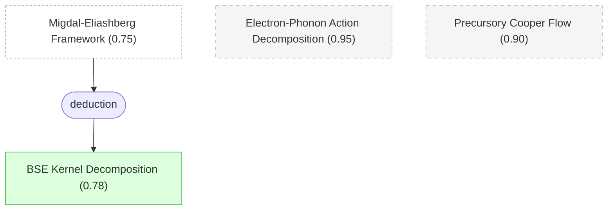

# 02 - 电子-声子耦合系统的有效场论与 Bethe-Salpeter 方程

## 概述

在上一章确立了超导 $T_c$ 预测的核心困难之后，本章建立解决问题的形式框架。论文从最基本的电子-声子耦合系统出发，利用电子质量 $m$ 远小于离子质量 $M$ 这一事实，构建了一个精确到 $O(\sqrt{m/M})$ 阶的有效作用量。与传统密度泛函方法不同，这里保留了完整的多电子作用量 $S_e$（包含所有动态库仑相互作用效应），而不是用 Kohn-Sham 非相互作用参考哈密顿量替代。这一选择是整个理论能够超越唯象处理的关键所在——它意味着电子-电子关联的所有非微扰效应都被保留在理论中。

在此基础上，论文通过 Bethe-Salpeter 方程 (BSE) 形式化描述超导不稳定性。BSE 的核心优势在于，它通过分析正常态中反常顶点函数的发散行为来预测 $T_c$，而不需要直接在临界点求解能隙方程。利用 Migdal 定理，BSE 的散射核被精确分解为纯电子部分 $\tilde\Gamma^e$ 和声子介导部分 $W^{\mathrm{ph}}$，为下一章的下折叠程序提供了理想的起点。此外，前驱 Cooper 流 (PCF) 的普适标度关系提供了一种从正常态高温计算外推 $T_c$ 的强大工具——这对于极低 $T_c$ 超导体（如锂、钠）尤为关键，因为传统方法在这些体系中需要在极低温度下直接求解能隙方程，计算量巨大且不可靠。

本章的三个 claim 为后续所有推导奠定了数学基础：有效作用量的分解提供了起点，BSE 核的分解提供了结构，PCF 提供了计算 $T_c$ 的工具。下一章将利用这些结构，在双电子通道中引入能量尺度分离，推导下折叠 BSE。

## 推理链

### [[electron_phonon_action|#16 电子-声子作用量分解]]

电子-声子耦合系统的有效作用量可以精确分解为：

$$S = S_e + S_{\mathrm{ph}} + S_{e\text{-ph}} + S_{\mathrm{CT}} + O(\sqrt{m/M})$$

这四个组分各有明确的物理含义。$S_e$ 是完整的多电子作用量——包含所有阶次的库仑相互作用，不做任何近似——这是本论文有别于传统 DFT 方法的根本出发点。$S_{\mathrm{ph}}$ 描述具有物理色散关系 $\omega_{\kappa\mathbf{q}}$ 的声子，其传播子 $D_{\kappa\mathbf{q}\nu} = -1/(\nu^2 + \omega_{\kappa\mathbf{q}}^2)$。$S_{e\text{-ph}}$ 是电子密度与离子位移的线性耦合 $S_{e\text{-ph}} = \sum_\kappa \int g_\kappa^{(0)}(\mathbf{q}) n_{\mathbf{q}\nu} u_{\kappa\mathbf{q}\nu}$，其中 $g_\kappa^{(0)}$ 是裸耦合常数。

这一分解最精妙之处在于反项 $S_{\mathrm{CT}}$ 的引入。由于物理声子频率 $\omega_{\kappa\mathbf{q}}$ 已经包含了电子屏蔽效应（电子的静态极化贡献），在微扰展开中必须减去这部分贡献以避免重复计数。反项 $S_{\mathrm{CT}} = -\frac{1}{2}\sum_\kappa \int (g_{\kappa\mathbf{q}}^{(0)})^2 \chi_\mathbf{q}^e |u_{\kappa\mathbf{q}\nu}|^2$ 正好完成了这一减除，其中 $\chi_\mathbf{q}^e$ 是电子电荷感应率的零频极限。这一构造保证了在微扰展开中使用物理声子色散时，声子传播子保持其物理性质。

belief 保持在先验值 0.95——这是标准的有效场论分解，在凝聚态物理中有深厚的基础。它为后续分析提供了一个精确而自洽的起点。

### [[precursory_cooper_flow|#17 前驱 Cooper 流]]

反常顶点函数在费米面上的低频极限 $\Lambda_0$ 满足一个普适标度关系——前驱 Cooper 流 (PCF)：

$$\Lambda_0 = \frac{1}{1 + g\ln(\omega_\Lambda/T)} + O(T)$$

其中 $g$ 是无量纲耦合常数，$\omega_\Lambda$ 是有效高能截断。当 $g < 0$（净吸引）时，$\Lambda_0$ 在 $T_c = \omega_\Lambda e^{1/g}$ 处发散，标志着 Cooper 不稳定性的出现。这一标度关系是由 Hou, Cai, Wang, Deng, Prokof'ev, Svistunov, Chen (2024) 在 Physical Review Research 上建立的。

PCF 的真正威力在于反向推断能力：通过在 $T \gg T_c$ 的正常态计算 $\Lambda_0$，然后利用上述标度关系外推，可以精确预测 $T_c$——完全无需在临界点附近进行计算量巨大的求解。与传统方法相比，PCF 还有一个关键优势：传统方法基于线性化 ME 能隙方程的最大本征值 $h(T)$ 的温度外推来预测 $T_c$，但在具有强排斥相互作用的系统中，$h(T)$ 的外推是不可靠的——没有简单的方法保证外推的精度。PCF 的标度关系 (10) 则提供了精确的函数形式，使外推具有坚实的理论基础。

对于超低 $T_c$ 超导体（如锂 $T_c \sim 10^{-4}$ K，钠 $T_c \sim 10^{-13}$ K），传统方法需要在极低温度下求解能隙方程，而 PCF 只需在高温正常态（如 $T \sim 0.01 E_F$）的几个点上计算即可。正是 PCF 的这一能力使得论文能够预测极低 $T_c$ 和量子相变临界点——这些目标用传统 ME 技术是无法达到的。belief 保持在 0.90，反映了 PCF 方法在先前工作中的验证。

当温度从上方趋近 $T_c$ 时，发散的反常顶点 $\Lambda_{k\omega} \sim \Delta_{k\omega}/(T-T_c)$ 与超导能隙函数 $\Delta_{k\omega}$ 成正比。将这一标度行为代入 BSE，发散前因子 $(T-T_c)^{-1}$ 在方程两侧抵消，BSE 化简为标准的线性化 ME 能隙方程——这建立了 PCF 方法与传统 ME 框架之间的精确联系。

### [[bse_kernel_decomposition|#39 BSE 散射核分解]]

Bethe-Salpeter 方程 $\Lambda_{k\omega} = \eta_{k\omega} + \int \tilde\Gamma_{k\omega;k'\omega'} G_{k'\omega'} G_{-k',-\omega'} \Lambda_{k'\omega'}$ 的散射核可以分解为：

$$\tilde\Gamma = \tilde\Gamma^e + W^{\mathrm{ph}} + O(\omega_D/E_F)$$

其中 $\tilde\Gamma^e$ 是纯电子的粒子-粒子不可约四点顶点（如 Fig. 3 所示），编码了所有非微扰的库仑效应；$W^{\mathrm{ph}}$ 是声子介导的有效电子-电子相互作用（如 Fig. 2 所示），由声子传播子 $D$、裸耦合 $g^{(0)}$、电子三点顶点 $\Gamma_3^e$ 和介电函数 $\epsilon_{\mathbf{q}\nu}$ 组合而成。Migdal 定理保证更高阶的声子顶点修正被绝热小参数 $O(\omega_D/E_F)$ 压低。

这一分解是从 ME 框架（belief 0.75）演绎推导出来的，其 belief 为 0.78——略高于前提，因为一旦接受 ME 框架的有效性，BSE 核的分解就是一个相当直接的结果。这一分解在后续推导中至关重要：它将"库仑问题"（由 $\tilde\Gamma^e$ 编码）和"声子问题"（由 $W^{\mathrm{ph}}$ 编码）清晰地分离开来，使两者可以独立处理——前者通过 vDiagMC 计算 UEG 的四点顶点（第四章），后者通过 DFPT 计算声子色散和耦合常数（第五章）。这种分离是整个第一性原理工作流的结构基础。

需要注意的是，BSE 核的分解虽然将两类相互作用分开，但并不自动保证下折叠后的方程仍然保持这种分离性——交叉项 $\tilde\Gamma^e \cdot \phi \cdot W^{\mathrm{ph}}$ 可能在重正化过程中耦合两个通道。第三章将专门处理这一问题，证明交叉项被等离子体频率压低到 $O(\omega_c^2/\omega_p^2)$ 阶。

## 本章小结

本章建立了三个核心数学工具：(1) 有效作用量的精确分解提供了保留完整电子关联的起点；(2) BSE 核的分解将库仑和声子问题解耦，为独立处理提供了结构；(3) PCF 标度关系提供了预测极低 $T_c$ 的计算手段。这些工具为下一章的下折叠推导——将完整的动量-频率 BSE 化简为频率-only 一维积分方程——提供了必要的形式基础。
