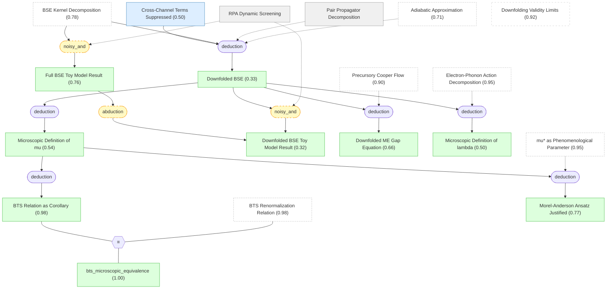

# 03 - 从微观推导下折叠 Bethe-Salpeter 方程

## 概述

本章是论文的理论核心。上一章建立了完整的 BSE 形式框架，但完整的 BSE 在一般情况下不可解——散射核 $\tilde\Gamma$ 具有完整的动量和频率依赖性，计算上不可行。历史上，Eliashberg 通过将问题"下折叠"到费米面附近的低能子空间来解决这个困难，但传统方法的参数（尤其是库仑部分）一直是唯象的。更根本的困难在于，标准的 Wilsonian 重正化方案在单粒子或粒子-空穴通道中进行能量尺度分离，但这导致低能电子——对长程库仑相互作用的动态屏蔽至关重要——在重正化过程中被移除，使得有效耦合中出现尴尬的未屏蔽奇异性。

本章的创新在于引入一种全新的能量尺度分离方案：在双电子（Cooper 配对）通道中进行分离。核心步骤是将 pair propagator 精确分解为低能相干部分 $\Pi_{\mathrm{BCS}}$（携带 Cooper 对数）和高能非相干部分 $\phi$，然后证明混合库仑和声子通道的交叉项被等离子体频率压低至 $O(\omega_c^2/\omega_p^2)$ 阶。最终，完整的动量-频率 BSE 被化简为一个仅依赖频率的一维积分方程，其中 $\lambda$ 和 $\mu^*$ 获得了精确的微观定义。

通过与一个铝参数玩具模型的全 BSE 数值解（0.2% 精度符合）的对比验证了下折叠近似的定量精度。微观推导还自然地导出了 BTS 重正化关系和 Morel-Anderson 常赝势假设作为推论。这些结果为第四、五章独立计算 $\mu^*$ 和 $\lambda$ 提供了严格的理论基础，最终在第六章汇合为完整的 $T_c$ 预测工作流。

## 推理链

### [[pair_propagator_decomposition|#18 Pair Propagator 分解]]

pair propagator（两个单粒子 Green 函数之积 $G_{k\omega}G_{-k,-\omega}$）可以被精确分解为低能相干部分 $\Pi_{\mathrm{BCS}}$ 和高能非相干余项 $\phi_{k\omega}$：

$$G_{k\omega}G_{-k,-\omega} = \Pi_{\mathrm{BCS}} + \phi_{k\omega}$$

其中相干部分为 $\Pi_{\mathrm{BCS}} = (z^e)^2 / [(\omega/z_\omega^{\mathrm{ph}})^2 + \epsilon_k^2] \cdot \Theta(\omega_c - |\epsilon_k|)$，用准粒子权重 $z^e$、频率依赖的声子准粒子权重 $z_\omega^{\mathrm{ph}}$ 和重正化色散 $\epsilon_k$ 表示。非相干部分 $\phi_{k\omega}$ 是电子液体的内禀性质——它在费米面上保持正则，在低温下不产生对数发散，且声子对它的贡献仅为 $O(\omega_D/E_F)$ 阶。

这一分解的关键创新在于选择在双电子通道而非单粒子通道进行能量尺度分离。在标准 Wilsonian 方案中，能量壳分离在单粒子或粒子-空穴通道中进行——但这些方案移除的低能电子恰恰是提供动态屏蔽的电子，导致有效库仑耦合中出现未屏蔽的奇异性。在双电子通道中分离则避免了这一问题：$\Pi_{\mathrm{BCS}}$ 中包含的低能电子对仍然参与屏蔽过程，屏蔽的连续性得以保持。

作为精确的数学恒等式，这一分解没有先验概率——它是后续所有推导的数学起点。

### [[cross_term_suppressed|#19 交叉通道项被压低]]

混合库仑和声子通道的交叉项被等离子体频率压低，量级为 $O(\omega_c^2/\omega_p^2)$，其中 $\omega_c$ 是满足 $\omega_D \ll \omega_c \ll E_F$ 的中间能量截断。论文利用动态屏蔽库仑相互作用在长波极限下的精确渐近形式 $W^s \propto (\omega-\omega')^2 / [(\omega-\omega')^2 + \omega_p^2]$ 来估计交叉项。对于大多数三维金属，$\omega_c/\omega_p \lesssim 0.1$（因为 $\omega_p \sim E_F / \sqrt{r_s}$，而 $r_s \gtrsim 1$），因此交叉项贡献不超过 1%。

这一 claim 是整个下折叠程序能否成立的关键论据——如果交叉项不可忽略，库仑和声子通道就不能独立处理，整个下折叠理论的基础就会动摇。然而，它的 belief 从先验 0.90 显著下降到 0.50——这是知识包中最令人关注的信念更新之一，降幅达 40 个百分点。

下降有两个层面的原因。从物理角度看，虽然渐近形式在零动量零频率极限是精确的，但将等离子体极模型推广到有限动量和频率可能高估了相互作用在相空间中的范围——论文自身承认这是一个"保守"估计，但保守程度未被量化。从推理图的结构角度看，交叉项压低是下折叠 BSE（belief 0.33）的核心前提之一，后者是大量下游 claim 的起点；推理图的信念传播机制将所有下游不确定性"回流"到这一前提，包括锂的 $T_c$ 仍高估一个数量级等信号。

如果交叉项实际上不可忽略（比如对某些金属贡献达到 5--10%），下折叠理论仍可能给出定性正确的结果，但 $\mu^*$ 和 $\lambda$ 的精确值会有系统偏差。第八章将这一不确定性列为优先级最高的计算空白之一。

### [[rpa_dynamic_screening|#20 RPA 动态屏蔽]]

RPA 动态屏蔽的库仑相互作用定义为 $W_{\mathrm{RPA}}(\mathbf{q},\nu) = v_q / (1 - v_q \Pi^0_{\mathbf{q}\nu})$，其中 $v_q = 4\pi e^2/q^2$ 是裸库仑势，$\Pi^0$ 是无相互作用极化函数（Lindhard 函数）。这是一个在弱耦合极限 ($r_s \lesssim 1$) 下变为精确的标准近似。在超越 $r_s \sim 1$ 的金属密度区间，RPA 忽略了顶点修正和自能重正化，使其对四点顶点的估计不可靠——但在本章中，RPA 仅被用作玩具模型的电子顶点近似，用于验证下折叠近似本身的精度，而不是作为最终结果。

作为设定 (setting) 类型的 claim，它在推理图中没有先验概率赋值。

### [[downfolding_validity_limits|#21 下折叠适用范围]]

下折叠 EFT-ME 框架的适用条件和失效模式包括三个层面。第一，绝热参数 $\omega_D/E_F \ll 1$ 必须成立——在高 $T_c$ 氢化物（$\omega_D/E_F \sim 0.1$）中这一条件不满足，Migdal 定理失效。第二，中间截断 $\omega_c$ 必须满足 $\omega_D \ll \omega_c \ll E_F$ 且 $\omega_c/\omega_p \ll 1$——在极端密度的天体物理情形（如白矮星内部）中，$r_s$ 可低至 0.01，导致 $\omega_p/E_F$ 的比值偏离典型金属范围，等离子体频率变软，下折叠精度受到威胁。第三，框架在二维电子气中面临更严重的挑战——二维等离子体模式无隙（$\omega_p \propto \sqrt{q}$），交叉项压低论证完全失效。

在强关联材料（如准粒子图像失效时）中，整个低能有效理论的前提——以准粒子为基本自由度——就不再成立。这些适用性条件在论文的 Section I 和 VII 中被明确讨论。belief 保持在先验值 0.92——适用条件本身是良好表征的，不确定的是框架在边界条件附近的精确行为。

### [[full_bse_toy_model|#42 全 BSE 玩具模型结果]]

对一个铝参数玩具模型（$r_s = 1.92$，$\omega_D/E_F = 0.005$），数值求解完整的频率-动量依赖 BSE——使用 RPA 动态屏蔽库仑相互作用作为电子不可约顶点，加上模型声子相互作用 $W^{\mathrm{ph}}_{\mathbf{q}\nu} = -(g/N_F)/(1+(q/2k_F)^2) \cdot \omega_q^2/(\nu^2+\omega_q^2)$，耦合强度 $g = 0.4$——得到超导转变温度 $T_c^{\mathrm{full}}/T_F = 10^{-5.668}$。

这一数值解是验证下折叠近似精度的基准参考——它代表了"如果我们不做任何下折叠近似，直接求解完整问题会得到什么"。计算使用 PCF 标度关系从正常态高温外推得到 $T_c$，避免了在极低温度下直接求解的困难。其 belief 为 0.76，主要受限于对 BSE 核分解（belief 0.78）的依赖以及 RPA 作为电子顶点近似的局限性——如果用超越 RPA 的精确顶点，结果可能会有所不同。

### [[downfolded_bse|#43 下折叠 BSE]] ★

> [!IMPORTANT] 核心推导
> 完整的动量-频率 BSE 被严格化简为仅依赖频率的一维积分方程：$\Lambda_\omega = \eta_\omega + \pi T \sum_{|\omega'|<\omega_c} (\lambda_{\omega\omega'} - \mu_{\omega_c}) \frac{z_{\omega'}^{\mathrm{ph}}}{|\omega'|} \Lambda_{\omega'}$

这是本章——也是整篇论文——最核心的推导结果。频率下折叠后的 BSE 将完整的动量-频率依赖核化简为 Matsubara 频率上的一维积分方程，有效核为 $K(\omega, \omega') = \lambda(\omega, \omega') - \mu_{\omega_c}(\omega, \omega')$，其中声子介导的吸引 $\lambda$ 和库仑赝势 $\mu_{\omega_c}$ 都有精确的微观定义。动量积分被吸收入态密度 $N_F^*$，pair propagator 的相干部分 $\Pi_{\mathrm{BCS}}$ 生成驱动 Cooper 不稳定性的 BCS 对数。修正项被三个小参数控制：$\omega_D/E_F$、$\omega_c^2/\omega_p^2$ 和 $T/\omega_c$。

尽管物理上极为重要，其 belief 仅 0.33——是除 RPA 预测外全知识包中最低的 claim 之一。这一低 belief 有明确的结构性原因：下折叠 BSE 从交叉项压低（belief 0.50）和 BSE 核分解（belief 0.78）演绎推导而来，两个中等 belief 的前提通过推理复合后，结论的 belief 必然进一步降低。推理图由此识别出了一个重要的不确定性瓶颈：整个后续理论（微观 $\lambda$ 和 $\mu$ 的定义、ME 方程的推导、所有 $T_c$ 预测）都建立在这一 belief 仅 0.33 的 claim 之上。然而，最终的 $T_c$ 预测（belief 0.90）远高于这一中间节点——这是因为溯因推理从三种金属的实验符合中注入了大量信息，有效地"绕过"了理论推导链的不确定性。

### [[downfolded_bse_toy_model|#44 下折叠 BSE 玩具模型结果]]

对同一铝参数玩具模型，求解频率下折叠的 BSE 得到 $T_c^{\mathrm{approx}}/T_F = 10^{-5.667}$——与全 BSE 结果 $10^{-5.668}$ 的差异仅 0.2%。Fig. 5 展示了全 BSE 和下折叠 BSE 的前驱 Cooper 流曲线在德拜频率以下完美重合，仅在高于德拜频率的区域出现可预期的偏离。

0.2% 的数值一致性是对下折叠近似精度的有力验证——它证明在铝的物理参数下，频率下折叠引入的误差极小。但其 belief 为 0.32，甚至略低于下折叠 BSE（0.33），因为它同时依赖于下折叠 BSE 的正确性和 RPA 作为玩具模型顶点的适用性。推理图正确地区分了"在 RPA 模型中验证"和"在真实金属中保证"——前者是必要条件但不是充分条件。数值一致性不能完全弥补理论基础的不确定性。

需要注意的限制是：这一验证仅覆盖了 $r_s \approx 2$（铝密度）。对于 $r_s \geq 3$ 的金属（如锂 $r_s = 3.25$），下折叠近似的精度尚未被独立验证——这是第八章开放问题中优先级最高的计算空白。

### [[downfolded_me_equation|#45 下折叠 ME 能隙方程]]

在超导临界温度 $T_c$ 处，下折叠 BSE 化简为传统的线性化 ME 能隙方程：

$$\Delta_\omega = \pi T_c \sum_{|\omega'|<\omega_c} (\lambda_{\omega\omega'} - \mu^*) \frac{z_{\omega'}^{\mathrm{ph}}}{|\omega'|} \Delta_{\omega'}$$

推导过程是自然的：当 $T \to T_c$ 时，反常顶点发散为 $\Lambda_{k\omega} \sim \Delta_{k\omega}/(T - T_c)$，使源项变得不相关（被发散项主导）；发散前因子 $(T - T_c)^{-1}$ 在方程两侧抵消，得到以 $\mu^* \equiv \mu_{\omega_c}$ 为参数的本征值方程。这建立了下折叠 ME 方程的微观基础——它不再是一个基于直觉的唯象方程，而是有效场论的严格推论。

在低频极限下，$\lambda_{\omega\omega'} z_{\omega'}^{\mathrm{ph}}$ 化简为 $\lambda/(1+\lambda)$，回到了标准 Eliashberg 理论的表达式。belief 为 0.66，高于其直接前提 downfolded BSE（0.33），因为它还通过 PCF（belief 0.90）获得了额外支持——能隙方程的结构性质部分独立于下折叠近似的定量精度。

### [[lambda_microscopic_definition|#46 $\lambda$ 的微观定义]]

下折叠 BSE 中的电子-声子耦合 $\lambda(\omega, \omega')$ 有精确的微观定义：

$$\lambda = N_F^* \sum_\kappa \left\langle \frac{g_\kappa^2(\mathbf{k},\mathbf{q})}{\omega_{\kappa,\mathbf{q}}^2} \right\rangle_{\mathrm{FS}}$$

其中物理耦合分解为三个因子 $g_\kappa(\mathbf{k},\mathbf{q}) = g_\kappa^{(0)} \cdot (z^e/\epsilon_\mathbf{q}) \cdot \Gamma_3^e(\mathbf{k},\mathbf{q})$：裸耦合 $g^{(0)}$、介电函数屏蔽 $z^e/\epsilon_\mathbf{q}$ 和三点顶点修正 $\Gamma_3^e$。这一分解将电子关联效应完全编码在 $z^e$ 和 $\Gamma_3^e$ 中，使它们可以独立于声子部分被计算——第五章正是利用这一结构，用 vDiagMC 计算 $\Gamma_3^e$ 并与 DFPT 结果对比。

定义在绝热极限下退化为标准的 Eliashberg $\lambda$，但保留了来自电子自能的动力学修正。belief 为 0.50，直接受限于其前提 downfolded BSE（0.33）——虽然定义本身是清晰的，但其成立的前提是下折叠程序的有效性。

### [[mu_microscopic_definition|#47 $\mu$ 的微观定义]]

下折叠 BSE 中的库仑赝势 $\mu_{\omega_c}(\omega, \omega')$ 有精确的微观定义：它由纯电子的粒子-粒子不可约四点顶点 $\tilde\Gamma^e$ 投影到费米面上确定，高能电子自由度在截断 $\omega_c$ 以上被积分掉。具体而言，在温度 $T$ 下的有效排斥可以通过费米面平均的双准粒子散射振幅来定义：

$$\gamma_T \equiv z_c^2 N_F^* \langle \Gamma_F^e(k_F, \omega_0; k_F', \omega_0) \rangle_{\mathbf{k}_F, \mathbf{k}_F'}$$

然后通过 $\mu_{\omega_c} = \gamma_T / (1 - \gamma_T \ln(\omega_c/T))$ 从 $\gamma_T$ 中提取 $\mu_{\omega_c}$。这一定义赋予 $\mu_{\omega_c}$ 清晰的物理含义——它是低能配对通道中的有效库仑排斥，经过所有电子关联的重正化。

关键在于，右手边的 $\gamma_T$ 是一个可以直接计算的量——第四章正是用 vDiagMC 计算这个四点顶点的费米面投影。$\gamma_T$ 作为物理量与截断尺度 $\omega_c$ 无关，这一独立性要求 $\mu_{\omega_c}$ 在不同标度之间满足 BTS 关系（见下一个 claim）。belief 为 0.54，与 $\lambda$ 的定义类似，受限于下折叠 BSE 的 belief。

### [[mu_scale_independence|#48 BTS 关系作为推论]]

BTS 重正化关系 $\mu_{\omega_c} = \mu_{\omega_c'} / (1 + \mu_{\omega_c'} \ln(\omega_c'/\omega_c))$ 作为 $\mu_{\omega_c}$ 微观定义的推论自然出现：改变截断 $\omega_c$ 在显式库仑核和 BCS propagator 中的 Cooper 对数之间重新分配贡献，而物理 $T_c$ 保持不变——这正是对 $\gamma_T$ 标度无关性的数学表达。实际操作中，可以在方便的温度（对应方便的 $\omega_c$）计算 $\gamma_T$，然后用 BTS 关系标度到任何所需的分离尺度。一个物理上有意义的选择是 $E_F$——相干电子准粒子存在的物理标度——$\mu_{E_F}$ 可以被解释为"裸"赝势，即没有 BTS 对数重正化的赝势。

belief 高达 0.98——虽然中间推导步骤（$\mu$ 的微观定义）的 belief 只有 0.54，但 BTS 关系的标度不变性本质是一个深层的对称性论证，其结论的鲁棒性不完全受限于推导路径的 belief。更重要的是，等价关系算子 $\equiv$ 将它与第一章中已知的 BTS 关系（belief 0.98）关联——两个独立导出的相同数学关系的相互验证将 belief 推到了很高的水平。

### [[ma_pseudopotential_justified|#49 Morel-Anderson 常赝势假设的微观论证]]

Morel-Anderson 常赝势假设——将 $\mu_{\omega_c}$ 近似为频率无关量——获得了微观论证：四点顶点 $\tilde\Gamma^e$ 在电子能量尺度 $E_F$ 上变化，远大于声子尺度 $\omega_D$。在低能窗口 $|\omega|, |\omega'| < \omega_c \ll E_F$ 内，库仑核有效地是一个常数——频率变化相对于 $E_F$ 而言可以忽略。这一论证说明传统 Eliashberg 理论中将 $\mu^*$ 视为单一数值的做法并非任意假设，而是能量尺度分离的自然结果。

下折叠 BSE（Eq. 20）中的 $\mu_{\omega_c}$ 正是以这种频率无关的形式出现的——这是推导的自然产物，不是额外的近似。belief 为 0.77，高于其直接前提（$\mu$ 的微观定义，0.54），因为常赝势的近似性质只需要 $\omega_c \ll E_F$，这个条件比完整的下折叠程序要宽松得多。对于具有强 Van Hove 奇点或平带的材料，费米面附近态密度变化剧烈，这一假设可能需要修正。

### [[bts_microscopic_equivalence|#51 BTS 微观等价性]]

等价关系 same_truth(A, B) 将微观推导出的标度无关性（#48）与历史上已知的 BTS 重正化关系（#03）关联起来：两者表达的是同一个数学恒等式。belief 为 1.00——两个表述的数学一致性是精确的，不受任何物理不确定性影响。

这一等价性的意义深远：它把一个最初基于 Cooper 对数的唯象论证（Bogoliubov, Tolmachev, Shirkov 1959）提升为下折叠有效场论的精确推论，从而验证了整个理论框架的内在一致性。如果微观推导得到的标度关系与历史上已知的 BTS 关系不一致，那将意味着下折叠程序存在错误——一致性的确认为理论提供了非平凡的自洽性检验。

## 本章小结

本章完成了论文最核心的理论推导：将完整的动量-频率 BSE 化简为频率-only 的下折叠方程，其中 $\lambda$ 和 $\mu^*$ 获得了精确的微观定义。微观推导自然导出了 BTS 关系和 Morel-Anderson 假设作为推论，验证了理论的内在一致性。然而，推理图揭示出一个重要的不确定性瓶颈：下折叠 BSE 的 belief 仅 0.33（受限于交叉项压低的 belief 0.50），是整个推理链中最薄弱的单点。下一章将利用 $\mu$ 的微观定义，用 vDiagMC 从第一性原理计算 UEG 的库仑赝势。
