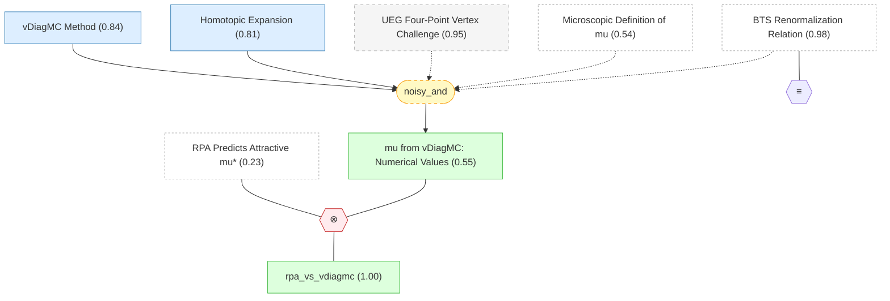

# 04 - 从第一性原理计算库仑赝势

## 概述

上一章给出了 $\mu^*$ 的精确微观定义——它由均匀电子气 (UEG) 的粒子-粒子不可约四点顶点 $\tilde\Gamma^e$ 在费米面上的投影确定。本章的任务是实际计算这个量。这是一项极具挑战性的多体计算：对于 $r_s \gtrsim 1$（即几乎所有金属的密度区间），裸库仑相互作用的微扰级数发散，部分重求和方法（RPA、GW）遗漏了关键的顶点修正，而传统量子 Monte Carlo 方法（如变分 QMC 和扩散 QMC）是基态方法，无法直接获取四点顶点函数。

论文使用变分图解 Monte Carlo (vDiagMC) 方法突破了这一瓶颈。vDiagMC 通过随机采样高阶 Feynman 图拓扑和内部变量，在自洽 bold-line 重求和的基础上构造受控的微扰展开，并通过 homotopic 展开技巧解决了 Cooper 通道中对数发散导致级数在低温下失去收敛性的问题。最终结果给出了 $\mu_{E_F}(r_s)$ 在金属密度范围内的精确值：$\mu_{E_F}$ 在 $r_s > 0.5$ 时显著大于 Morel-Anderson 和静态 RPA 估计值（$r_s = 5$ 时约三倍），且始终为正——彻底否定了动态 RPA 预测的纯电子配对吸引。

本章的输出——$\mu_{E_F}(r_s)$ 的参数化——为第六章的 $T_c$ 预测工作流提供了库仑排斥端的核心输入。下一章将转向天平的另一端：声子介导的吸引。

## 推理链

### [[ueg_vertex_challenge|#22 UEG 四点顶点的计算挑战]]

计算均匀电子气 (UEG) 的粒子-粒子不可约四点顶点 $\tilde\Gamma^e$ 是一个长期未解决的挑战。困难来自三个层面：(i) 裸库仑相互作用 $v_q = 4\pi e^2/q^2$ 在小动量转移时发散，使得微扰论在 $r_s \gtrsim 1$ 时不收敛；(ii) 部分重求和方法（如 RPA/GW）仅保留了泡图贡献，遗漏了直接影响四点顶点的梯形图、交叉图等关键修正；(iii) 四点顶点编码了所有非微扰的库仑关联效应——它不能用任何单粒子方法（包括 DFT）获取，也不能从传统基态 QMC 方法中提取，因为后者只能给出能量和密度矩阵，而不是响应函数或散射振幅。

需要一种全新的多体数值方法，能够在 $r_s \in [1, 6]$ 的金属密度范围内以受控精度评估 $\tilde\Gamma^e$。这一 claim 的 belief 保持在 0.95——挑战本身是公认的。它在推理图中作为背景 claim 出现，为引入 vDiagMC 方法提供了动机和语境。

### [[vdiagmc_method|#23 vDiagMC 方法]]

变分图解 Monte Carlo (vDiagMC) 为高阶计算 Feynman 图级数提供了一种受控的、可系统改进的方法。它的技术框架建立在三个支柱之上。

第一个支柱是 bold-line（自洽）重求和：将 UEG 作用量重写为重正化 Yukawa 费米气加反项的形式 $v(\mathbf{q}) = 4\pi e^2/(\mathbf{q}^2 + \lambda_R) + \delta v_1 \cdot \xi + \delta v_2 \cdot \xi^2 + \ldots$，裸库仑势中的长程奇异性被 Yukawa 屏蔽参数 $\lambda_R$ 吸收，消除了单个图中的红外发散。化学势 $\mu$ 也做类似的反项重展开，保证树级传播子对应物理电子密度。

第二个支柱是随机采样：图拓扑和内部变量（动量、频率）的高维积分通过 Monte Carlo 方法完成——包括 VEGAS 自适应算法和基于 normalizing flow 神经网络的重要性采样。这使得确定性方法无法达到的高阶展开成为可能。

第三个支柱是现代计算基础设施：Feynman 图被表示为计算图（computational graph），利用 Dyson-Schwinger 和 Parquet 方程的结构以分形张量运算的形式压缩表示。Taylor 模式自动微分算法将场论重正化方案的计算成本从指数降到亚指数。这一"AI 技术栈"——计算图表示 + 自动微分 + 机器学习框架——是使高阶图解计算成为可能的关键使能技术。

belief 从先验 0.90 下降到 0.84。下降反映了方法本身的系统不确定性：图解级数的截断（有限阶外推到无穷阶）、收敛性判据（conformal map 对收敛半径的估计）、以及 Yukawa 起始点 $\lambda_R$ 对最终结果的弱残余依赖性（物理量应独立于 $\lambda_R$，但有限阶截断破坏了这一独立性）。在金属密度范围内，vDiagMC 对自能、极化率和有效质量的计算结果与 QMC 吻合良好，但四点顶点是首次计算，没有独立方法可以交叉验证。

### [[homotopic_expansion|#24 Homotopic 展开]]

简单的 vDiagMC 微扰展开在低温下面临一个根本困难：Cooper 通道中嵌套的粒子-粒子泡在第 $N$ 阶产生 $(\ln T)^N$ 的对数发散，使得散射振幅 $\gamma_T(\xi)$ 的级数在物理值 $\xi = 1$ 处失去收敛性。Fig. 7 左图清楚地展示了这一行为：$\gamma_T$ 的部分和在 $T < 0.01 E_F$ 以下出现对数发散。

homotopic 展开通过一个巧妙的变量替换解决了这一问题。定义一个温度无关的函数：

$$\mu_{\omega_c}(\xi) = \frac{\gamma_T(\xi)}{1 - \gamma_T(\xi) \ln(\omega_c/T)}$$

这一变换将温度依赖的对数发散吸收为反项（对应 BTS 重正化关系的结构），产生一个温度无关的级数 $\mu_{\omega_c}(\xi) = \mu^{(0)} + \mu^{(1)}\xi + \mu^{(2)}\xi^2 + \ldots$，其系数快速收敛到明确的低温极限。Fig. 7 右图展示了 $\mu_{\omega_c}$ 的部分和在 $T \to 0$ 时确实饱和到一个稳定值，使得 $\mu_{E_F}$ 可以被可靠地提取。

这一技巧的数学基础是 $\gamma_T(\xi)$ 作为 $\xi$ 的函数的解析性——homotopic 变换本质上是从 $\gamma_T$ 的解析区域到 $\mu_{\omega_c}$ 的解析区域的 conformal mapping。如果 $\gamma_T(\xi)$ 存在非解析奇点（例如在 $|\xi| < 1$ 的某处），conformal map 可能产生系统偏差。belief 从先验 0.88 下降到 0.81——下降主要来自这一解析性假设的不可直接验证性。不过，级数的快速收敛（Fig. 7 右图）为结果的可靠性提供了经验证据。

### [[mu_vdiagmc_values|#37 vDiagMC 计算的 $\mu$ 数值]] ★

> [!IMPORTANT] 核心数值结果
> vDiagMC 给出的 UEG 库仑赝势 $\mu_{E_F} \approx 0.27 r_s$（$r_s = 2$ 时 $\mu_{E_F} = 0.53(2)$，$r_s = 3$ 时 $\mu_{E_F} = 0.77(5)$），始终为正且显著大于传统估计

vDiagMC 对 UEG 四点顶点的计算给出了费米能尺度上的库仑赝势——TABLE I 列出了 $r_s = 1$--$6$ 的完整数值。在计算最优的 $\omega_c = 0.1 E_F$ 处计算 $\mu_{\omega_c}$，然后通过 BTS 关系反演得到 $\mu_{E_F}$。代表性数值包括：$\mu_{E_F} = 0.28(1)$（$r_s = 1$）、$\mu_{E_F} = 0.53(2)$（$r_s = 2$，类铝密度）、$\mu_{E_F} = 0.77(5)$（$r_s = 3$，类锂密度）和 $\mu_{E_F} = 1.3(2)$（$r_s = 5$）。括号中的数字表示最后一位的系统不确定性估计。

这些数值的物理意义深远。Fig. 4 展示了 $\mu_{E_F}$ vs $r_s$ 的关系：vDiagMC 数据点沿 $\mu_{E_F} \approx 0.27 r_s$ 的近线性关系增长。与三种标准近似的比较极具说服力：(i) 静态 RPA 给出的 $\mu_{\mathrm{RPA-static}}$ 在 $r_s > 0.5$ 时严重低估；(ii) Morel-Anderson 基于 Thomas-Fermi 屏蔽的 $\mu_{\mathrm{MA}}$ 更低；(iii) 动态 RPA 在 $r_s > 2$ 时甚至给出负值。所有曲线仅在 $r_s \ll 1$（弱耦合极限）时一致——这恰恰是 RPA 变为精确的区域。论文指出："仅凭静态和动态 RPA 结果之间的巨大差异，就足以质疑 RPA 在 $r_s > 0.5$ 时的可靠性。"

通过 BTS 关系将 $\mu_{E_F}$ 降到 Debye 频率尺度后，$\mu^* \approx 0.12$--$0.18$——与经验范围 $0.1$--$0.2$ 一致，但现在是从第一性原理导出的，带有几个百分点的受控误差棒，不再是可调参数。

belief 为 0.55，通过 noisy-AND 推理策略从 vDiagMC 方法（0.84）和 homotopic 展开（0.81）联合得出。矛盾关系算子 $\otimes$ 将此 claim 与 RPA 预测（先验 0.50）对立，导致 RPA 的 belief 进一步大幅下降到 0.23。

### [[rpa_vs_vdiagmc|#40 RPA 与 vDiagMC 的矛盾]]

矛盾关系 not_both_true(A, B)：RPA 预测的吸引性 $\mu^*$（$r_s > 2$ 时 $\mu^* < 0$）与 vDiagMC 计算的正值 $\mu^*$（$r_s \in [1,6]$ 范围内一致为正）不可能同时为真。belief 为 1.00——逻辑上，两个直接矛盾的数值陈述不可能同时正确。

这一矛盾关系在推理图中触发了一个关键的信念重分配。RPA 预测 $\mu^* < 0$ 意味着即使没有声子，仅靠库仑相互作用的动态效应就能产生 s 波超导——这与大量实验证据不符（没有任何简单金属在仅有库仑作用时表现出超导性），也与 vDiagMC 的精确计算直接矛盾。信念传播将 RPA 的 belief 从先验 0.50 压低到 0.23：不确定性被决定性地从"二者各占一半可能"重新分配到"vDiagMC 正确而 RPA 不可靠"。

从物理角度看，这一矛盾的根源很清楚：动态 RPA 在 $r_s > 1$ 时忽略了自能重正化（准粒子权重 $z^e < 1$）和顶点修正（$\Gamma_3^e \neq 1$），而这些效应在中等密度下是显著的。vDiagMC 系统地包含了这些修正到高阶，给出的结果从根本上推翻了 RPA 的预测。这从推理图的角度量化解决了凝聚态物理中关于"纯电子超导"的长期争议。

## 本章小结

本章通过 vDiagMC + homotopic 展开，首次从第一性原理以受控精度计算了 UEG 的库仑赝势 $\mu_{E_F}(r_s)$。核心发现有三个：(1) $\mu_{E_F}$ 始终为正且显著大于传统估计；(2) RPA 在 $r_s > 1$ 时的预测被彻底否定；(3) 通过 BTS 关系降到 Debye 尺度后的 $\mu^* \approx 0.12$--$0.18$ 为简单金属提供了无可调参数的库仑赝势输入。下一章将转向 $T_c$ 预测的另一半——验证 DFPT 对电子-声子耦合 $\lambda$ 的计算精度。
