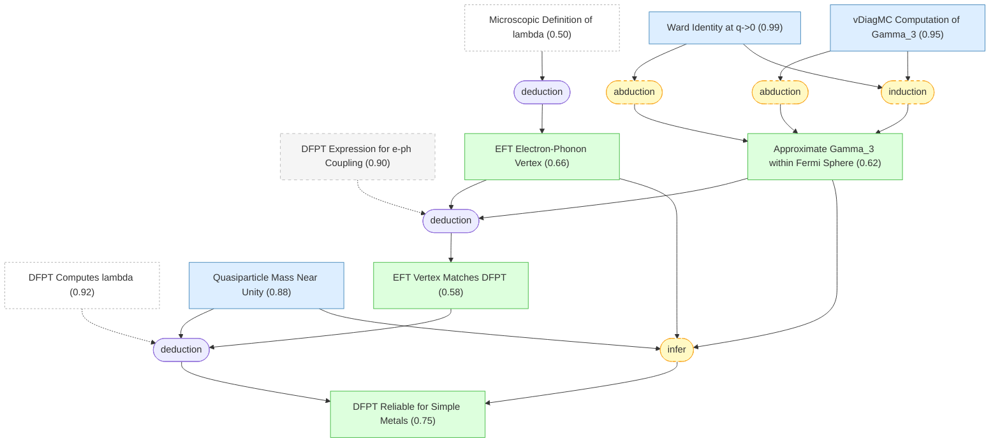

# 05 - 电子-声子耦合的微观验证

## 概述

上一章解决了库仑排斥端的问题——$\mu^*$ 可以从第一性原理计算。本章转向天平的另一端：声子介导的吸引，量化为无量纲耦合常数 $\lambda$。

现有的 $\lambda$ 计算完全依赖密度泛函微扰理论 (DFPT)，它通过 Kohn-Sham 基态对晶格畸变的线性响应来估算电子-声子耦合。DFPT 在弱关联超导体中表现良好，但一个根本性问题一直未被回答：DFPT 到底有多准确？它隐式地假定 Kohn-Sham 交换关联泛函已经吸收了电子-声子顶点修正，但这种吸收的程度从未在多体理论层面得到严格检验。

本章利用 UEG 模型回答了这个问题。EFT 表达式将物理电子-声子耦合分解为 $g(\mathbf{k},\mathbf{q}) = g^{(0)}_\mathbf{q} \cdot (z^e / \epsilon_\mathbf{q}) \cdot \Gamma_3^e(\mathbf{k};\mathbf{q})$——裸耦合、介电屏蔽和三点顶点修正三个因子。尽管 $z^e$、$\epsilon_\mathbf{q}$ 和 $\Gamma_3^e$ 各自都有很大的相互作用修正，它们的乘积却出现了惊人的对消——最终结果与 DFPT 的 Kohn-Sham 表达式极为接近（Fig. 8）。Ward 恒等式保证了 $q \to 0$ 极限的精确性，而 vDiagMC 计算表明在整个费米面相关动量转移范围内顶点修正都是温和的。结合准粒子有效质量接近裸质量的事实，论文得出结论：DFPT 对简单金属的 $\lambda$ 计算是可靠的。这为第六章的 $T_c$ 预测扫清了声子端的最后障碍。

## 推理链

### [[ward_identity|#25 $q \to 0$ 处的 Ward 恒等式]]

一个精确的 Ward 恒等式将三点电子-声子顶点 $\Gamma_3^e(k, q)$ 与电子自能在长波极限 $q \to 0$ 下联系起来：

$$\lim_{q \to 0} \Gamma_3^e(k, q) = 1 - \frac{\partial\Sigma(k)}{\partial\epsilon_k} = \frac{m^*}{m}$$

这一恒等式是电荷守恒的直接后果——它是量子场论中的精确结果，不依赖于任何近似或微扰展开。在物理上，它表达了一个深刻的约束：长波长密度响应（$q \to 0$）必须与准粒子有效质量一致。在 $q = 0$ 处，电子对均匀势场的响应完全由费米面处的态密度（即有效质量）决定，不需要任何关于内部动力学的详细知识。

belief 从先验 0.98 上升到 0.99，这是整个知识包中 belief 最高的非平凡 claim 之一。Ward 恒等式在后续推理中扮演双重关键角色：一方面，它提供了 $\Gamma_3^e$ 插值的精确锚点——在 $q = 0$ 处我们精确知道 $\Gamma_3^e = m^*/m$；另一方面，它为 $z^e$ 和 $\Gamma_3^e$ 之间的对消关系提供了精确的数学基础——正是这种对消使得 EFT 顶点与 DFPT 吻合。

### [[gamma3_vdiagmc|#26 vDiagMC 计算 $\Gamma_3$]]

vDiagMC 对 UEG 三点顶点 $\Gamma_3^e(k, q)$ 的有限动量转移 $q$ 计算展现了令人鼓舞的结果。在金属密度 $r_s \in [2, 4]$ 下，费米球内 ($|k|, |k+q| \lesssim k_F$) 的顶点修正是温和的——典型值在 10--20% 量级——且随散射角 $\theta$（$\mathbf{k}$ 和 $\mathbf{k}+\mathbf{q}$ 之间的夹角）平滑变化。

Fig. 8 的数据点展示了 $z^e N_F W_\mathbf{q}^{\mathrm{qp}} \Gamma_3^e(\mathbf{k},\mathbf{q})$ 在不同 $r_s$ 和 $\theta$ 下的值。vDiagMC 数据在 $\theta \to 0$（前向散射，$q \to 0$）处与 Ward 恒等式的精确极限无缝衔接，然后随 $\theta$ 增大缓慢变化，直到反散射区域（$\theta \approx \pi$，$q \approx 2k_F$）。在反散射区域，图解级数对 Cooper 通道的对数发散最敏感，vDiagMC 数据的误差棒略有增大——但整体变化仍然是温和的。

belief 从先验 0.88 上升到 0.95——这是少数几个 belief 显著上升的 claim 之一。上升反映了计算结果的内在一致性：插值光滑、与 Ward 恒等式的精确极限无缝衔接、以及在不同 $r_s$ 值下行为的系统性——这些特征共同为方法的可靠性提供了强有力的内证据。与第四章的四点顶点计算不同，三点顶点在技术上更简单（阶次更低、收敛更好），这也是 belief 更高的原因之一。

### [[dfpt_eph_ansatz|#27 DFPT 电子-声子耦合表达式]]

DFPT 通过 Kohn-Sham 势对离子位移的线性响应来定义有效电子-声子耦合：

$$g^{\mathrm{KS}}(\mathbf{q}) = \frac{g_\mathbf{q}^{(0)}}{1 - (v_\mathbf{q} + f_{xc})\chi_0^e(\mathbf{q})}$$

其中分母包含裸库仑势 $v_\mathbf{q}$、交换关联核 $f_{xc}$（LDA 近似）和 Lindhard 函数 $\chi_0^e(\mathbf{q})$。这一表达式将电子-声子耦合描述为被电子极化屏蔽后的有效离子势。

一个重要的特征是 $g^{\mathrm{KS}}$ 只依赖于转移动量 $\mathbf{q}$，而不依赖于入射电子动量 $\mathbf{k}$——这与 EFT 顶点 $g(\mathbf{k},\mathbf{q})$ 形成对比。正是这一特征使得 EFT 与 DFPT 的对比成为一个有意义的检验：如果 EFT 的 $\mathbf{k}$ 依赖性很强，DFPT 的 $\mathbf{k}$-无关假设就不成立。Fig. 8 的结果证明，对于 UEG，残余的 $\mathbf{k}$ 依赖性确实很弱——DFPT 的简化是合理的。

belief 保持在先验值 0.90——作为一个方法论描述，DFPT 表达式的数学形式本身是正确的，问题在于其隐式假设（$f_{xc}$ 是否准确地吸收了所有顶点修正）的精度。

### [[quasiparticle_mass_near_unity|#28 准粒子质量接近裸质量]]

对于金属密度 ($r_s \in [2, 4]$) 的简单金属，准粒子有效质量比 $m^*/m \approx 1$，偏差不超过 5--10%。这一结论来自高精度的量子 Monte Carlo 和图解 Monte Carlo 计算：Haule & Chen (2022) 和 Holzmann et al. (2023) 的独立计算一致表明，UEG 的 $m^*/m$ 在 $r_s \leq 5$ 时偏差不到 1%——这是一个相当反直觉的结果，因为 $r_s \sim 3$--$5$ 时电子-电子相互作用已经不弱（准粒子权重 $z^e$ 可以偏离 1 达 10--20%）。

这一近乎恒等的质量比带来了一个重要的实际后果：准粒子态密度 $N_F^* = m^* k_F / (2\pi^2)$ 几乎等于裸带态密度 $N_F^{(0)} = m k_F / (2\pi^2)$。EFT 使用 $N_F^*$ 而 DFPT 使用 $N_F^{(0)}$ 来计算 $\lambda$——两者几乎相同。这消除了将顶点层面的 EFT-DFPT 符合（$g(\mathbf{k},\mathbf{q}) \approx g^{\mathrm{KS}}(\mathbf{q})$）推广到 $\lambda$ 层面（$\lambda_{\mathrm{EFT}} \approx \lambda_{\mathrm{DFPT}}$）时可能出现的最后一个差距。

belief 从先验 0.92 下降到 0.88——略微下降可能反映了在 $r_s$ 接近 5 时误差棒的增大，但整体上这一 claim 仍有很高的可信度。

### [[gamma3_approximation|#38 费米球内 $\Gamma_3$ 的近似]]

三点顶点 $\Gamma_3^e(k, q)$ 在费米球内可以通过两个受控极限之间的插值来准确近似。第一个极限是 $q \to 0$ 处的精确 Ward 恒等式，给出 $\Gamma_3^e = m^*/m \approx 1$。第二个极限是 vDiagMC 在有限 $q$ 处（特别是在 $q \sim k_F$ 和 $q \sim 2k_F$ 处）的计算结果。两个极限之间的过渡是光滑和单调的——没有尖锐的结构或共振。

对于简单金属，$\Gamma_3^e \approx m^*/m$ 在整个相关动量范围 $|\mathbf{q}| \leq 2k_F$ 内成立，精度在 10--15% 以内。这一近似通过归纳推理从两个独立证据源——精确的 Ward 恒等式（belief 0.99）和 vDiagMC 有限 $q$ 计算（belief 0.95）——联合推断出来。belief 为 0.62，低于两个前提，反映了归纳推理固有的不确定性：两个极限处的一致性并不自动保证整个动量范围内的近似都同样精确。

物理上，这一近似在反散射区域 ($\theta \approx \pi$，即 $q \approx 2k_F$) 可能最不准确，因为 Cooper 通道的对数发散在这里最强——Fig. 8 中反散射区域的 vDiagMC 数据点确实显示出略大的离散度和误差棒。

### [[eft_eph_vertex|#50 EFT 电子-声子顶点]]

EFT 表达式将物理电子-声子耦合顶点分解为三个因子：

$$g(\mathbf{k}, \mathbf{q}) = g^{(0)}_\mathbf{q} \cdot \frac{z^e}{\epsilon_\mathbf{q}} \cdot \Gamma_3^e(\mathbf{k};\mathbf{q})$$

其中 $g^{(0)}_\mathbf{q}$ 是裸电子-声子矩阵元（$\propto q v_q$ 对纵模），$z^e/\epsilon_\mathbf{q}$ 是准粒子权重与介电屏蔽的组合，$\Gamma_3^e$ 是电子三点顶点修正。下折叠 BSE 中的 $\lambda$ 则是 $|g(\mathbf{k}, \mathbf{q})|^2$ 在费米面上的平均值除以声子传播子。

这一分解的物理意义在于将电子关联效应完全编码在可独立计算的量中：$z^e$ 来自电子自能，$\epsilon_\mathbf{q}$ 来自密度-密度关联函数，$\Gamma_3^e$ 来自三点顶点——这三个量都可以通过 vDiagMC 或其他多体方法获得，而声子部分 $g^{(0)}_\mathbf{q}$ 和 $\omega_{\kappa,\mathbf{q}}$ 则从 DFT/DFPT 获取。这种分离是论文 Fig. 9 工作流的核心结构。

belief 为 0.66，从 $\lambda$ 的微观定义（belief 0.50）演绎推导而来——belief 的提升反映了这一分解在接受微观定义后的数学确定性。

### [[eft_vertex_matches_dfpt|#52 EFT 顶点与 DFPT 的符合]]

在 UEG 密度 $r_s \in [1,5]$ 下，EFT 电子-声子顶点被 DFPT 的 Kohn-Sham 屏蔽势很好地近似：

$$z^e \frac{v_\mathbf{q}}{\epsilon_\mathbf{q}} \Gamma_3^e(\mathbf{k};\mathbf{q}) \approx \frac{v_\mathbf{q}}{1-(v_\mathbf{q}+f_{xc})\chi_0^e(\mathbf{q})}$$

Fig. 8 是本章最核心的图——它展示了 vDiagMC 数据点（EFT 左边）与 DFPT 曲线（右边）在所有 $r_s$ 和角度 $\theta$ 下的出色吻合。残余的 $\mathbf{k}$ 依赖性（EFT 有而 DFPT 没有）很弱，只在反散射区域 $\theta \approx \pi$ 略微可见。

这一近似等式的物理根源是一个深层的对消效应：电子-电子自能修正降低了准粒子权重 $z^e < 1$（准粒子"变轻"），但同时顶点修正增强了 $\Gamma_3^e > 1$（准粒子与离子的耦合"变强"）——两个效应几乎精确地补偿了彼此。在 $q \to 0$ 极限，这一对消由 Ward 恒等式保证是精确的：$z^e \Gamma_3^e(q=0) = z^e \cdot m^*/m \approx z^e / z^e = 1$（因为 $m^*/m \approx 1$）。vDiagMC 的贡献在于证明这一对消在整个 $q \leq 2k_F$ 范围内都以高精度成立——这不是 Ward 恒等式能保证的，而是一个非平凡的数值发现。

belief 为 0.58，受限于 EFT 顶点（0.66）和 $\Gamma_3$ 近似（0.62）的联合 belief。

### [[dfpt_reliable_for_simple_metals|#53 DFPT 对简单金属是可靠的]] ★

> [!IMPORTANT] 核心验证结论
> 对于简单金属，DFPT 计算的 $\lambda$ 是可靠的——EFT 顶点与 DFPT 在顶点层面匹配，准粒子态密度接近带态密度，修正在百分之几的水平

对于简单金属，DFPT 计算的电子-声子耦合常数 $\lambda$ 是可靠的。论证链条包含三个环节：(1) EFT 顶点在顶点层面与 DFPT 表达式匹配（$g \approx g^{\mathrm{KS}}$），(2) 准粒子态密度 $N_F^*$ 几乎等于带态密度 $N_F^{(0)}$（因为 $m^*/m \approx 1$），(3) 因此 $\lambda_{\mathrm{EFT}} \approx \lambda_{\mathrm{DFPT}}$，修正在百分之几的水平。

这是本章的核心输出——它为第六章的 $T_c$ 预测工作流提供了"声子端"的最后一块拼图。现在两个输入都已就绪：$\mu^*$ 来自第四章的 vDiagMC，$\lambda$ 来自标准的 DFPT 计算（经本章验证可靠）。

belief 为 0.75，由两条独立推理路径支持：一条通过 EFT 顶点与 DFPT 的匹配（演绎），另一条通过 EFT 顶点、$\Gamma_3$ 近似和准粒子质量的联合推断（归纳）。0.75 的 belief 提醒我们，这一结论的适用范围严格限制在简单金属——弱晶格势、近自由电子的体系。对于强关联体系（如过渡金属中涉及半核电子的情况、具有平带的 Ca、强自旋-轨道耦合的 Ta），DFPT 的精度仍然是未知的，需要发展对应的 EFT 策略。论文明确将此列为开放问题。

## 本章小结

本章通过 UEG 模型中 EFT 与 DFPT 的系统对比，验证了 DFPT 对简单金属的 $\lambda$ 计算是可靠的。关键物理机制是 $z^e$ 和 $\Gamma_3^e$ 之间的惊人对消——多体效应在顶点层面几乎完全抵消。Ward 恒等式保证了长波极限的精确性，vDiagMC 将这一保证扩展到了整个费米面动量转移范围。结合准粒子有效质量接近裸质量的事实，$\lambda$ 的 EFT 和 DFPT 值几乎相同。至此，第一性原理 $T_c$ 预测的两个核心输入——$\mu^*$ 和 $\lambda$——都已到位，下一章将它们汇合为完整的预测工作流。
