# 06 - 简单金属超导转变温度的第一性原理预测

## 概述

前五章分别建立了理论框架（第二、三章）、计算了库仑赝势 $\mu^*$（第四章）和验证了电子-声子耦合 $\lambda$（第五章）。本章将这些成果汇合为一个完整的无可调参数 $T_c$ 预测工作流（Fig. 9）：(1) 从 vDiagMC 计算 UEG 的 $\mu_{E_F}$，(2) 通过材料的 $r_s$ 和带质量映射到实际金属，再经 BTS 关系降到 Debye 频率尺度得到 $\mu^*$，(3) 从 DFPT 获取 $\lambda$，(4) 求解下折叠 Eliashberg 方程或使用 PCF 外推预测 $T_c$。所有输入都来自第一性原理，不含任何可调参数。

论文将这一工作流应用于 Li、Na、K、Mg、Al、Zn 六种简单金属。核心结果令人瞩目：铝的 $T_c^{\mathrm{EFT}} = 0.96$ K 与实验值 1.2 K 良好符合（偏差 20%）；锌的 $T_c^{\mathrm{EFT}} = 0.874$ K 几乎精确匹配实验值 0.875 K（偏差 0.1%）；锂的 $T_c^{\mathrm{EFT}} = 5 \times 10^{-3}$ K 虽然仍高于实验值一个数量级，但相比唯象理论的三个数量级偏差已是质的改善。更令人兴奋的是全新的可检验预测：铝在约 60 GPa 压力下超导消失；钠和镁处于超导-正常态量子相变的临界点附近。

本章是推理图中所有链条的最终汇聚点——多条独立的证据线（正向推理从工作流流下、溯因推理从实验值向上）在 $T_c$ 预测处交汇，使得最终结论的 belief（0.90）远高于中间推导链条中任何单一节点。

```mermaid
graph TD
    bts_renormalization["BTS Renormalization Relation (0.98)"]:::external
    tc_al_experimental["Tc(Al) Experimental (1.00)"]:::external
    tc_li_experimental["Tc(Li) Experimental (0.94)"]:::external
    tc_zn_experimental["Tc(Zn) Experimental (1.00)"]:::external
    tc_al_phenomenological["Tc(Al) Phenomenological Prediction (0.41)"]:::external
    tc_li_phenomenological["Tc(Li) Phenomenological Prediction (0.13)"]:::external
    tc_zn_phenomenological["Tc(Zn) Phenomenological Prediction (0.41)"]:::external
    precursory_cooper_flow["Precursory Cooper Flow (0.90)"]:::external
    downfolded_bse["Downfolded BSE (0.33)"]:::external
    mu_vdiagmc_values["mu from vDiagMC: Numerical Values (0.55)"]:::external
    dfpt_reliable_for_simple_metals["DFPT Reliable for Simple Metals (0.75)"]:::external
    aluminum_parameters["Aluminum Material Parameters"]:::setting
    lithium_parameters["Lithium Material Parameters"]:::setting
    sodium_parameters["Sodium Material Parameters"]:::setting
    magnesium_parameters["Magnesium Material Parameters"]:::setting
    zinc_parameters["Zinc Material Parameters"]:::setting
    simple_metals_weak_lattice["Simple Metals Have Weak Lattice Effects (0.90)"]:::background
    ueg_pseudopotential_parameterization["UEG mu#ast; Parameterization and Mapping (0.85)"]:::premise
    ab_initio_workflow["Ab Initio Tc Prediction Workflow (0.96)"]:::derived
    mu_available_for_simple_metals["mu#ast; Available for Simple Metals (0.41)"]:::derived
    tc_al_predicted["Tc(Al) Ab Initio Prediction (0.90)"]:::derived
    tc_zn_predicted["Tc(Zn) Ab Initio Prediction (0.90)"]:::derived
    tc_li_predicted["Tc(Li) Ab Initio Prediction (0.90)"]:::derived
    al_pressure_transition["Al Pressure-Tc Transition (0.77)"]:::derived
    tc_mg_na_near_qpt["Na and Mg Near Quantum Phase Transition (0.77)"]:::derived
    strat_11(["noisy_and"]):::weak
    bts_renormalization -.-> strat_11
    strat_11 --> mu_vdiagmc_values
    strat_19(["noisy_and"]):::weak
    ueg_pseudopotential_parameterization --> strat_19
    mu_vdiagmc_values --> strat_19
    simple_metals_weak_lattice -.-> strat_19
    bts_renormalization -.-> strat_19
    strat_19 --> mu_available_for_simple_metals
    strat_20(["deduction"])
    downfolded_bse --> strat_20
    mu_available_for_simple_metals --> strat_20
    dfpt_reliable_for_simple_metals --> strat_20
    strat_20 --> ab_initio_workflow
    strat_21(["infer"]):::weak
    downfolded_bse --> strat_21
    mu_vdiagmc_values --> strat_21
    dfpt_reliable_for_simple_metals --> strat_21
    ueg_pseudopotential_parameterization --> strat_21
    simple_metals_weak_lattice -.-> strat_21
    bts_renormalization -.-> strat_21
    strat_21 --> ab_initio_workflow
    strat_22(["noisy_and"]):::weak
    ab_initio_workflow --> strat_22
    aluminum_parameters -.-> strat_22
    strat_22 --> tc_al_predicted
    strat_23(["noisy_and"]):::weak
    ab_initio_workflow --> strat_23
    zinc_parameters -.-> strat_23
    strat_23 --> tc_zn_predicted
    strat_24(["noisy_and"]):::weak
    ab_initio_workflow --> strat_24
    lithium_parameters -.-> strat_24
    strat_24 --> tc_li_predicted
    strat_25(["noisy_and"]):::weak
    ab_initio_workflow --> strat_25
    aluminum_parameters -.-> strat_25
    strat_25 --> al_pressure_transition
    strat_26(["noisy_and"]):::weak
    ab_initio_workflow --> strat_26
    magnesium_parameters -.-> strat_26
    sodium_parameters -.-> strat_26
    precursory_cooper_flow -.-> strat_26
    strat_26 --> tc_mg_na_near_qpt
    strat_27(["abduction"]):::weak
    tc_al_experimental --> strat_27
    tc_al_phenomenological --> strat_27
    strat_27 --> tc_al_predicted
    strat_28(["abduction"]):::weak
    tc_zn_experimental --> strat_28
    tc_zn_phenomenological --> strat_28
    strat_28 --> tc_zn_predicted
    strat_29(["abduction"]):::weak
    tc_li_experimental --> strat_29
    tc_li_phenomenological --> strat_29
    strat_29 --> tc_li_predicted
    oper_0{{"≡"}}
    bts_renormalization --- oper_0
    oper_1{{"⊗"}}:::contra
    mu_vdiagmc_values --- oper_1

    classDef setting fill:#f0f0f0,stroke:#999,color:#333
    classDef premise fill:#ddeeff,stroke:#4488bb,color:#333
    classDef derived fill:#ddffdd,stroke:#44bb44,color:#333
    classDef question fill:#fff3dd,stroke:#cc9944,color:#333
    classDef background fill:#f5f5f5,stroke:#bbb,stroke-dasharray: 5 5,color:#333
    classDef orphan fill:#fff,stroke:#ccc,stroke-dasharray: 5 5,color:#333
    classDef external fill:#fff,stroke:#aaa,stroke-dasharray: 3 3,color:#333
    classDef weak fill:#fff9c4,stroke:#f9a825,stroke-dasharray: 5 5,color:#333
    classDef contra fill:#ffebee,stroke:#c62828,color:#333
```

## 推理链

### [[aluminum_parameters|#29 铝的材料参数]]

铝 (Al)：FCC 晶体结构，$r_s = 2.07$，带质量 $m_b = 1.05$，DFPT 电子-声子耦合 $\lambda = 0.44$，对数平均声子频率 $\omega_{\mathrm{log}} = 320$ K，费米温度 $T_F = 1.3 \times 10^5$ K。铝是论文的主要基准材料——它的 $r_s$ 值适中，使得 UEG 映射最可靠；晶体结构为 FCC，带质量仅比自由电子略重 5%，完美满足简单金属的所有假设。DFT 计算使用 Quantum ESPRESSO 包配合 ONCV 赝势和 PBE 泛函，$\lambda$ 通过 EPW 包在 $60^3$ 的精细网格上计算。作为 setting 类型的 claim，这些参数没有 belief 赋值。

### [[lithium_parameters|#30 锂的材料参数]]

锂 (Li)：低温下为 9R 晶体结构（也研究了 HCP 结构）。9R 参数：$r_s = 3.25$，$m_b = 1.75$，$\lambda = 0.34$，$\omega_{\mathrm{log}} = 242$ K，$T_F = 4.0 \times 10^4$ K。HCP 参数：$r_s = 3.19$，$m_b = 1.4$，$\lambda = 0.37$。

锂是论文中最有挑战性也最有启发性的案例。它的 $r_s = 3.25$ 意味着比铝更强的库仑关联，而 $m_b = 1.75$（远大于铝的 1.05）进一步将有效 $r_s$ 推高到约 $3.25 \times 1.75 = 5.7$。在 Fig. 4 中插值，这对应 $\mu_{E_F} \approx 1.5$——是铝的近三倍。经 BTS 关系降到 Debye 尺度后，$\mu^* = 0.18$——几乎等于 $\lambda/2$，意味着库仑排斥几乎完全抵消了声子吸引。正是这一精细平衡将 $T_c$ 推到了极低值——$T_c$ 对 $\mu^*$ 的微小变化呈指数敏感。

两种晶体结构给出的 $T_c$ 相差近两个数量级（$5 \times 10^{-3}$ K vs $0.03$ K），说明晶体结构的不确定性在这种极度精细平衡的体系中被指数放大。低温晶体结构的争议为理论-实验对比增加了额外的不确定性。

### [[sodium_parameters|#31 钠的材料参数]]

钠 (Na)：BCC 晶体结构，$r_s = 3.96$，$m_b = 1.0$，$\lambda = 0.2$，$\omega_{\mathrm{log}} = 127$ K，$T_F = 4.2 \times 10^4$ K。实验上至 mK 温度下未观测到超导。钠是最接近理想自由电子气的金属之一（$m_b = 1.0$），但其高 $r_s$ 意味着 $\mu^* = 0.15$——相当于 $\lambda$ 的 75%。库仑排斥几乎完全抵消了声子吸引，理论预测 $T_c = 2 \times 10^{-13}$ K——在实验上完全不可观测。

### [[magnesium_parameters|#32 镁的材料参数]]

镁 (Mg)：HCP 晶体结构，$r_s = 2.66$，$m_b = 1.02$，$\lambda = 0.24$，$\omega_{\mathrm{log}} = 269$ K，$T_F = 8.0 \times 10^4$ K。实验上至 mK 温度下未观测到超导。镁的情况介于铝和钠之间：$\lambda$ 适中但 $\mu^* = 0.14$ 足以将 $T_c$ 压到 $5 \times 10^{-5}$ K——极低但理论上非零。

### [[zinc_parameters|#33 锌的材料参数]]

锌 (Zn)：HCP 晶体结构，$r_s = 2.90$，$m_b = 1.0$，$\lambda = 0.502$，$\omega_{\mathrm{log}} = 111$ K，$T_F = 1.21 \times 10^5$ K。锌的电子-声子耦合在本文讨论的所有金属中最强（$\lambda > 0.5$），提供了足够的"余量"来克服 $\mu^* = 0.12$ 的库仑排斥，产生可观测的 $T_c = 0.875$ K。由于 $m_b = 1.0$（精确等于自由电子质量），UEG 映射对锌特别可靠。

### [[simple_metals_weak_lattice|#34 简单金属的弱晶格效应]]

简单金属（Al、Li、Na、Mg、Zn）的库仑赝势中晶格效应很弱：晶体的 $\mu^*$ 与相同 $r_s$ 下 UEG 的 $\mu^*$ 之差很小（几个百分点）。物理原因是这些金属的近自由电子特性：费米面近似为球形，电子结构可以用均匀电子气在微小晶场扰动下很好地描述。论文利用 extended zone scheme 中的近似旋转对称性，将总动量 $\mathbf{K} = \mathbf{k} + \mathbf{G}_m$ 作为有效动量使用。

这一假设是将 UEG 计算映射到实际材料的关键桥梁——没有它，第四章的 $\mu_{E_F}(r_s)$ 就无法转化为材料特有的 $\mu^*$ 值。belief 保持在先验值 0.90。对于非简单金属——Be 的强晶格势、Fe 和 Cu 的半核电子、Ca 的平带——这一假设不成立，论文的方法不直接适用。

### [[ueg_pseudopotential_parameterization|#35 UEG $\mu^*$ 的参数化和映射]]

vDiagMC 计算的 UEG 库仑赝势 $\mu_{E_F}(r_s)$ 可以参数化为 $r_s$ 的光滑函数（近似为线性 $\mu_{E_F} \approx 0.27 r_s$，见 Fig. 4 的线性拟合），然后通过两步映射到实际金属。第一步确定材料的有效 $r_s$：价电子密度给出裸 $r_s$，带质量 $m_b$（从 $\Gamma$ 点能带曲率提取）将其重标度为 $r_s \to (m_b/m) r_s$。第二步通过 BTS 关系将 $\mu_{E_F}$ 降到 Debye 尺度：$\mu^* = \mu_{E_F}/(1 + \mu_{E_F} \ln(E_F/\omega_D))$。

belief 为 0.85——映射程序本身是合理的，但带质量修正和 $r_s$ 重标度引入了一些不确定性。对锂尤为重要：$m_b = 1.75$ 将 $r_s$ 从 3.25 推高到 5.7，增幅达 75%，使 $\mu_{E_F}$ 几乎翻倍。如果 $m_b$ 的估计有 10% 的误差，通过指数放大，$T_c$ 预测可能变化数倍。

### [[mu_available_for_simple_metals|#41 简单金属可用的 $\mu^*$]]

对于简单金属，$\mu^*$ 可以从第一性原理获得而无需可调参数。TABLE II 列出了所有金属的具体值：Al 的 $\mu^* = 0.13$，Zn 的 $\mu^* = 0.12$，Li(9R) 的 $\mu^* = 0.18$，Na 的 $\mu^* = 0.15$，Mg 的 $\mu^* = 0.14$，K 的 $\mu^* = 0.16$。这些值系统性地高于传统经验值 0.1——解释了为什么唯象理论一致性地高估 $T_c$。

这一 claim 是整个工作流中的关键环节——连接第四章的 UEG 计算和本章的材料预测。然而其 belief 仅 0.41，是通过 noisy-AND 从 UEG 参数化（0.85）和 $\mu$ vDiagMC 数值（0.55）联合推断出来的。低 belief 反映了映射链的累积不确定性：即使每一步都合理，串联三步（确定有效 $r_s$ → 提取 $m_b$ → BTS 对数外推）的误差会累积。

### [[ab_initio_workflow|#54 第一性原理 $T_c$ 预测工作流]] ★

> [!IMPORTANT] 核心工作流
> 完整的第一性原理工作流（Fig. 9）：vDiagMC → $\mu_{E_F}$ → 材料映射 → $\mu^*$ + DFPT → $\lambda$ → 下折叠 ME/PCF → $T_c$，所有输入均无可调参数

完整的第一性原理工作流由两条并行的计算线（Fig. 9 的蓝色和红色分支）组成。蓝色分支（关联电子部分）计算三个关键量：密度-密度关联函数 $\chi^e(\mathbf{q})$、准粒子顶点修正 $z^e \Gamma_3^e / \epsilon_q$、以及费米面平均的准粒子散射振幅 $z_e^2 N_F^e \langle \Gamma_q^e \rangle_{\mathrm{FS}}$——最后一个量直接给出 $\mu^*$。红色分支（声子部分）利用蓝色分支的输出（$\chi^e$ 和 $z^e \Gamma_3^e$）计算声子色散重正化和有效电子-声子耦合。两条分支最终汇合，将 $\lambda$ 和 $\mu^*$ 代入下折叠 ME 方程或 BSE，通过 PCF 外推得到 $T_c$。

这是论文的最高层汇聚节点——belief 高达 0.96，远高于其任何单个前提（downfolded BSE 0.33、$\mu^*$ available 0.41、DFPT reliable 0.75）。这一看似矛盾的现象有两个结构性原因。首先，工作流通过两条独立的推理路径获得支持——一条纯演绎（从理论推导流下），一条归纳（从多个前提的联合推断）——独立证据的汇合提升了总 belief。其次，也是更重要的，溯因推理从三种金属的实验符合中提供了强烈的反向支持：如果工作流在某个关键环节是错误的，很难解释它为什么能在铝、锌、锂三种不同金属上都给出定量合理的预测——特别是锌的 0.1% 符合几乎排除了系统性错误的可能。

### [[tc_al_predicted|#55 铝的第一性原理 $T_c$ 预测]] ★

> [!IMPORTANT] 铝：$T_c^{\mathrm{EFT}} = 0.96$ K vs 实验 1.2 K（偏差 20%，无可调参数）

铝的第一性原理超导转变温度预测为 $T_c^{\mathrm{EFT}} = 0.96$ K，与实验值 $T_c^{\mathrm{exp}} = 1.2$ K 良好符合——无可调参数的情况下 20% 偏差是令人瞩目的成就。输入参数为 $\mu^*(\mathrm{Al}) = 0.13$（从 vDiagMC 的 $\mu_{E_F}$ 在 $r_s = 2.07 \times 1.05 = 2.17$ 处插值，经 BTS 重正化得到）和 $\lambda = 0.44$（DFPT）。相比之下，唯象 McMillan 公式（$\mu^* = 0.1$）给出 1.9 K，偏差 58%——第一性原理方法将偏差从 58% 缩减到 20%，是三倍的改善。

belief 为 0.90，同时通过两条路径获得支持：正向推理从工作流流下（belief 0.96），溯因推理从实验值向上支持（实验 belief 1.00 vs 唯象替代解释 belief 0.41）。实验符合的质量——方向正确且数量级精确——为工作流提供了最有力的验证之一。20% 的残余偏差可能来自多个来源：UEG 映射的有限精度、DFPT $\lambda$ 的数值误差、或下折叠近似本身的微小不精确。

### [[tc_zn_predicted|#56 锌的第一性原理 $T_c$ 预测]] ★

> [!IMPORTANT] 锌：$T_c^{\mathrm{EFT}} = 0.874$ K vs 实验 0.875 K（偏差 0.1%，知识包最精确预测）

锌的第一性原理超导转变温度预测为 $T_c^{\mathrm{EFT}} = 0.874$ K，与实验值 $T_c^{\mathrm{exp}} = 0.875$ K 几乎完美匹配——偏差仅 0.1%。这是整个知识包中最精确的定量预测，也是整个超导 $T_c$ 计算文献中罕见的精度。输入参数为 $\mu^*(\mathrm{Zn}) = 0.12$（$r_s = 2.90$，$m_b = 1.0$）和 $\lambda = 0.502$。

如此精确的符合当然包含了一定的幸运因素——理论中的各种误差（下折叠近似、UEG 映射、DFPT $\lambda$）碰巧在锌的参数点上接近抵消。但即使考虑误差棒，预测的准确性仍然令人印象深刻：$\lambda = 0.502$ 提供了最大的声子吸引"余量"，使得 $T_c$ 对 $\mu^*$ 的敏感性相对较低——这也是为什么锌的预测比铝更准确。

belief 与铝相同为 0.90，推理图结构完全平行。锌的案例最有力地证明了第一性原理工作流的定量预测能力。

### [[tc_li_predicted|#57 锂的第一性原理 $T_c$ 预测]] ★

> [!IMPORTANT] 锂：$T_c^{\mathrm{EFT}} = 5 \times 10^{-3}$ K vs 实验 $\sim 4 \times 10^{-4}$ K（高估一个数量级，但相比唯象的三个数量级是质的飞跃）

锂（9R 结构）的第一性原理超导转变温度预测为 $T_c^{\mathrm{EFT}} = 5 \times 10^{-3}$ K，实验值约为 $T_c^{\mathrm{exp}} \approx 4 \times 10^{-4}$ K——仍高估了一个数量级。但必须从正确的角度理解这一偏差：唯象理论预测 0.35 K，高估了三个数量级；第一性原理方法将偏差从 1000 倍缩减到 10 倍，这是质的改善。

锂是极端精细平衡的典型案例。大 $\mu^*(\mathrm{Li}) = 0.18$（来自 $r_s = 3.25$，$m_b = 1.75$ 导致有效 $r_s \approx 5.7$）几乎完全抵消了 $\lambda = 0.34$ 的声子吸引。有效耦合 $g = \lambda - \mu^* \approx 0.16$ 很小，$T_c \propto \exp(-1/g)$ 的指数依赖使得 $g$ 的微小误差（如 $\pm 0.02$）就会导致 $T_c$ 变化一个数量级。HCP 结构给出更高的 $T_c^{\mathrm{EFT}} = 0.03$ K（$\mu^* = 0.17$，$\lambda = 0.37$），相差半个数量级——说明晶体结构的不确定性是目前限制锂预测精度的首要因素。

一个数量级的残余偏差可能有多个来源：(i) 有效 $r_s \approx 5.7$ 已超出 vDiagMC 的验证范围（$r_s \leq 5$），(ii) $m_b = 1.75$ 的提取可能不够精确，(iii) 低温晶体结构的不确定性。belief 为 0.90，与铝和锌相同。

### [[al_pressure_transition|#58 铝的压力-$T_c$ 转变]] ★

> [!IMPORTANT] 新预测：铝的超导在约 60 GPa 压力下消失

在静水压下，第一性原理框架预测铝的超导 $T_c$ 单调下降（Fig. 10）。在 0--6 GPa 的已有实验范围内，理论预测与 Levy & Olsen (1964) 和 Gubser & Webb (1975) 的实验数据良好一致——这为框架在高压外推中的可靠性提供了经验依据。框架进一步预测：在 20 GPa 时，$T_c$ 已被压到 1 mK 以下——超出现有实验检测能力；在约 60 GPa 时，铝的超导性完全消失。

物理机制是压力增大导致电子密度升高（$r_s$ 减小），但 $\lambda$ 同时也因声子硬化而变化。net 效应是 $T_c$ 的单调下降。这是一个明确的可检验预测——假设铝在高压下不发生结构相变（论文假设 FCC 结构保持不变）。

belief 为 0.77，低于常压 $T_c$ 预测（0.90），因为向高压的外推增加了额外的不确定性：高压晶格稳定性、DFPT 在极端压力下的精度、以及 UEG 映射在压缩密度下的适用性。

### [[tc_mg_na_near_qpt|#59 钠和镁接近量子相变]] ★

> [!IMPORTANT] 新预测：钠和镁处于超导-正常态量子相变附近，配对场感应率 $\chi \sim \ln(T)$ 应在 10 K 以下显现

第一性原理框架预测钠和镁具有极低或消失的 $T_c$：钠（$r_s = 3.96$，$\lambda = 0.2$，$\mu^* = 0.15$）的 $T_c^{\mathrm{EFT}} = 2 \times 10^{-13}$ K（实际上不超导）；镁（$r_s = 2.66$，$\lambda = 0.24$，$\mu^* = 0.14$）的 $T_c^{\mathrm{EFT}} = 5 \times 10^{-5}$ K。钾（$r_s = 4.86$，$\lambda = 0.11$，$\mu^* = 0.16$）甚至被预测为完全不超导——库仑排斥彻底压过了声子吸引。

两种材料都处于超导与正常态基态之间的量子相变附近。论文的一个深刻洞见是：虽然 $T_c$ 本身可能低到不可观测，但量子临界行为可以在远高于 $T_c$ 的温度下被探测到。具体而言，正常费米液体态对均匀配对场的低温响应 $\chi_0 \propto z_c^2/(m^* \mu_{E_F})$ 在 $\mu_{E_F} > 0$ 时（即不超导时）仍会在 10 K 以下表现出 $\chi \sim \ln(T)$ 的量子临界标度行为——不需要任何微调。这一标度行为完全由库仑排斥与声子吸引的精细平衡决定。

如果在实验中（通过精密的低温配对场感应率测量）观测到这种标度行为，它将为 $\mu^*$ 和 $\lambda$ 的精细平衡提供直接证据，也将为第一性原理框架提供一种全新的验证方式——不是通过测量 $T_c$（对这些金属来说可能低到不可观测），而是通过测量量子临界区域的标度指数。

belief 为 0.77，与压力转变相同——量子临界点附近的 $T_c$ 对参数变化极度敏感，使得定量预测固有地不确定。

## 本章小结

本章将前五章的所有理论和计算成果汇合为完整的无可调参数 $T_c$ 预测，并在六种简单金属上进行了验证。核心成就是：铝偏差 20%（唯象 58%）、锌偏差 0.1%（唯象 57%）、锂从三个数量级改善到一个数量级——系统性地证明了第一性原理 $\mu^*$ 的优越性。两个全新的可检验预测（铝高压超导消失、钠镁量子临界标度）为框架提供了独立验证的机会。推理图显示，最终 $T_c$ 预测的高 belief（0.90）主要归功于溯因推理从实验数据注入的信息——理论推导链的说服力本身不足以支撑如此高的可信度，是实验验证赋予了框架力量。
